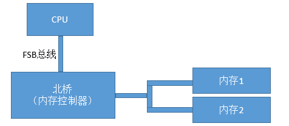
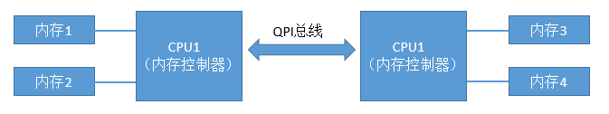

现在的服务器物理机CPU一般都是多个CPU，核数也是十几甚至几十核。内存几十GB甚至是上百G，也是由许多的内存条组成的。那么我这里思考一下，这么多的CPU和内存它们之间是怎么互相连接的？同一个CPU核访问不同的内存条延时一样吗？

在《内存随机访问也比顺序慢，带你深入理解内存IO过程》中我们了解了内存访问时芯片内部的执行过程，在《实际测试内存在顺序IO和随机IO时的访问延时差异》中我们又进行了实际的代码测试。不过这两文中我们都把精力聚焦在内存内部机制，而回避了上面的问题，那就是CPU和内存的连接方式，也就是总线架构。

## 回顾CPU与内存的简单连接：FSB时代

我们先来回顾下在历史上CPU、内存数量比较少的年代里的总线方案-FSB。FSB的全称是Front Side Bus，因此也叫前端总线。CPU通过FSB总线连接到北桥芯片，然后再连接到内存。内存控制器是集成在北桥里的，Cpu和内存之间的通信全部都要通过这一条FSB总线来进行。



在这个年代里，当时提高计算机系统整体性能的方式就是不断地提高CPU、FSB总线、内存条的数据传输频率。

## 如今多CPU多内存条复杂互联：NUMA时代

当CPU的主频提升到了3GHz每秒以后，硬件制造商们发现单个CPU的已经到了物理极限了。所以就改变了性能改进的方法，改成为向多核、甚至是多CPU的方向来发展。在这种情况下，如果仍然采用FSB总线，会导致所有的CPU和内存通信都经过总线，这样总线就成为了瓶颈，无法充分发挥多核的优势与性能。所以CPU制造商们把内存控制器从北桥搬到了CPU内部，这样CPU便可以直接和自己的内存进行通信了。那么，如果CPU想要访问不和自己直连的内存条怎么办呢？所以就诞生了新的总线类型，它就叫QPI总线。



图中CPU1如果想要访问内存3的话，就需要经过QPS总线才可以。

## 动手查看Linux下NUMA架构

我们先通过dmidecode命令查看一下内存插槽，单条大小等信息。大家可以试着在linux上执行以下该命令。输出结果很长，大家可以有空仔细研究。我这里不全部介绍，这里只挑选一些和内存相关的：

```shell {.line-numbers}
# dmidecode|grep -P -A5 "Memory\s+Device"|grep Size  
        Size: 8192 MB  
        Size: 8192 MB  
        Size: No Module Installed  
        Size: 8192 MB  
        Size: No Module Installed  
        Size: 8192 MB  
        Size: 8192 MB  
        Size: 8192 MB  
        Size: No Module Installed  
        Size: 8192 MB  
        Size: No Module Installed  
        Size: 8192 MB  
```

可以看出，我当前使用的机器上共有16个内存插槽，共插了8条8G的内存。所以总共是64GB。如我们前面所述，在NUMA架构里，每一个物理CPU都有不同的内存组，通过numactl命令可以查看这个分组情况。

```shell {.line-numbers}
# numactl --hardware
available: 2 nodes (0-1)
node 0 cpus: 0 1 2 3 4 5 12 13 14 15 16 17
node 0 size: 32756 MB
node 0 free: 19642 MB
node 1 cpus: 6 7 8 9 10 11 18 19 20 21 22 23
node 1 size: 32768 MB
node 1 free: 18652 MB
node distances:
node   0   1
  0:  10  21
  1:  21  10
```

通过上述命令可以看到，每一组CPU核分配了32GB（4条）的内存。 node distance是一个二维矩阵，描述node访问所有内存条的延时情况。 node 0里的CPU访问node 0里的内存相对距离是10,因为这时访问的内存都是和该CPU直连的。而node 0如果想访问node 1节点下的内存的话，就需要走QPI总线了，这时该相对距离就变成了21。

**所以、在NUMA架构下，CPU访问自己同一个node里的内存要比其它内存要快！**

## 动手测试NUMA架构内存延迟差异

numactl命令有--cpubind和--membind的选项，通过它们我们可以指定我们要用的node节点。还沿用《用代码让你来实际感受内存的在不同情况下的访问延时差异》里的测试代码

**1、让内存和CPU处于同一个node**

```shell {.line-numbers}
# numactl --cpubind=0 --membind=0 ./main
Delay  (ns)
        2k      8k      32k     128k    512k    2m      8m      32m     128m
s1      1.28    1.28    1.26    1.25    1.26    1.26    1.28    1.43    1.43
s32     1.27    1.26    1.32    1.78    2.67    2.73    3.27    9.95    10.37
s64     1.28    1.26    1.26    1.82    2.43    2.48    3.15    8.82    8.92
andom   2.40    2.40    2.40    2.40    4.80    4.80    19.20   28.80   52.80
```

**2、让内存和CPU处于不同node**

```shell {.line-numbers}
# numactl --cpubind=0 --membind=1 ./main
Delay  (ns)
        2k      8k      32k     128k    512k    2m      8m      32m     128m
s1      1.29    1.28    1.26    1.26    1.26    1.26    1.31    1.62    1.63
s32     1.29    1.26    1.33    1.77    2.80    2.92    3.95    13.69   13.77
s64     1.30    1.27    1.26    1.82    2.47    2.48    3.96    12.93   12.90
andom   2.40    2.40    2.40    2.40    4.80    4.80    19.20   31.20   52.80
```

## 结论

通过上面的各个小节我们可以看到，现代的服务器里，CPU和内存条都有多个，它们之前目前主要采用的是复杂的NUMA架构进行互联，NUMA把服务器里的CPU和内存分组划分成了不同的node。从上述实验结果来看，拿8M数组，循环步长为64的case来说，同node耗时3.15纳秒，跨node为3.96纳秒。所以属于同一个node里的CPU和内存之间访问速度会比较快。而如果跨node的话，则需要经过QPI总线，总体来说，速度会略慢一些。


> 本文转载自：https://www.cnblogs.com/kfngxl/p/13917559.html

