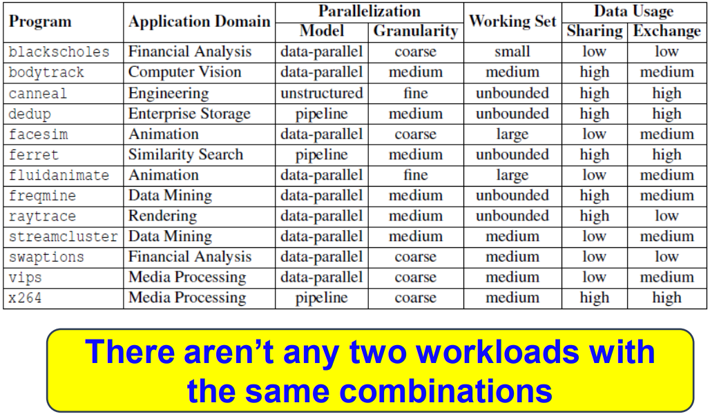
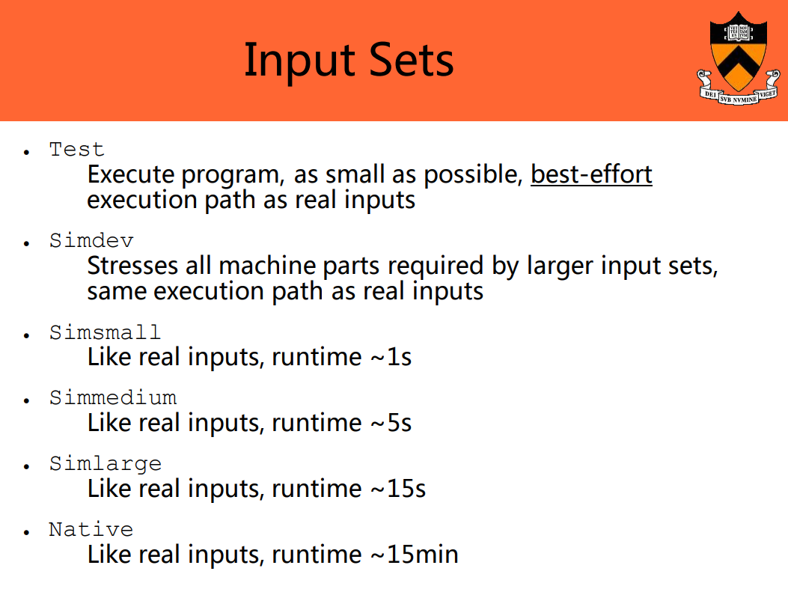

PARSEC全称为：Princeton Application Repository for Shared-Memory Computers，是由Intel和Princeton大学合作提出的一套多核测试程序套件。

包云岗老师[PPT](https://parsec.cs.princeton.edu/download/tutorial/3.0/parsec-tutorial.pdf)中有一张表对PARSEC 2.1进行了总结。



## 1. 编译和运行

下载地址：https://parsec.cs.princeton.edu/

### 1.1 下载PARSEC 3.0

```shell {.line-numbers}
wget http://parsec.cs.princeton.edu/download/3.0/parsec-3.0.tar.gz
```

### 1.2 解压

```shell {.line-numbers}
tar -xzf parsec-3.0.tar.gz
```

### 1.3 设置环境变量

```shell {.line-numbers}
source env.sh
```

### 1.4 万能命令parsecmgmt

PARSEC 3.0提供了parsecmgmt命令进行管理，运行parsecmgmt会输出帮助。

```shell {.line-numbers}
[PARSEC] Error: No action specified.
Usage: parsecmgmt -a ACTION [OPTION]...

Manage the installation of the PARSEC benchmark suite.

Options:
    -a ACTION        Specifies the action to perform. See below for a
                     list of valid actions.
    -p PACKAGE       A list of packages or aliases on which the action is to be
                     performed.
    -c CONFIG        Which build configuration to use. Default: 'gcc'
    -d RUNDIR        Use directory RUNDIR as root in which to run the
                     benchmarks.
    -i INPUT         The input to use to run the benchmarks. Default: 'test'
    -n THREADS       The minimum number of threads to use. Default: '1'
    -s SUBMIT        Command to use to submit the benchmark for execution.
                     Default: 'time'
    -x EXTENSION     Extension to append to platform descriptor string.
                     Default: none
    -k               Keep & use run directory as found, do not unpack inputs for
                     benchmark execution. Assume everything is already set up.
    -m NETMODE       Execution mode for network workloads. 
                     NETMODE can be either 'server' or 'client'. 
    -t THREADS       The number of user threads talking to the upTCP/IP stack. Default: '1'
    -r THREADS       The number of TCP/IP protocol receving threads. Default: '1'
    -l               Disable log.
    -h               Displays this help message.


Actions:
    'build'          Builds and installs the specified packages.
    'run'            Runs the specified packages.
    'clean'          Removes all files generated during the build and run phase
                     of the listed packages for the current platform, but
                     leaves the installed files untouched.
    'uninstall'      Removes the installed files of the listed packages for the
                     current platform.
    'fullclean'      Like 'clean', but for all architectures.
    'fulluninstall'  Like 'uninstall', but for all architectures.
    'status'         Shows a summary of the current status of the PARSEC
                     installation.
    'info'           List available packages and configurations.


Examples (1) [Compatible to PARSEC 2.1 but Extended]:
    - Build all benchmarks of three suites, i.e., PARSEC, SPLASH-2 and SPLASH-2x:
        parsecmgmt -a build -p all
    - Build only applications, use 'icc' as build configuration:
        parsecmgmt -a build -c icc -p apps
    - Do a full cleanup after a build or benchmark run:
        parsecmgmt -a fullclean -p all
    - Remove all generated files of the current architecture:
        parsecmgmt -a uninstall -p all
    - Run benchmark 'ferret' w/ input 'simsmall' and 4 threads:
        parsecmgmt -a run -p ferret -i simsmall -n 4
    - Get a quick summary of all available packages and features:
        parsecmgmt -a info
    - Show which kernel binaries have been installed:
        parsecmgmt -a status -p kernels


Examples (2) [NEW: Network Benchmarks]:
    - Check the status of all components involved in network benchmarks:
        parsecmgmt -a status -p netapps
    - Build network benchmark 'netstreamcluster':
        parsecmgmt -a build -p raytrace
    - Build all network benchmark:
        parsecmgmt -a build -p netapps
    - Run network benchmark 'netdedup' w/ input 'native' and 2 server threads:
        parsecmgmt -a run -p netdedup -i native -n 2
    - Run network benchmark 'netferret' w/ input 'simlarge', 4 server threads and 2 client connections:
        parsecmgmt -a run -p netferret -i simlarge -n 4 -t 2
    - For simulation, run 'netdedup' server on a simulator w/ 4 threads and run client on a real machine:
        parsecmgmt -a run -p netdedup -i simlarge -n 4 -m server
        parsecmgmt -a run -p netdedup -i simlarge -m client
    - Do a full cleanup for network benchmarks:
        parsecmgmt -a fullclean -p netapps


Examples (3) [NEW: SPLASH-2 Suite and SPLASH-2x Suite]:
    - Check the status of SPLASH-2 suite and SPLASH-2x suite:
        parsecmgmt -a status -p splash2
        parsecmgmt -a status -p splash2x
    - Build benchmark 'raytrace' from SPLASH-2x suite other than PARSEC:
        parsecmgmt -a build -p splash2x.raytrace
        parsecmgmt -a build -p raytrace   ## defaultly from PARSEC (for comparison)
    - Build benchmark 'fft' from SPLASH-2 suite with 'gcc-serial' build configuration:
        parsecmgmt -a build -c gcc-serial -p splash2.fft
    - Build all benchmarks from SPLASH-2 suite and SPLASH-2x suite:
        parsecmgmt -a build -p splash2
        parsecmgmt -a build -p splash2x
    - Run benchmark 'fft' from SPLASH-2x w/ input 'simsmall' and 4 threads:
        parsecmgmt -a run -p splash2x.fft -i simsmall -n 4
    - Do a full cleanup for SPLASH-2 suite
        parsecmgmt -a fullclean -p splash2
```

### 1.5 Build/run/uninstall Benchmarks

当前测试环境：gcc version 5.3.1 20160413 (Ubuntu 5.3.1-14ubuntu2)

build and run one benchmark (e.g., streamcluster)

```shell {.line-numbers}
$ parsecmgmt -a build -p streamcluster
[PARSEC] Packages to build:  parsec.streamcluster

[PARSEC] [========== Building package parsec.streamcluster [1] ==========]
[PARSEC] [---------- Analyzing package parsec.streamcluster ----------]
[PARSEC] parsec.streamcluster does not depend on any other packages.
[PARSEC] [---------- Building package parsec.streamcluster ----------]
[PARSEC] Copying source code of package parsec.streamcluster.
[PARSEC] Running 'env version=pthreads /usr/bin/make':
/usr/bin/g++ -O3 -g -funroll-loops -fprefetch-loop-arrays -fpermissive -fno-exceptions -static-libgcc -Wl,--hash-style=both,--as-needed -DPARSEC_VERSION=3.0-beta-20150206 -DENABLE_THREADS -pthread -c streamcluster.cpp
streamcluster.cpp: In function ‘void outcenterIDs(Points*, long int*, char*)’:
streamcluster.cpp:1825:39: warning: format ‘%u’ expects argument of type ‘unsigned int’, but argument 3 has type ‘long int’ [-Wformat=]
       fprintf(fp, "%u\n", centerIDs[i]);
                                       ^
streamcluster.cpp: In function ‘void streamCluster(PStream*, long int, long int, int, long int, long int, char*)’:
streamcluster.cpp:1890:46: warning: format ‘%d’ expects argument of type ‘int’, but argument 3 has type ‘size_t {aka long unsigned int}’ [-Wformat=]
     fprintf(stderr,"read %d points\n",numRead);
                                              ^
/usr/bin/g++ -O3 -g -funroll-loops -fprefetch-loop-arrays -fpermissive -fno-exceptions -static-libgcc -Wl,--hash-style=both,--as-needed -DPARSEC_VERSION=3.0-beta-20150206 -DENABLE_THREADS -pthread -c parsec_barrier.cpp
/usr/bin/g++ -O3 -g -funroll-loops -fprefetch-loop-arrays -fpermissive -fno-exceptions -static-libgcc -Wl,--hash-style=both,--as-needed -DPARSEC_VERSION=3.0-beta-20150206 -DENABLE_THREADS -pthread -L/usr/lib64 -L/usr/lib -static streamcluster.o parsec_barrier.o  -o streamcluster
[PARSEC] Running 'env version=pthreads /usr/bin/make install':
mkdir -p /share/parsec-3.0/pkgs/kernels/streamcluster/inst/amd64-linux.gcc/bin
cp -f streamcluster /share/parsec-3.0/pkgs/kernels/streamcluster/inst/amd64-linux.gcc/bin/streamcluster
[PARSEC]
[PARSEC] BIBLIOGRAPHY
[PARSEC]
[PARSEC] [1] Bienia. Benchmarking Modern Multiprocessors. Ph.D. Thesis, 2011.
[PARSEC]
[PARSEC] Done.
```

Build and run all benchmarks (Note that it may take several hours depending on your machine)

```shell {.line-numbers}
$ parsecmgmt -a build -p all
$ parsecmgmt -a status -p parsec	# 查看安装情况
$ parsecmgmt -a run -p all
```

### 1.6 Try other inputs



parsec默认使用test input，如果需要使用其他input数据，并且之前没有下载完整的Benchmark Suite，则需要下载相应的input数据集，并放置到固定的路径下。

指定运行数据输入：

```shell {.line-numbers}
$ parsecmgmt -a run -p streamcluster -i simsmall

$ parsecmgmt -a run -p streamcluster -i simlarge -n 2
```

## 2. Run PARSEC on Simulators

参考：https://parsec.cs.princeton.edu/parsec3-doc.htm#simulation