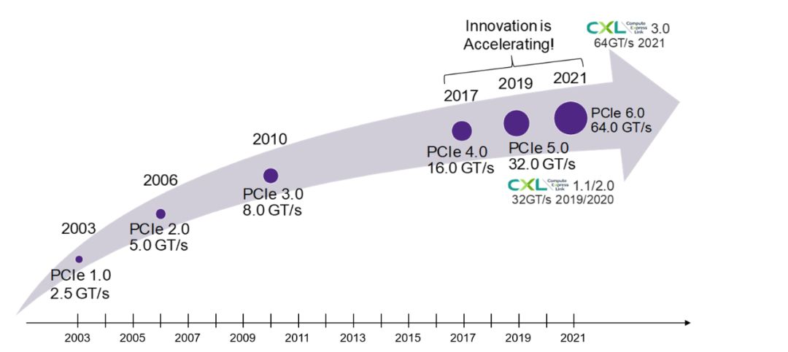
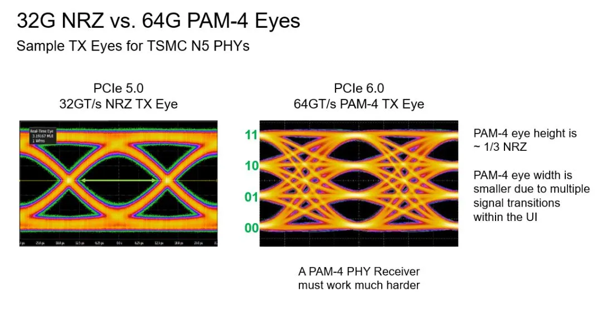
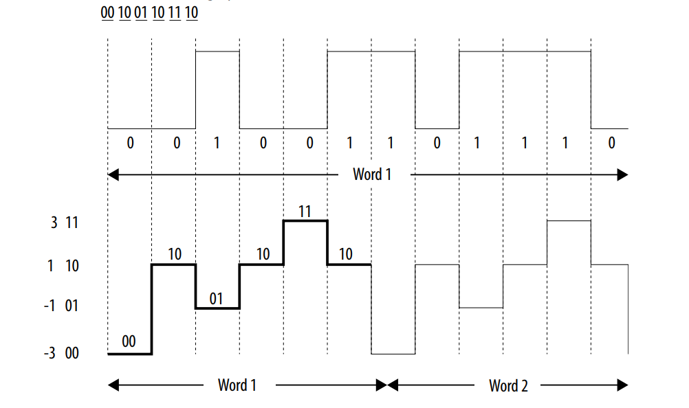
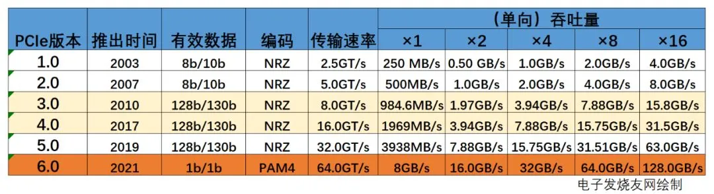
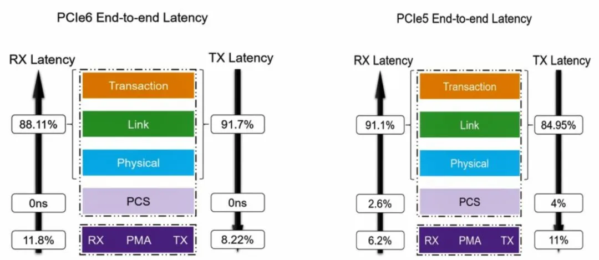

2022年1月11日，PCI-SIG正式发布了PCI Express（PCIe）6.0最终版本1.0。

为什么说这次6.0是有史以来变化最大的一次？我们先来快速回看下PCIe的发展史。

PCIe发展历史

PCIe诞生于2003年，在2017年以前发展速度都相对较慢，三、四年更新一次标准。PCIe 3.0发布后甚至等了七年才推出PCIe 4.0。而自此之后，PCIe标准几乎每两年就更新一次。

其中的缘由正是因为近年来，高性能计算和AI快速发展，高清视频和网络数据迅速膨胀，还有自动驾驶等技术的蓬勃发展。这些技术的推动，让数据中心和高性能计算机对高速率和高带宽的需求越来越大，PCI-SIG也加快了新标准的推出。

这次的PCIe 6.0主要有三大变化：

- 数据传输速率从32GT/s翻倍至64GT/s；
- 编码方式从NRZ 信令模式转向PAM4信令模式；
- 从传输可变大小TLP到固定大小FLIT。

其中，前两个变化是密切相关的，正是因为引入了PAM4编码方式，才让PCIe 6.0的数据传输速率再次翻倍的。采用PAM4信令后，由于使用4个信号电平，而不是传统的0/1两个电平，单个信号就能有四种编码（00/01/10/11）状态。这使得PAM4可以携带两倍于NRZ信令的数据。

不过，由于PAM4的电平更多，更容易受到噪声的影响，出现误码。因此，如果想让信号更加可靠的话，就需要辅以轻量级前向纠错（FEC）和循环冗余校验（CRC）方案，以减少误码率的增长。

历代PCIe参数对比（数据来源：PCI-SIG）

标准每更新一次，传输速率就翻倍一次。PCIe 6.0原始的传输速率为64GT/s，转换成吞吐量的话，单向吞吐量单条通道（Lane）为：64/8=8GB/s，这里除以8是为了将bit转换为Byte，也就是说PCIe 6.0 x16的单向吞吐量为128GB/s，双向为256GB/s。

当然，对于吞吐量其实是有一个计算公式的，以PCIe 3.0协议支持8.0GT/s为例，即每一条通道上支持每秒钟内传输8G个bit，PCIe 3.0的物理层协议中使用的是128b/130b的编码方案，即每传输128个bit，需要发送130个bit。因此，PCIe 3.0协议的每一条Lane支持的吞吐量就是8×128/130=7,877Gbps=984.6MB/s。

还有一点是流量控制单元（FLIT）编码方式。与物理层的PAM4不同，FLIT编码用于逻辑层，将数据分解为固定大小的数据包。

随着在PCIe 6.0中引入新的FLIT模式，TLP和数据层数据包(DLP)包头格式发生了变化，应用程序需要理解并正确处理这些变化。例如，对于PCIe 6.0，FLIT包含自己的CRC，因此数据链路层数据包(DLLP)和TLP不再需要像在PCIe 5.0和前几代中那样的单独CRC字节。此外，由于FLIT的大小固定，因此无需使用前几代（非FLIT模式）中的PHY层成帧令牌。与PCIe 5.0相比，这提高了带宽效率。

PCIe 6.0的大升级，实现了数据传输速率的翻倍。而从32GT/s NRZ到64GT/s的PAM4信令，使得信噪比目标将更难达到，因为反射要差3倍。所以说，要设计的更加稳健，通道损耗更少，功耗更低，但性能却不降低，甚至更高的PCIe 6.0产品，将成为开发者们的挑战。作为PCIe标准制定工作组成员，新思科技早已提前布局，在去年3月就推出了面向PCIe6.0的完整IP解决方案，可满足高性能计算、AI和存储SoC在延迟、带宽和功耗效率方面不断提高的要求。为了实现最低延迟并最大限度地提高所有传输规模的吞吐量，面向PCIe 6.0的DesignWare控制器采用MultiStream架构，可提供相当于Single-Stream设计2倍的性能。该控制器采用1024位架构，可让开发者在1GHz时序收敛的条件下实现64GT/s x 16的带宽。DesignWare PHY IP则可提供独特的自适应DSP算法，可优化模拟和数字均衡，从而最大限度地提高功耗效率，而不受通道影响。

此外，PCIe 6.0还引入了新电源状态，称为L0p 或 LOp。这是一种新的电源状态，能够以非破坏性方式为正常工作的链路节省电源。举例来讲，此电源状态下的 x4 链路可以确保只有一个通道工作，而其他三个通道进入低功率流。与任何其他低功耗状态一样，退出这种低功耗状态的延迟是一个值得关注的关键参数。虽然现在主流的应用还在PCIe 3.0和PCIe 4.0，但我们看到在有些数据中心，以及新的GPU、CPU，或加速器已经开始采用PCIe 5.0了。PCIe 6.0，作为PCIe问世近20年以来变化最大的一代，它所带来的新特性，包括64GT/s的数据速率，采用具有吞吐量和延迟优势的 FLIT，以及新的低功耗状态L0p，实现了真正的带宽扩展来降低功耗。期待PCIe 6.0日后会给业界带来哪些新的体验，又给世界带来哪些新的变化。

作者：新思科技
链接：https://www.zhihu.com/question/511127411/answer/2456877396
来源：知乎
著作权归作者所有。商业转载请联系作者获得授权，非商业转载请注明出处。