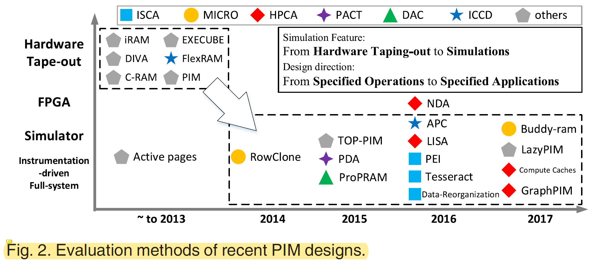

# PIMSim: A Flexible and Detailed Processing-in-Memory Simulator

<!-- TOC -->

- [PIMSim: A Flexible and Detailed Processing-in-Memory Simulator](#pimsim-a-flexible-and-detailed-processing-in-memory-simulator)
  - [论文介绍](#论文介绍)
  - [Introduction](#introduction)
  - [PIMSim架构](#pimsim架构)
    - [PIM设计特性](#pim设计特性)
      - [1. Three Simulation Mode with a Trade-Off Between Speed and Accuracy](#1-three-simulation-mode-with-a-trade-off-between-speed-and-accuracy)
      - [2. PIM-Enabled Instructions, Offloading, and Flexible PIM Code Annotations](#2-pim-enabled-instructions-offloading-and-flexible-pim-code-annotations)
      - [3. Unified Framework for PIM Coherence](#3-unified-framework-for-pim-coherence)
  - [VALIDATION AND BENCHMARK EVALUATION](#validation-and-benchmark-evaluation)
    - [Setup](#setup)

<!-- /TOC -->

## 论文介绍

这篇工作为中科院计算所Xiaowei Li团队发表在2019年的IEEE COMPUTER ARCHITECTURE LETTERS上，主要内容为PIM架构仿真器，一作为Sheng Xu，通信作者为Yinhe Han和Xiaowei Li，开源代码链接：https://github.com/vineodd/PIMSim

## Introduction

Fig. 1中PIM就类似近存计算，为什么不直接在Memory Array附近堆CPU呢，这样就不需要Memory之外的原始CPU了。个人认为涉及以下几点：（1）Memory芯片内部由于工艺和拓扑结构限制无法集成复杂的处理核心；（2）近存计算核心无法涉及高性能的Cache来利用Locality，从这我们也可以看出Locality也是workload划分的关键因素之一。综上，我们可以反思在Cache中做近存加速是否有收益？虽然可以利用局部性，但是近Cache核是否就等同于现有的CPU呢？我的意见是Cache的近存处理核心只能集成相对于近DRAM更简单的处理单元，例如仅仅是几条指令的处理逻辑。

本文引出target的思路：

- Technology evolution -> "Memory Wall"
- Primary innovation：PIM with the lightweight computing logics integrated into the memory (Fig. 1), which brings 2 benefits:
  - Much higher internal bandwidth
  - Eliminate data movements between the memoryand processors

接下来，作者对近几年PIM的工作进行了统计，汇总如下图所示：

从这幅图中，作者总结出两条规律：

- 验证特性：硬件Tape-out -> 仿真
- 设计方向：特定操作 -> 特定应用

虽然仿真工具极大地提升了相关研究，但是仍面临以下几个挑战：

- 现有的 PIM 仿真环境通常由几种不同的模型组成，包括内存、处理器、编译器、一致性等，缺乏统一的架构组织和抽象。
- 大多数现有的 PIM 仿真环境都是高度定制的，即仿真环境针对某种指令集架构 (ISA) 和设计，在配置和建模方面缺乏通用性和灵活性。
- 现有的 PIM 仿真忽略了处理器和内存之间的数据一致性、新的内存特性或不同内存类型的协同仿真。

为解决以上问题，作者提出了PIMSim仿真器。

## PIMSim架构

作者在描述仿真器架构的时候，提及了以下这段话：
> "In PIM, memory means not only a storage component but also a computing end. However, the processors cannot be eliminated because they have to provide necessary PIM instruction decoding and distribution. Thus, PIMSim relies on current architectural simulation with added components to support PIM simulation."

个人对这段话的理解为：PIM还是依赖于原始的控制逻辑，即作为粗粒度的kernel卸载，PIM的功能需要具有相对完备性，因此还需要类似现有CPU的控制模型，可不可以直接通过spatial processor实现以减少控制模块的开销？

从图3可以看出，PIMSim的架构主要分为三部分：
- Application Partitioner
  存在问题：现有的 PIM 模拟器不提供指令级 PIM 内核选择，这使得它们变得困难和无能。
  PIMSim 提供了四种灵活的 PIM 注释样式和相应的编译器，让用户可以在源代码中定义 PIM 内核，而对编程模型的影响可以忽略不计。
  除了提供的Application Partitioner外，PIMSim 还支持动态反馈来决定是否应在内存中执行 PIM 指令，这利用了跟踪执行因素（如缓存命中率或局部性）。
- PIM Logic Modeling
  存在问题：用户指定的 PIM Logic 设计可以从逻辑门到处理器内核有所不同，这增加了模拟器设计的复杂性。
  在 PIMSim 中，PIM Logic 可以轻松配置为处理器或指定的加速器。 在 PIMSim 的全系统模式下，GEM5提供的所有处理器模型都可以配置为 PIM Logic。 
  此外，PIMSim 还提供了一个接口，使其与处理器模拟器协同工作以模拟目标 PIM 内核。例如，当想要将 GPGPU-Sim 集成到 PIMSim 中并将图形处理单元 (GPU) 视为 PIM Logic 时，他/她只需要实现所有接口，PIMSim 就可以自动调用 GPGPU-Sim。
  在快速仿真模式下，PIMSim 提供了快速但准确的内核和流水线模型来进行 PIM Logic 仿真。
  PIMSim 还提供了一个高级黑盒模型，用于快速验证架构设计。
  从以上可以看出，PIMSim提供的PIM支持主要还是处理器核心级别的，没有逻辑电路级的支持。
- Memory Organization
  作者通过对PIM研究工作核工业产品的需求调研，结果显示最普遍的存储模型包括DRAM、HMC核一系列NVM，因此作者集成DRAMSim2、HMCSim和NVMain到PIMSim，并提供统一接口。

### PIM设计特性

#### 1. Three Simulation Mode with a Trade-Off Between Speed and Accuracy

- Fast simulation
  - Only primary models, such as processors, memory, PIM Logic, and simple lock-based PIM coherent methods, are simulated.
  - The input files are memory traces that include memory access operations, cycles, and data, which can be generated by other Simulators, making it swift and flexible to migrate previous work to PIM architecture.
- Instrumentation-driven simulation
  - PIMSim provides an efficient tool that user Pin as a frontend to feed real-time traces to the simulator by instrumenting. Thus, PIMSim is able to simulate PIM simultaneous during the application runtime. Upon the Pin tool found the instruction sequences that match the user-defined instruction sequences to be offloaded, it refers to architecture- and system- level characteristiccs and dispatches them as PIM operations to the simulator.
- Full-system simulation
  - Execute both user- and kernel-level instruction.
  - Models a complete system including the operating system, memory, and peripherals.
  - Implement detailed PIM-enabled instructions to support user-defined PIM instructions.
  - Implemente detailed coherence mechanisms
  - Support different ISAs and integrated PIM micro-benchmarks.

#### 2. PIM-Enabled Instructions, Offloading, and Flexible PIM Code Annotations

- Implements basic PIM instructions to coordinate PIM system controlling, such as PIM load/store, register read/write, calculation and cache flushing operations.
- Provides flexible methods to define user's own PIM instructions.
- Uses pseudo instrucions to transmit PIM operands without hurting the ISAs in the full-system mode.
- Supports partitioning from 2 aspecs by simplified PIM code annotations (Fig. 5):
  - Partitioning between the host and memory
  - Partitioning among PIM Logics
- Provides 2 offloading methods:
  - Instruction bypass
    Give instructions to PIM Logic through off-chip connections, which is suitable for simple PIM kernels and specified in-memory accelerators. (在近Cache加速时，由于指令简单，可以考虑选取这种方式。)
  - In-memory binary
    Writes the executable binaries in the memory and informs PIM Logic with only start address provided, which minimizes the consumption of off-chip bandwidth when using complex PIM kernels.

#### 3. Unified Framework for PIM Coherence

PIM 的一致性是影响系统性能的另一个重要因素。实验表明，不同的Coherence方法使性能从 -30% 到 +80% 变化。
PIMSim 支持三种不同粒度的 PIM coherences，以提供与新设计的 PIM coherence方法的比较。
存在问题：PIM 中的一致性设计通常会导致使用其他研究人员提出的解决方案不便。例如，如果想要实现像LazyPIM这样的一致性方案，就不能简单地使用像 #include 这样的预处理器指令来直接调用它。 相反，必须对处理器、PIM 逻辑、coherence总线等进行大量修改。
PIM解决方案：PIMSim 实现了一个统一的框架，以提供一个无冲突的包括调用其他 PIM 方案的方法。 用户只需要在配置文件中设置一致性名称，就可以节省大量模拟PIM一致性的工作。

## VALIDATION AND BENCHMARK EVALUATION

### Setup

**Benchmarks:**

- Average Teenage Follower (ATF)
- Breadth-Firth Searcch (BFS)
- Pagerank (PR)
- Shortest Path (SP)

Workload (input): a real-world graph called soc-Livejoural1 [19], with 4.8M nodes and 69M edges

**Hardware:**

Intel (R) Xeon(R) E7-8830 processor running at 2.13 GHz, with 32 GB of DRAM

**Simulation time normalized to the real execution time on the host:**

- Fast mode: $4.2\times 10^4 X$
- Instrumentation-driven mode: $1.4\times 10^5 X$
- Full-system mode: $3.1\times 10^5 X$

**Same parameters setting as PEI, and compares the IPC gap:**

*PIM-Only*: represents the architecture that offloads all instructions to the memory.
*Locality-Aware:* represents the same architecture as PEI.

**Compared with PEI, the three modes of PIMSim, fast, instrumentation-driven, and full-system simulation, produce 18.75, 14.63 and 7.88 percent differences in the performance result, respectively.**