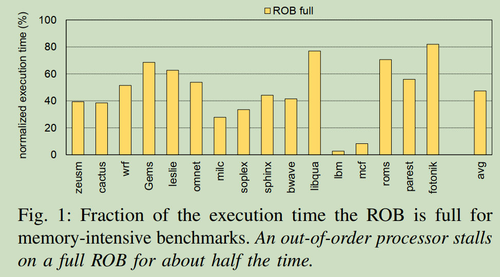
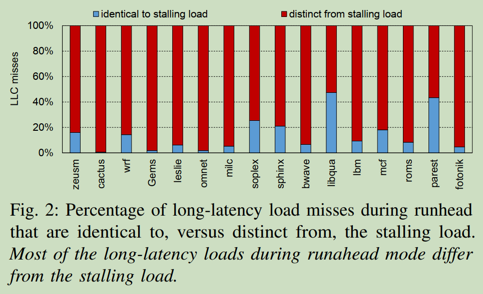
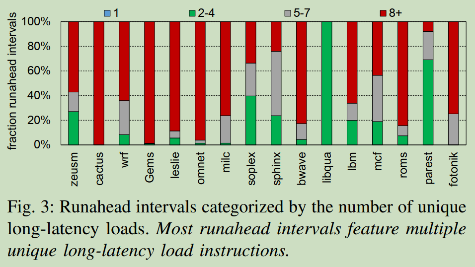
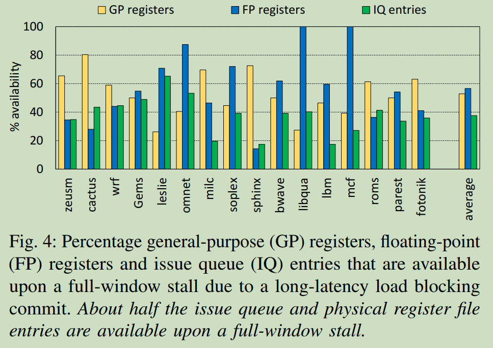
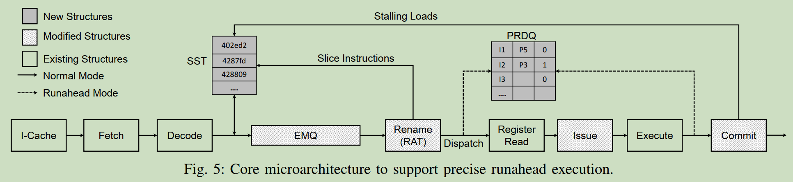

## Introduction

### Runahead背景介绍

Load指令发生Cache miss，会导致后续的指令填充指令窗口，当ROB entry被占满之后，CPU将会被stall。

处理器可以触发Runahead执行机制，移除阻塞长延迟的Load，并推测性地执行后续指令，以发现未来 独立的长延迟Load操作，发掘存储层级的并行度(MLP, Memory-Level Parallelism)。

 是否可以理解为发生Cache miss的load指令其实是发生了异常，我们应该废弃这条指令以及之后指令的执行，在等待之前的指令提交之后跳转到中断处理程序去处理。中断处理程序就是去提前执行未来独立的可能会发生Cache miss的Load操作的相关指令。当发生Cache miss的Load指令返回数据之后，处理器跳转到这天load指令继续执行。当然这边也可以不等待发生异常之前的指令提交再转入Runahead模式，因为这些指令还可以正常提交。

Q: 这个“独立的”比较有意思，难道这个Load操作相关指令完全不需要依赖于现有的寄存器结果吗？整条路径不需要live-in寄存器输入？

A: 应该是需要live-in的，但是我们可以确保这个live-in是Load之前的指令准备好的，而与当前Load指令的目的寄存器无关。

Runahead指令提前执行了未来的Load指令，相当于执行了prefetch操作，因此当程序返回正常模式之后执行到这条Load指令时，数据已经被预取到Cache中，不再发生Cache miss。

### 现有研究存在的问题

作者指出了runahead execution存在的两个挑战：（1）prefetch coverage；（2）支持runahead相关的开销。

预测执行的开销包括保存和恢复状态的开销，以及从runahead模式返回到normal模式是将流水线回滚到合适的状态的开销。

因此，提高Runahead收益需要从两方面出发：（1）最大化每次runahead执行中发起的有效预取次数；（2）限制模式切换的开销。

现有的研究发展历程是：Runahead执行遇到的所有指令->过滤掉不必要的指令，只是将产生阻塞load指令的依赖链保存到rnahead buffer中。runahead buffer方案存在两个问题：（1）开销大；（2）每次runahead只能覆盖一条预取路径。

### Key observation

The processor has sufficient unused resources in the issue queue and physical register file to continue speculatively executing instructions in runahead mode, eliminating the need to release processor state in the ROB, issue queue(IQ), and physical rigister file(PRF).

### PRE解决的核心思路总结

## Background and Motivation

### Full Window Stalls

在乱序处理器核心中，一个在LLC miss的load指令需要数百个时钟周期才能从片下memory中取回数据，这条load指令会阻塞流水线的提交，当前端不断分配新指令到后端，一旦ROB被填满，前端无法再分配新指令，从而导致full window stall。

如图一所示，乱序处理器在执行访存密集的SPEC CPU benchmark时，需要花费近一半的执行时间在等待长延迟load阻塞ROB。

本文中将导致full window stall的load指令称为stalling load，导致stalling load的反向指令链称为stalling slice。

### Runahead Execution

当遇到full-window stall，处理器会checkpoint PC、架构寄存器(ARF)、分支历史寄存器和返回地址栈(RAS)，然后进入runahead模式，并且标记stalling load及依赖它的指令为invalid。在runahead模式下，处理器并不会更新架构状态，只会pseudo-retire指令从而保持不断预测向前执行。一旦stalling load返回，流水线被冲刷，保存点的架构状态被恢复。这标志着从runahead模式退出，处理器再次从stalling load开始取指令执行。

Runahead execution在返回到正常执行模式时，通过刷新和重新填充流水线，会产生显著的性能和能源开销。

### Future Thread

Future Thread依赖于两个硬件线程，每个都具有动态分配数量的物理寄存器。当主线程由于长延迟load耗尽分配的物理寄存器之后，主线程停止，处理器切换至第二个硬件线程（Future Thread）试图预取未来的load。

这个方案一方面需要硬件超线程的支持，另一方面future thread需要分享硬件资源。

### Filtered Runahead Execution

以上两种方案都需要执行处理器前端的所有指令，而许多指令对于产生长延迟load请求是不需要的。因此Hashemi等人在2015年提出了一种技术，仅追踪和执行stalling load依赖链上的指令。该方案对ROB和store queue执行后向数据流遍历，以找到该stalling load的依赖链。这个依赖链保存在runahead buffer中，放置在Rename阶段之前。在runahead模式下，runahead buffer中的指令被rename, dispatch并循环执行，流水线前端则可以进行clock-gated以降低动态功耗。

### 以往技术的不足之处

**Flushing and Refilling the Pipeline**

在从normal mode切换至Runahead mode，该论文中没有介绍存在开销，个人感觉是只需要对现有状态进行checkpoint，这就是切换寄存器。现有流水线和ROB中的指令可以进行pseudo-commit，因此，不需要重新fetch指令。而在从Runahead mode切换至normal mode时，不仅需要restore架构状态，而且要填充流水线前端和ROB。restore架构状态本文中假设不需要时间开销，但是填充流水线前端需要8个周期（假设流水线前端为8级），填充ROB需要dispatch 192条指令（假设ROB entry为192），如果dispatch宽度为4，需要48个周期，因此一共需要56个周期才能回到之前的状态。

作者通过实验表明，传统Runahead execution能够提升16%的性能，但是如果ROB中的指令在退出Runahead模式之后不需要重新取指和执行，则可以获得22.8%的性能提升。

**Limited  Prefetch Coverage**

传统runahead execution需要执行所有未来指令，因此限制了runahead执行指令流的深度。

> "Runahead buffer assumes that the load that triggers runahead execution is likely to recur more than any other load within the same runahead interval. Therefore, it decides to replay only the chain of instructions that produces future instances of the same stalling load. Although runahead buffer enables runahead execution to speculate further down the instruction stream, it is limited to a single slice."

以上这句原文提出了runahead buffer方案的两个特性：（1）runahead execution中执行的load slice更大概率是触发full-window stall的这条stalling load相同的指令，虽然现在我并没有看懂为什么，可能需要看一下runahead buffer的原文；（2）Runahead buffer在每个runahead interval只能预取一个load slice，因为上面也说了runahead buffer是循环执行。

图2中作者测试了实际运行程序中大部分runahead execution预取的load实际上是与stalling load不相等的。

作者同时还通过图3证实了大部分runahead interval包含多个(8+) unique long-latency load instruction。

以上这两点都是与runahead buffer的特性相冲突的。

**Short Runahead Interval**

现在一些工作过滤掉一些short runahead interval，但是40%的runahead interval是短于56个周期，如果将这些都排除，会显著浪费提升MLP的机会。

## Precise Runahead Execution

特性：

- Prefetch all stalling slices in runahead mode;
- Executing only the instruction chain leading to the loads;
- Does not release processor state when entering runahead mode, hence it does not need to flush and refill the pipeline when resuming normal mode.

### PRE: Key Insights

1. There are enough available physical register file and issue queue resources to initiate runahead execution upon a full-window stall.

图4的实验结果表明，再full-window stall时，37%的issue queue entries, 51%的整数寄存器和59%的浮点寄存器都是空闲的。

2. There is no need to pre-execute all instructions during runahead mode. Instead we can speculate deeper in the dynamic instruction stream by only pre-executing stalling load slices.

这个之前的论文已经提出了，我自己可以做个实验统计一下这个占比大概有多少。

3. IQ resources are quickly recycled during runahead execution. Recycling PRF resources requires a noval mechanism that is different from conventional register renaming schemes.

这边的理解应该是虽然不执行load consumer，但是还是需要进行重命名，因此这些指令会占据很多物理寄存器无法释放。而这些load consumer不会进行dispatch，而load slice只会短暂占据IQ。

图5描绘了乱序核支持PRE的示意图，接下来将介绍工作细节。

### Entering Precise Runahead Execution

当发生full-window stall唤起PRE，在checkpointingPC，寄存器重命名表(register alias table)和RAS之后进入runahead模式。填充ROB的指令仍然可以按照正常模式执行，但是不需要从ROB中commit，因此不更新ARF和L1 D-cache。
PRE在decode阶段动态的识别指令是否为part of potential stalling slices，如果是则预测执行他们。

### Identifying Stalling Slices

PRE使用stalling slice table追踪stalling slice(SST)，SST是一个全组相联的Cache，在decode之后进行访问。
当load指令阻塞ROB，我们将其保存到SST中，为了追踪load slice，本工作扩展了RAT，保存产生该寄存器值的指令PC。
回溯过程采用迭代方式，当stalling load指令再次被译码，这条stalling load的PC在SST中命中，PRE查找RAT以确定产生该load指令原操作寄存器的指令PCs，并将这些PC值保存到SST中。不断迭代就可以在SST中建立load slice。由此也可以看出，PRE不局限于每个runahead interval只能执行一个load slice。

这边使用迭代的方法有一个好处是倾向于标记存在循环的stalling load。

由于load slice的源操作数不依赖于分支指令，所以分支指令不存在与SST中。但是会标记不同分支跳转到load slice，因此每一条路径都会被标记，不影响runahead的执行。

作者认为128 entries的SST就可以满足需求，因为后续循环可以替换之前循环所占据的SST。这就需要load slice的循环次数需要足够多才有收益吧，否则还没有迭代完就被其他load slice所替换。

### Execution in Runahead Mode

PRE 使用 SST 过滤并推测性地执行紧随停顿窗口的所有停顿切片。指令解码后，PRE 仅执行命中 SST 的指令，因为它们是生成未来加载所必需的。

Runahead模式下发射的指令只会使用在runahead模式触发时未被使用的寄存器，这些寄存器会重复利用而不会影响正常模式下已分配的寄存器。同时，处理器会继续执行ROB中非推测指令，这些结果会被写入进入runahead模式之前就分配好的物理寄存器中。当恢复到正常模式，只有在runahead模式下取的指令才需要再次取指和处理。

这边有一个疑问：如果ROB被block住，后续只执行SST中标记的指令，如何保证SST中指令的源寄存器是正确的呢？

### Runahead Register Reclamation

