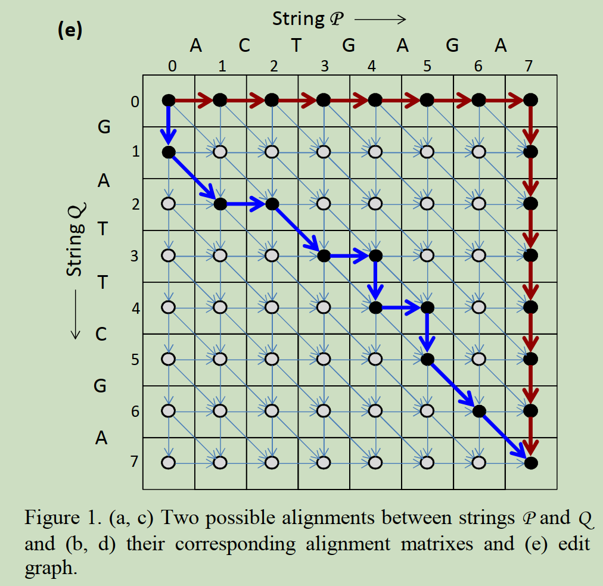

# Race Logic: A Hardware Acceleration for Dynamic Programming Algorithms

这篇论文为UCSB Advait Madhavan团队发表在ISCA-2014上，提出了使用Race Logic电路解动态规划问题。这篇论文以基因序列匹配为例，如Fig. 1e所示，该问题可以转化成求解最短或最长路径问题（取决于惩罚函数），如Fig. 2所示。

Fig. 3展示了本文提出的Race logic电路，Fig. 3a展示了两输入一输出的DAG，边上为延迟信息。该图可以转化成Fig. 3b和Fig. 3c展示了通过Race logic实现最长路径和最短路径搜索，该电路利用DFF实现不同的延迟，并分别通过与门和或门实现最长路径和最短路径搜索，与门只有在最长延迟的输入为1时才会向后传递，非门则是在最早的输入为1时向后传递。因此，可以看出Race logic是通过将计算转换成了延迟。此外，通过DFF实现需要时钟进行同步，能耗与节点N成三次方的关系，通过Fig. 3c的可编程忆阻器的RC延迟能够实现异步Race logic。(这个异步实现与SNN比较像)

