# Recryptor: A Reconfigurable Cryptographic Cortex-M0 Processor With In-Memory and Near-Memory Computing for IoT Security

## Summary

这篇论文并没有提出新的SRAM计算电路，属于是将10T SRAM计算电路在架构级进行了应用，加速加密算法。这篇论文给我们的一个启发是：我们并不一定受限于传统SRAM的push rule结构，担心影响其他操作的性能。这篇论文就是3/4的SRAM属于传统Cache应用，1/4的SRAM用于存算一体，这其实和谢源老师的Prime架构思路类似，比Prime有优势的地方在于存/算模式切换没有开销。

## Motivation

加密函数通常需要高带宽计算(64-512 bits)，但是嵌入式处理器的数据通路只有32-bit宽度。
现有架构，无论是CPU还是ASIC，加密算法的运行效率不高。

## Target of This Work

本文提出了 Recryptor，这是一种可重构的加密处理器，可通过增强商业通用处理器的现有Cache以增强计算能力。它支持使用10晶体管位单元的Cache中位线计算，以支持高达512位宽的不同按位运算。定制设计的移位器、旋转器和S-box模块位于内存附近，提供高吞吐量的近内存计算能力。

## 架构介绍

### Overview

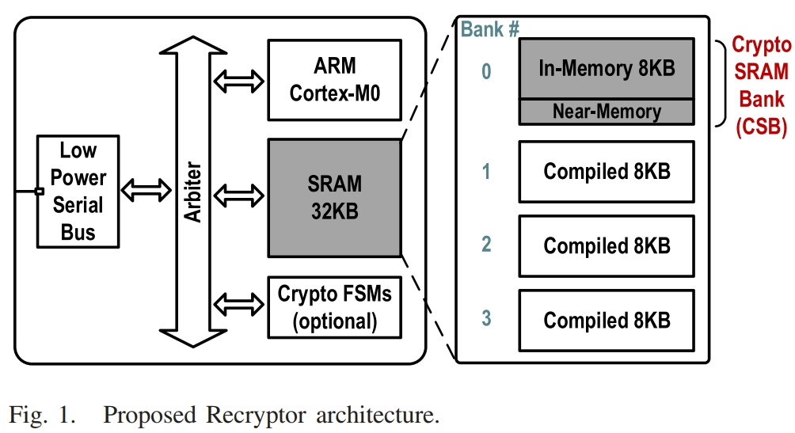

Recryptor 包含一个标准 ARM Cortex-M0 微控制器和 32-kB 存储器、一个用于访问片外数据的低功耗串行总线和一个仲裁器作为其内部总线，以及可选的有限状态机 (FSM)，如图 1 所示。32-kB存储器由四个8-kB Banks组成。三个是使用标准存储器编译器实现的，而第四个是定制设计的crypto-SRAM Bank(CSB)。

## RECRYPTOR’S IN-MEMORY COMPUTING

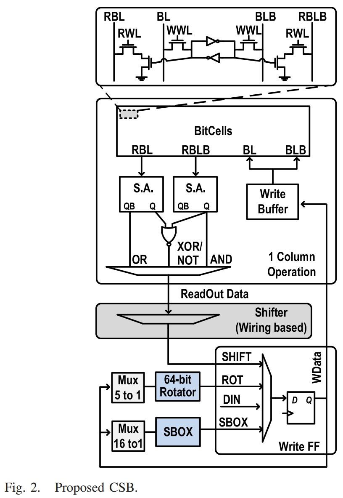

CSB不仅能够当作常规的存储器进行32-bit的读写，而且支持大带宽存内/近存计算。如图2所示，CSB的存储单元使用的10T SRAM结构，读写路径分离，能够同时激活多行而不会对存储的值产生干扰。通过偏斜的两个SA分别实现OR/NAND/XOR/NOT/COPY操作(NOT/COPY是如何实现的？)。运算结果可以通过移位器进行得到移位之后的结果，并将结果锁存到Write FF中等待Write Buffer写回。此外，Write FF里的结果还可以通过64-bit Rotator或SBOX进行近存计算。最后，还有一路DIN用于支持标准memory的写操作。

### Bank分块的配置

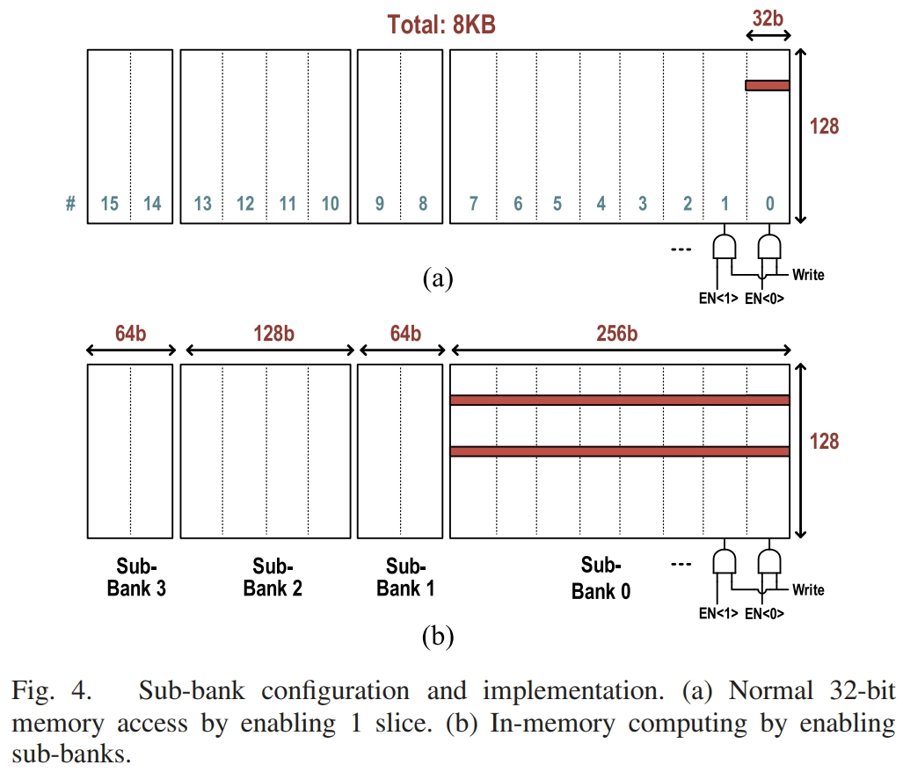

如图4所示，8-kB CSB分为16个slices，每个slice包含128个32-bit words。进行标准memory读写时，只激活一个slice。进行存内计算时，可以通过控制同时激活多个slices，即图4(b)中的Sub-Bank，以支持不同宽度的存内计算。

## RECRYPTOR’S NEAR-MEMORY COMPUTING

### Shifter

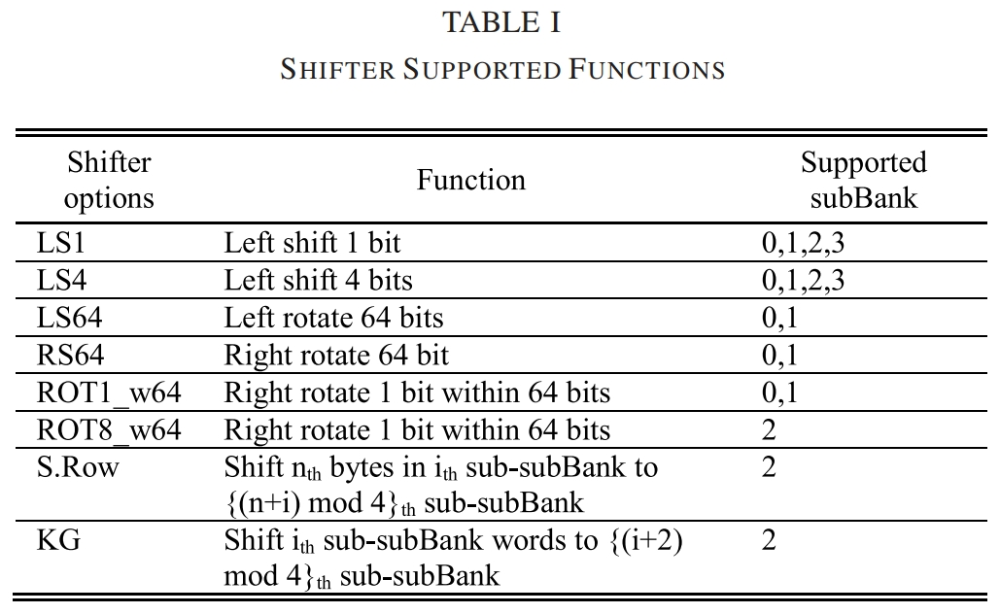

Recryptor支持的近存shifter操作如表1所示。图5显示了一个简单的Shifter的草图及其wiring intensive版图设计。

### Rotator

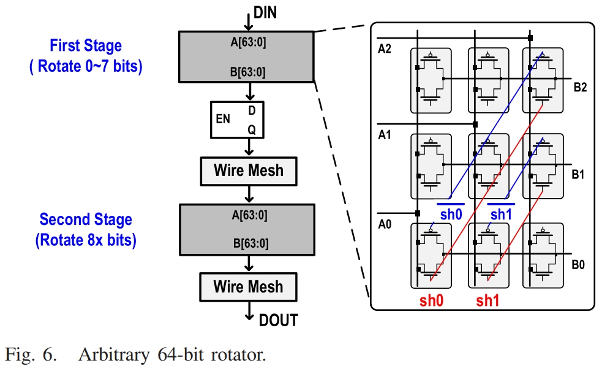

Rotator是用于任意64位旋转的自定义两级设计，如图6所示，第一级可移动0-7 bits，第二级移动8x bits，从而可以实现0-63 bits的任意移位。

### SBOX

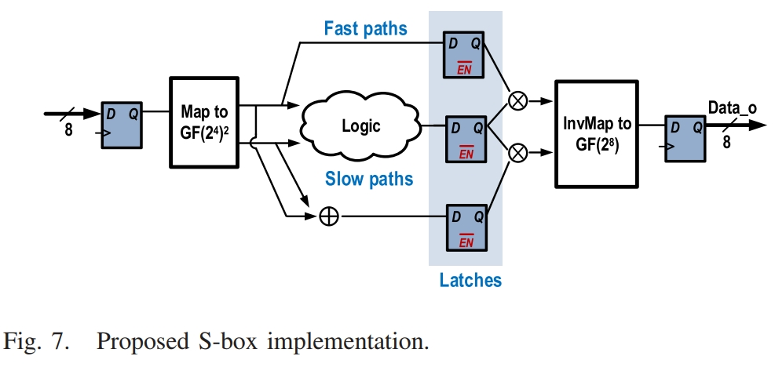

S-box是用于字节替换的分组密码中的常用组件。它是一个非线性函数，对伽罗华域执行乘法反演，然后是仿射变换。该算法在转换为复合域GF(24)2时更有效。电路实现如图7所示。

## 可编程性和优化的算法实现

该段对FFMR，AES，Keccak-f算法进行了优化，并介绍了图2中提及的可选的密码有限状态机，暂时跳过。

## RECRYPTOR 测试芯片设计和实验结果

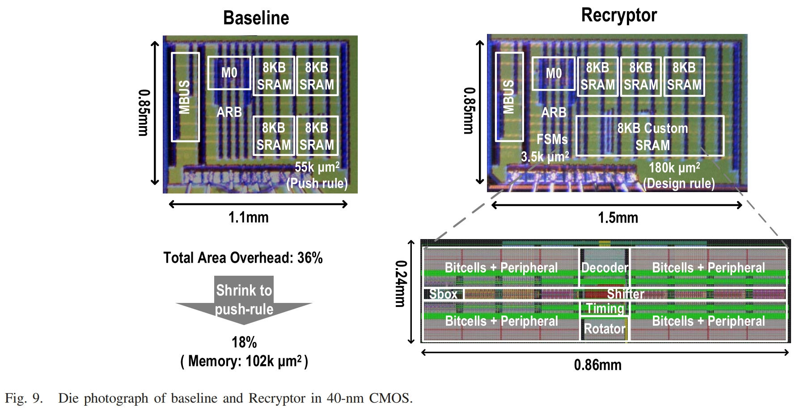

Baseline和Recryptor都是基于ARM Cortex-M0处理器，测试芯片的工艺节点为40nm，如图9所示。

我们可以看出Recryptor与baseline相比，存在36%的面积开销，如果使用push rule设计，面积开销降低至18%。

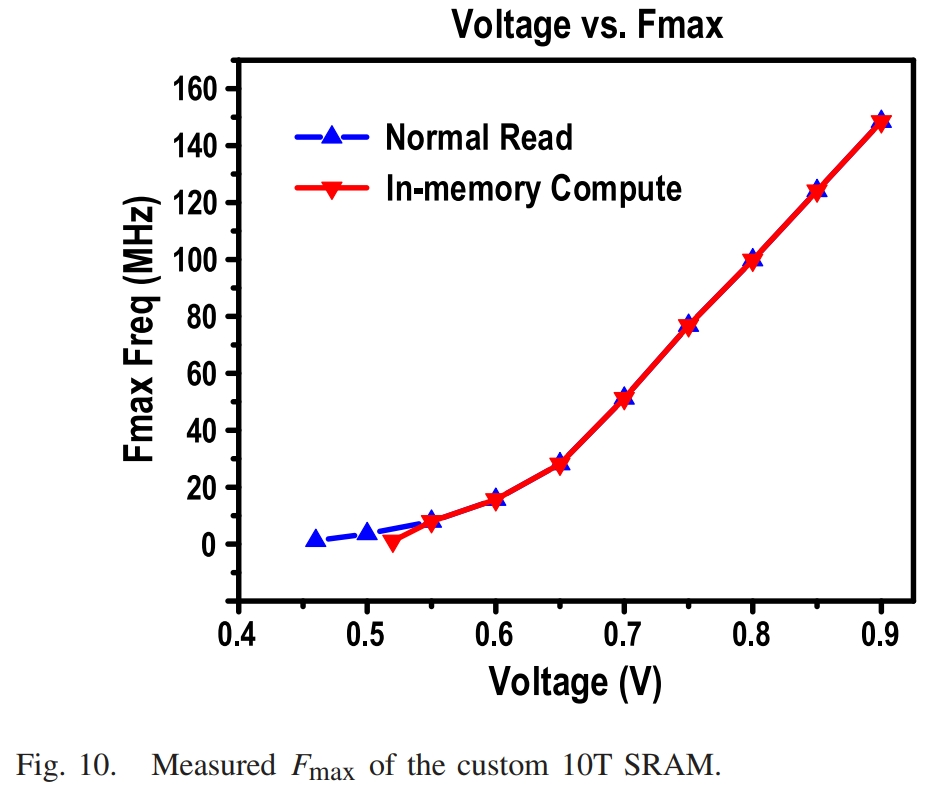

图10显示的时10T SRAM的最高工作频率。

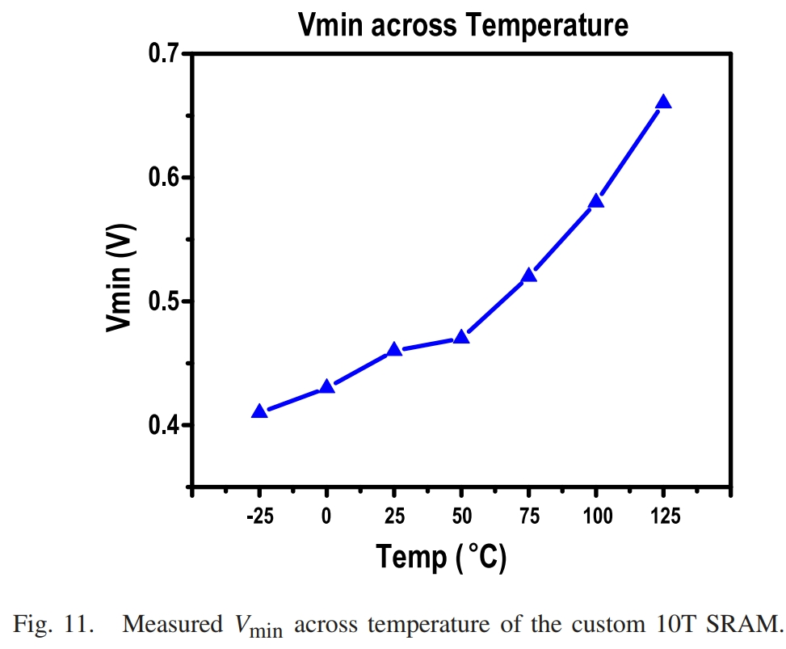

图11显示的时不同温度下正常CSB读操作的最低工作电压。

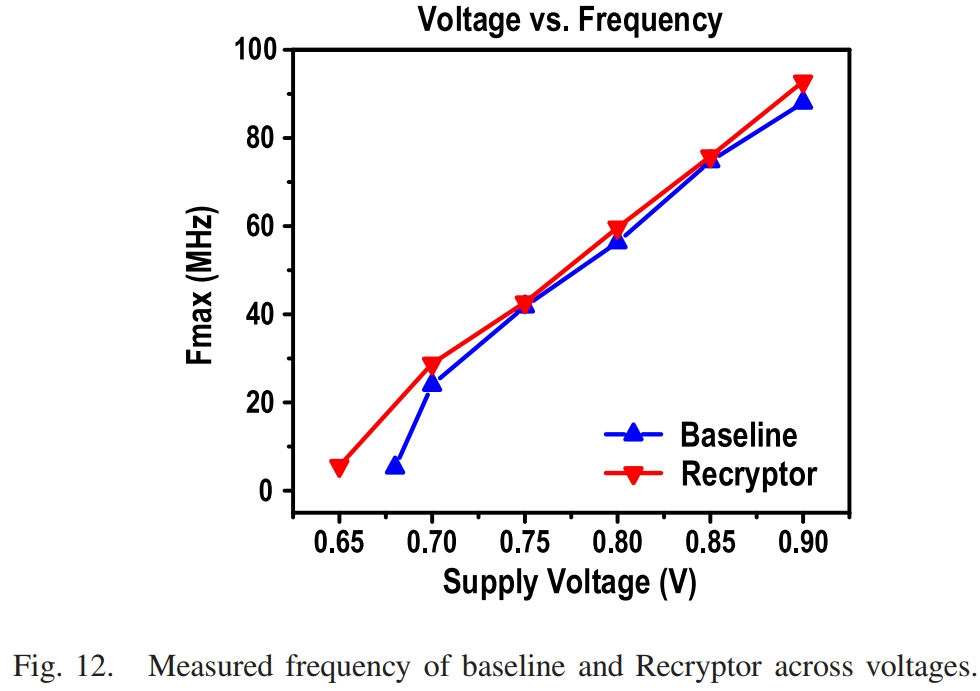

图12可以看出Recryptor与baseline的性能相当接近。

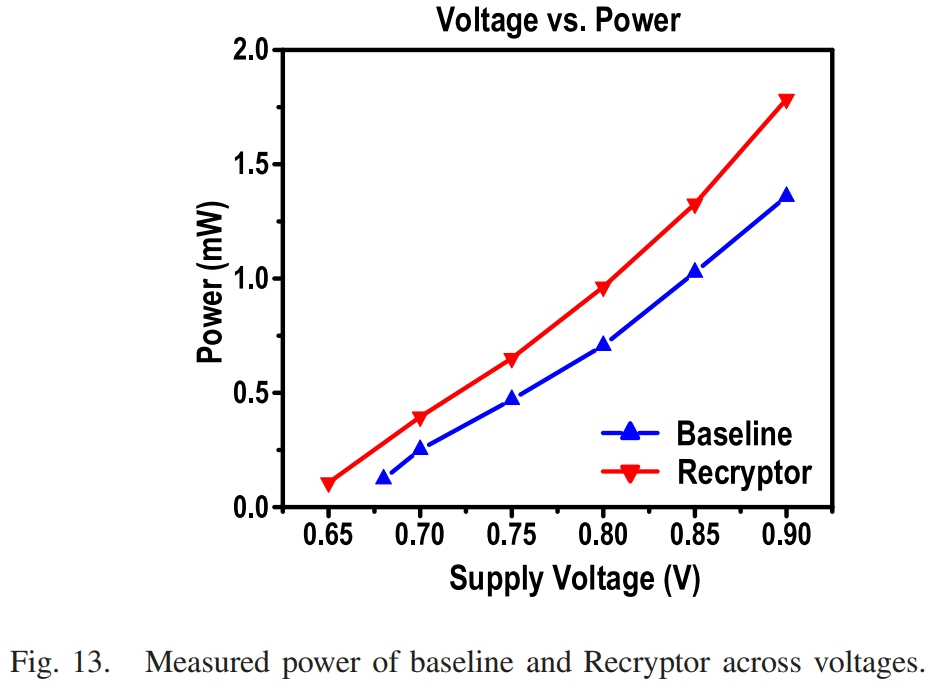

图13可以看出Recryptor的功率超过base 30%，但是这一开销可以被速度优势弥补。

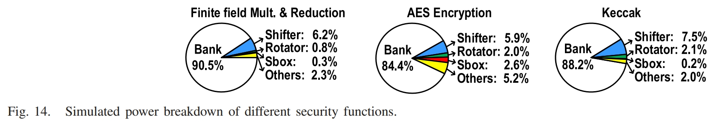

图14显示了CSB仿真的能耗分布。

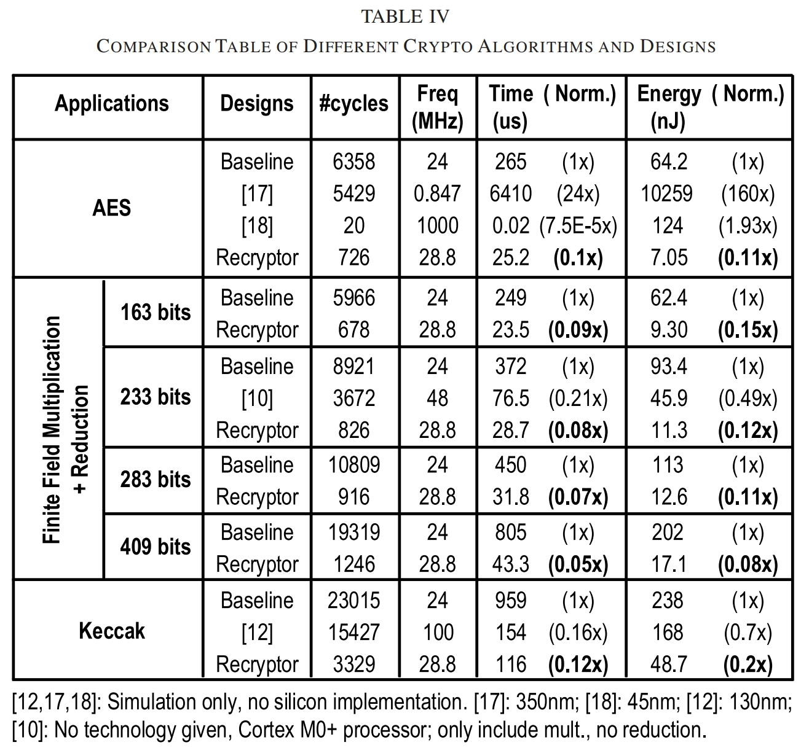

表4显示了Recryptor与其他处理器的性能对比：

- 对于FFMR，Recryptor支持163-409 bits的字长，速度提升大于11倍，能效提升大于6.7倍。
- 对于Keccak，没有任何的协处理器实现的工作，因此选用了参考文献[12]中的ASIC实现进行对比。速度提升超过8倍，能效提升超过4.8倍。
- 对于AES，速度和能效提升9倍。(这边参考文献[18]中的工作速度会快很多，一部分时频率优势，另一部分可能是处理器的微架构优势，这需要看原文才能知道。)

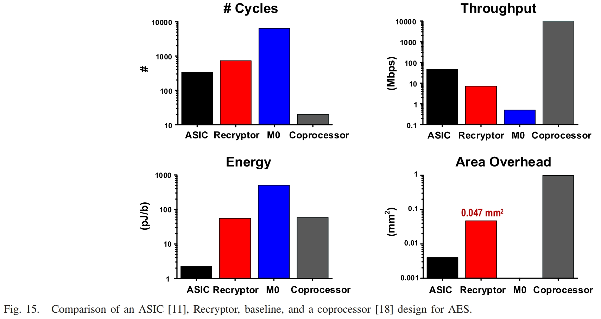

图15进一步与ASIC和加密协处理器进行了对比，可以看出：在面积、吞吐量、能源和可编程性方面，Recryptor 作为比较架构之间的中间解决方案。

## Discussion

暂时跳过