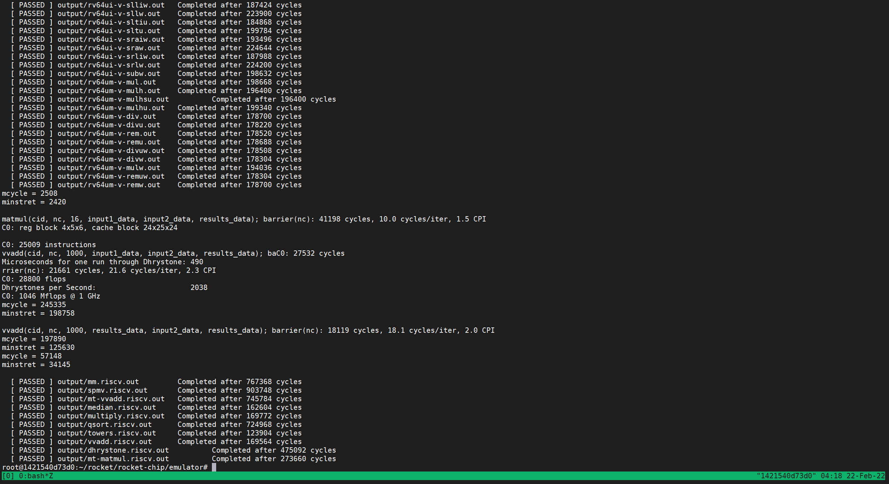
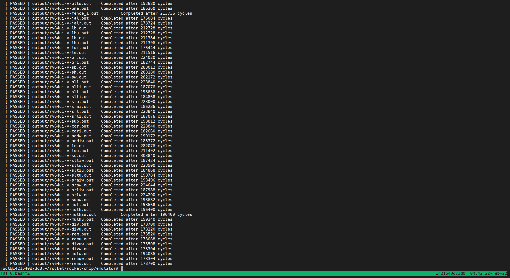
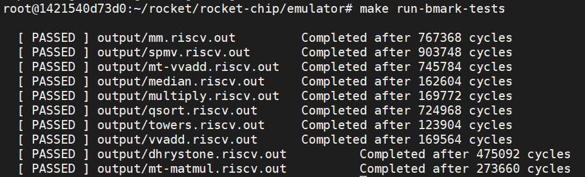
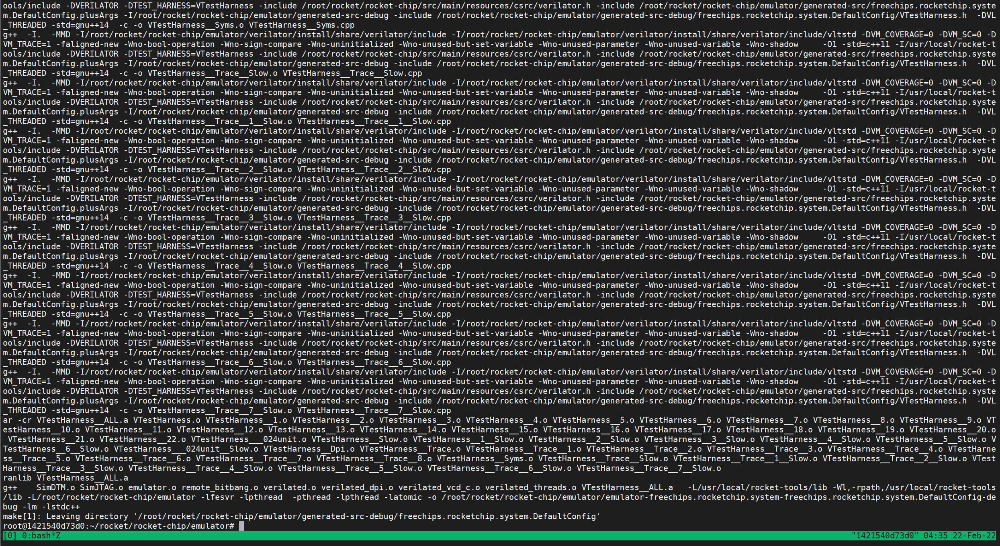
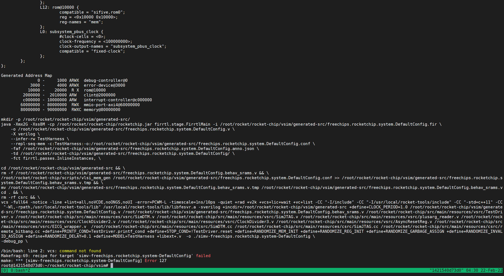

## 一、环境准备

### 1. 准备Rocket-Chip工程

```shell
git clone https://github.com/ucb-bar/rocket-chip.git
cd rocket-chip
export ROCKETCHIP=`pwd`
git submodule update --init
```

### 2. 设置RISCV工具链

首先需要[安装依赖](https://github.com/chipsalliance/rocket-tools/blob/master/README.md)：

```shell
sudo apt-get install autoconf automake autotools-dev curl libmpc-dev libmpfr-dev libgmp-dev libusb-1.0-0-dev gawk build-essential bison flex texinfo gperf libtool patchutils bc zlib1g-dev device-tree-compiler pkg-config libexpat-dev libfl-dev
```

开始编译工具链：

```shell
git clone https://github.com/freechipsproject/rocket-tools
cd rocket-tools
git submodule update --init --recursive
export RISCV=/path/to/riscv/toolchain/installation #例如 /usr/local/rocket-tools
#export MAKEFLAGS="$MAKEFLAGS -jN" # Assuming you have N cores on your host system
./build.sh
#./build-rv32ima.sh (if you are using RV32).
```


## 二、构建项目

### 1. 构建C仿真器(Verilator)

```shell
cd emulator
make
```

运行结果：


运行汇编测试和简单的benchmarks：

```shell
make -jN run-asm-tests
make -jN run-bmark-tests
```





此外还可以构建具有VCS波形生成能力的C仿真器

```shell
cd emulator
make debug
```

运行结果：



运行汇编测试和简单的benchmarks：

```shell
make -jN run-asm-tests-debug
make -jN run-bmark-tests-debug
```

单独测试某一汇编测试或benchmark：

```shell
$ make output/rv64ui-p-add.out
$ make output/rv64ui-p-add.vcd
```

### 2. 构建VCS仿真器

```shell
cd vsim
make
```

运行结果：


显然，缺少VCS指令支持

生成FPGA或VLSI可综合的Verilog：

```shell
cd vsim
make verilog
```

## 三、运行Scala测试

```shell
cd regression

Scala tests
make scalatest SUITE=foo

Scala linter, automatically modifying files to correct issues
make scalafix SUITE=foo

Scala linter, only printing out issues
make scalafix-check SUITE=foo
```

