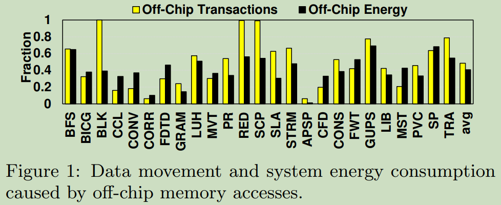
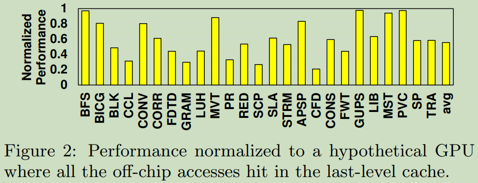
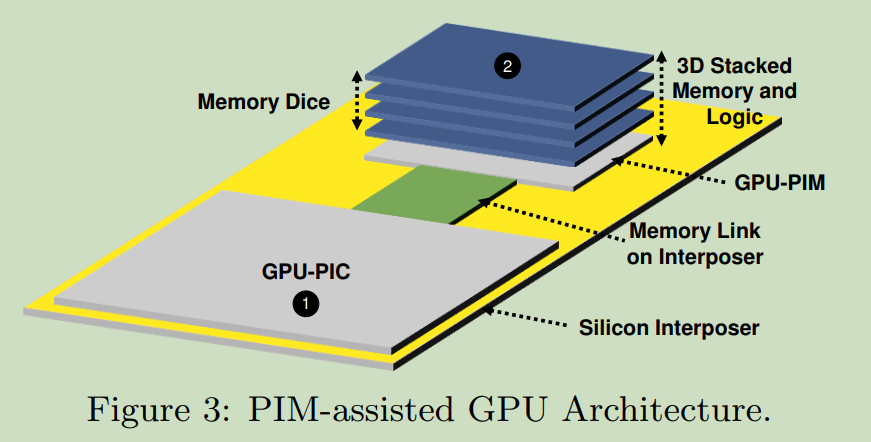
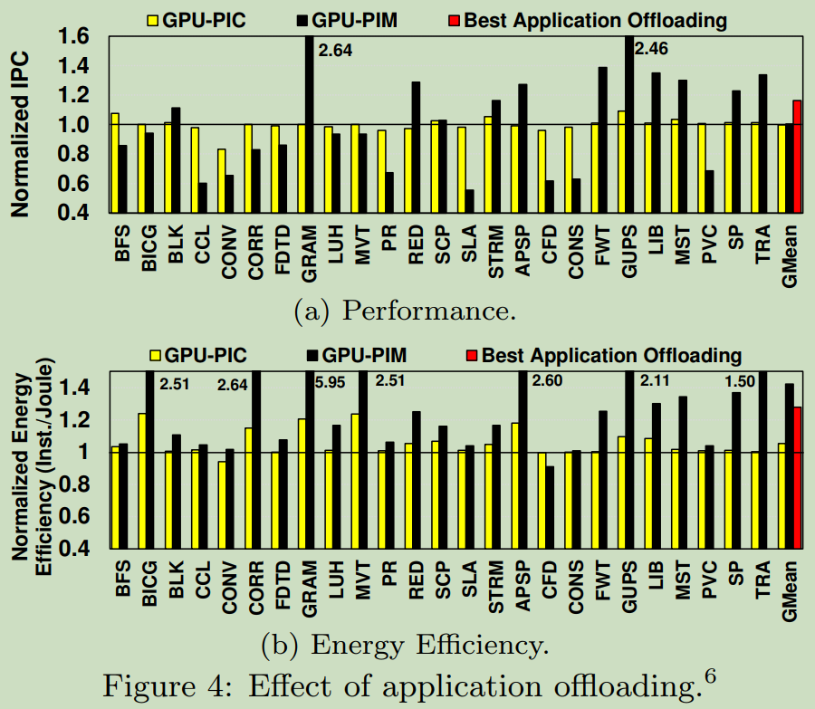
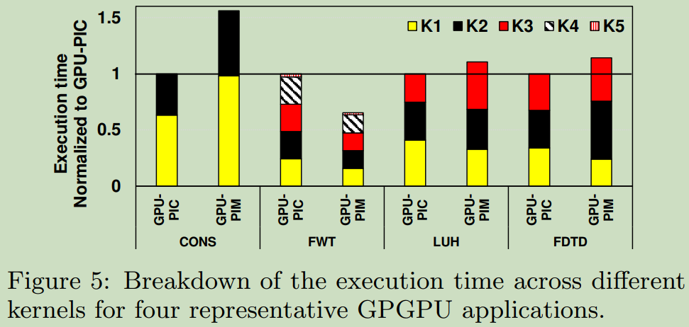
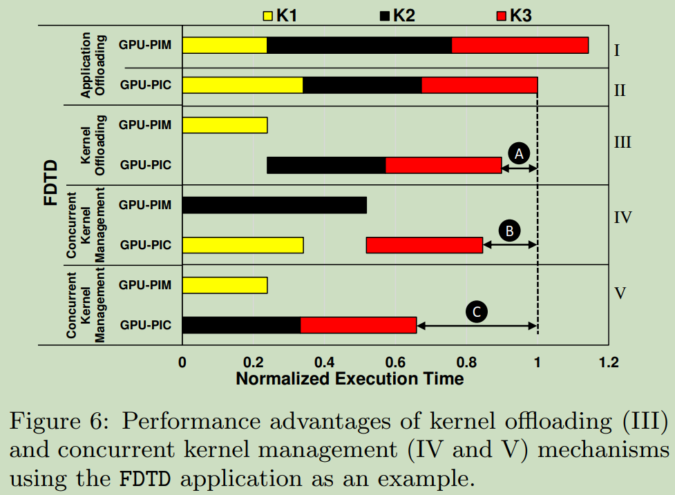

这篇工作为Pennsylvania State University, College of William and Mary, AMD, Intel Labs, ETH, CMU团队发表在2016年的PACT上，主要内容为CUDA kernel在GPU-PIC和GPU-PIM的调度策略。
这篇论文调研了PIM-assisted GPU架构中存在的两个核心代码调度问题：（1）如何自动识别要卸载到内存内核的代码段或内核？（2）如何在主GPU核心和内存中的辅助GPU核心上同时调度多个内核？
论文作者开发两种新的运行时技术：（1）一种基于回归的亲和力预测模型和机制，可准确识别哪些内核将从PIM中受益并将它们卸载到内存中的GPU内核；（2）一种并发内核管理机制，它使用亲和性预测模型、新的内核执行时间预测模型和内核依赖信息来决定在主GPU内核和内存中的GPU内核上同时调度哪些内核。
实验结果：两种技术分别提升应用性能25%和42%，提升能效28%和27%。

图1说明了在现代GPU系统中跨25个应用程序在内存和计算单元之间传输数据的数据移动和能耗开销，我们观察到需要内存访问占所有数据移动的49%，并造成了系统能耗的41%。

图2显示的是内存访问带来的性能损失，baseline为假设所有的off-chip数据访问都在LLC命中，不需要访问DRAM。实验结果表明：平均跨 25 个应用程序，主内存访问导致 45% 的性能下降。

为此，提出了基于3D-stacked DRAM技术的PIM-assisted GPU架构，如图3所示。

存在问题：之前没有工作探索过如何充分利用这种架构，以便识别和安排应用程序的适当部分以利用主 GPU 内核 (GPU-PIC) 和内存中的内核 (GPU-PIM) 来最大限度地提高整个系统的性能和能源效率。

Motivation: 鉴于PIM辅助GPU架构中的这种异构性，CPU可能需要将compute-bound的GPGPU应用程序卸载到GPU-PIC上，并将memory-bound的GPGPU应用程序卸载到GPU-PIM上。然而，这并不是最优的。下面将通过实验一步步的说明这一点。

Fig. 4的实验设置：baseline为40 cores GPU,PIM-Assisted GPU system配置为32 cores GPU-PIC+8 cores GPU-PIM，每个application分别在GPU-PIC和GPU-PIM上执行，Best application offloading配置为每个application选择最佳的执行位置的平均收益。

从图4我们可以看出三点：
1. 将所有应用程序卸载到GPU-PIC或GPU-PIM会产生相似的平均性能，这是因为一些应用程序更适合GPU-PIC和其他的更适合GPU-PIM，简单的说就是不同应用算力需求和访存需求不同。
2. 将所有应用程序卸载到GPU-PIM可提供最高的平均能效（指令/焦耳），甚至高于最佳应用程序卸载机制。
3. 最佳应用程序卸载方案可以根据性能检测执行应用程序的最佳平台，与总是卸载到GPU-PIC或GPU-PIM相比，可以提供性能和能源改进。

是否实现上述第三点，优化应用级调度策略就可以了呢？答案是否定的。应用级调度存在两点限制：（1）缺乏细粒度卸载；（2）缺乏 GPU-PIM 和 GPU-PIC 的并发利用。
为了验证这一观点，本文作者继续实现了以下实验。

图5显示了GPU-PIC和GPU-PIM上四个代表性GPGPU应用程序的kernel级（即细粒度）执行时间分解，归一化为GPU-PIC上的执行时间。可以看出同一应用程序中，不同的kernel在GPU-PIC和GPU-PIM上有不同的执行表现，因此，细粒度的内核级卸载策略可以比应用程序卸载策略执行得更好。

图6显示了不同kernel级调度策略的执行时间，(I)和(II)分别表示应用级调度到GPU-PIM和GPU-PIC上。(III)表示根据kernel的架构亲和性（指的是在那个计算核心上执行时间更短）进行调度，并且保证程序的顺序语义。(IV)和(V)表示的是考虑并发的kernel级调度策略。

从图6可以看出：要想实现最优的调度策略，首先需要判断不同kernel的亲和性；其次，还需要解决kernel之间的依赖问题和执行时间，提高并发效率。

目标：

1. 自动识别应用程序中每个内核的架构亲和性（GPU-PIM或GPU-PIC）；
2. 调度可以在PIM辅助GPU架构（GPU-PIM或GPU-PIC）的不同部分上同时执行的内核)，同时平衡跨架构的执行时间并尽可能保持内核的架构亲和性。

## Kernel Offloading Mechanism

本文使用了回归模型来判断kernel的亲和性，涉及的参数主要分为三类：（1）访存密度；（2）并行度；（3）共享内存(Scratchpad)访问密度，详细的指标如表一所示，其中Static表示可以通过解析源码得到，Dynamic表示跟输入集合相关，需要在启动kernel或在kernel运行时才能得到。