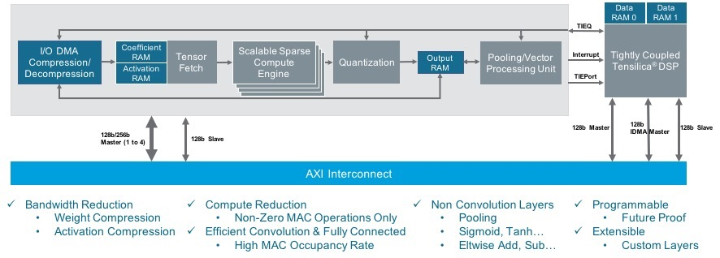
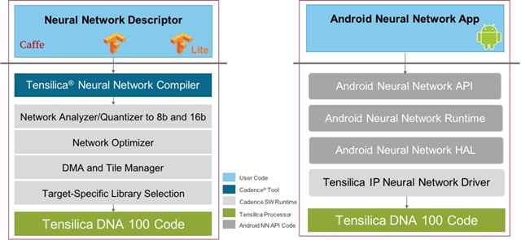

# The New Tensilica DNA 100 Deep Neural-network Accelerator

<!-- TOC -->

- [The New Tensilica DNA 100 Deep Neural-network Accelerator](#the-new-tensilica-dna-100-deep-neural-network-accelerator)
	- [Neural Network Development](#neural-network-development)
	- [DNA架构](#dna架构)
	- [Performance](#performance)
	- [Software](#software)
	- [Summary](#summary)

<!-- /TOC -->

Today, at the beautiful Tegernsee resort outside Munich in Germany, Cadence announced their latest processor IP, the Tensilica DNA 100 Deep Neural-network Accelerator. This is a highly scalable processor with a range from 0.5 TMACS (tera multiply-accumulates per second) up to hundreds of TMACS.

今天，在德国慕尼黑郊外美丽的 Tegernsee 度假村，Cadence 宣布了他们最新的处理器 IP，Tensilica DNA 100 深度神经网络加速器。 这是一个高度可扩展的处理器，范围从 0.5 TMACS（每秒万亿次乘法累加）到数百个 TMACS。

## Neural Network Development

I have heard it said that there has been more advance in deep learning and neural networks in the last 3 years than in all the years before. I rejoined Cadence 3 years ago. Coincidence? I think not.

我听说过去 3 年深度学习和神经网络的进步比以往任何时候都多。 我在 3 年前重新加入了 Cadence。 巧合？ 我想不是。

Joking aside, neural networks have become increasingly important and I have found myself writing about various aspects of them many times. At first, it was mostly about using 32-bit floating point in the cloud, probably with GPUs, too. It has been a hot area in Universities for both undergraduates (instant hire) and research. Just as a datapoint, I happened to see a tweet from Yan LeCun about the most cited authors in the whole of computer science over the last 3 years:

撇开玩笑不谈，神经网络变得越来越重要，我发现自己多次写过它们的各个方面。 起初，它主要是在云中使用 32 位浮点，可能也使用 GPU。 它一直是大学本科生（即时招聘）和研究人员的热门领域。 作为一个数据点，我碰巧看到严乐存的一条推文，关于过去 3 年整个计算机科学中被引用次数最多的作者：

The top researchers are all neural network researchers. Note the units that these are measured in. This is not citations over the whole year, it is citations per day over the whole year. I don't actually know if this should be multiplied by 260 (weekdays) or 365 to get to annual numbers. Even if we use the lower number, in 2018 (annualized) Yoshua Bengio was cited over 34,000 times. Also look at the citation growth over the three years, the rates all basically doubled.

顶尖的研究人员都是神经网络研究人员。 请注意这些的计量单位。这不是全年的引用次数，而是全年每天的引用次数。 我实际上不知道这是否应该乘以 260（工作日）或 365 来获得年度数字。 即使我们使用较低的数字，在 2018 年（年化）Yoshua Bengio 也被引用超过 34,000 次。 再看看这三年的引用增长，率基本都翻了一番。

Once research had found effective ways to use the cloud and GPUs for training, a new important area for research was how to do on-device inference. There are lots of drivers for this, such as wanting more responsive systems than is possible sending everything up to the cloud and back. But the biggest is that some systems need to operate without permanent connectivity. Most obviously, an autonomous vehicle cannot depend on cellular connectivity being good before it decides if a traffic light is red or green. Another driver is the need for privacy: people are uncomfortable with, for example, their smart TV uploading all their conversations to the cloud to find the occasional command of relevance to the TV among the everyday conversation.

一旦研究找到了使用云和 GPU 进行训练的有效方法，一个新的重要研究领域就是如何进行设备端推理。 这有很多驱动因素，例如需要响应速度更快的系统，而不是将所有内容发送到云端并返回。 但最大的问题是某些系统需要在没有永久连接的情况下运行。 最明显的是，自动驾驶汽车在决定交通灯是红色还是绿色之前不能依赖于良好的蜂窝连接。 另一个驱动因素是对隐私的需求：例如，人们对他们的智能电视将所有对话上传到云端以在日常对话中偶尔找到与电视相关的命令感到不舒服。

On-device inference means doing inference with limited resources. There are two big aspects to this. How to compress the network (weight data) without losing accuracy, and how to architect hardware that can handle on-device inference using the compressed weight data. At the recent HOT CHIPS conference in Cupertino, one of the tutorials was on how to do the compression. I won't cover that ground again here, you can read my post [HOT CHIPS Tutorial: On-Device Inference](https://community.cadence.com/cadence_blogs_8/b/breakfast-bytes/posts/ai-processing). The bottom line is to reduce everything from 32-bit floating point to 8-bit, and to use techniques to make as many of the weight values zero, and so the matrices involved as sparse as possible. Surprisingly, instead of this being a difficult tradeoff of size and accuracy, the reduced networks seem to end up with slight increases in accuracy. The compression ratios can be as high as 50 times.

设备端推理意味着在有限的资源下进行推理。 这有两个重要方面。 如何在不损失准确性的情况下压缩网络（权重数据），以及如何构建能够使用压缩的权重数据处理设备端推理的硬件。 在最近在库比蒂诺举行的 HOT CHIPS 会议上，其中一个教程是关于如何进行压缩的。 我不会在这里再次介绍这个领域，您可以阅读我的帖子 HOT CHIPS 教程：设备上的推理。 底线是将所有内容从 32 位浮点减少到 8 位，并使用技术使尽可能多的权重值为零，从而使所涉及的矩阵尽可能稀疏。 令人惊讶的是，这不是在大小和准确性之间进行艰难的权衡，而是减少的网络最终似乎在准确性上略有增加。 压缩比可高达 50 倍。

Having made many of the weights zero, the next step is to build optimized hardware that delivers a huge number of MACS and deals with all those zeros specially. The reason optimizing the zeros is so important is that zero times anything is zero. So not only is it unnecessary to explicitly load zero into a register, nor do the multiply, but the other value in the calculation does not need to be loaded either. The values involved can also be compressed so that fewer bits need to be transferred to and from memory—every memory transfer uses power, and it is not hard to end up with data transfer interface consuming more power than the calculations themselves, as happens with the Google TPU.

将许多权重设为零后，下一步是构建优化的硬件，以提供大量 MACS 并专门处理所有这些零。 优化零点如此重要的原因是零乘以任何东西都是零。 因此，不仅不需要将零显式加载到寄存器中，也不需要进行乘法运算，而且计算中的其他值也不需要加载。 所涉及的值也可以被压缩，以便更少的位需要传输到内存和从内存传输——每次内存传输都会消耗能量，并且最终数据传输接口比计算本身消耗更多的能量并不难，就像 谷歌 TPU。

## DNA架构

The computational requirements (and the power and silicon budgets to pay for them) vary a lot depending on the end market. For example:

计算要求（以及支付它们的功率和硅预算）因终端市场而异。 例如：

- IoT is less than 0.5 TMACS
- Mobile is 0.5 to 2 TMACS
- AR/VR is 1-4 TMACS
- Smart surveillance is 2-10 TMACS
- Autonomous vehicles from 10s to 100s of TMACS

Every application of a processor like the DNA 100 is going to be different, but one high-end use case is perception and decision making in automotive, with cameras, radar, lidar, and ultrasound. A typical architecture is to have local pre-processing of the different types of data, and then bring it all together to analyze it (is that a pedestrian?) and act upon it (apply the brakes). Cadence has some application specific Tensilica processors such as the Vision C5 suitable for handling the pre-processing, and the new DNA 100 is powerful enough to handle all the decision making.

像 DNA 100 这样的处理器的每一种应用都会有所不同，但一个高端用例是汽车中的感知和决策，包括摄像头、雷达、激光雷达和超声波。 典型的架构是对不同类型的数据进行本地预处理，然后将它们放在一起进行分析（这是行人吗？）并对其采取行动（刹车）。 Cadence 有一些特定于应用程序的 Tensilica 处理器，例如适合处理预处理的 Vision C5，而新的 DNA 100 功能强大，足以处理所有决策。

The DNA 100 processor architecture is shown in the block diagram above. The left-hand gray background block is a sparse compute engine with high MAC utilization. The block on the right is a tightly coupled Tensilica DSP that controls the flow of processing, and also future-proofs designs by providing programmability. You can think of these two blocks as the orchestra and the conductor.

DNA 100 处理器架构如上图所示。 左侧的灰色背景块是具有高 MAC 利用率的稀疏计算引擎。 右边的块是一个紧密耦合的 Tensilica DSP，它控制处理流程，并通过提供可编程性来适应未来的设计。 您可以将这两个街区视为管弦乐队和指挥家。

The DNA 100 architecture is scalable internally, mostly by how many MACs are included. It can easily scale from 0.5 to 12 TMACS. The next level of scaling is to put several DNA 100 cores on the same chip, communicating via some sort of network-on-chip (NoC). If that is not enough, multiple chips (or boards) can be grouped into a huge system. Autonomous driving has been described as requiring a super-computer in the trunk. This is how you build a supercomputer like that.

DNA 100 架构可在内部进行扩展，主要取决于包含的 MAC 数量。 它可以轻松地从 0.5 到 12 TMACS。 下一个扩展级别是将多个 DNA 100 内核放在同一芯片上，通过某种片上网络 (NoC) 进行通信。 如果这还不够，可以将多个芯片（或板）组合成一个庞大的系统。 自动驾驶被描述为需要在后备箱中安装超级计算机。 这就是你如何建造一台这样的超级计算机。

## Performance

ResNet50 is a well-known network for image classification. A DNA 100 processor in a 4K MAC configuration, running at 1GHz can handle 2550 frames per second. This high number is enabled by both sparse compute and high MAC utilization.

ResNet50 是一个著名的图像分类网络。 4K MAC 配置的 DNA 100 处理器，运行频率为 1GHz，每秒可处理 2550 帧。 这个高数字是由稀疏计算和高 MAC 利用率实现的。

It is also extremely power-efficient. In 16nm it delivers 3.4 TMACS/W (in a 4 TMACS configuration, with all the network pruning).

它也非常节能。 在 16nm 中，它提供 3.4 TMACS/W（在 4 TMACS 配置中，所有网络修剪）。

## Software

A complex processor like the DNA 100 is not something where you would consider programming "on the bare metal." There are frameworks such as Caffe, TensorFlow, and TensorFlow Lite that are popular for creating the neural networks. Cadence has the Tensilica Neural Network Compiler that takes the output from these frameworks and maps them onto the DNA 100, performing all the sparseness optimization, and eventually generating the DNA 100 code. Another popular approach is the Android Neural Networks API, which handles some levels of mapping before passing on to the Tensilica IP Neural Network Driver that produces the DNA 100 code.

像 DNA 100 这样的复杂处理器不是您考虑“在裸机上”编程的东西。 有一些框架，例如 Caffe、TensorFlow 和 TensorFlow Lite，它们在创建神经网络方面很受欢迎。 Cadence 拥有 Tensilica 神经网络编译器，可将这些框架的输出映射到 DNA 100，执行所有稀疏优化，并最终生成 DNA 100 代码。 另一种流行的方法是 Android 神经网络 API，它在传递到生成 DNA 100 代码的 Tensilica IP 神经网络驱动程序之前处理某些级别的映射。

And in a bit of late-breaking news from last Thursday:

在上周四的一些最新消息中：

> At Facebook’s 2018 @Scale conference in San Jose, California today, the company announced broad industry backing for Glow, its machine learning compiler designed to accelerate the performance of deep learning frameworks. Cadence, Esperanto, Intel, Marvell, and Qualcomm committed to supporting Glow in future silicon products.
> Facebook 今天在加利福尼亚州圣何塞举行的 2018 年 @Scale 会议上，该公司宣布了 Glow 的广泛行业支持，Glow 是其旨在加速深度学习框架性能的机器学习编译器。 Cadence、世界语、英特尔、Marvell 和高通承诺在未来的硅产品中支持 Glow。

The DNA 100 doesn't support Glow yet...but watch this space.

DNA 100 尚不支持 Glow ......但请注意这个空间。

For higher level functionality, Cadence partners with specialists such as ArcSoft for facial recognition, or MulticoreWare for face-detection.

对于更高级别的功能，Cadence 与 ArcSoft 等专家合作进行面部识别，或 MulticoreWare 进行面部检测。

## Summary

The Tensilica DNA 100:

- Can run all neural network layers, including convolution, fully connected, LSTM, LRN, and pooling.
- Can easily scale from 0.5 to 12 effective TMACS. Further, multiple DNA 100 processors can be stacked to achieve 100s of TMACS for use in the most compute-intensive on-device neural network applications.
- Also incorporates a Tensilica DSP to accommodate any new neural network layer not currently supported by the hardware engines inside the DNA 100 processor.
- Complete software compilation flow, including compression for sparsity.
- Will be available to select customers in December 2018, with general availability in Q1 2019.

For more details, see the [product page](https://ip.cadence.com/ai&CMP=TIP_AI1_BLG_CDN_0918_PP).

原文链接：https://community.cadence.com/cadence_blogs_8/b/breakfast-bytes/posts/tegensee