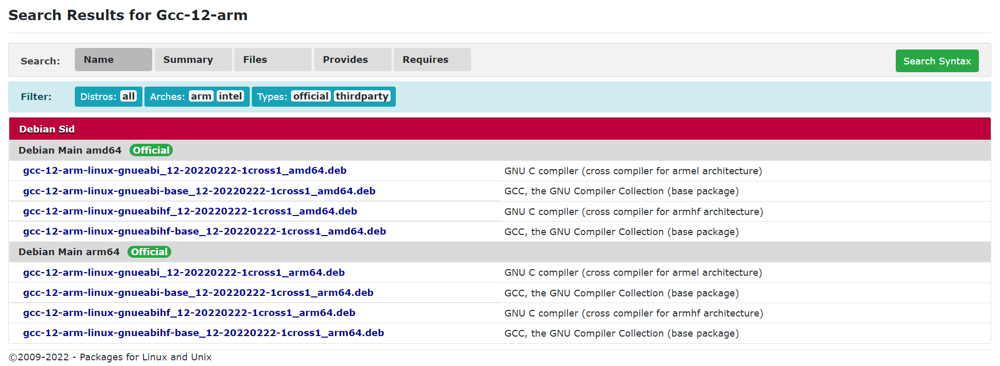
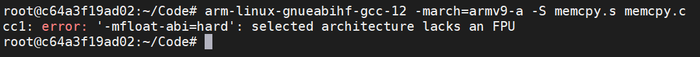
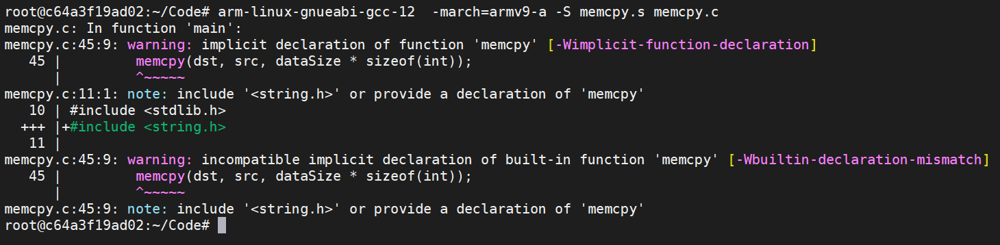
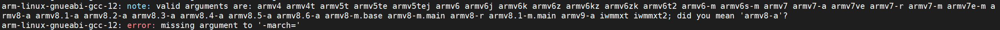

# Ubuntu 20.04安装gcc-12

在[^1]中可以看到存在的可安装文件为：



关于eabi和eabihf的区别，参考[^2]。此处建议安装eabi版本，否则会在指定--march=armv9-a时报fpu错误。





参考[^3]中加入安装源，在/etc/apt/sources.list中加入：

```shell
deb http://deb.debian.org/debian unstable main
deb http://deb.debian.org/debian-debug unstable-debug main
deb http://deb.debian.org/debian-ports unstable main
```

此时，apt-get ungrade时可能会遇到NO_PUBKEY的问题，参考[^4]安装所有显示的key。

此后，进行apt-get安装对应软件包即可。

本来想体验ARMv8.8中的FEAT_MOPS指令，可惜编译结果表明，并不支持。虽然支持armv9，但是还没有支持armv8.8。




[^1]:https://pkgs.org/search/?q=Gcc-12-arm
[^2]:https://blog.csdn.net/weixin_39328406/article/details/117202335
[^3]:http://deb.debian.org/
[^4]:https://blog.csdn.net/yjk13703623757/article/details/78998443