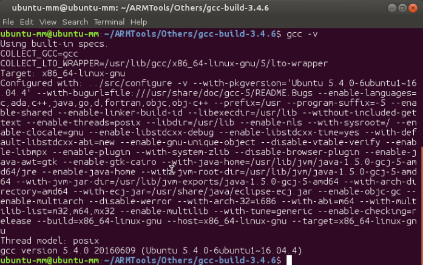
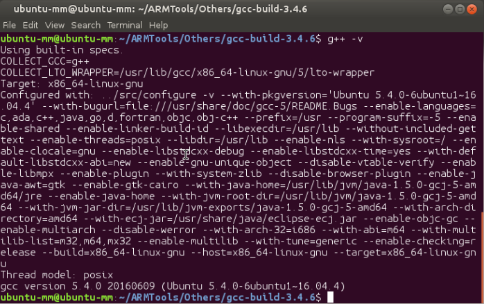
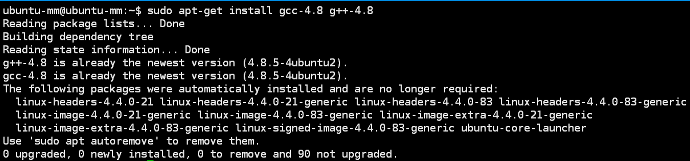
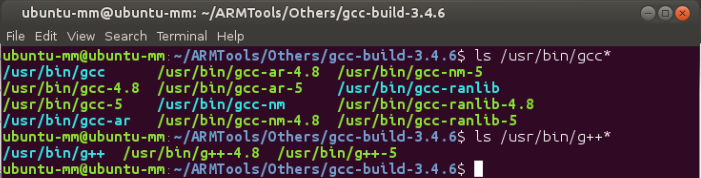
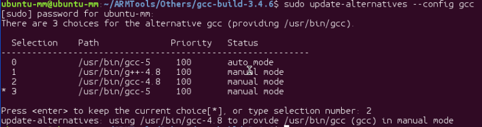
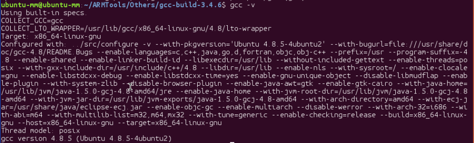
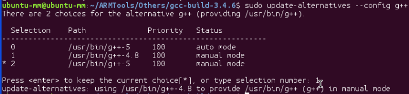

## 一、Ubuntu16.04多个版本GCC编译器的安装和切换

这几天在配置交叉编译ARM开发板的linux内核的过程中碰到了很多问题，其中包括了GCC版本太高等问题，由此我打算安装其他老的版本给我的Ubuntu16.04.实验过程如下：

官网的教程是最牛逼的，先看看官网的安装教程吧：https://gcc.gnu.org/install/

### 1、首先查看一下当前我的Ubuntu16.04版本的原装GCC版本：

```
gcc -v #查看gcc的版本
g++ -v #查看g++的版本
```





如上图所示：GCC的版本是5.4.0（这对我编译某些很早的内核文件的确是太新了）

### 2、安装目前需要GCC和G++的版本（目前安装的是gcc-4.8.5版本）：

在这之前，我尝试采用下载源文件编译安装的方法，碰到了太多的问题，先记录于此，后面再解决吧，先使用apt-get的安装方法：

```
sudo apt-get install gcc-4.8 g++-4.8
```



你在安装完之后可以采用下面的指令来查看当前系统中安装的所有的gcc和g++的版本：

```
ls /usr/bin/gcc*
ls /usr/bin/g++*
```




### 3、将某个版本加入gcc候选中，最后的数字是优先级，我自己是直接设为100（测试没有问题），指令如下：

```
sudo update-alternatives --install /usr/bin/gcc gcc /usr/bin/gcc-4.8 100
```
同样的我们也将原来系统中的gcc和g++的优先级改成100，这样我们就能在选择完当前使用版本之后不会恢复默认优先级的版本。

```
sudo update-alternatives --install /usr/bin/gcc gcc /usr/bin/gcc-5 100
```

### 4、完成上面的操作之后，我们就可以通过下面的指令来选择不同的gcc和g++的版本了，（注意使用之前确保至少有两个gcc或者g++的版本进行了第3步的操作）：

```
sudo update-alternatives --config gcc
```



这里我们选择了2，也就是gcc-4.8的版本，接下来查看当前的版本是否已经切换过来了。

```
gcc -v
```



这样表示确实切换过来了。

我们可以使用同样的方法来选择g++：



<font color=red>注意一个问题：
当切换使用了其他版本的gcc时，请务必保持g++的版本和gcc版本的一致性，否则用cmake配置出来的项目遇到c++代码还是会用之前版本的gcc。</font>

关于直接编译安装gcc的教程可以参看这里（虽然我还没成功）：http://blog.csdn.net/ws_20100/article/details/51207372

关于上面的gcc的切换和安装也可以参考这里：http://www.linuxidc.com/Linux/2017-03/142299.htm

## 二、Ubuntu中update-alternatives命令

### 1. update-alternatives 命令选项

命令格式：update-alternatives [<选项> ...] <命令>

主要参数：

```shell
Commands:
  --install <link> <name> <path> <priority>
    [--slave <link> <name> <path>] ...
                           在系统中加入一组替换项.
  --remove <name> <path>   从 <名称> 替换组中去除 <路径> 项.
  --remove-all <name>      从替换系统中删除 <名称> 替换组.
  --auto <name>            将 <名称> 的主链接切换到自动模式.
  --display <name>         显示关于 <名称> 替换组的信息.
  --query <name>           machine parseable version of --display <name>.
  --list <name>            列出 <名称> 替换组中所有的可用替换项.
  --get-selections         list master alternative names and their status.
  --set-selections         read alternative status from standard input.
  --config <name>          列出 <名称> 替换组中的可选项，并就使用其中
                                 哪一个，征询用户的意见.
  --set <name> <path>      将 <路径> 设置为 <名称> 的替换项.
  --all                    对所有可选项一一调用 --config 命令.
<link> 是指向 /etc/alternatives/<名称> 的符号链接>.
  (e.g. /usr/bin/pager)
<name> 是该链接替换组的主控名.
  (e.g. pager)
<path> 是替换项目标文件的位置.
  (e.g. /usr/bin/less)
<priority> 是一个整数，在自动模式下，这个数字越高的选项，其优先级也就越高.
Options:
  --altdir <directory>     指定不同的可选项目录.
  --admindir <directory>   指定不同的管理目录.
  --log <file>             设置log文件.
  --force                  allow replacing files with alternative links.
  --skip-auto              skip prompt for alternatives correctly configured
                           in automatic mode (relevant for --config only)
  --verbose                详尽的操作进行信息，更多的输出.
  --quiet                  安静模式，输出尽可能少的信息.
  --help                   显示本帮助信息.
  --version                显示版本信息.
```

### 2. display命令：（查看命令链接信息）

指令格式：update-alternatives --display name

例子：
```shell
root@12c917c63fb3:/share/IMPICA/gem5# update-alternatives --display gcc
gcc - auto mode
  link best version is /usr/bin/gcc-4.8
  link currently points to /usr/bin/gcc-4.8
  link gcc is /usr/bin/gcc
/usr/bin/gcc-4.8 - priority 100
/usr/bin/gcc-5 - priority 100
```

### 3. install命令：（增加命令链接）

指令格式：update-alternatives --install link name path priority

例子：

```shell
sudo update-alternatives --install /usr/bin/gcc gcc /usr/bin/gcc-4.8 100
sudo update-alternatives --install /usr/bin/gcc gcc /usr/bin/gcc-5 100
```

### 4. remove命令：（删除命令链接）

指令格式：update-alternatives --remove name path

例子：

```shell
sudo update-alternatives --remove g++ /usr/bin/g++-4.8
```

### 5. config命令：（配置命令链接）

指令格式：update-alternatives --config name

例子：

```shell
$ update-alternatives --config gcc
There are 2 choices for the alternative gcc (providing /usr/bin/gcc).

  Selection    Path              Priority   Status
------------------------------------------------------------
* 0            /usr/bin/gcc-4.7   100       auto mode
  1            /usr/bin/gcc-4.7   100       manual mode
  2            /usr/bin/gcc-4.8   50        manual mode

Press enter to keep the current choice[*], or type selection number: 
```

### 6. auto和manual模式转换

默认为auto模式，将manual模式改为auto模式：

指令格式：update-alternatives --auto name

```shell
$ update-alternatives --auto gcc
```


## Reference

- [1] https://www.cnblogs.com/uestc-mm/p/7511063.html
- [2] https://blog.csdn.net/u011762313/article/details/47324839
- [3] https://blog.csdn.net/JasonDing1354/article/details/50470109
- [4] https://linux.die.net/man/8/update-alternatives