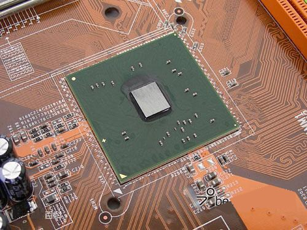
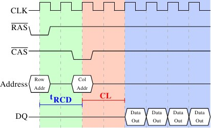

<!-- TOC -->

- [Ⅰ Classification of the memory controller](#ⅰ-classification-of-the-memory-controller)
  - [1. Traditional memory controller](#1-traditional-memory-controller)
  - [2. Integrated memory controller](#2-integrated-memory-controller)
- [Ⅱ Working principle of the memory controller](#ⅱ-working-principle-of-the-memory-controller)
  - [1. Memory frequency](#1-memory-frequency)
  - [2. Memory Capacity](#2-memory-capacity)
  - [3. Operating Voltage](#3-operating-voltage)
  - [4. Timing parameters](#4-timing-parameters)
- [Ⅲ Advantage and disadvantage](#ⅲ-advantage-and-disadvantage)
  - [1. Advantage](#1-advantage)
  - [2. Disadvantage](#2-disadvantage)
- [Ⅳ To sum up](#ⅳ-to-sum-up)

<!-- /TOC -->

The memory controller is an important part of the computer system that controls the memory and is responsible for data exchange between the memory and the CPU. The memory controller determines the maximum memory capacity that the computer system can use, the number of memory banks, memory type and speed, memory particle data depth and data width, and other important parameters. The memory controller determines the memory performance of the computer system and therefore has a greater impact on the overall performance of the computer system.

<iframe src="https://youtu.be/OXLY7mrHIaI"></iframe>

## Ⅰ Classification of the memory controller

With the development of computer technology, memory controllers are divided into traditional and integrated types.

### 1. Traditional memory controller

The **memory controller** of a traditional computer system is located inside the northbridge chip of the motherboard chipset. To exchange data with the memory, the CPU needs to go through the five steps of "CPU-North Bridge-Memory-North Bridge-CPU". In this mode, the data passes through Multi-level transmission, the data delay is obviously relatively large, which affects the overall performance of the computer system.

memory controller

### 2. Integrated memory controller

Integrated memory controller means to build a memory controller on the base of the CPU. Let us talk about how the system works without a memory controller. The 26 data A~Z needs to be transmitted to the CPU. The CPU issues an instruction to the northbridge. Because the memory controller is integrated on the northbridge, it is said to pass through the northbridge. The memory receives the instruction through the memory controller. This instruction transfers the A~Z data of unit b in the memory to the CPU, and the memory starts to fetch the data at this time, which is usually referred to as addressing. When the memory finds this data, and each of these 26 data is 500MB, the sum of all data is about 12GB. Assuming that the memory is a dual-channel R2 800, the data transfer rate is 800MHZ multiplied by 128BIT divided by 8 bits per byte = 12GB per second. Through analysis, it is believed that it only takes one second to transmit to the CPU. The data is only transmitted to the North Bridge in one second. The memory controller is in the North Bridge. 

How do the data in the North Bridge be transmitted to the CPU? This must be through the FSB front-side bus. Assuming the FSB frequency is 800MHZ, then the data transfer rate is multiplied by 64BIT divided by 8 bits per second = 6.4GB per second. It takes 2 seconds from the North Bridge to the CPU, so the total time for data transmission to the CPU is 3 seconds. 

Next, let's look at the CPU integrated memory controller system. How does it work? After the data is transmitted from the memory to the controller, it is also 1 second. The difference is that this time does not need to go through the slow front-side bus, the CPU directly reads the data from the memory controller because the memory controller is at the door of the CPU. For example, when an item is at your door, everyone can take it directly. The CPU of the integrated memory controller reads 12GB of data. The time is 1 second, so the calculation time is greatly saved, and the performance of the CPU is also fully utilized.

Finally, to summarize: when the CPU does not have a memory controller, the data transmission is the memory controller --- Northbridge - CPU; when there is a memory controller, the data is transferred by the memory controller - CPU.

## Ⅱ Working principle of the memory controller

### 1. Memory frequency
Like the CPU, the memory has its own operating frequency. The frequency is measured in MHz. The higher the memory frequency, to a certain extent, the faster the memory can reach. The main frequency of the memory determines the maximum frequency at which the memory can work normally. The mainstream memory types are DDR3 and DDR4. As a replacement for DDR2, the frequency of DDR3 memory has reached 1600MHz, while the frequency of DDR4 memory is 2133MHz. 

### 2. Memory Capacity
The memory capacity is not only a factor that affects the price of the memory, but also a factor that affects the performance of the entire system. In the past Windows XP platform, 512M of memory was still the mainstream, and 1GB was already a large capacity. 64-bit systems began to spread, Windows Vista, Windows 7, and Windows 10 were used by more and more people. Without about 2GB of memory, smooth operation may not be guaranteed. The capacity of a single memory is 1GB, 2GB, 4GB. The highest has reached 8GB and 16GB. 

### 3. Operating Voltage
The voltage value required by the memory for normal operation is different, but each has its own specifications. Exceeding its specifications may easily cause memory damage. The working voltage of DDR2 memory is generally around 1.8V, while DDR3 memory is around 1.5V or 1.35V. In order to overclock, the memory needs to work at a voltage higher than the standard. For each brand and model of memory, it depends on the manufacturer. As long as it floats within the allowable range, a slight increase in the memory voltage is conducive to memory overclocking, but at the same time, the heat generation greatly increases, so there is a risk of hardware damage. 

### 4. Timing parameters

Parameters of the memory controller

**tCL: CAS Latency Control(tCL)**

Generally, when we look up the timing parameters of the memory, such as "8-8-8-24". The corresponding parameters of the above-mentioned digital sequences are "CL-tRCD-tRP-tRAS". The first "8" is the first parameter, the CL parameter.

CAS Latency Control (also described as tCL, CL, CAS Latency Time, CAS Timing Delay). CAS controls the time between receiving instruction and executing the instruction. Because CAS mainly controls the hexadecimal address or the column address in the memory matrix, it is the most important parameter and should be set as low as possible under the premise of stability.

The memory is addressed according to rows and columns. When the request is triggered, it is initially tRAS (Active to Precharge Delay). After precharging, the memory really starts to initialize RAS. Once tRAS is activated, RAS (Row Address Strobe) starts to address the required data. First is the row address, then initialize tRCD, the cycle ends, and then access the exact hexadecimal address of the required data through CAS. The period from the beginning of the CAS to the end of the CAS is the CAS delay. So CAS is the last step to find data, and it is also the most important of memory parameters.

This parameter controls how many clock cycles the memory waits after receiving a data read instruction before actually executing the instruction. At the same time, this parameter also determines the number of clock cycles required to complete the first part of the transfer in a memory burst transfer. The smaller the parameter, the faster the memory speed. It must be noted that part of the memory cannot run at low latency, and data may be lost. And increasing the latency can make the memory run at a higher frequency, so when you need to overclock the memory, you should try to increase the CAS latency.

This parameter has the greatest impact on memory performance. Under the premise of ensuring system stability, the lower the CAS value, the faster the memory read and write operations.

**tRCD: RAS to CAS Delay**

This value is the second parameter in the memory timing parameters of "8-8-8-24", that is, the second "8". RAS to CAS Delay (also described as tRCD, RAS to CAS Delay, Active to CMD) means "row addressing to column addressing delay time". The smaller the value, the better the performance. When reading, writing, or refreshing the memory, a delay clock cycle needs to be inserted between these two pulse signals. In the JEDEC specification, it is the second parameter. Reducing this delay can improve system performance. If the overclocking performance of your memory is not good, you can set this value to the default value of the memory or try to increase the tRCD value.

**tRP: Row Precharge Timing(tRP)**

This value is the third parameter in the memory timing parameters of "8-8-8-24", that is, the third "8". Row Precharge Timing (also described as tRP, RAS Precharge, Precharge to active) means "memory row address controller precharge time". The smaller the precharge parameter, the faster the memory read and write speed. tRP is used to set the charging time required by RAS before another row can be activated.

**tRAS: Min RAS Active Timing**

This value is the last parameter in the memory timing parameters of "8-8-8-24", that is, "24". Min RAS Active Time (also described as tRAS, Active to Precharge Delay, Row Active Time, Precharge Wait State, Row Active Delay, Row Precharge Delay, RAS Active Time), which means "the shortest period from the effective memory line to precharge". Adjusting this parameter needs to be determined according to the specific situation, generally, we'd better set it between 24~30. 

If the tRAS cycle is too long, the system will degrade performance due to unnecessary waiting. Reducing the tRAS cycle will cause the activated row address to enter the inactive state earlier. If the period of tRAS is too short, the burst transmission of data may not be completed due to a lack of sufficient time, which may cause data loss or damage. This value is generally set to CAS latency + tRCD + 2 clock cycles.

## Ⅲ Advantage and disadvantage

### 1. Advantage 

The advantage of integrating the memory controller inside the CPU is that it can effectively control the memory controller to work at the same frequency as the CPU core, and because the data exchange between the memory and the CPU does not need to go through the northbridge, it can effectively reduce the transmission delay. For example, this is like moving the goods warehouse directly next to the processing workshop, greatly reducing the time required for the transportation of raw materials and finished products between the goods warehouse and the processing workshop. As a result, the overall performance of the system has also been improved. 

Reduce the burden of the North Bridge chip. Since the amount of data exchange between CPU and memory accounts for a large proportion of the entire computer data exchange. The workload of the North Bridge chip is greatly reduced after the integration, and it provides more efficient support for the data exchange channel of SATA, PCI-E, etc...

### 2. Disadvantage

The biggest disadvantage of the integrated memory controller inside the CPU is that it has poor memory adaptability and flexibility. It can only use specific types of memory, and there are restrictions on the capacity and speed of memory. It is necessary to update the internal integrated memory controller of the CPU to support new types of memory, which means that a new CPU must be replaced. For example, AMD's K8 series CPU can only support DDR, but not the higher-speed DDR2. The traditional memory controller is located inside the northbridge chip of the motherboard chipset, so there is no such problem. You only need to replace the motherboard, and you can use different types of memory without replacing the motherboard, such as the Intel Pentium4 series CPU. If the motherboard does not support DDR2, you can use DDR2 as long as you replace a motherboard that supports DDR2. If you have a motherboard that supports both DDR and DDR2, you can use DDR2 directly without replacing the motherboard.

## Ⅳ To sum up

Many applications have more complex read patterns (almost random, especially when cache hits are unpredictable) and do not use bandwidth efficiently. A typical application of this type is business processing software. Even with CPU features such as out-of-order execution, it will be limited by memory latency. In this way, the CPU must wait for the data required for the operation to be loaded by the dividend before it can execute the instructions. The memory latency of the current low-end system is about 120-150ns, and the CPU speed has reached more than 3GHz, a single memory request may waste 200-300 CPU cycles. Even with a cache hit rate of 99%, the CPU may spend 50% of the time waiting for the end of the memory request-for example, due to memory latency.

The memory controller of a traditional computer system is located inside the northbridge chip of the motherboard chipset. The CPU needs to exchange data with the memory through five steps of "CPU-North Bridge-Memory-North Bridge-CPU". In this mode, data is transmitted through multiple levels, and the data delay is obviously relatively large, which affects the overall performance of the computer system. AMD’s K8 series CPUs (including various processors with Socket 754/939/940 interfaces) integrate a memory controller. The data exchange process of CPU and the memory is simplified to the three steps of "CPU-memory-CPU", and two steps are omitted. Compared with the traditional memory controller solution, the data delay is obviously lower, which helps to improve the overall performance of the computer system.

> 本文转载自：https://www.utmel.com/blog/categories/memory%20chip/what-is-a-memory-controller