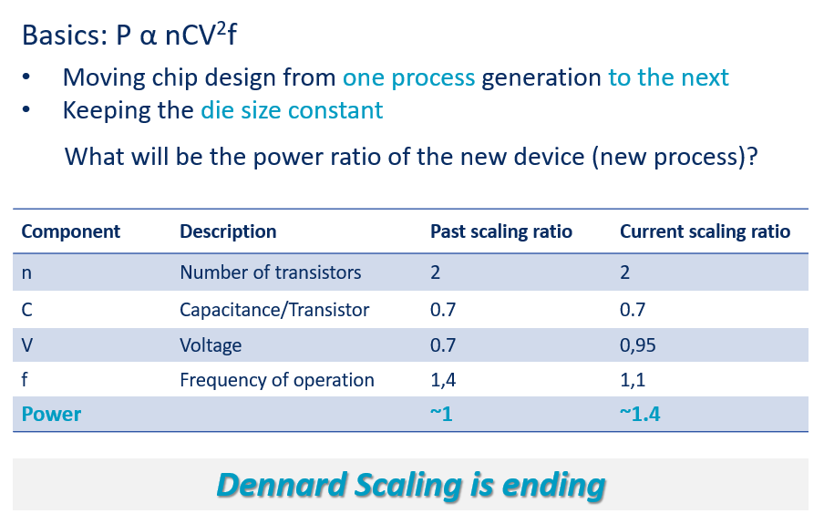
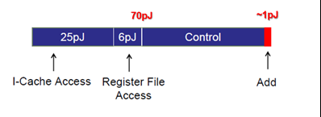
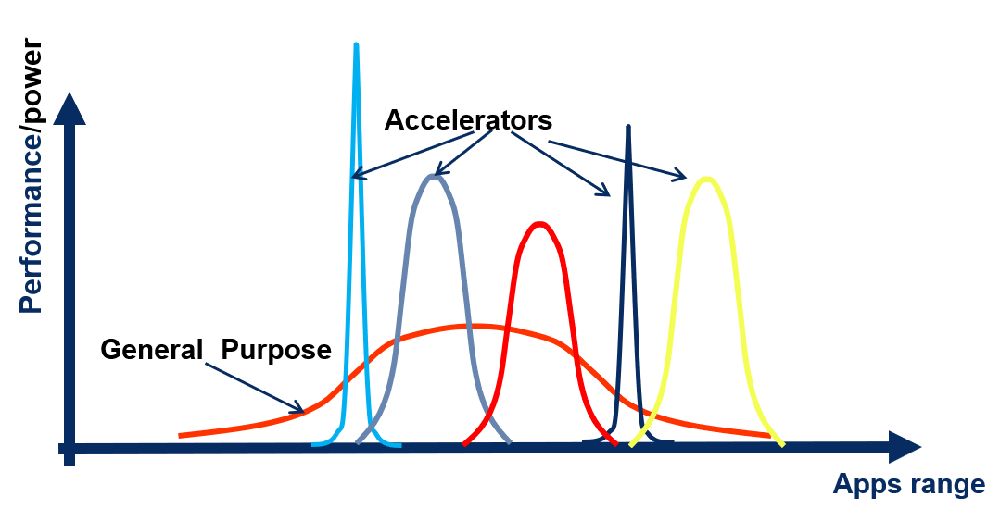
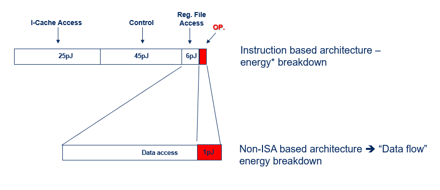

# Why Domain-Specific Dataflow Processing Is the Only Way Forward

## 1. Moore's Law和Dennard Scaling的终结

30 多年来，通用计算的发展令人印象深刻且快节奏，性能每两年左右翻一番。 但是，有人会说，不出所料，它撞上了比喻的墙。 正如许多人评论的那样，过程进展开始放缓，摩尔定律进入了最后阶段。 在一代又一代地提高性能方面承担了大部分重任的工艺技术正在放缓。

最重要的是，由于在从一种工艺技术转移到另一种工艺技术时降低电源电压的能力下降，我们达到了Dennard Scaling的终点。

Figure 1: The end of Dennard Scaling: After years of process scaling down, we are no longer able to lower voltage (we are getting near the transistor’s threshold Voltage), while frequency increase is slowing down when moving from one process to the next. When moving to the next process generation, while keeping the die area constant, the number of transistors will double, and the power will increase by 1.4X. 

此外，单线程通用性能增长已经趋于平稳，而冷却设备达到了“功率包络”[^1]。 因此，我们已经达到了并非所有芯片上的晶体管都可以同时工作的地步。在任何给定时刻，只有部分片上功能可以完全激活。我们称这种情况为“暗硅”。多核芯片也是如此，并非所有内核都能以最大速度同时工作。我们已经看到云和边缘不同应用程序的使用呈指数增长。这些新应用程序需要性能，因此它们很快将计算性能加冕为王者，他的统治要求越来越强大的能力[^2]。

在当今世界，部署频谱的两端都优先考虑最高效率：在能源消耗有限的边缘设备中，以及在功耗急剧上升的大型服务器群和数据中心中，其对财务和环境都有影响。因此，我们当前计算环境的必然目标是提高每单位功率的可能性能，即达到最佳的功率效率。

这种动机使我们摆脱“通用”计算而构建“专用”计算引擎[^3]。 要了解原因，让我们看看通用指令集架构 (ISA) 计算引擎。 在 ISA 方法中，我们获得了最大的使用灵活性——您可以在这种引擎上运行任何应用程序，但我们为它的能效“付费”。 在 CPU 中，不到 10% 的消耗能量用于执行指令的实际功能（例如，“add”）。 其余的用于到达指令缓存和解码/控制指令。

Figure 2: Instruction energy breakdown (@45nm technology) – only less than a tenth of the power consumption is dedicated to executing the instruction[^2]

“但是GPU呢？” 有人可能会问。GPU是图形应用程序“广义执行”的发展。这是朝着专业化迈出的一步，尽管范围很广。图形操作非常重复的特性允许在大量数据执行之间“划分”指令开销。对于某些类型的应用程序，它实现了比CPU更高的效率，但它仍然是基于ISA的机器，因此，它遇到了相同的进化墙。

在这方面值得一提的另一个实现架构是FPGA。这是功能硬件灵活性为王的地方，并且在大多数情况下，在电源效率方面付出了高昂的代价。可编程结构和布局使得它们需要跨芯片进行大量数据移动，这在能源方面非常昂贵。

## 2. 特定领域的数据流是一种绕过墙的方法

当看起来可以做的所有事情都已经完成或至少被考虑过时，我们的下一步需要超越我们迄今为止所做的基本前提：下一个自然进化是“牺牲”灵活性。

专注和专业化创造了相对优势和效率，就像在经济和商业中一样，在计算中也是如此。 这种“牺牲”是值得的，在大多数情况下，当所需的应用程序是特定的并且它的使用很频繁时。 专业化带来的高性能和能效带来了重大回报。 一般而言，您的应用程序越具体，硬件的定制程度越高，效率也越高。

特定领域架构 (DSA) 的概念是将目标应用程序映射到没有通用 ISA 的硬件。 一种这样的映射被称为数据流架构[^4]，类似于应用程序功能直接映射到硬件的映射。

在 DSA 中，主要问题应该是关于所需的应用范围。 例如，如果我们要为特定的机器学习应用程序构建 DSA，我们仍然应该保持将硬件用于一系列机器学习应用程序的灵活性。 这种灵活性需要软件（例如深度学习编译器）和深度学习硬件协同设计，[Hailo设计路径](https://hailo.ai/technology/)就是一个很好的例子。

Figure 3: The tradeoff of processing efficiency and applications range flexibility – Domain-Specific architecture achieves better performance per unit of power but is designed for domain-specific workloads. 

## 3. 特定领域和深度学习

深度学习神经网络 (DNN) 需要基于相对简单的构建块——MAC（乘法和累加）操作的高度重复的计算操作。 与通用架构相比，这种具有简单重复操作的 Dataflow 架构具有更高的能效，因为不需要指令并且计算引擎高度简化（即 MAC）。 除了操作本身，Domain-Specific Dataflow 中的主要部分是数据访问，即对内存的访问。

Figure 4: Dataflow consumes a fraction of the energy consumed by the instruction (energy breakdown presented in Figure 2). It expends additional energy only on data access, resulting it a much smaller per-instruction overhead. 

特定领域的数据流架构是计算的下一阶段。 我们的数据处理需求越大（最近的历史表明这是趋势），之前被忽视的电源效率就成为一个问题，并引导我们远离灵活但耗电且效率低下的 ISA。 在大数据世界中，深度学习已成为杀手级应用[^5]，特定领域的数据流架构具有能效优势。 因此，它们是跨领域和用例大规模采用人工智能技术的主要推动者。

要了解更多信息，请观看 Uri Weiser 教授和 Hailo 联合创始人兼首席技术官 Avi Baum 在这个引人入胜的网络研讨会中：[A Computer Architecture Renaissance: Energy-efficient Deep Learning Processors for Machine Vision](https://register.gotowebinar.com/register/3860448400143025666?source=Hailo+website&__hstc=198290672.b52a8653ec6062fe2b4a777c555598e3.1615993153960.1617890964826.1618122728859.8&__hssc=198290672.1.1618122728859&__hsfp=1640172291&hsCtaTracking=0cec0928-a95e-4099-8218-6872e28ff851%7C2ca76283-6a62-46de-9730-9e0e62e95e79)

[^1]: Kozyrakis, Christos & Kansal, Aman & Sankar, Sriram & Vaid, Kushagra. (2010). Server Engineering Insights for Large-Scale Online Services. Micro, IEEE. 30. 8 – 19. 10.1109/MM.2010.73. https://www.researchgate.net/figure/Scaling-trends-for-the-transistor-count-clock-frequency-number-of-cores-and_fig2_224168227 ; new Plot and Data Collected for 2010-2017 by K. Rupp. 
[^2]: M. Horowitz, “1.1 Computing’s energy problem (and what we can do about it),” 2014 IEEE International Solid-State Circuits Conference Digest of Technical Papers (ISSCC), 2014, pp. 10-14, doi: 10.1109/ISSCC.2014.6757323 
[^3]: Simone Bianco, Remi Cadene, Luigi Celona, Paolo Napoletano. (2018). Benchmark Analysis of Representative Deep Neural Network Architectures. https://arxiv.org/abs/1810.00736  
[^4]: Veen, Arthur H. (December 1986). “Dataflow Machine Architecture”. ACM Computing Surveys. 18 (4): 365–396. doi:10.1145/27633.28055 
[^5]: “Killer App” is an application family that cannot run on current implementation but can run on the new implementation. For instance, NN training of high-resolution recognition is almost impossible to run on GP-CPU but is possible on dedicated Dataflow architecture. 

> 原文地址：[Why Domain-Specific Dataflow Processing Is the Only Way Forward](https://hailo.ai/blog/why-domain-specific-dataflow-processing-is-the-only-way-forward/)