# X-SRAM: Enabling In-Memory Boolean Computations in CMOS Static Random Access Memories

<!-- TOC -->

- [X-SRAM: Enabling In-Memory Boolean Computations in CMOS Static Random Access Memories](#x-sram-enabling-in-memory-boolean-computations-in-cmos-static-random-access-memories)
  - [Motivation](#motivation)
  - [X-SRAM支持的操作](#x-sram支持的操作)
    - [NOR](#nor)
    - [NAND操作](#nand操作)
    - [分压实现IMP和XOR逻辑操作](#分压实现imp和xor逻辑操作)
    - [Read-Compute-Store操作](#read-compute-store操作)
    - [8+ 晶体管差分读SRAM](#8supsup-晶体管差分读sram)
  - [评估结果](#评估结果)

<!-- /TOC -->

<!-- ## 总结

这是一篇没有价值的工作，虽然能够实现所说的操作，但是开销大，操作复杂，而且稳定性差。

不要往下看，浪费时间！！！
不要往下看，浪费时间！！！
不要往下看，浪费时间！！！
 -->

## Motivation

之前的基于SRAM的存内计算方案需要锁存计算结果，并需要额外的周期写回结果。

## X-SRAM支持的操作

### NOR

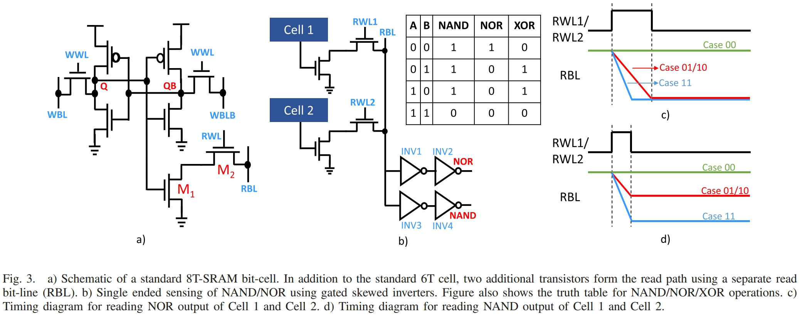

8T SRAM的单元结构如图3(a)所示，在传统6T SRAM上增加了M1和M2形成单独的read通路。

NOR操作如图3(b)所示，首先预充RBL，然后通过RWL开启M2。如果Q为1(图3(a)中Q和QB的位置需要互换一下才正确)，则M1也开启，RBL通过M2和M1放电，否则，RBL保持高电平。NOR操作的波形如图3(c)所示。

### NAND操作

NAND逻辑的实现是利用的单行漏电和多行漏电，RBL电压下降的速度不同来实现的。需要合适的RWL脉冲宽度控制，使得两行同时漏电（Case 11）可以将RBL拉低到反相器阈值以下，而单行打开（Case 01/10）在这段时间里无法将RBL拉低到反相器阈值以下，如图3(d)所示。这种脉宽调制的方法我是不太看好的，控制难度太高，速度和精度都无法做到很高，虽然本文中作者做了一些monte carlo的仿真(图4和图5)，但是与实际情况相差较大。还不如增加两个晶体管做成差分的读取通路，还可以实现XOR逻辑，面积可能并不会比这种大，因为M1/M2的管子不再受放电速度限制可以做到最小尺寸，整体来说这个方案面积开销会比较大。NAND的工作波形如图3(d)所示。

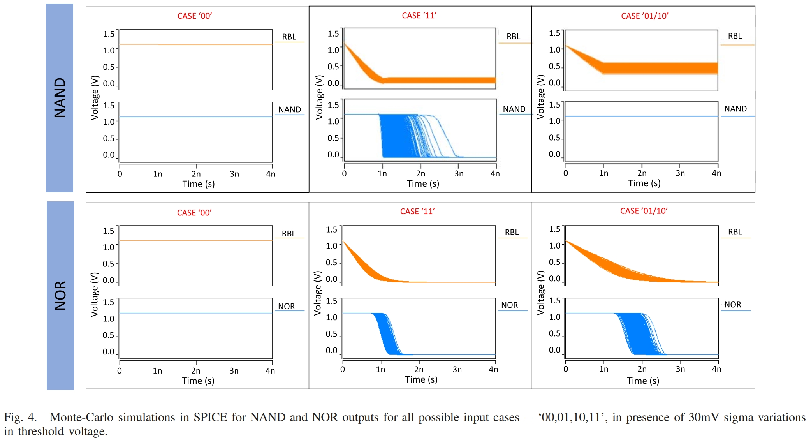

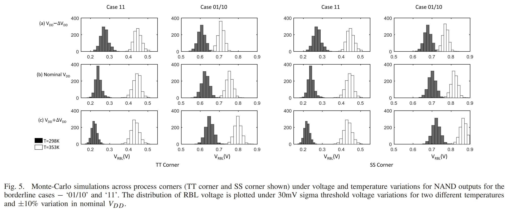

### 分压实现IMP和XOR逻辑操作

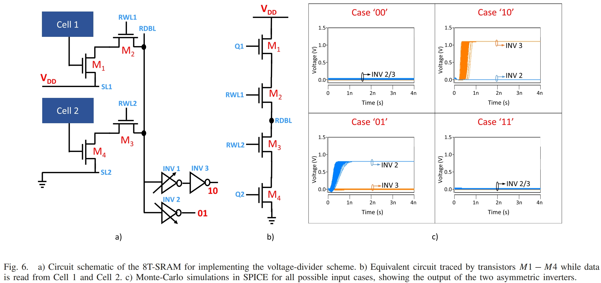

IMP和XOR逻辑如图6(a)所示。cell 1对应的SL1驱动到VDD，cell 2对应的SL2接到GND。计算时将RWL1和RWL2打开，从而M1->M2->M3->M4实现了从VDD到GND的通路，由于M2和M3开启，RDBL处的电压可以看作M1和M4的分压。Case 00，M1和M4都关断，RDBL保持预充电压，Case 11，M1和M4都开启，RDBL是两者沟道电阻的分压，仍然接近预充电压。Case 01，M4将RDBL下拉到GND。Case 10，M1将RDBL上拉到VDD。通过控制反相器的PU/PD的驱动能力，可以使得INV2在RDBL电压远低于$V_{pre}$，接近0V时输出才翻转到1；INV1在RDBL电压远高于$V_{pre}$，接近VDD时，输出才翻转到0。因此，INV2输出高电平表明数据为(0,1)，INV3输出高电平时，数据为(1,0)。此时INV1实现了"A IMP B"蕴含逻辑，通过对INV2和INV3的输出做或操作，可以得到XOR逻辑。此处的反相器与执行NOR/NAND时的反相器不同，而且不能使用最小尺寸。

### Read-Compute-Store操作

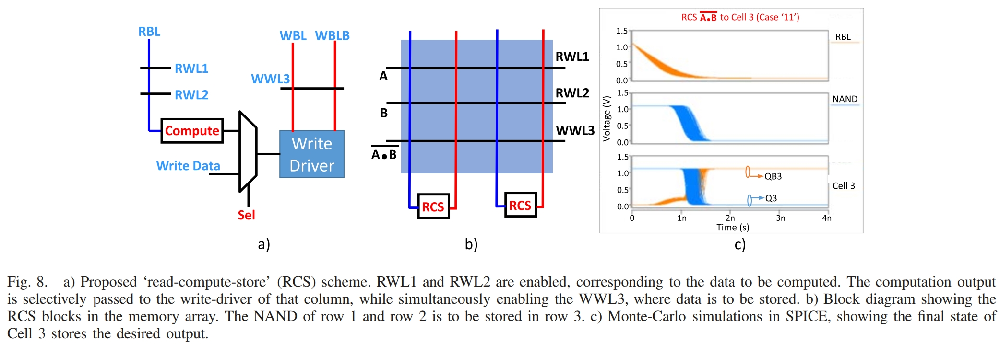

RCS可以在一个周期内进行计算，并将计算结果写到目的地址，不需要锁存计算结果。读取/写入路径解耦使得同一个周期完成计算和存储可能。从图8(a)种可以看到：首先激活RWL1和RWL2进行计算，计算结果通过多路选择器控制Write Driver写入WWL3对应行种。

这个操作还比较有优势，在一个周期内完成Load/Commpute/Store，这跟无线项目的想法一致。此外，这一功能还能实现memory copy操作。但是存在两点挑战：（1）这个电路还是比较复杂，能不能在[4+2T SRAM](https://zongwuwang.github.io/2021/09/07/a-4-2t-sram-for-searching-and-in-memory-computing-with-0-3-v-vddmin/)方案或者Local Bitline方案上进行改进；（2）如何将数据对齐仍相当有挑战。

### 8+ 晶体管差分读SRAM

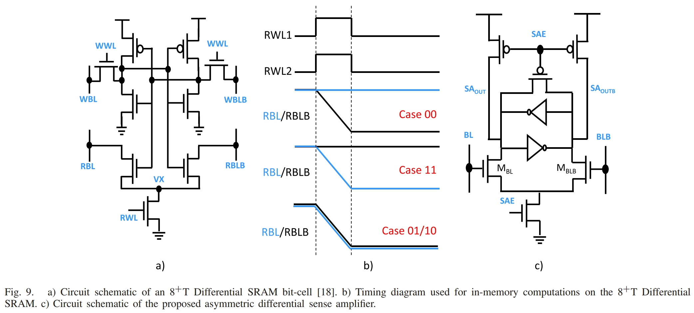

这个就是我在之前提到的使用差分读通路，如图9(a)所示，使用9T实现。图9(b)显示的是9T SRAM实现NOR和NAND的波形，这与6T SRAM一摸一样。

为了感测bit-wise NAND和NOR操作的结果，图9(c)也展示了通过偏斜某一晶体管实现的非对称SA结构。偏斜晶体管可以通过多种途径实现，如晶体管尺寸，阈值电压和体偏电压等。如图9(c)所示，如果晶体管$M_{BL}$的尺寸大于$M_{BLB}$，其载流能力增加。对于“01”和“10”的情形，RBL和RBLB同时放电。但是由于$M_{BL}$的载流能力大于$M_{BLB}$，因此$SA_{out}$节点放过点更快，交叉耦合的反相器对最终会使得$SA_{out}$稳定在“0”。对于“11”的情形，RBL放电，RBLB保持为VDD，SA放大RBL和RBLB之间的电压差，最终导致$SA_{out}$稳定在“1”。对于“00”的情形，与“11”情形相反，最终$SA_{out}=1$。综上，$SA_{out}$实现了AND操作，$SA_{outb}$输出NAND操作结果。
同理，我们也可以设计$M_{BLB}$的尺寸大于$M_{BL}$，最终SA实现OR/NOR操作。
两个SA并行工作，实现AND/NAND/OR/NOR/XOR操作。

Monte Carlo仿真结果：

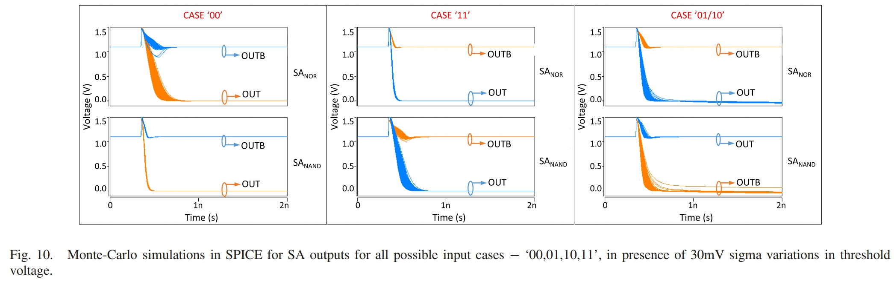

工艺角仿真结果：

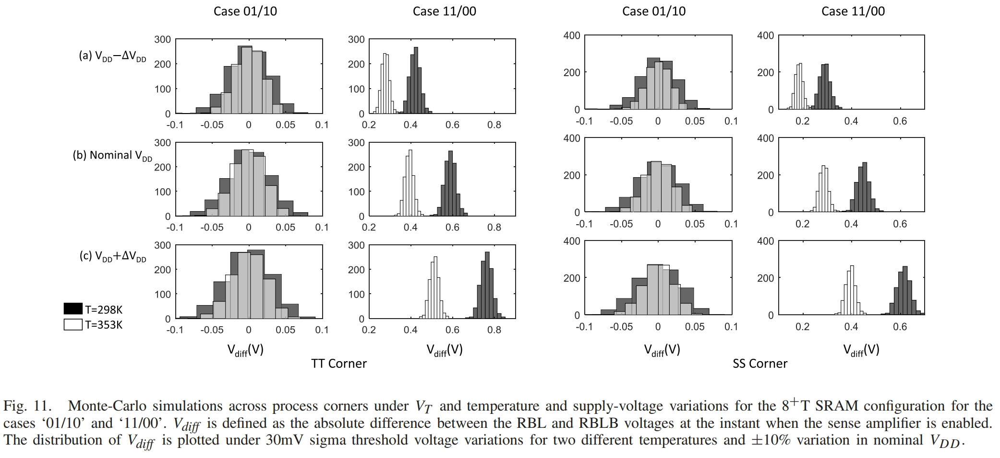

## 评估结果

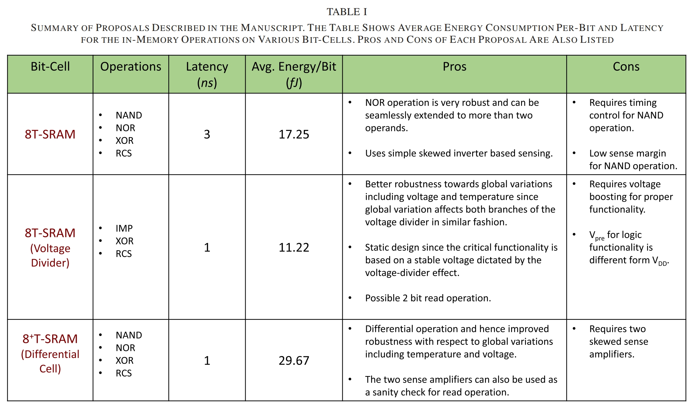

表1展示了SRAM支持的各种操作的延迟和能耗，并且分析了各类操作的优缺点。

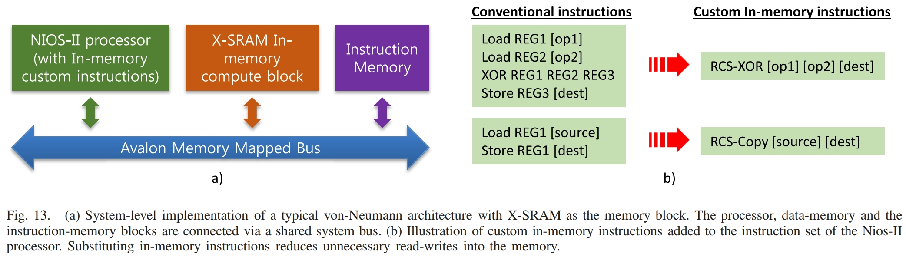

图13显示了整个仿真的系统架构，采用的是Intel Nios-II处理器和Avalon总线，X-SRAM作为总线连接的协处理器，一共处理两条包含三个地址的指令。
仿真所用的Benchmark为AES加解密，其中可用于RCS-XOR和RCS-Copy加速的部分占整体运行时间的92%。

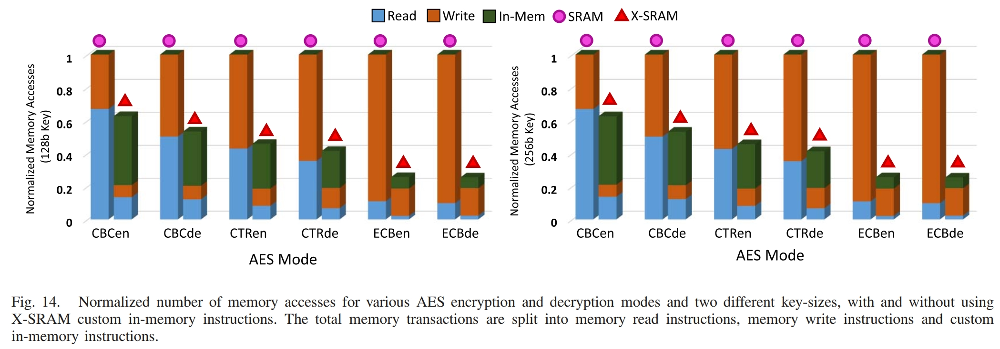

实验结果如图14所示，在128b和256b 密钥的ECB模式下，访存分别减少74.7%和74.6%。