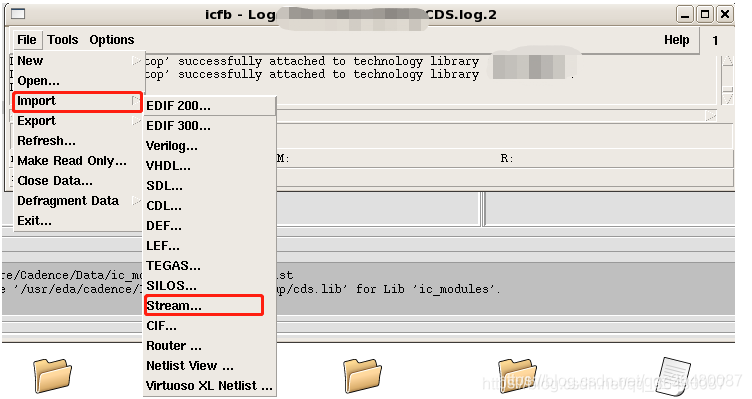

# cadence导入和导出版图gds文件

## 导入：

选择要导入的gds文件以及导入的library，按“OK”即可。

在IC 617中，加载时指定了technology file貌似没有出现问题。

## 导出：

选择版图文件导出到哪个文件夹，版图所在的library，以及cell的名字。之后点击“Output File”栏方框，会自动弹出要导出的版图名称，可修改，点击“OK”即可完成GDS版图文件的导出。

> 参考链接：https://blog.csdn.net/qq_36480087/article/details/84452928