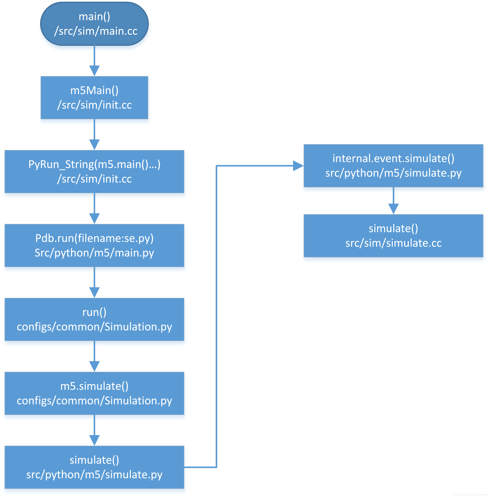

# gem5 debug manual

gem5最外层是C++文件，里面包含python模块的调用。对于单独C++程序可以使用gdb进行调试，而对于纯python程序则可以使用pdb进行调试。对于python调用C++程序也可以使用gdb attach到python进程进行调试。但是对于gem5这种代码结构，由于pdb暂不支持attach到C++进程，虽然网上提供了一些第三方pdb拓展支持attach到现有进程，但是在ubuntu 20.04上并没有试验成功。此外，visual studio貌似支持该类调试手段，但是由于只支持windows平台，并没有进一步去尝试该方法。学习gem5框架时，通过调试可以更好的掌握整个框架的架构。为此，撰写这篇博客记录gem5的调试过程。

1. 首先编译gem5
   ```shell
   scons build/ARM/gem5.opt -j16
   ```
2. 运行以下指令进行gdb+pdb调试
   ```shell
   build/ARM/gem5.opt --pdb --debug-file=trace.out.gz --debug-flags=$debugFlags -d se_results/$item configs/example/se.py --cpu-type=MinorCPU --arm-iset=aarch64 --caches --cmd=./llvm-Stanford-se-benchmarks/$item -I 10000000
   ```
   具体运行参数可以通过"build/ARM/gem5.opt --help"进行查看。此外，还可以直接在"$GEM5_ROOT/src/python/m5/main.py"中的main()中进行查看，pdb也是在这边进行调用的。

接下来总结以下debug过程中摸索出来的gem5的调用过程：

1. 运行：
	```shell
	gdb --args build/ARM/gem5.debug --pdb --debug-file=trace.out.gz --debug-flags="Exec,-ExecSymbol" -d se_results/count configs/example/se.py --cpu-type=MinorCPU --arm-iset=aarch64 --caches --cmd=./llvm-Stanford-se-benchmarks/count -I 10000000
	```
2. 定位gem5的入口函数main:
	```gdb
	layout src
	b main
	r
	```
	经此步骤，我们可以看到调试停在了"build/ARM/sim/main.cc"的main()函数，这就是整个gem5的入口函数，对应原始文件"$GEM5_ROOT/src/arch/arm/sim/main.cc"

	可以看出，整个gem5框架的核心就是调用m5.Main(argc, argv)
3. 继续追踪
	```gdb
	b m5Main(int, char**)
	c
	```
	对于函数只需要输入m5Main，使用tab自动补全，如果无法不全可以使用最新版的gdb试试，不仅补全功能变强，而且对于数组和容器的输出功能也有更好的支持。

	运行发现调试停止在"build/ARM/sim/init.cc"的m5Main函数的入口处，对应原始文件"$GEM5_ROOT/src/sim/init.cc"。仔细看这个函数，主要是进行一些C++调用python的准备，即对输入参数进行解析，传入python程序。参数设置好之后，执行m5MainCommands定义的指令"import m5"和"m5.main()"，因此，整个gem5的转为执行m5.main()，这是调用python代码，如果此时仅用gdb调式，调式就会无法继续进行下去。此时或许可以修改这边的python调用为支持pdb调试，不过这在C++代码中修改暂时没有研究，毕竟python程序的输入参数已经通过C++ -> Python接口传入。
4. m5.main转pdb调试
	gdb无法跟踪程序执行m5.main()，而pdb在这时也没有加入支持。运行continue会直接跳到pdb调试界面，这是如何实现的呢？这时候我们就需要分析一下m5.main()。稍微在gem5源文件下搜索一下就可以轻松的定位到这个函数的位置在"$GEM5_ROOT/src/python/m5/main.py"中。从main()函数可以看出其功能主要包括解析命令行中对gem5的配置参数options，并进行相应的程序配置。这边值得注意的是下面这段代码：
	```python
	if options.pdb:
        import pdb
        import traceback

        pdb = pdb.Pdb()
        try:
            pdb.run(filecode, scope)
        except SystemExit:
            print("The program exited via sys.exit(). Exit status: ", end=' ')
            print(sys.exc_info()[1])
        except:
            traceback.print_exc()
            print("Uncaught exception. Entering post mortem debugging")
            t = sys.exc_info()[2]
            while t.tb_next is not None:
                t = t.tb_next
                pdb.interaction(t.tb_frame,t)
    else:
        exec(filecode, scope)
	```
	可以看出如果在命令行中加入"--pdb"，则这边执行的是"pdb.run(filecode, scope)”，否则执行"exec(filecode, scope)"。这边根据输入的参数调用python程序进行仿真。关于这一段filecode和scope分别是什么，感兴趣的可以在这边使用print函数打印出来，其实调用的就是pdb的入口位置，可以在pdb中使用以下指令查看位置:
	```pdb
	w(here)
	```
	输出结果大概为：
	```shell
	/usr/lib/python3.8/bdb.py(580)run()
	-> exec(cmd, globals, locals)
	> /share/gem5/configs/example/se.py(43)<module>()
	-> import optparse
	```
	我们可以发现其实就是进入了我们在命令行中定义的"se.py"文件。"se.py"之前的代码都是对仿真系统进行一些配置，真正执行在最后一行"Simulation.run(options, root, system, FutureClass)"，因此可以在此之前设置断点，然后step in，进入"$GEM5_ROOT/configs/common/Simulation.py"中。<font color=red>在这边还可以发现"options.wait_gdb"的配置，猜想应该是后面gdb attach以调试python调用的C++代码。</font> <font color=blue>从[Debugging Simulated Code](https://www.gem5.org/documentation/general_docs/debugging_and_testing/debugging/debugging_simulated_code)可以看出这个remote gdb gdb的用处是调试模拟的机器里面代码执行的过程。</font>
5. Simulation.py解读
	step in进入"Simulation.py"之后，我们逐步调试可以发现最终有效执行的那一步在："exit_event = benchCheckpoints(options, maxtick, cptdir)"。通过观察benchCheckpoints函数，我们可以看到该函数的核心就是"m5.simulate"函数，整个gem5仿真转为"m5.simulate"。当然根据设置的不同也可能从其它入口进入下一步仿真，最终都是通过"m5.simulate"开启下一步仿真。
6. m5.simulate解读
	step in m5.simulate，可以看到程序跳转到"$GEM5_ROOT/build/ARM/python/m5/simulate.py"的simulate()函数。观察simulate()函数，仿真转移为"_m5.event.simulate(*args, **kwargs)"。
7. _m5.event.simulate(*args, **kwargs)解读
	step in "_m5.event.simulate(*args, **kwargs)"，这时候其实是调用python wrappered C++代码，中间会涉及到一大堆的转换。但是此时在pdb中不知道如何退出去，后续可以继续探索python和C++接口。但是根据[GEM5仿真器启动过程](https://blog.csdn.net/benben2301/article/details/32334309)中的启动过程，如下图所示，我可以得知后续会停留在"$GEM5_ROOT/src/sim/simulate.cc"的"simulate()"函数。

	

	而采用上面的方式无法退出pdb调试，因此，直接在运行命令行中将"--pdb"取消，不进入pdb，而直接通过"b simulate(unsigned long)"设置断点。(直接通过c执行完pdb调试也可以跳出pdb) 然后执行到此处，使用"bt"回溯堆栈，得到如下结果：
	```shell
	#10 0x00007f7bbd131d6d in ?? () from /lib/x86_64-linux-gnu/libpython3.8.so.1.0
	#11 0x00007f7bbd13346d in _PyEval_EvalFrameDefault ()
	from /lib/x86_64-linux-gnu/libpython3.8.so.1.0
	#12 0x00007f7bbd287e3b in _PyEval_EvalCodeWithName ()
	from /lib/x86_64-linux-gnu/libpython3.8.so.1.0
	#13 0x00007f7bbd365114 in _PyFunction_Vectorcall ()
	from /lib/x86_64-linux-gnu/libpython3.8.so.1.0
	#14 0x00007f7bbd131d6d in ?? () from /lib/x86_64-linux-gnu/libpython3.8.so.1.0
	#15 0x00007f7bbd139ef6 in _PyEval_EvalFrameDefault ()
	from /lib/x86_64-linux-gnu/libpython3.8.so.1.0
	#16 0x00007f7bbd287e3b in _PyEval_EvalCodeWithName ()
	from /lib/x86_64-linux-gnu/libpython3.8.so.1.0
	#17 0x00007f7bbd2881c2 in PyEval_EvalCodeEx ()
	from /lib/x86_64-linux-gnu/libpython3.8.so.1.0
	#18 0x00007f7bbd2885af in PyEval_EvalCode ()
	from /lib/x86_64-linux-gnu/libpython3.8.so.1.0
	#19 0x00007f7bbd28cbf1 in ?? () from /lib/x86_64-linux-gnu/libpython3.8.so.1.0
	#20 0x00007f7bbd31c537 in ?? () from /lib/x86_64-linux-gnu/libpython3.8.so.1.0
	#21 0x00007f7bbd131d6d in ?? () from /lib/x86_64-linux-gnu/libpython3.8.so.1.0
	#22 0x00007f7bbd13346d in _PyEval_EvalFrameDefault ()
	from /lib/x86_64-linux-gnu/libpython3.8.so.1.0
	#23 0x00007f7bbd287e3b in _PyEval_EvalCodeWithName ()
	from /lib/x86_64-linux-gnu/libpython3.8.so.1.0
	#24 0x00007f7bbd365114 in _PyFunction_Vectorcall ()
	from /lib/x86_64-linux-gnu/libpython3.8.so.1.0
	#25 0x00007f7bbd131d6d in ?? () from /lib/x86_64-linux-gnu/libpython3.8.so.1.0
	#26 0x00007f7bbd133018 in _PyEval_EvalFrameDefault ()
	from /lib/x86_64-linux-gnu/libpython3.8.so.1.0
	#27 0x00007f7bbd287e3b in _PyEval_EvalCodeWithName ()
	from /lib/x86_64-linux-gnu/libpython3.8.so.1.0
	#28 0x00007f7bbd365114 in _PyFunction_Vectorcall ()
	from /lib/x86_64-linux-gnu/libpython3.8.so.1.0
	#29 0x00007f7bbd131d6d in ?? () from /lib/x86_64-linux-gnu/libpython3.8.so.1.0
	--Type <RET> for more, q to quit, c to continue without paging--
	#30 0x00007f7bbd139ef6 in _PyEval_EvalFrameDefault ()
	from /lib/x86_64-linux-gnu/libpython3.8.so.1.0
	#31 0x00007f7bbd287e3b in _PyEval_EvalCodeWithName ()
	from /lib/x86_64-linux-gnu/libpython3.8.so.1.0
	#32 0x00007f7bbd2881c2 in PyEval_EvalCodeEx ()
	from /lib/x86_64-linux-gnu/libpython3.8.so.1.0
	#33 0x00007f7bbd2885af in PyEval_EvalCode ()
	from /lib/x86_64-linux-gnu/libpython3.8.so.1.0
	#34 0x00007f7bbd24904c in ?? () from /lib/x86_64-linux-gnu/libpython3.8.so.1.0
	#35 0x00007f7bbd249399 in PyRun_StringFlags ()
	from /lib/x86_64-linux-gnu/libpython3.8.so.1.0
	#36 0x0000558fe8e84280 in m5Main (_argv=<optimized out>, argc=13)
		at build/ARM/sim/init.cc:318
	#37 main (argc=<optimized out>, argv=<optimized out>) at build/ARM/sim/main.cc:67
	```

	从以上结果可以看出，上面先是调用一些python/C++之间的接口函数，然后进入C++模块之后调用的第一个函数是"build/ARM/sim/init.cc"的m5Main()函数，接下来再调用"build/ARM/sim/main.cc"中的main函数。<font color=red>这边发现使用gem5.opt有一些变量被优化掉了，建议debug时还是从gem5.debug开始。</font>

8. build/ARM/sim/main.cc->main()解析
	仿真转化为"Event *local_event = doSimLoop(mainEventQueue[0]);"

## VSCode调试方法

直接运行VSCode的调试功能，选用GDB进行调试，则会在gem/.vscode目录中自动生成launch.json文件，修改launch.json如下所示：

```json
{
    // 使用 IntelliSense 了解相关属性。 
    // 悬停以查看现有属性的描述。
    // 欲了解更多信息，请访问: https://go.microsoft.com/fwlink/?linkid=830387
    "version": "0.2.0",
    "configurations": [
        {
            "name": "(gdb) 启动",
            "type": "cppdbg",
            "request": "launch",
            "program": "${workspaceFolder}/build/ARM/gem5.debug",
            "args": ["configs/example/se.py",
					"--cpu-type",
					"DerivO3CPU",
					"--cmd=tests/test-progs/hello/bin/arm/linux/hello",
					"--l1d_size=64kB",
					"--l1i_size=16kB",
					"--l2_size=256kB",
					"--l2_size=1MB",
					"--caches"],
            "stopAtEntry": false,
            "cwd": "${workspaceFolder}",
            "environment": [],
            "externalConsole": false,
            "MIMode": "gdb",
            "miDebuggerPath": "/usr/bin/gdb",
            "setupCommands": [
                {
                    "description": "为 gdb 启用整齐打印",
                    "text": "-enable-pretty-printing",
                    "ignoreFailures": true
                }
            ]
        }
    ]
}
```
提前在命令行中编译生成gem5.debug的可执行文件，即可愉快的开始调试执行。

相关网站：

- http://doxygen.gem5.org/release/current/hierarchy.html
- https://blog.csdn.net/weixin_33963189/article/details/85970250?utm_medium=distribute.pc_relevant.none-task-blog-2~default~baidujs_title~default-1.no_search_link&spm=1001.2101.3001.4242.2
- https://blog.csdn.net/hit_shaoqi/article/details/103940753?spm=1001.2101.3001.6650.5&utm_medium=distribute.pc_relevant.none-task-blog-2%7Edefault%7EBlogCommendFromBaidu%7Edefault-5.no_search_link&depth_1-utm_source=distribute.pc_relevant.none-task-blog-2%7Edefault%7EBlogCommendFromBaidu%7Edefault-5.no_search_link
- https://blog.csdn.net/hit_shaoqi/article/details/98498680
- https://www.lume.ufrgs.br/bitstream/handle/10183/194605/001093821.pdf?sequence=1
- [Gem5 Simulation Framework](https://nitish2112.github.io/post/gem5-simulation/)
- [配置VScode调试配置文件](https://blog.csdn.net/weixin_43746597/article/details/106620364)