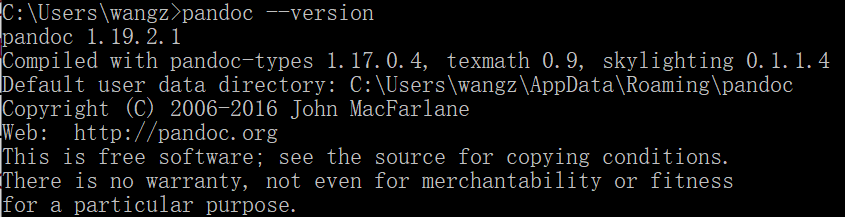

## 安装流程

1. 电脑安装最新版pandoc



2. 更新插件：
```shell
npm uninstall hexo-renderer-marked --save
npm uninstall hexo-math --save
npm install hexo-renderer-pandoc --save
npm install hexo-renderer-mathjax --save
```

3. 修改配置文件，修改theme/_config.yml中mathjax的设置，如下：

```shell
# Math Formulas Render Support
math:
  # Default (true) will load mathjax / katex script on demand.
  # That is it only render those page which has `mathjax: true` in Front-matter.
  # If you set it to false, it will load mathjax / katex srcipt EVERY PAGE.
  per_page: true
 
  # hexo-renderer-pandoc (or hexo-renderer-kramed) required for full MathJax support.
  mathjax:
    enable: true
    # See: https://mhchem.github.io/MathJax-mhchem/
    mhchem: false
 
  # hexo-renderer-markdown-it-plus (or hexo-renderer-markdown-it with markdown-it-katex plugin) required for full Katex support.
  katex:
    enable: false
    # See: https://github.com/KaTeX/KaTeX/tree/master/contrib/copy-tex
    copy_tex: false
```

## 测试

$$E=mc^2$$
$$\int_{a}^{b} x^2 dx$$


# Reference

- [Hexo如何显示latex公式](https://blog.csdn.net/gorray/article/details/122398901)
- [在 Hexo 博客中写出好看的Latex 公式](https://zhuanlan.zhihu.com/p/105986034)
- [如何在 hexo 中支持 Mathjax？](https://www.jianshu.com/p/e8d433a2c5b7)