# i-SRAM: Interleaved Wordlines for Vector Boolean Operations Using SRAMs

## Motivation

之前基于SRAM的存内计算的工作需要对正常的 SRAM 读取操作进行修改，从而导致读取稳定性下降或感测裕度降低。

该论文所提出工作的一个关键亮点是，所提出的读取操作与正常的内存读取操作完全相同，因此不会导致读取鲁棒性或检测裕度的任何损失。

## INTERLEAVED WLS FOR 6T-SRAM: i-SRAM-6T

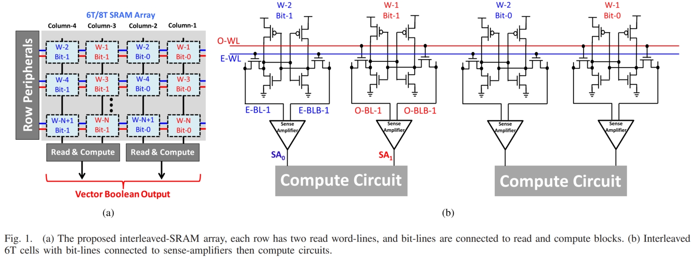

交错WL技术如图1(a)所示，每一行由两根WL(O-WL和E-WL)控制，分别控制odd bit和even bit。计算电路如图1(b)所示，相邻的奇偶BL对应的SA测量结果输入到同一个计算电路中进行计算，这样任意连个奇偶word进行逻辑计算不需要同时打开多行，消除了传统6T SRAM的读取不稳定性。同时，与某些单端的SA相比，该工作与传统SA一样，采用差分的SA，能够提供更高的感测性能。

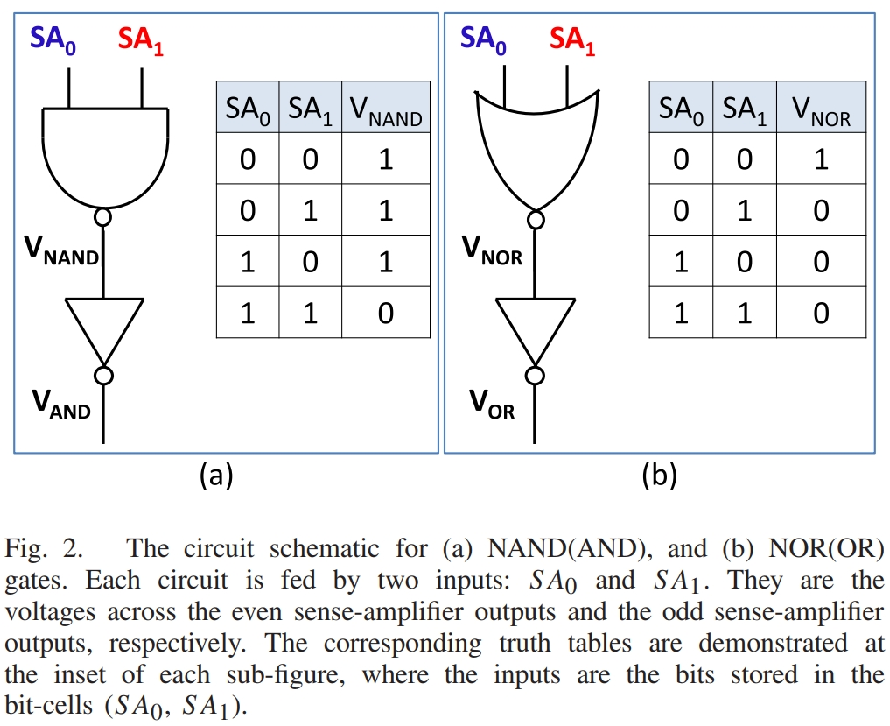

计算单元如图2所示，采用传统的CMOS逻辑实现NAND/NOR/XOR等操作。

针对这一方案，有两个关注点：

1. 该方案能且只能在任意的奇偶两个set之间进行逻辑操作，这在某些应用中非常适合，如CNN中Activation和Weight的VMM操作。
2. 该方案没有对传统的6T SRAM的bit-cell电路和驱动电压进行任何更改。

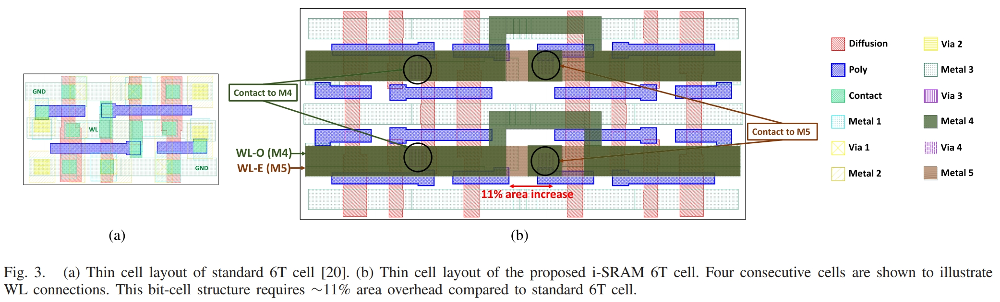

该方案的开销：由于采用双倍的WL，面积开销增加11%，此外还需要增加一层金属布线层。版图如图3所示。

## INTERLEAVED WLS FOR 8T CELL: i-SRAM-8T

虽然交叉WL结构消除了同时激活多行带来的问题，但是8T SRAM相较于6T SRAM的优势在于读写路径解耦，非常适合进行低电压设计。在该论文中采用的是0.8V电压供电，而在65nm工艺下，标准供电电压为1.2V。8T SRAM相比于传统的6T SRAM，面积增加30%。cell结构及版图如图4所示，计算电路如图5所示。

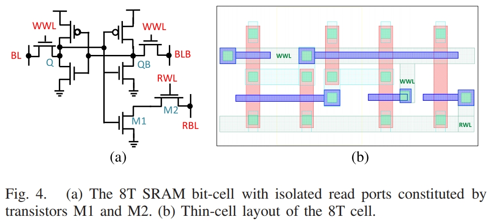

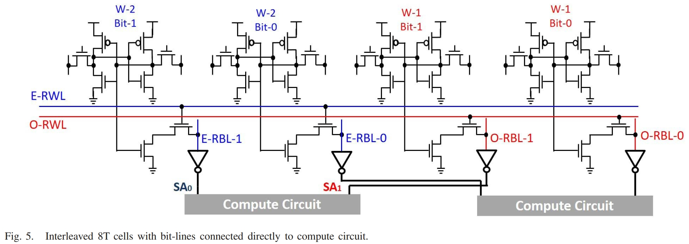

## 系统设置和评估框架

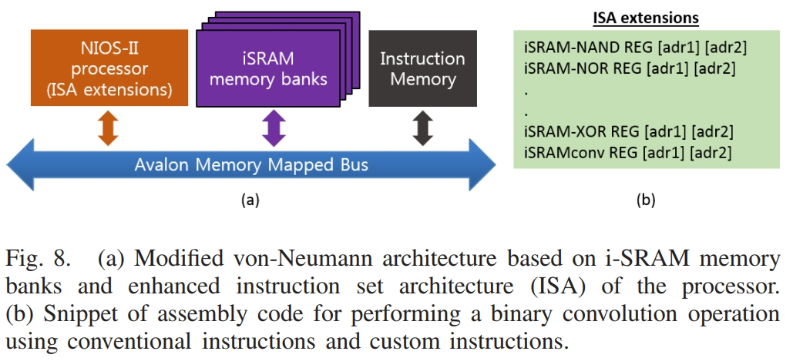

仿真采用的是一个简单的冯诺依曼架构，主机位Nios-II处理器，多个SRAM banks通过总线连接到主机，系统架构如图8(a)所示，针对iSRAM的指令扩展如图8(b)所示。系统仿真相关参数如表2所示。

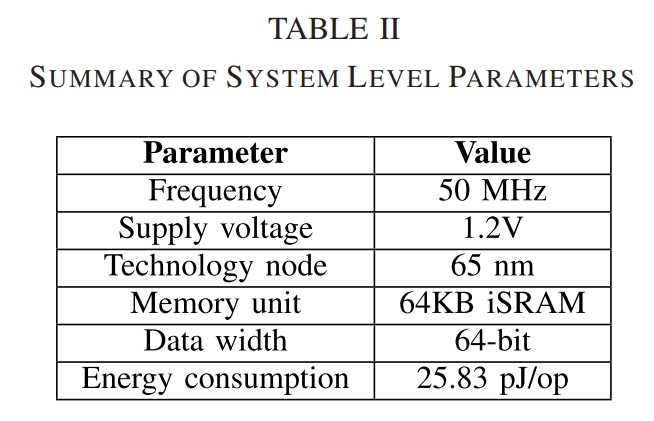

### BNN 加速

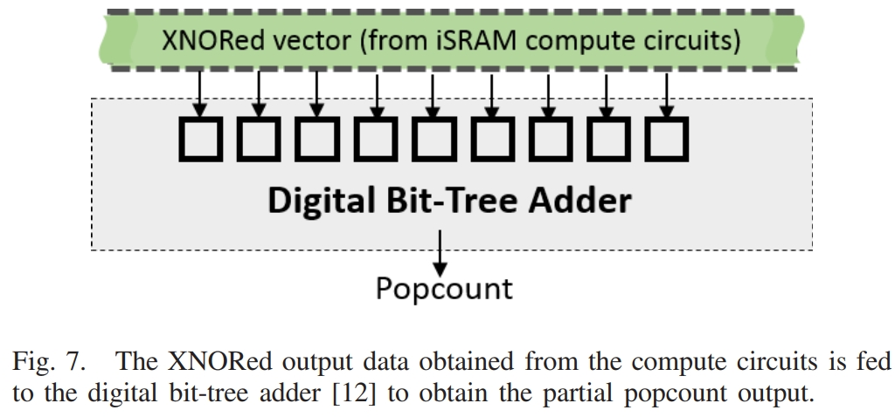

BNN的加速方式如图7所示

### AES 加速

AES 加密算法严重依赖于使用逐位布尔运算（例如 XOR）的替换和置换操作。整个 AES 运行时高达 67% 的操作可以映射到上述 iSRAM-XOR 指令。

## Results

### CNN加速结果

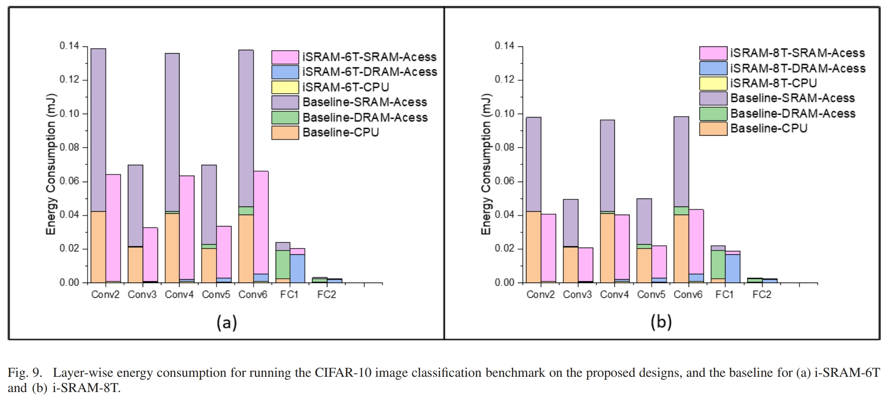

- 与baseline(CPU)相比，i-SRAM-6T和8T能效提升分别位2.16x和2.4x；
- i-SRAM-8T的能效最优，这是由于其供电电压低；
- i-SRAM速度提升8.1x。

### AES加速结果

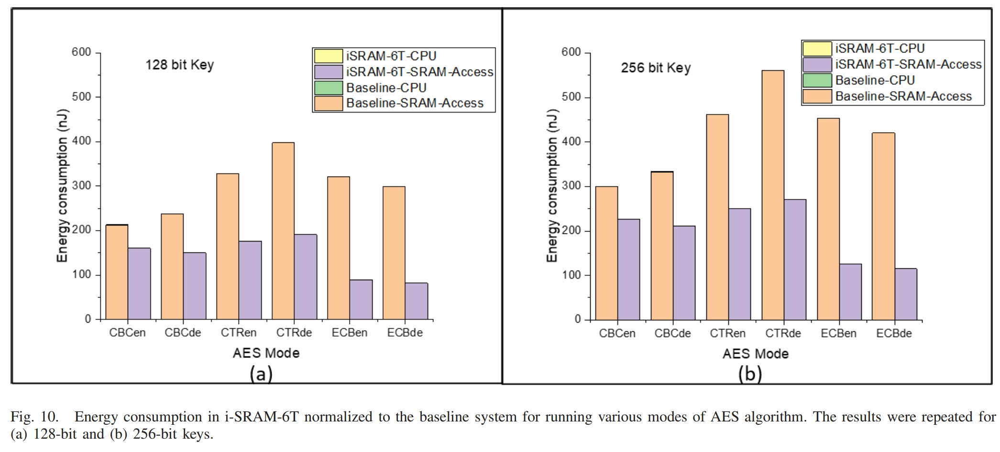

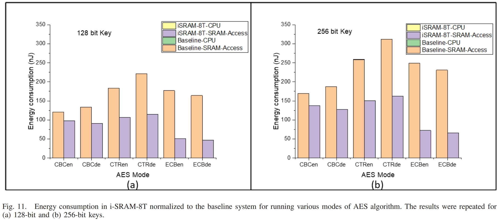

- i-SRAM-6T和i-SRAM-8T能效提升分别为3.6x和3.5x；
- 运行时间提速3x；
- 从64KB memory中读取64-bit数据能耗为19.36pJ，对两个64-bit数据进行计算能耗为25.83pJ。