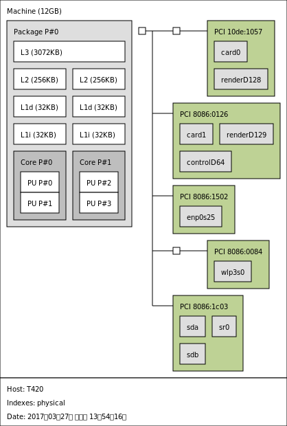

lstopo is a tool provided by the Portable Hardware Locality(HWLOC) project.

它可以图片的形式显示计算机的结构。包括处理图的结构，物理核心数，虚拟核心数，和对应的各级缓存，还有总线上的元件。

安装：

```shell
sudo apt install hwloc
```

显示：

```shell
lstopo
```

用文字方式显示：

```shell
lstopo -.txt
```

用文本显示：

```shell
lstopo --of console
```

保存为png格式图片：

```shell
lstopo --of png mycomputer.png
```

保存为pdf格式文件：

```shell
lstopo --of pdf mycomputer.pdf
```

保存为xml格式文件：

```shell
lstopo --of xml mycomputer.xml
```

本文转载自：http://allstack.net/wordpress/post-2311.html