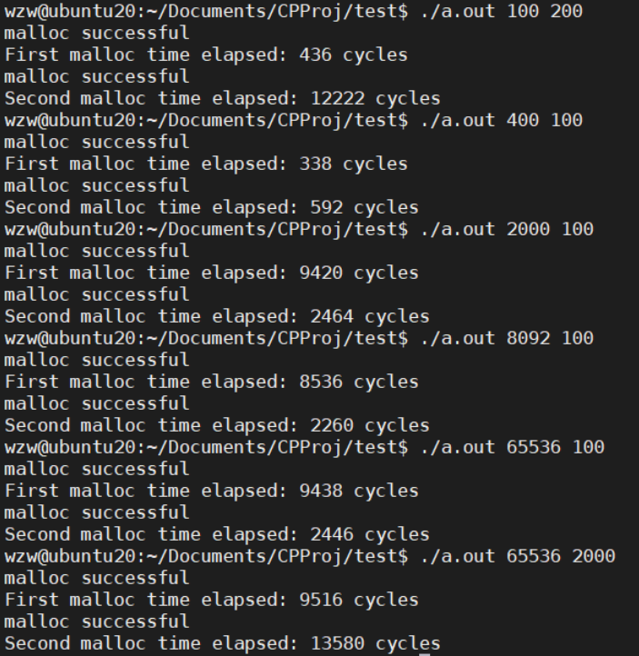

<script type="text/javascript">
function SetCwinHeight(){
  var iframeid = document.getElementById("iframeid"); //iframe id
  if (document.getElementById) {
    if (iframeid && !window.opera) {
      if (iframeid.contentDocument && iframeid.contentDocument.body.offsetHeight) {
        iframeid.height = iframeid.contentDocument.body.offsetHeight + 50;
      } else if (iframeid.Document && iframeid.Document.body.scrollHeight) {
        frameid.height = iframeid.Document.body.scrollHeight + 50;
      }
    }
  }
}
</script>

最近在分析指令trace时，发现malloc中存在很多用户态指令。同时，在学习GC时也对比了C语言中的显式内存管理，于是试图进一步探究malloc的内部细节。

在stack overflow中，Juergen的回答非常的好。其中对其中的一点比较感兴趣，在free时，OS不会立即回收这一段内存空间，因为OS管理内存空间是以page为粒度，如果粒度太小并不会立即回收，而是将该段内存空间加入到一个free list里面，后续如果需要malloc空间，则会有限从这个free list里面找到符合大小的空间。这就可以联想到GC的内存管理，对于mark sweep算法，就是管理整个free list。目前我的理解就是通过Xmx和Xms分配一定容量的内存空间给JVM，形成JVM的堆区。后续如果不需要扩展堆区容量，JVM就可以自己在这一块内存空间（堆区）里面自由玩耍了。

<iframe width="100%" id="iframeid" onload="Javascript:SetCwinHeight()" scrolling=yes height="1000" frameborder="0" src="https://stackoverflow.com/questions/1119134/how-do-malloc-and-free-work"></iframe>

可以通过以下代码测试：


```c++ {.line-numbers}
/*************************************************************************
	> File Name: main.c
	> Author: Wang Zongwu
	> Mail: wangzongwu@outlook.com
	> Created Time: Wed 28 Sep 2022 06:14:51 AM UTC
  # Description: 
  ***********************************************************************/
#include <cstddef>
#include <cstdlib>
#include <stdlib.h>
#include <stdio.h>
#include <chrono>

using namespace std;

int main(int argc, char **argv) {
	int *a, *b;
	long int begin, end;
	int pid;
	int len1, len2;
	len1 = atoi(argv[1]);
	len2 = atoi(argv[2]);
	__asm__ __volatile__(
			"rdtscp;"
			"shl $32, %%rdx;"
			"or %%rdx, %%rax"
			: "=a"(begin), "=c"(pid)
			:
			: "%rdx"
			);
	a = (int *)malloc(len1);
	__asm__ __volatile__(
			"rdtscp;"
			"shl $32, %%rdx;"
			"or %%rdx, %%rax"
			: "=a"(end)
			:
			: "%rdx", "%rcx"
			);
	if (a != NULL) {
		printf("malloc successful\n");
		printf("First malloc time elapsed: %ld cycles\n", (end - begin));
	}

	free(a);
	a = NULL;

	__asm__ __volatile__(
			"rdtscp;"
			"shl $32, %%rdx;"
			"or %%rdx, %%rax"
			: "=a"(begin), "=c"(pid)
			:
			: "%rdx"
			);
	b = (int *)malloc(len2);
	__asm__ __volatile__(
			"rdtscp;"
			"shl $32, %%rdx;"
			"or %%rdx, %%rax"
			: "=a"(end)
			:
			: "%rdx", "%rcx"
			);
	if (b != NULL) {
		printf("malloc successful\n");
		printf("Second malloc time elapsed: %ld cycles\n", (end - begin));
	}

	free(b);
	b = NULL;

	return 0;
}
```




以上应该能够证实上述的free list结论，但是无法解释所有的情况，后续需要进一步阅读源码，探索更多free list管理的细节。
源码参考：https://stackoverflow.com/questions/3479330/how-is-malloc-implemented-internally