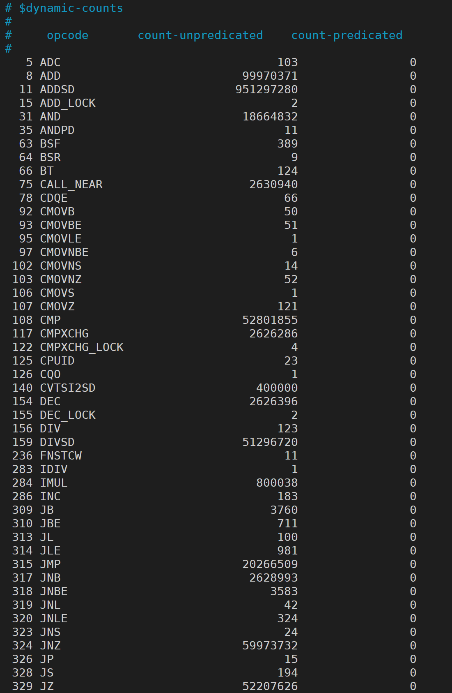

在对原子指令进行加速的过程中，希望通过对程序的指令组成进行分析。想到两种方案：

- gem5仿真统计
- pintools统计

gem5仿真太慢，基于X86平台当然选用pintools，以下记录pintools进行指令分析的流程。

pintools自带的指令分析的脚本位于`$PIN_ROOT/source/tools/Insmix`下，首先执行以下编译指令。

```shell {.line-numbers}
make all TARGET=intel64
```

执行程序分析：

```shell {.line-numbers}
../../../pin -t obj-intel64/insmix.so -- /bin/ls
```

执行分析之后会生成两个文件：`bblcnt.out`和`insmix.out`。

报告具体的格式分析可以参考`insmix.cpp`文件，这边只介绍我们需要的部分。如下图所示，在`insmix.out`的最后一部分，展示的是动态指令的统计分布，格式为 **"ins_index opcode count-unpredicated count-predicated"**.


