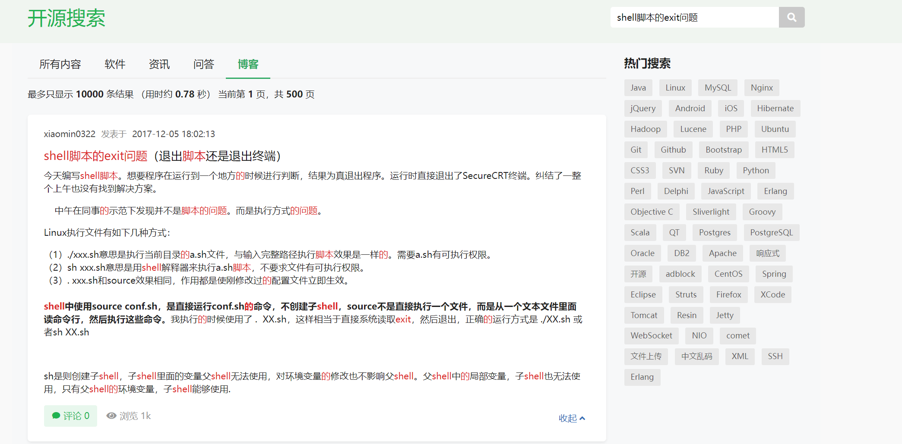

今天在docker container中编写脚本时，通过"exit 1"实现在检测到异常时退出shell脚本的执行，但是发现在执行"exit 1"时会直接退出当前shell终端。

通过阅读博客[^1]终于搞懂了其中的原因，但是该博客已失效，但是可以在网站搜索标题找到快照。

在此摘抄一下原文的解释：

Linux执行文件有如下几种方式：

1. ./xxx.sh意思是执行当前目录的a.sh文件，与输入完整路径执行脚本效果是一样的。需要a.sh有可执行权限。
2. sh xxx.sh意思是用shell解释器来执行a.sh脚本，不要求文件有可执行权限。
3. ./xxx.sh和source效果相同，作用都是使刚修改过的配置文件立即生效。

shell中使用source conf.sh，是直接运行conf.sh的命令，不创建子shell，source不是直接执行一个文件，而是从一个文本文件里面读命令行，然后执行这些命令。我执行的时候使用了 .  XX.sh，这样相当于直接系统读取exit，然后退出，正确的运行方式是 ./XX.sh 或者sh XX.sh

sh是则创建子shell，子shell里面的变量父shell无法使用，对环境变量的修改也不影响父shell。父shell中的局部变量，子shell也无法使用，只有父shell的环境变量，子shell能够使用.

[^1]: [shell脚本的exit问题（退出脚本还是退出终端）](https://my.oschina.net/xiaominmin/blog/1584883)
