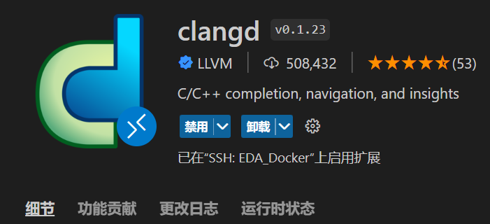

## 1. 配置方法

首先在vscode的插件商店中搜索clangd，并安装。



安装完成后，打开一个已有的工程

clangd是基于compile_commands.json文件来完成对项目的解析，并支持代码补全和跳转。

针对不同的项目构建工具，如CMake、Make和Scons，可以通过不同的方式生成compile_commands.json文件。

- CMake工程
  cmake工程生成 compile_commands.json 文件比较简单，定义 CMAKE_EXPORT_COMPILE_COMMANDS 即可。
  ```shell {.line-numbers}
  cmake -DCMAKE_EXPORT_COMPILE_COMMANDS=1
  ```
- makefile工程
  很多(旧的)工程都是用 makefile 来编译的，没有现成的选项生成 compile_commands.json 文件。
  虽然也可以使用 ctags, gtags 等，但是跳转其实不是很准确。
  我们可以通过[Bear](https://github.com/rizsotto/Bear)来生成，而且不需要改动代码。
  具体Bear的安装这里就不赘述了，按照[官方文档](https://github.com/rizsotto/Bear#how-to-install)来即可。
  安装之后，执行以下命令即可生成：
  ```shell {.line-numbers}
  bear <your-build-command>
  # 比如: bear make -f <path-to-makefile>
  ```
- scons工程
  scons工程也可以通过makefile同样的方式生成compile_commands.json文件。
  ```shell {.line-numbers}
  bear scons build/X86/gem5.debug -j8
  ```

TODO: 在SConstruct中设置，每次通过scons命令编译时自动更新compile_commands.json文件。参考[^1][^2]。


[^1]: https://gem5-review.googlesource.com/c/public/gem5/+/50260
[^2]: [Chapter 27. Using SCons with other build tools](https://scons.org/doc/production/HTML/scons-user/ch27.html)