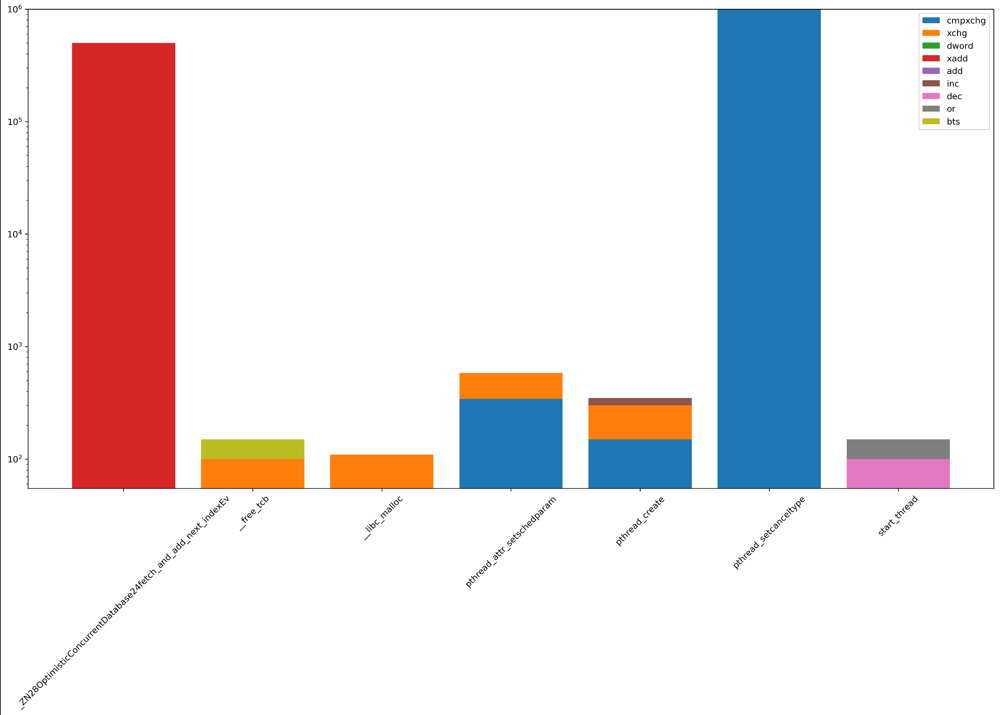

这篇博客主要介绍如何使用pin tool进行原子指令统计，pin tool是一个动态二进制插桩工具，可以在程序运行时动态插入代码，这里我们使用pin tool来统计程序中原子指令的使用情况。

## 1. 构建benchmark


```c++ {.line-numbers}
#include <iostream>
#include <vector>
#include <atomic>
#include <thread>
#include <chrono>
#include <random>
#include <functional>

class OptimisticConcurrentDatabase {
public:
    void insert(int value) {
        size_t index = fetch_and_add_next_index();
        if (index < data.size()) {
            data[index] = value;
        }
    }

    int query(size_t index) const {
        if (index < data.size()) {
            return data[index];
        }
        return -1;
    }

    size_t size() const {
        return data.size();
    }

private:
    size_t fetch_and_add_next_index() {
        return next_index.fetch_add(1, std::memory_order_relaxed);
    }

    std::vector<int> data{1000};
    std::atomic<size_t> next_index{0};
};

void insert_and_query(OptimisticConcurrentDatabase &db, int id) {
    std::default_random_engine generator{static_cast<unsigned>(std::chrono::system_clock::now().time_since_epoch().count())};
    std::uniform_int_distribution<int> distribution(1, 100);

    for (int i = 0; i < 10000; ++i) {
        int value = distribution(generator);
        db.insert(value);
        // std::cout << "Thread " << id << " inserted: " << value << std::endl;

        std::this_thread::sleep_for(std::chrono::milliseconds(1));

        size_t index = distribution(generator) % db.size();
        int queried_value = db.query(index);
        // std::cout << "Thread " << id << " queried at index " << index << ": " << queried_value << std::endl;
    }
}

int main() {
    OptimisticConcurrentDatabase db;

    const int num_threads = 50;
    std::vector<std::thread> threads;
    for (int i = 0; i < num_threads; ++i) {
        threads.emplace_back(std::thread(insert_and_query, std::ref(db), i + 1));
    }

    for (auto &t : threads) {
        t.join();
    }

    return 0;
}
```


## 2. 构建pin tool


```c++ {.line-numbers}
#include <iostream>
#include <fstream>
#include <string>
#include "pin.H"

using std::string;

#define LOGINST

KNOB<string> KnobOutputFile(KNOB_MODE_WRITEONCE, "pintool",
    "o", "atomic_instructions.log", "specify output file name");

//std::ofstream outFile;
FILE *logFile;

// Function to be called before atomic instruction
VOID PrintFunctionName(ADDRINT ip, const std::string* name) {
    //std::cout << "Atomic instruction in function: " << *name << std::endl;
    //outFile << "Atomic instruction in function: " << *name << std::endl;
	// printf("ip = %lu, fn = %s\n", ip, name->c_str());

	// Disassemble the instruction using xed
	xed_decoded_inst_t xedd;
	xed_decoded_inst_zero(&xedd);
	xed_decoded_inst_set_mode(&xedd, XED_MACHINE_MODE_LONG_64, XED_ADDRESS_WIDTH_64b);
	xed_error_enum_t xed_error = xed_decode(&xedd, reinterpret_cast<const xed_uint8_t*>(ip), 15);
	if (xed_error == XED_ERROR_NONE)
	{
		char disasm_buf[2048];
		// xed_print_info_t pi;
		// pi.p = (const xed_decoded_inst_t*)disasm_buf;
		// pi.disassembly_max_size = sizeof(disasm_buf);
		xed_format_context(XED_SYNTAX_INTEL, &xedd, disasm_buf, sizeof(disasm_buf), ip, 0, 0);

		// OutFile << "Instruction address: " << std::hex << ip << ", ASM: " << disasm_buf << std::endl;
		#ifdef LOGINST
		// fprintf(trace, "TID[%d]: Instruction address: %lx, ASM: %s\n", PIN_ThreadId(), ip, disasm_buf);
		// logFile << "0x" << std::hex << ip << ": " << disasm_buf << std::endl;
        fprintf(logFile, "0x%lx: %s %s\n", ip, disasm_buf, name->c_str());
		#endif
	}
	
    //fprintf(logFile, "Atomic instruction in function: %s\n", name->c_str());
}

// Called for every instruction executed
VOID Instruction(INS ins, VOID *v) {
    if (INS_IsAtomicUpdate(ins)) {
        RTN rtn = INS_Rtn(ins);
        if (RTN_Valid(rtn)) {
            std::string rtn_name = RTN_Name(rtn);
            INS_InsertCall(ins, IPOINT_BEFORE, (AFUNPTR)PrintFunctionName,
			IARG_INST_PTR,
            IARG_PTR, new std::string(rtn_name),
            IARG_END);
        }
    }
}


VOID Routine(RTN rtn, VOID *v) {
	string rtn_name = RTN_Name(rtn);
	//std::cout << "Routine Name: " << rtn_name << std::endl;
	fprintf(logFile, "Routine Name: %s\n", rtn_name.c_str());
}

// This function is called when the application exits
VOID Fini(INT32 code, VOID *v) {
    //outFile.close();
    fclose(logFile);
}

/* ===================================================================== */
/* Print Help Message                                                    */
/* ===================================================================== */

INT32 Usage() {
    PIN_ERROR("This Pintool detects atomic instructions and prints the function name containing them.\n" + KNOB_BASE::StringKnobSummary() + "\n");
    return -1;
}

/* ===================================================================== */
/* Main                                                                  */
/* ===================================================================== */

int main(int argc, char *argv[]) {
    if (PIN_Init(argc, argv)) {
        return Usage();
    }

    PIN_InitSymbols();

    //outFile.open(KnobOutputFile.Value().c_str());
    logFile = fopen(KnobOutputFile.Value().c_str(), "w");

    INS_AddInstrumentFunction(Instruction, 0);
    //RTN_AddInstrumentFunction(Routine, 0);
    PIN_AddFiniFunction(Fini, 0);

    // Start the program, never returns
    PIN_StartProgram();

    return 0;
}
```


最终打印的格式如下所示：

```shell {.line-numbers}
0x7f0faed90fec: lock cmpxchg dword ptr [rip+0x1b34c], edx __pthread_initialize_minimal
0x7f0faed9100f: xchg dword ptr [rip+0x1b32b], eax __pthread_initialize_minimal
0x7f0faed950ad: lock cmpxchg dword ptr [rdi], edx pthread_mutex_lock
0x7f0faed967db: xchg dword ptr [rdi], eax pthread_mutex_unlock
0x7f0faed92936: lock cmpxchg dword ptr [rip+0x19a02], edx pthread_create
0x7f0faed93049: xchg dword ptr [rip+0x192f1], eax pthread_create
0x7f0faed92a82: lock cmpxchg dword ptr [rip+0x198de], ecx pthread_create
0x7f0faed93212: xchg dword ptr [rip+0x19150], eax pthread_create
0x7f0faed93333: lock cmpxchg dword ptr [rip+0x1902d], edx pthread_create
0x7f0faed93391: xchg dword ptr [rip+0x18fd1], eax pthread_create
```

## 3. 使用python脚本分析


```python {.line-numbers}
'''
Author: Wang Zongwu
Date: 2023-04-12 10:11:14
LastEditTime: 2023-04-13 13:38:21
LastEditors: Wang Zongwu
Description: 这个脚本实现对原子指令trace的分类, 即atomicInsMix
FilePath: /benchbase/tmp/atomic_classify.py
Mail: wangzongwu@sjtu.edu.cn
Please ask for permission before quote the code.
'''

import os
import matplotlib.pyplot as plt

def classify(trace_name):
	op_dict = {}
	func_list = []
	with open(trace_name, 'r') as f:
		count = 0
		while True:
			line = f.readline()
			count += 1
			if not line:
				break
			if "lock" in line:
				try:
					op = line.split()[2]
					func = line.split()[-1]
					if func not in func_list:
						func_list.append(func)
				except:
					print(count)
					exit()
				if op not in op_dict.keys():
					op_dict[op] = {}
					op_dict[op][func] = 1
				else:
					if func not in op_dict[op].keys():
						op_dict[op][func] = 1
					else:
						op_dict[op][func] += 1
			else:
				try:
					op = line.split()[1]
					func = line.split()[-1]
					if func not in func_list:
						func_list.append(func)
				except:
					print(count)
					exit()
				if op not in op_dict.keys():
					op_dict[op] = {}
					op_dict[op][func] = 1
				else:
					if func not in op_dict[op].keys():
						op_dict[op][func] = 1
					else:
						op_dict[op][func] += 1

	# 对func_list进行unique, 并按照字母顺序排序
	func_list = list(set(func_list))
	func_list.sort()
	# # 将op_dict中每个key对应的value根据func_list转换成一个list
	# for key in op_dict.keys():
	# 	op_dict[key] = [op_dict[key][func] if func in op_dict[key].keys() else 0 for func in func_list]

	# 通过op_dict生成一个新的字典，key为函数名，value为一个op->count的字典
	func_dict = {}
	for func in func_list:
		func_dict[func] = {}
		for key in op_dict.keys():
			func_dict[func][key] = op_dict[key][func] if func in op_dict[key].keys() else 0
	

	# 统计func_dict中累积op count超过100的key，保存到一个list中
	filtered_func_list = []
	for func in func_dict.keys():
		count = 0
		for key in func_dict[func].keys():
			count += func_dict[func][key]
		if count > 100:
			filtered_func_list.append(func)

	# 对func_dict进行过滤，只保留filtered_func_list中的函数，生成一个新的字典new_func_dict
	new_func_dict = {}
	for func in func_dict.keys():
		if func in filtered_func_list:
			new_func_dict[func] = func_dict[func]
	
	# # 对new_func_dict中每个key对应的op->count进行归一化
	# for func in new_func_dict.keys():
	# 	count = 0
	# 	for key in new_func_dict[func].keys():
	# 		count += new_func_dict[func][key]
	# 	for key in new_func_dict[func].keys():
	# 		new_func_dict[func][key] /= count

	# 通过new_func_dict生成一个新的字典，key为op，value为一个func->count的字典
	op_dict = {}
	for key in new_func_dict.keys():
		for op in new_func_dict[key].keys():
			if op not in op_dict.keys():
				op_dict[op] = {}
				op_dict[op][key] = new_func_dict[key][op]
			else:
				op_dict[op][key] = new_func_dict[key][op]
	
	# 将op_dict中每个key对应的value根据filtered_func_list转换成一个list
	for key in op_dict.keys():
		op_dict[key] = [op_dict[key][func] if func in op_dict[key].keys() else 0 for func in filtered_func_list]

	# 打印op_dict
	print("op_dict:")
	for key in op_dict.keys():
		print(key, op_dict[key])

	# exit()


	# 绘制堆积柱状图，横坐标为函数名，纵坐标为指令数
	print("Start to draw the figure...")
	plt.figure(figsize=(20, 10))
	bottom = [0 for i in range(len(filtered_func_list))]
	for key in op_dict.keys():
		try:
			plt.bar(filtered_func_list, op_dict[key], label=key, bottom=bottom)
		except:
			print(key)
			print(bottom)
			print(op_dict[key])
			exit()
		bottom = [bottom[i] + op_dict[key][i] for i in range(len(bottom))]
	plt.legend()
	plt.xticks(rotation=45)
	plt.yscale('log')
	plt.savefig("atomicInsMix.png", dpi=300, bbox_inches='tight')
	plt.close()
		

if __name__ == "__main__":
	# trace_name = "/data/wzw/Documents/ACA/Projects/benchbase/target/benchbase-2021/atomic_instructions.log"
	trace_name = "/data/wzw/Documents/ACA/Projects/benchbase/target/benchbase-2021/atomic_instructions.log"
	classify(trace_name)
```



绘图结果如下：

