# 内存一致性和缓存连贯性入门

<!-- TOC -->

- [内存一致性和缓存连贯性入门](#内存一致性和缓存连贯性入门)
	- [摘要](#摘要)
	- [关键词](#关键词)
	- [1. 一致性和连贯性简介](#1-一致性和连贯性简介)
		- [1.1 一致性（又称内存一致性、内存一致性模型或内存模型）](#11-一致性又称内存一致性内存一致性模型或内存模型)
		- [1.2 连贯性（又名缓存连贯性）](#12-连贯性又名缓存连贯性)
		- [1.3 异构系统的一致性和连贯性](#13-异构系统的一致性和连贯性)
		- [1.4 指定和验证内存一致性模型和缓存连贯性](#14-指定和验证内存一致性模型和缓存连贯性)
		- [1.5 一致性和连贯性测验](#15-一致性和连贯性测验)
		- [1.6 本入门不做的事](#16-本入门不做的事)
	- [2. 连贯性基础](#2-连贯性基础)
		- [2.1 基线系统模型](#21-基线系统模型)
		- [2.2 问题：不连贯是如何发生的](#22-问题不连贯是如何发生的)
		- [2.3 缓存连贯性接口](#23-缓存连贯性接口)
		- [2.4 （一致性无关的）连贯性不变量](#24-一致性无关的连贯性不变量)
			- [2.4.1 保持连贯不变量](#241-保持连贯不变量)
			- [2.4.2 连贯性的粒度](#242-连贯性的粒度)
			- [2.4.3 连贯性何时相关？](#243-连贯性何时相关)
	- [3 内存一致性动机和顺序一致性](#3-内存一致性动机和顺序一致性)
		- [3.1 共享内存行为的问题](#31-共享内存行为的问题)
		- [3.2 什么是内存一致性模型？](#32-什么是内存一致性模型)
		- [3.3 一致性 VS. 连贯性](#33-一致性-vs-连贯性)
		- [3.4 顺序一致性 (SC) 的基本思想](#34-顺序一致性-sc-的基本思想)
		- [3.5 一点SC形式化](#35-一点sc形式化)
		- [3.6 简单的 SC 实现](#36-简单的-sc-实现)
		- [3.7 具有缓存连贯性的基本 SC 实现](#37-具有缓存连贯性的基本-sc-实现)
		- [3.8 使用缓存一致性优化 SC 实现](#38-使用缓存一致性优化-sc-实现)
		- [3.9 SC 的原子操作](#39-sc-的原子操作)
		- [3.10 综合起来：MIPS R10000](#310-综合起来mips-r10000)
		- [3.11 关于 SC 的进一步阅读](#311-关于-sc-的进一步阅读)
	- [4 Total Store Order 和 x86 内存模型](#4-total-store-order-和-x86-内存模型)
		- [4.1 TSO / X86 的动机](#41-tso--x86-的动机)
		- [4.2 TSO/X86 的基本理念](#42-tsox86-的基本理念)
		- [4.3 一点 TSO/X86 形式主义](#43-一点-tsox86-形式主义)
		- [4.4 实施 TSO / X86](#44-实施-tso--x86)
			- [4.4.1 执行原子指令](#441-执行原子指令)
			- [4.4.2 实现FENCE](#442-实现fence)
		- [4.5 关于 TSO 的进一步阅读](#45-关于-tso-的进一步阅读)
		- [4.6 比较SC和TSO](#46-比较sc和tso)
	- [5 宽松的内存一致性](#5-宽松的内存一致性)
		- [5.1 动机](#51-动机)
			- [5.1.1 重新排序内存操作的机会](#511-重新排序内存操作的机会)
			- [5.1.2 利用重新排序的机会](#512-利用重新排序的机会)
		- [5.2 松弛一致性模型 (XC) 示例](#52-松弛一致性模型-xc-示例)
			- [5.2.1 XC 模型的基本思想](#521-xc-模型的基本思想)
			- [5.2.2 在 XC 下使用 Fences 的示例](#522-在-xc-下使用-fences-的示例)
			- [5.2.3 形式化 XC](#523-形式化-xc)
			- [5.2.4 XC正常运行的示例](#524-xc正常运行的示例)
	- [6 连贯性协议](#6-连贯性协议)
		- [6.1 大局](#61-大局)
		- [6.2 指定一致性协议](#62-指定一致性协议)
		- [6.3 简单一致性协议示例](#63-简单一致性协议示例)
		- [6.4 一致性协议设计空间概述](#64-一致性协议设计空间概述)
			- [6.4.1 状态](#641-状态)
			- [6.4.2 事务](#642-事务)
			- [6.4.3 主要协议设计选项](#643-主要协议设计选项)
	- [7 侦听连贯性协议](#7-侦听连贯性协议)
		- [7.1 侦听简介](#71-侦听简介)
		- [7.2 基线侦听协议](#72-基线侦听协议)
			- [7.2.1 高级协议规范](#721-高级协议规范)
			- [7.2.2 简单的侦听系统模型：原子请求、原子事务](#722-简单的侦听系统模型原子请求原子事务)
			- [7.2.3 基线侦听系统模型：非原子请求、原子事务](#723-基线侦听系统模型非原子请求原子事务)
			- [7.2.4 运行示例](#724-运行示例)
			- [7.2.5 协议简化](#725-协议简化)
		- [7.3 添加独占(E)状态](#73-添加独占e状态)
			- [7.3.1 动机](#731-动机)
			- [7.3.2 进入EXCLUSIVE状态](#732-进入exclusive状态)
			- [7.3.3 协议的高级规范](#733-协议的高级规范)
			- [7.3.4 详细规格](#734-详细规格)
			- [7.3.5 运行示例](#735-运行示例)
		- [7.4 添加OWNED状态](#74-添加owned状态)
			- [7.4.1 动机](#741-动机)
			- [7.4.2 高级协议规范](#742-高级协议规范)
			- [7.4.3 详细的协议规范](#743-详细的协议规范)
			- [7.4.4 运行示例](#744-运行示例)
		- [7.5 非原子总线](#75-非原子总线)
			- [7.5.1 动机](#751-动机)
			- [7.5.2 按序 VS 无序响应](#752-按序-vs-无序响应)
			- [7.5.3 非原子系统模型](#753-非原子系统模型)
			- [7.5.4 具有拆分事务总线的 MSI 协议](#754-具有拆分事务总线的-msi-协议)
			- [7.5.5 具有拆分事务总线的优化的、非停滞的 MSI 协议](#755-具有拆分事务总线的优化的非停滞的-msi-协议)
		- [7.6 对总线互连网络的优化](#76-对总线互连网络的优化)
			- [7.6.1 用于数据响应的独立非总线网络](#761-用于数据响应的独立非总线网络)
			- [7.6.2 一致性请求的逻辑总线](#762-一致性请求的逻辑总线)
	- [8 目录一致性协议](#8-目录一致性协议)
		- [8.1 目录协议简介](#81-目录协议简介)
		- [8.2 基线目录系统](#82-基线目录系统)
			- [8.2.1 目录系统模型](#821-目录系统模型)
		- [8.2.2 高级协议规范](#822-高级协议规范)

<!-- /TOC -->

## 摘要

许多现代计算机系统，包括同构和异构体系结构，都支持硬件共享内存。在共享内存系统中，每个处理器内核都可以读取和写入单个共享地址空间。对于共享内存机器，内存一致性模型定义了其内存系统的架构可见行为。一致性定义提供有关加载和存储（或内存读取和写入）以及它们如何作用于内存的规则。作为支持内存一致性模型的一部分，许多机器还提供缓存连贯性协议，确保多个缓存的数据副本保持最新。本入门读物的目标是让读者对一致性和连贯性有一个基本的了解。这种理解既包括必须解决的问题，也包括各种解决方案。我们既展示了高级概念，也展示了来自现实世界系统的特定的、具体的例子。

第二版反映了自第一版以来十年的进步，除其他更温和的变化外，还包括两个新章节：一个关于非 CPU 加速器的一致性和连贯性（重点是 GPU），另一个是针对一致性和连贯性的正式工作和工具。

## 关键词

计算机架构、内存一致性、缓存连贯性、共享内存、内存系统、多核处理器、异构架构、GPU、加速器、语义、验证

## 1. 一致性和连贯性简介

许多现代计算机系统和大多数多核芯片（芯片多处理器）都支持硬件共享内存。 在共享内存系统中，每个处理器内核都可以读取和写入单个共享地址空间。 这些设计寻求各种优良特性，例如高性能、低功耗和低成本。 当然，在不首先提供正确性的情况下提供这些优良特性是没有价值的。 正确的共享内存在粗暴(hand-wave)级别上似乎很直观，但是，正如本讲座将帮助展示的那样，甚至在定义共享内存系统正确的含义时也存在一些微妙的问题，以及在设计正确的共享内存实现时存在许多微妙的极端情况。此外，必须在错误修复成本高昂的硬件实现中掌握这些微妙之处。 即使是学者也应该掌握这些微妙之处，以使他们提出的设计更有可能奏效。

设计和评估正确的共享内存系统需要架构师了解内存一致性和缓存连贯性，这是本入门书的两个主题。内存一致性（一致性、内存一致性模型或内存模型）是共享内存正确性的精确的、架构可见的定义。一致性定义提供有关加载和存储（或内存读取和写入）以及它们如何作用于内存的规则。理想情况下，一致性定义应该简单易懂。然而，定义共享内存正确行为的含义比定义正确行为（例如，单线程处理器内核）更微妙。单个处理器内核的正确性标准将行为划分为一个正确结果和许多不正确的替代方案。这是因为处理器的架构要求线程的执行将给定的输入状态转换为单个明确定义的输出状态，即使在无序内核上也是如此。然而，共享内存一致性模型涉及多个线程的加载和存储，并且通常允许许多正确的执行同时不允许许多（更多）不正确的执行。多次正确执行的可能性是由于 ISA 允许多个线程同时执行，通常来自不同线程的指令有许多可能的合法交错。大量的正确执行使以前确定执行是否正确的简单挑战变得复杂。然而，必须掌握一致性以实现共享内存，并且在某些情况下，编写使用它的正确程序。

微体系结构——处理器内核和共享内存系统的硬件设计——必须强制执行所需的一致性模型。 作为此一致性模型支持的一部分，硬件提供缓存连贯性（或连贯性）。 在具有缓存的共享内存系统中，当其中一个处理器更新其缓存值时，缓存值可能会过时（或不连贯）。 Coherence试图使共享内存系统的缓存在功能上与单核系统中的缓存一样不可见；它通过将处理器的写入传播到其他处理器的缓存来实现。值得强调的是，与定义共享内存正确性的架构规范一致性不同，连贯性是支持一致性模型的一种手段。

尽管一致性是本入门读物的第一个主要主题，但我们在第 2 章开始时会简要介绍连贯性，因为连贯性协议在提供一致性方面发挥着重要作用。第2章的目标是充分解释连贯性，以了解一致性模型如何与连贯性缓存交互，而不是探索特定的连贯性协议或实现，我们将这些主题推迟到第 6-9 章本入门的第二部分。

### 1.1 一致性（又称内存一致性、内存一致性模型或内存模型）

一致性模型根据加载和存储（内存读取和写入）定义正确的共享内存行为，而不参考缓存或连贯性。为了获得一些关于为什么我们需要一致性模型的真实世界的直觉，考虑一所在线发布其课程安排的大学。假设计算机体系结构课程原定在152室，开课前一天，大学注册员决定将班级搬到252室。注册员发送电子邮件，要求网站管理员更新在线时间表，几分钟后，注册员会向所有注册的学生发送一条短信，以查看最新更新的时间表。不难想象这样一种场景——比如说，网站管理员太忙而不能立即发布更新——一个勤奋的学生收到短信，立即查看在线时间表，仍然观察（旧）班级位置152 房间。即使在线时间表最终更新到 252 房间，并且注册员以正确的顺序执行“写入”，但这位勤奋的学生以不同的顺序观察它们，因此走错了房间。一致性模型定义了这种行为是正确的（因此用户是否必须采取其他行动来实现预期的结果）还是不正确的（在这种情况下，系统必须排除这些重新排序）。

尽管这个人为的示例使用了多种媒体，但在具有乱序处理器内核、写缓冲区、预取和多个缓存组的共享内存硬件中也会发生类似的行为。 因此，我们需要定义共享内存的正确性——即允许哪些共享内存行为——以便程序员知道期望什么，实现者知道他们可以提供什么的限制。

共享内存的正确性由内存一致性模型或更简单的内存模型指定。 内存模型指定了使用共享内存执行的多线程程序的允许行为。 对于使用特定输入数据执行的多线程程序，内存模型指定动态加载可能返回的值，以及可选的内存可能的最终状态。 与单线程执行不同，通常允许多个正确的行为，这使得对内存一致性模型的理解变得微妙。

第 3 章介绍了内存一致性模型的概念，并介绍了最强大、最直观的一致性模型——顺序一致性 (SC, Sequential Consistency)。 本章首先激发了指定共享内存行为的需要，并精确定义了内存一致性模型是什么。 接下来深入研究直观的 SC 模型，该模型指出多线程执行应该看起来像是每个组成线程的顺序执行的交错，就好像这些线程在单核处理器上进行了时间复用。 除了这种直觉之外，本章还对 SC 进行了形式化，并探索了以简单和积极的方式以连贯性的方式实施 SC，最后以 MIPS R10000 案例研究结束。

在第 4 章中，我们将超越 SC，重点关注由 x86 和历史 SPARC 系统实现的内存一致性模型。 这种一致性模型称为总存储顺序 (TSO, Total Store Order)，其动机是希望在将结果写入缓存之前使用先进先出写入缓冲区来保存已提交存储的结果。 这种优化违反了 SC，但承诺足够的性能优势来激发架构定义 TSO，这允许这种优化。 在本章中，我们将展示如何从我们的 SC 形式化中形式化 TSO，TSO 如何影响实现，以及 SC 和 TSO 如何比较。

最后，第 5 章介绍了“宽松”或“弱”内存一致性模型。它通过证明强模型中的大多数内存排序是不必要的来激励这些模型。如果一个线程更新十个数据项，然后更新一个同步标志，程序员通常不关心数据项是否按彼此的顺序更新，而只关心在更新标志之前更新所有数据项。宽松模型试图捕捉这种增加的排序灵活性，以获得更高的性能或更简单的实现。<font color=blue>也就是对内存操作进行粗粒度的划分，只有乱序访存会出错时才硬性规定访存顺序。</font> 在提供这个动机之后，本章开发了一个名为 XC 的宽松一致性模型示例，其中程序员只有在使用 FENCE 指令（例如，在最后一次数据更新之后但在标志写入之前）请求它时才能获得命令。本章然后扩展前两章的形式来处理 XC 并讨论如何实现 XC（在内核和一致性协议之间进行了大量的重新排序）。本章然后讨论了许多程序员可以避免直接考虑宽松模型的方法：如果他们添加足够的 FENCE 以确保他们的程序无数据竞争 (DRF, Data-Race Free)，那么大多数宽松模型将出现 SC。通过“SC for DRF”，程序员可以获得（相对）简单的 SC 正确性模型和（相对）更高的 XC 性能。对于那些想要更深入推理的人，本章的结尾是区分获取和发布，讨论写入原子性和因果关系，指向商业示例（包括 IBM Power 案例研究），并涉及高级语言模型（Java 和 C++）.

回到课程表的真实世界一致性示例，我们可以观察到电子邮件系统、人工网络管理员和文本消息系统的组合代表了一个极弱的一致性模型。 为了防止勤奋的学生走错房间的问题，大学注册员需要在她的电子邮件后执行 FENCE 操作，以确保在发送短信之前更新在线时间表。

### 1.2 连贯性（又名缓存连贯性）

除非小心，否则如果多个参与者（例如，多个核心）可以访问数据的多个副本（例如，在多个缓存中）并且至少一个访问是写入，则会出现连贯性问题。考虑一个类似于内存一致性示例的示例。 一名学生查看在线课程表，发现计算机体系结构课程正在 152 室举行（读取数据），并将此信息复制到她手机中的日历应用程序中（缓存数据）。 随后，大学注册官决定将班级搬到 252 房间，更新在线时间表（写入数据）并通过短信通知学生。 学生的数据副本现在已经过时，我们遇到了不连贯的情况。 如果她去 152 房间，她将找不到她的班级。 来自计算世界的不连贯示例（但不包括计算机架构）包括陈旧的 Web 缓存和程序员使用未更新的代码存储库。

<font color=gray>个人理解：在[Memory Consistency](https://youtu.be/43lrxYHTpdU?t=2124)中是从没有私有缓存的多核系统延申到具有缓存的简单多核系统，最后到拥有write buffer等复杂功能的Cache系统。虽然这边作者讲解的是Memory Consistency在逐渐复杂的系统中发生的变化，但是也可以反过来用于理解Cache coherence。在没有私有缓存的多核系统中，所有的处理器都将数据直接存储到共享存储中，任何数据都只有一个副本，所以不存在处理器观察到数据过期的情况，这也对应了如果学生不存在手机中的日历，也不存在记忆，那么在决定去哪上课之前，都需要去查看在线课程表。在有私有缓存的情况下，其他处理器对数据的改动（网络管理员更新课程房间）即使传递到了共享内存中，如果其他处理器私有缓存中存在过期的数据，并且没有感知到数据的更新，就会发生系统错误。由于这个问题是由于私有缓存的加入带来的，因此也叫做缓存连贯性（Cache coherence）。在下面存在私有缓存系统的图中，可以看到只要支持缓存一致性，整个系统的正确性就可以保证跟上面没有私有缓存的结果一致。（只是暂时看到一致，至少是访问同一个位置的数据不会发生数据过期的问题，但是由于私有缓存延迟和乱序的存在，导致共享内存观察到的最终访存顺序与所有核心上程序发送的访存请求顺序不一致，这个问题就属于memory consistency问题。此外，对于不同位置的访存顺序，编译器不会感知，因为不存在访存依赖，因此有可能会对这两条指令进行乱序，但这在并行程序中就可能引发错误，因为这两个变量值有可能是用于同步，这也属于memory consistency的问题，因此memory consistency问题我理解为共享内存感知到的访存顺序与预期的访存语义不一致，导致的多线程程序结果错误。而缓存连贯性则是需要感知到其他所有核心对于数据的最新更新。memory consistency关注任意地址之间的读写顺序对线程间的影响，cache coherence则是关注线程间同一地址的影响，这个同一地址指的是Cache coherence粒度。）</font>

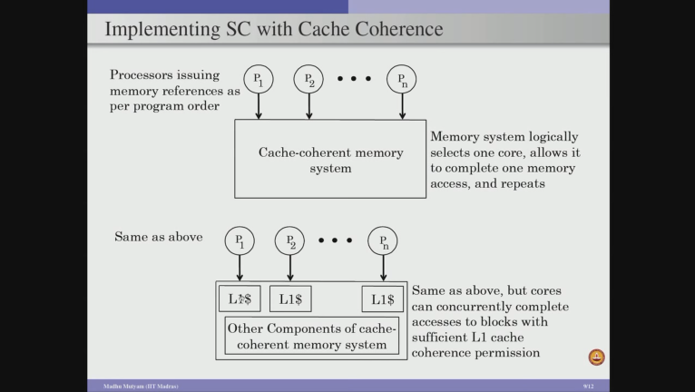

使用一致性协议可以防止访问陈旧数据（不连续性），该协议是由系统内分布式参与者实现的一组规则。Coherence协议有多种变体，但遵循一些主题，如第 6-9 章所述。本质上，所有变体都通过将写入传播到所有缓存，使一个处理器的写入对其他处理器可见，即保持日历与在线计划同步。但是协议在同步发生的时间和方式上有所不同。有两大类连贯性协议。在第一种方法中，连贯性协议确保写入同步传播到缓存。当在线时间表更新时，连贯性协议确保学生的日历也更新。在第二种方法中，连贯性协议异步地将写入传播到缓存，同时仍然遵守连贯性模型。连贯性协议不保证在线时间表更新时，新值也会传播到学生的日历；但是，该协议确实确保在文本消息到达她的手机之前传播新值。本入门书侧重于第一类连贯性协议（第 6-9 章），而第 10 章则讨论新兴的第二类。

第 6 章展示了缓存连贯性协议的总体情况，并为后续有关特定连贯性协议的章节奠定了基础。 本章涵盖了大多数连贯性协议共有的问题，包括缓存控制器和内存控制器的分布式操作以及常见的 MOESI 连贯性状态：已修改 (M)、拥有 (O)、独占 (E)、共享 (S) 和无效 (I)。 重要的是，本章还介绍了我们的表格驱动方法，用于呈现具有稳定（例如，MOESI）和瞬态连贯状态的协议。 在实际实现中需要瞬态状态，因为现代系统很少允许从一种稳定状态到另一种稳定状态的原子转换（例如，状态 Invalid 中的读取未命中将花费一些时间等待数据响应，然后才能进入共享状态）。 连贯性协议中的大部分真正复杂性隐藏在瞬态中，类似于处理器核心复杂性的多少隐藏在微架构状态中。

第 7 章介绍了最初主导商业市场的侦听缓存连贯性协议。在粗暴(hand-wave)级别，窥探协议很简单。当发生缓存未命中时，内核的缓存控制器会仲裁共享总线并广播其请求。共享总线确保所有控制器以相同的顺序观察所有请求，因此所有控制器可以协调它们各自的分布式动作，以确保它们保持全局一致的状态。然而，侦听变得复杂，因为系统可能使用多条总线，而现代总线不能以原子方式处理请求。现代总线具有仲裁队列，可以发送单播、流水线延迟或乱序响应。所有这些特征都会导致更多的瞬态连贯状态。第 7 章以 Sun UltraEnterprise E10000 和 IBM Power5 的案例研究结束。

第 8 章深入研究目录缓存连贯性协议，与依赖广播的侦听协议相比，该协议有望扩展到更多的处理器内核和其他参与者。有一个笑话，计算机科学中的所有问题都可以通过间接级别来解决。目录协议支持这个笑话：缓存未命中向下一级缓存（或内存）控制器请求内存位置，该控制器维护一个目录，跟踪哪些缓存保存哪些位置。基于所请求的内存位置的目录条目，控制器向请求者发送响应消息或将请求消息转发给当前缓存该内存位置的一个或多个参与者。每条消息通常都有一个目的地（即，没有广播或多播），但是瞬态连贯状态比比皆是，因为从一个稳定的连贯状态到另一个稳定的状态的转换可以生成与系统中参与者数量成正比的大量消息。本章从一个基本的 MSI 目录协议开始，然后对其进行细化以处理 MOESI 状态 E 和 O、分布式目录、减少请求延迟、近似目录条目表示等。本章还探讨了目录本身的设计，包括目录缓存技术。本章以旧 SGI Origin 2000 和更新的 AMD HyperTransport、HyperTransport Assist 和 Intel QuickPath Interconnect (QPI) 的案例研究结束。

第 9 章讨论了一些（但不是全部）连贯性的高级主题。 为了便于解释，前面关于连贯性的章节有意将自己限制在解释基本问题所需的最简单的系统模型上。 第 9 章深入研究更复杂的系统模型和优化，重点关注侦听和目录协议的共同问题。 初始主题包括处理指令高速缓存、多级高速缓存、直写高速缓存、转换后备缓冲区 (TLB)、连贯直接内存访问 (DMA)、虚拟高速缓存和分层连贯协议。 最后，本章深入探讨了性能优化（例如，针对迁移共享和虚假共享）和一个名为 Token Coherence 的新协议族，该协议族包含目录和监听连贯性。

### 1.3 异构系统的一致性和连贯性

现代计算机系统主要是异构的。 今天的手机处理器不仅包含多核 CPU，还包含 GPU 和其他加速器（例如神经网络硬件）。 为了寻求可编程性，此类异构系统开始支持共享内存。 第 10 章讨论此类异构处理器的一致性和连贯性。

本章首先关注 GPU，可以说是当今最流行的加速器。 本章观察到 GPU 最初选择不支持硬件缓存连贯性，因为 GPU 是为令人尴尬的并行图形工作负载而设计的，这些工作负载不同步或共享数据。 然而，当 GPU 用于具有细粒度同步和数据共享的通用工作负载时，缺乏硬件缓存连贯性会导致可编程性和/或性能挑战。本章详细讨论了一些克服这些限制的有前途的连贯性替代方案——特别是解释了为什么候选协议直接强制执行一致性模型而不是以与连贯性无关的方式实现一致性。 本章最后简要讨论了 CPU 和加速器之间的一致性和连贯性。

### 1.4 指定和验证内存一致性模型和缓存连贯性

一致性模型和连贯性协议是复杂而微妙的。 然而，必须管理这种复杂性，以确保多核是可编程的，并且它们的设计可以得到验证。 为了实现这些目标，正式指定一致性模型至关重要。 正式的规范将使程序员能够清楚而详尽地（借助工具支持）了解内存模型允许哪些行为以及哪些行为不允许。 其次，为了验证实现，一个精确的正式规范是强制性的。

第 11 章首先讨论了两种指定系统的方法——公理的和操作的——重点关注如何将这些方法应用于一致性模型和连贯性协议。 然后，本章将讨论验证实现（包括处理器流水线和连贯性协议实现）的技术是否符合它们的规范。 本章讨论了正式方法和非正式测试。

### 1.5 一致性和连贯性测验

可以很容易地说服自己，一个人对一致性和连贯性的了解就足够了，并且没有必要阅读这本入门书。 为了测试是否是这种情况，我们提供了这个流行测验。

问题1：在保持顺序一致性的系统中，核心必须按程序顺序发出连贯性请求。 对或错？ （答案在第 3.8 节）

问题 2：内存一致性模型指定了一致性事务的合法顺序。 对或错？ （第 3.8 节）

问题 3：要执行原子读-修改-写指令（例如，测试和设置），一个内核必须始终与其他内核通信。 对或错？ （第 3.9 节）

问题 4：在具有多线程内核的 TSO 系统中，线程可能会绕过写入缓冲区中的值，无论哪个线程写入该值。 对或错？ （第 4.4 节）

问题 5：相对于高级语言的一致性模型（例如 Java）编写适当同步代码的程序员不需要考虑架构的内存一致性模型。 对或错？ （第 5.9 节）

问题6：在MSI Snooping 协议中，缓存块只能处于三种一致性状态之一。 对或错？ （第 7.2 节）

问题 7：侦听缓存连贯性协议要求内核在总线上进行通信。 对或错？ （第 7.6 节）

问题 8：GPU 不支持硬件缓存连贯性。 因此，他们无法强制执行内存一致性模型。 对或错？ （第 10.1 节）。

尽管在本入门书的后面提供了答案，但我们鼓励读者在看答案之前先尝试回答问题。

### 1.6 本入门不做的事

本讲座旨在成为连贯性和一致性的入门。 我们预计这些材料可以在大约 10 节 75 分钟的课程（例如，第 2 章到第 11 章的一节课）中涵盖。

为此，讲座没有涵盖许多内容。 其中一些包括以下内容。

- 同步。 Coherence 使缓存不可见。 一致性可以使共享内存看起来像一个单一的内存模块。 然而，程序员可能需要锁、屏障和其他同步技术来使他们的程序有用。 读者可以参考关于**共享内存同步**的综合讲座。
- 商业宽松一致性模型。 本入门指南并未涵盖 ARM、PowerPC 和 RISC-V 内存模型的细微之处，但确实描述了它们提供哪些机制来强制执行顺序。
- 并行编程。 本入门不讨论并行编程模型、方法或工具。
- 分布式系统中的一致性。 本入门指南将自身限制在共享内存多核内的一致性，并不涵盖一致性模型及其对通用分布式系统的实施。 读者可以参考关于**数据库复制**和**仲裁系统**的综合讲座。

## 2. 连贯性基础

在本章中，我们对缓存连贯性进行了足够的介绍，以了解一致性模型如何与缓存交互。 我们从 2.1 节开始，介绍我们在本入门书中考虑的系统模型。 为了简化本章和后续章节的阐述，我们选择了足以说明重要问题的最简单的系统模型； 我们推迟到第 9 章讨论与更复杂的系统模型相关的问题。 2.2 节解释了必须解决的缓存连贯性问题以及不连贯性的可能性是如何产生的。 2.3 节精确定义了缓存连贯性。

### 2.1 基线系统模型

在本入门读物中，我们考虑具有共享内存的多个处理器内核的系统。也就是说，所有内核都可以对所有（物理）地址执行加载和存储。基线系统模型包括单个多核处理器芯片和片外主存储器，如图 2.1 所示。多核处理器芯片由多个单线程内核组成，每个内核都有自己的私有数据缓存，以及一个所有内核共享的末级缓存（LLC）。在本入门手册中，当我们使用术语“缓存”时，我们指的是内核的私有数据缓存，而不是 LLC。每个内核的数据缓存都使用物理地址访问并且是回写的。核心和 LLC 通过互连网络相互通信。尽管 LLC 位于处理器芯片上，但在逻辑上是“内存端缓存”，因此不会引入其他级别的一致性问题。 LLC 逻辑上就在内存前面，用于减少内存访问的平均延迟并增加内存的有效带宽。 LLC 还用作片上存储器控制器。

此基线系统模型省略了许多常见的功能，但对于本入门读物的大部分目的而言并不需要这些功能。 这些功能包括指令高速缓存、多级高速缓存、在多个内核之间共享的高速缓存、虚拟寻址高速缓存、TLB 和一致的直接内存访问 (DMA)。 基线系统模型也忽略了多个多核芯片的可能性。 我们稍后将讨论所有这些功能，但就目前而言，它们会增加不必要的复杂性。

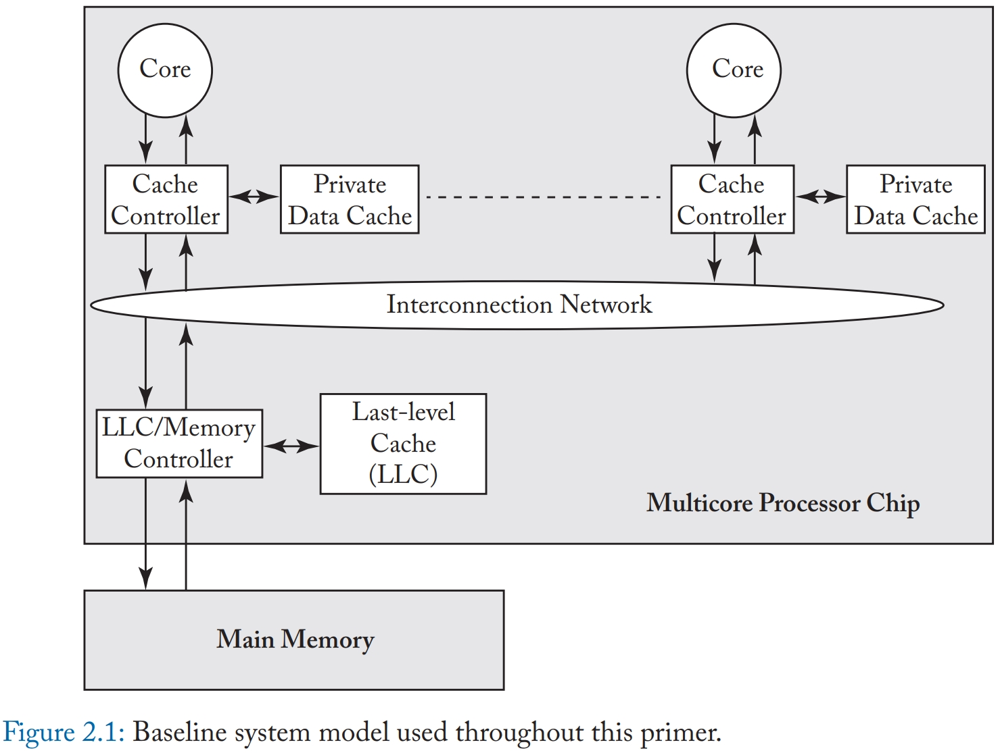

### 2.2 问题：不连贯是如何发生的

出现不连贯的可能性只是因为一个基本问题：存在多个可以访问缓存和内存的参与者。在现代系统中，这些参与者是处理器内核、DMA 引擎和可以读取和/或写入缓存和内存的外部设备。 在本入门书的其余部分，我们通常关注作为核心的参与者，但值得记住的是，可能存在其他参与者。

表 2.1 说明了一个简单的不连贯示例。 最初，内存位置 A 在内存以及两个内核的本地缓存中的值为 42。 在时间 1，Core 1 将其缓存中内存位置 A 的值从 42 更改为 43，从而使 Core 2 在其缓存中的 A 值失效。 核心 2 执行一个 while 循环，从其本地缓存中重复加载 A 的（陈旧）值。 显然，这是一个不连贯的例子，因为来自 Core 1 的 store 没有对 Core 2 可见，因此 C2 被卡在 while 循环中。

表 2.1：不连贯示例。 假设内存位置 A 处的内存值最初为 42，并缓存在两个内核的本地缓存中。

| Time 	| Core C1     	| Core C2               	|
|------	|-------------	|-----------------------	|
| 1    	| S1: A = 43; 	| L1: while (A = = 42); 	|
| 2    	|             	| L2: while (A = = 42); 	|
| 3    	|             	| L3: while (A = = 42); 	|
| 4    	|             	| ...                   	|
| n    	|             	| Ln: while (A = = 42); 	|


```c++
// visual studio 2019
#include <iostream>
#include <thread>
#include <windows.h>

using namespace std;

class A
{
private:
	int count = 0;
public:
	A(int _count):count(_count){}
	void updateCount()
	{
		Sleep(5000);
		cout << "Before update count to 1" << endl;
		count++;
		Sleep(1000);
		cout << "After update count to 1" << endl;
	}
	void whileLoop(int ref)
	{
		while (count != ref)
		{
		}
		cout << "count != " << ref << ", exit loop" << endl;
	}

};

int main()
{
	A obj(0);
	thread trdObj1(&A::updateCount, &obj);
	thread trdObj2(&A::whileLoop, &obj, 1);
	trdObj1.join();
	trdObj2.join();
	return 0;
}
```


为了防止不连贯，系统必须实现一个缓存连贯性协议，使内核 1 的存储对内核 2 可见。这些缓存连贯性协议的设计和实现是第 6-9 章的主要主题。

### 2.3 缓存连贯性接口

非正式地，连贯性协议必须确保写入对所有处理器可见。在本节中，我们将通过它们公开的抽象接口更正式地理解连贯性协议。

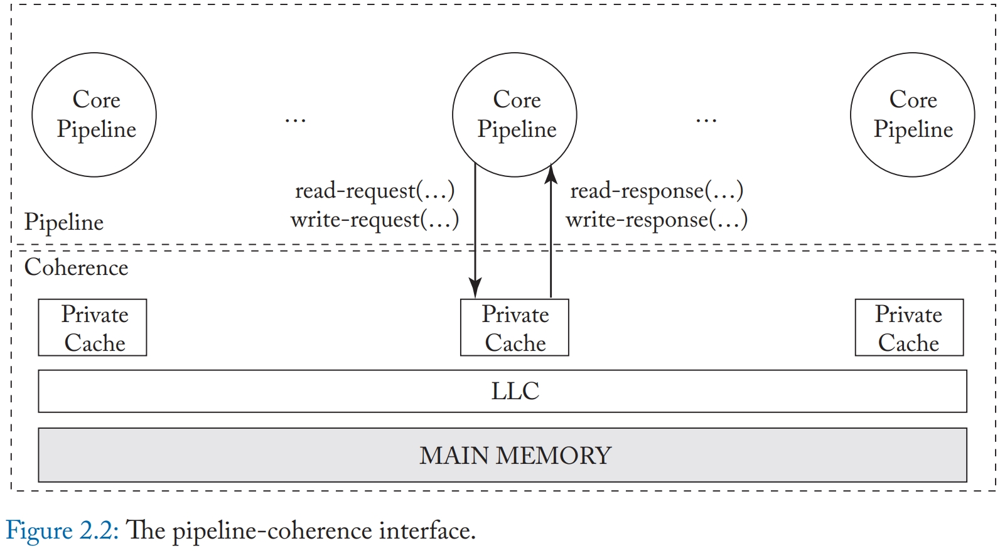

处理器内核通过连贯性接口（图 2.2）与连贯性协议交互，该接口提供两种方法：（1）读取请求方法，以内存位置作为参数并返回值； (2) 一种写入请求方法，它接受一个内存位置和一个（要写入的）值作为参数并返回一个确认。

文献中出现了许多连贯性协议，并在实际处理器中使用。 我们根据其连贯性接口的性质将这些协议分为两类——具体来说，是基于一致性模型中的连贯性是否清晰分离，或者它们是否不可分割。

**与一致性无关的连贯性** 

在第一类中，写入在返回之前对所有其他内核可见。 因为写入是同步传播的，所以第一类提供了一个与原子内存系统相同的接口（没有缓存）。 因此，任何与连贯性协议交互的子系统——例如，处理器核心流水线——都可以假设它正在与没有缓存的原子内存系统交互。 从一致性强制的角度来看，这种连贯性接口可以很好地分离关注点。 缓存连贯性协议将缓存完全抽象出来，并呈现出原子内存的错觉——就好像缓存被移除了，只有内存包含在连贯性框中（图 2.2）——而处理器核心流水线强制执行由一致性模型规范的顺序。
<!-- <font color=gray>个人理解：在这个系统中，write需要让所有其他核心感知到之后才会返回响应到CPU中，因此可以将Core和私有缓存看成是一个系统，这些系统与共享memory进行原子访存。这样内存一致性模型来仲裁多个cache coherence系统向共享内存的访存顺序，而Cache coherence则只需要保证上述的写入同步传播功能，不需要考虑一致性模型。</font> -->

**一致性导向的连贯性**

在第二个较新的类别中，写入是异步传播的——因此，写入可以在所有处理器可见之前返回，从而允许观察过时值（实时）。 但是，为了正确地强制执行一致性，此类中的连贯性协议必须确保写入最终可见的顺序符合一致性模型规定的排序规则。 回到图 2.2，流水线和连贯性协议都强制执行一致性模型规定的排序。 第二类是为了支持基于吞吐量的通用图形处理单元 (GP-GPU) 而出现的，并在本入门读物第一版出版后变得突出。

入门（以及本章的其余部分）重点介绍第一类连贯性协议。 我们在异构连贯性的背景下讨论第二类连贯性协议（第 10 章）。


### 2.4 （一致性无关的）连贯性不变量

连贯性协议必须满足哪些不变量才能使缓存不可见并呈现原子内存系统的抽象？

教科书和已发表的论文中出现了几种连贯性的定义，我们不希望呈现所有这些定义。 相反，我们提出了我们更喜欢的定义，因为它可以洞察连贯性协议的设计。 在侧边栏中，我们讨论了替代定义以及它们与我们首选定义的关系。

我们通过单写-多读（SWMR）不变量来定义连贯性。 对于任何给定的内存位置，在任何给定的时刻，要么有一个内核可以写入它（也可以读取它），要么有一些内核可以读取它。 因此，永远不会有一个给定的内存位置可以由一个内核写入并同时由任何其他内核读取或写入的情况。 查看此定义的另一种方法是考虑，对于每个内存位置，内存位置的生命周期被划分为多个时期。 在每个 epoch 中，要么单个内核具有读写访问权限，要么某些数量的内核（可能为零）具有只读访问权限。 图 2.3 说明了示例内存位置的生命周期，分为四个保持 SWMR 不变的时期。

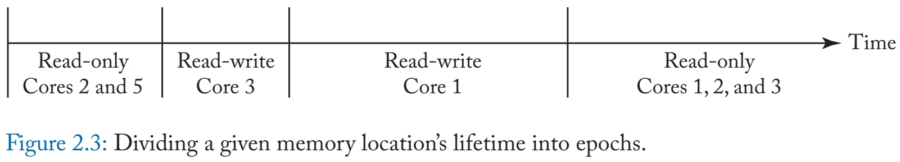

除了 SWMR 不变量之外，连贯性还要求正确传播给定内存位置的值。 为了解释为什么值很重要，让我们重新考虑图 2.3 中的示例。 即使 SWMR 不变量成立，如果在第一个只读时期内核 2 和 5 可以读取不同的值，那么系统是不连贯的。 类似地，如果 Core 1 在其读写 epoch 期间未能读取 Core 3 写入的最后一个值，或者 Core 1、2 或 3 中的任何一个未能读取 Core 1 在其读写期间执行的最后一次写入，则系统是不连贯的。

因此，连贯性的定义必须用一个数据值不变量来扩充 SWMR 不变量，该数据值不变量与值如何从一个时代传播到下一个时代有关。 这个不变量表明一个时期开始时内存位置的值与其最后一个读写时期结束时的内存位置值相同。

这些不变量还有其他等效的解释。 一个值得注意的例子是用标记(token)来解释 SMWR 不变量。 不变量如下。 对于每个内存位置，都存在至少与内核数量一样大的固定数量的令牌。 如果核心拥有所有令牌，则它可以写入内存位置。 如果一个内核有一个或多个令牌，它可以读取内存位置。 因此，在任何给定时间，一个内核不可能在任何其他内核正在读取或写入内存位置时写入内存位置。

> 连贯性不变量
> 1. 单写入、多读取 (SWMR) 不变。 对于任何内存位置 A，在任何给定时间，只有一个内核可以写入 A（也可以读取它）或某些数量的内核只能读取 A。
> 2. 数据值不变。 epoch 开始时的内存位置值与其上一个读写 epoch 结束时的内存位置值相同。

#### 2.4.1 保持连贯不变量

上一节中介绍的连贯性不变量提供了有关连贯性协议如何工作的一些直觉。绝大多数连贯性协议，称为“（使）无效协议”，都是明确设计来维护这些不变量的。如果一个内核想要读取一个内存位置，它会向其他内核发送消息以获取该内存位置的当前值，并确保没有其他内核在读写状态下缓存了该内存位置的副本。这些消息结束任何活动的读写纪元并开始只读纪元。如果一个核想写入一个内存位置，它会向其他核发送消息以获取该内存位置的当前值，如果它还没有一个有效的只读缓存副本，并确保没有其他核有以只读或读写状态缓存的内存位置副本。这些消息结束任何活动的读写或只读时期，并开始一个新的读写时期。本入门书关于缓存连贯性的章节（第 6-9 章）极大地扩展了对无效协议的抽象描述，但基本直觉保持不变。

#### 2.4.2 连贯性的粒度

内核可以以各种粒度执行加载和存储，通常范围从 1 到 64 字节。 理论上，连贯性可以在最精细的加载/存储粒度下执行。 然而，==在实践中，连贯性通常保持在缓存块的粒度上。== 也就是说，硬件在逐个缓存块的基础上强制执行连贯性。 在实践中，SWMR 不变量很可能是，对于任何内存块，要么有一个写入者，要么有一定数量的读取者。 在典型系统中，不可能一个内核写入块的第一个字节，而另一个内核写入该块内的另一个字节。 尽管缓存块粒度很常见，而且我们在本入门书的其余部分都假设它是这样，但应该注意，已经存在以更细和更粗粒度保持连贯性的协议。

> 侧边栏：连贯性的类一致性定义
> 我们首选的连贯性定义是从实现的角度定义的——指定关于不同内核对内存位置的访问权限和内核之间传递的数据值的硬件强制不变量。
> 存在另一类定义从程序员的角度定义连贯性，类似于内存一致性模型如何指定加载和存储的架构可见顺序。
> 指定一致性的一种类似一致性的方法与顺序一致性的定义有关。顺序一致性 (SC) 是我们在第 3 章中深入讨论的内存一致性模型，它指定系统必须以尊重每个线程的程序顺序的总顺序执行所有线程的加载和存储到所有内存位置.每次加载都获取该总顺序中最近存储的值。与 SC 的定义类似的连续性定义是，一个连续性系统必须以尊重每个线程的程序顺序的总顺序执行所有线程的加载和存储到单个内存位置。这个定义突出了文献中连续性和一致性之间的一个重要区别：连续性是在每个内存位置的基础上指定的，而一致性是针对所有内存位置指定的。值得注意的是，任何满足 SWMR 和数据值不变量（与不对任何特定位置的访问重新排序的管道相结合）的连续性协议也保证满足这种类似一致性的一致性定义。 （但是，反过来不一定正确。）
> 连贯性的另一个定义 [1, 2] 定义了具有两个不变量的连贯性：（1）每个存储最终都对所有内核可见，（2）对同一内存位置的写入被序列化（即，所有内核以相同的顺序观察 ）。 IBM 在 Power 架构中采用了类似的观点，部分是为了促进实现，其中一个内核的一系列存储可能已经到达某些内核（它们的值对这些内核的负载可见），但其他内核不可见。 不变量 2 等价于我们之前描述的类似一致性的定义。 与作为安全不变量（坏事不能发生）的不变量 2 不同，不变量 1 是活性不变量（好事最终必须发生）。
> 正如 Hennessy 和 Patterson [3] 所指定的，连贯性的另一个定义由三个不变量组成：(1) 一个内核对内存位置 A 的加载会获得该内核对 A 的先前存储的值，除非另一个内核已经存储了 到 A 之间； (2) 如果 S 和负载“在时间上充分分离”，并且如果 S 和负载之间没有发生其他存储，则到 A 的负载通过另一个核获得存储 S 到 A 的值； (3) 存储到相同内存位置的存储被序列化（与之前定义中的不变量 2 相同）。 与之前的定义一样，这组不变量同时捕获了安全性和活性。


```c++
// visual studio 2019

#include <iostream>
#include <thread>
#include <windows.h>
#include<ctime>

using namespace std;

namespace coh2 {
	class A
	{
	private:
		int *count;
		int size;
	public:
		A(int _size):size(_size)
		{
			count = new int[_size];

			memset(count, 0, size * sizeof(int));
		}
		~A()
		{
			delete []count;
		}
		void updateCount(int pos)
		{
			int id = GetCurrentThreadId();
			clock_t start, end;
			start = clock();
			if (pos < size)
			{
				for (int i = 0; i < 100000000; i++)
				{
					count[pos]++;
				}
			}
			end = clock();
			double endtime = (double)(end - start) / CLOCKS_PER_SEC;
			cout << "Thread id: " << id << "; Total time:" << endtime * 1000 << "ms" << endl;	//ms为单位
		}
		void printCount()
		{
			for (int i = 0; i < size; i++)
			{
				cout << "count[" << i << "] = " << count[i] << endl;
			}
		}		
	};
}


int main()
{

	// 对于同一个位置没有写入权限就会write miss，但是指令还是不会再等待执行了。对于不同位置，即使是同一个cacheline，也不会write miss，需要等待返回最新数据在执行写操作。
	// 为什么对于同一个地址的数据不设计成也等待write权限呢？
	// 下面程序输出结果显示了这一有意思的现象。可见同时对pos=0进行写操作，两次的时间存在很大的差异，这是因为第一次需要同步pos=1的结果。
	//Thread 1 id: 6976
	//Thread 2 id : 36480
	//Thread 3 id : 38760
	//Thread id : 38760; Total time : 2719ms
	//Thread id : 36480; Total time : 2750ms
	//Thread id : 6976; Total time : 2765ms
	//Thread 4 id : 34744
	//Thread 5 id : 35456
	//Thread 6 id : 39648
	//Thread id : 39648; Total time : 493ms
	//Thread id : 35456; Total time : 1672ms
	//Thread id : 34744; Total time : 1680ms

	using namespace coh2;
	A obj(32);
	thread trdObj1(&A::updateCount, &obj, 0);
	thread trdObj2(&A::updateCount, &obj, 0);
	thread trdObj3(&A::updateCount, &obj, 1);
	cout << "Thread 1 id: " << trdObj1.get_id() << endl;
	cout << "Thread 2 id: " << trdObj2.get_id() << endl;
	cout << "Thread 3 id: " << trdObj3.get_id() << endl;
	trdObj1.join();
	trdObj2.join();
	trdObj3.join();
	//obj.printCount();

	A obj2(32);		// 32 * sizeof(int) = 64 B, 2 cache blocks
	thread trdObj4(&A::updateCount, &obj2, 0);
	thread trdObj5(&A::updateCount, &obj2, 0);
	thread trdObj6(&A::updateCount, &obj2, 16);
	cout << "Thread 4 id: " << trdObj4.get_id() << endl;
	cout << "Thread 5 id: " << trdObj5.get_id() << endl;
	cout << "Thread 6 id: " << trdObj6.get_id() << endl;
	trdObj4.join();
	trdObj5.join();
	trdObj6.join();
	//obj2.printCount();
	return 0;
}
```



```c++ {.line-numbers}
// g++-7.5
/*************************************************************************
	> File Name: src/consistency.cpp
	> Author: Wang Zongwu
	> Mail: wangzongwu@outlook.com
	> Created Time: Wed 21 Sep 2022 08:27:19 AM CST
  # Description: 这个比较有意思的是当开启-Og优化时，cache coherence的开销基本上没有了。但是如果注释掉第49~51行的cout，cache coherence反而开始体现出一些，建议使用默认优化等级进行测试Cache coherence开销。
  ***********************************************************************/
#include <iostream>
#include <thread>
#include <vector>
#include <time.h>

using namespace std;

int *counter = new int[1024];

void updateCounter(int position) {
	for (int i = 0; i < 100000000; ++i) {
		counter[position] = counter[position] + 8;
	}
}


int main(int argc, char **argv) {
	vector<int> nums;
	if (argv[1][0] == '0') {
		nums = {0, 1, 2, 3};
	} else if (argv[1][0] == '1') {
		nums = {16, 32, 48, 64};
	//} else if (argv[1][0] = '2') {
		//nums = {0, 1024, 2048, 3072};
	} else {
		nums = {0, 1, 2, 3};
	}

	vector<thread> threads(nums.size());
	clock_t start, end;
	start = clock();
	for (int i = 0; i < nums.size(); ++i) {
		threads[i] = thread(updateCounter, nums[i]);
	}

	for (auto &t : threads) {
		t.join();
	}
	end = clock();
	cout << end -start << endl;
	for (int i = 0; i < nums.size(); ++i) {
		cout << nums[i] << " " << counter[nums[i]] << endl;
	}

	return 0;
}
```


#### 2.4.3 连贯性何时相关？

连贯性的定义——无论我们选择哪种定义——只在某些情况下相关，架构师必须意识到它什么时候适用，什么时候不适用。 我们现在讨论两个重要的问题。

- 连贯性适用于所有保存来自共享地址空间的块的存储结构。 这些结构包括 L1 数据缓存、L2 缓存、共享末级缓存 (LLC) 和主存储器。 这些结构还包括 L1 指令缓存和翻译后备缓冲区 (TLB)。
- 连贯性对程序员来说不是直接可见的。 相反，处理器流水线和连贯性协议共同强制执行一致性模型——并且只有一致性模型对程序员可见。

## 3 内存一致性动机和顺序一致性

本章深入研究了内存一致性模型（也称为内存模型），这些模型为程序员和实现者定义了共享内存系统的行为。 这些模型定义了正确性，以便程序员知道期望什么，实现者知道提供什么。 我们首先激发需要定义内存行为（第 3.1 节），说明内存一致性模型应该做什么（第 3.2 节），并比较和对比一致性和连贯性（第 3.3 节）。

然后我们探索（相对）直观的顺序一致性（SC）模型。SC很重要，因为它是许多程序员对共享内存的期望，并为理解接下来两章中介绍的更宽松（弱）内存一致性模型提供了基础。我们首先介绍SC的基本思想（第 3.4 节），并介绍它的形式体系，我们也将在后续章节（第 3.5 节）中使用它。然后我们讨论SC的实现，从用作操作模型的简单实现开始（第 3.6 节）、具有缓存连贯性的SC的基本实现（第 3.7 节）、具有缓存连贯性的 SC 的更优化实现（第 3.8 节），以及实现原子操作（第 3.9 节）。我们通过提供MIPS R10000案例研究（第 3.10 节）并指向一些进一步阅读（第 3.11 节）来结束对SC的讨论。

### 3.1 共享内存行为的问题

要了解为什么必须定义共享内存行为，请考虑表 3.1 中描述的两个内核(Let "core" refer to software's view of a core, which may be an actual core or a thread context of a multithreaded core.)的示例执行。（这个例子和本章所有例子一样，假设所有变量的初始值都是零。）大多数程序员都希望核心C2的寄存器r2应该得到值NEW。尽管如此，在当今的某些计算机系统中，r2可以为0。

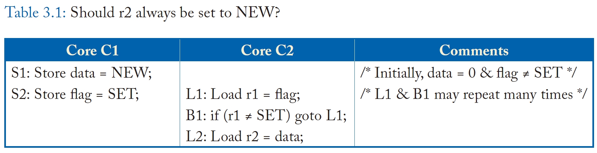

硬件可以通过对核心 C1 的存储 S1 和 S2 重新排序来使 r2 获得值 0。 在本地（即，如果我们只看 C1 的执行而不考虑与其他线程的交互），这种重新排序似乎是正确的，因为 S1 和 S2 访问不同的地址。第 18 页的边栏描述了硬件可能会重新排序内存访问的一些方式，包括这些存储。不是硬件专家的读者可能希望相信这种重新排序会发生（例如，使用不是先进先出的写缓冲区）。

将S1和S2重新排序后，执行顺序可能是S2、L1、L2、S1，如表3.2所示。

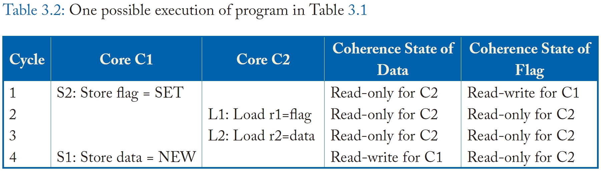

> **侧边栏：内核如何重新排序内存访问**
> 这个侧边栏描述了现代内核可以将内存访问重新排序到不同地址的一些方式。 那些不熟悉这些硬件概念的人可能希望在第一次阅读时跳过这一部分。 现代内核可能会对许多内存访问进行重新排序，但足以推理对两个内存操作进行重新排序。 在大多数情况下，我们只需要推理内核将两个内存操作重新排序到两个不同的地址，因为顺序执行（即冯诺依曼）模型通常要求对同一地址的操作按原始程序顺序执行。 我们根据重新排序的内存操作是加载还是存储将可能的重新排序分为三种情况。
> **Store-store重新排序:** 如果一个内核有一个非FIFO写缓冲区，允许存储以与它们进入的顺序不同的顺序离开，则两个存储可能会被重新排序。如果第一个存储在缓存中未命中而第二个命中，或者如果第二个存储可以与较早的存储（即在第一个存储之前）合并，则可能会发生这种情况。请注意，即使内核按程序顺序执行所有指令，这些重新排序也是可能的。将存储重新排序到不同的内存地址对单线程执行没有影响。然而，在表 3.1的多线程示例中，重新排序Core C1的存储允许Core C2在看到存储到数据之前看到标记为SET。请注意，即使写入缓冲区排入完全一致的内存层次结构，问题也没有解决。Coherence 将使所有缓存不可见，但存储已经重新排序。
> **Load-load重新排序:** 现代动态调度内核可能会不按程序顺序执行指令。在表 3.1的示例中，Core C2可以乱序执行负载L1和L2。仅考虑单线程执行，这种重新排序似乎是安全的，因为L1和L2指向不同的地址。但是，重新排序Core C2的负载与重新排序Core C1的存储的行为相同；如果内存引用按照L2、S1、S2和L1的顺序执行，则r2被赋值为0。如果分支语句B1被省略，则这种情况更加合理，因此没有控制依赖将L1和L2分开。
> **Load-store和store-load重新排序:** 乱序内核还可以从同一线程重新排序加载和存储（到不同地址）。将较早的加载与较晚的存储重新排序（加载-存储重新排序）会导致许多不正确的行为，例如在释放保护它的锁后加载值（如果存储是解锁操作）。表 3.3中的示例说明了对较早的存储重新排序后加载（存储加载重新排序）的效果。重新排序核心C1的访问S1和L1以及核心C2的访问S2和L2允许违反直觉的结果，即r1和r2都是0。请注意，存储加载重新排序也可能由于普遍实现的FIFO写缓冲区中的本地旁路而出现，即使使用 按程序顺序执行所有指令的核心。
> 读者可能会假设硬件不应该允许这些行为中的一些或全部，但是如果没有更好地理解允许哪些行为，就很难确定硬件可以做什么和不能做什么的列表。

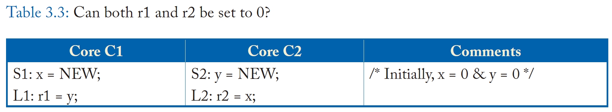

这个执行满足连贯性，因为没有违反SWMR属性，所以不连贯性不是这个看似错误的执行结果的根本原因。

让我们考虑另一个受Dekker算法启发的重要示例，用于确保互斥，如表 3.3所示。执行后，r1和r2中允许什么值？直觉上，人们可能会认为存在三种可能性：

- $(r1, r2) = (0, NEW)$ for execution S1, L1, S2, then L2
- $(r1, r2) = (NEW, 0)$ for S2, L2, S1, and L1
- $(r1, r2) = (NEW, NEW)$ e.g., for S1, S2, L1, and L2

令人惊讶的是，大多数真实的硬件，例如来自Intel和AMD的x86系统，也允许$(r1, r2) = (0, 0)$，因为它使用先进先出(FIFO)写入缓冲区来提高性能，<font color=blue>因为写缓冲的存在，store指令会立即commit，但其实还没有写入cache中，此时虽然执行的指令是Store -> Load，但最终的效果是Load执行是Store的数据还在写缓冲中，表现为Load -> Store。</font>与表 3.1中的示例一样，即使$(r1, r2) = (0, 0)$，所有这些执行都满足缓存一致性。


```c++
// Ubuntu 20.04.4 LTS
// Intel(R) Xeon(R) Gold 6230 CPU @ 2.10GHz
// 重复执行10000次可以发现输出都为0
#include <iostream>
#include <thread>
#include <cstring>

using namespace std;

namespace coh3 {
	class A
	{
	private:
		int *data;
	public:
		A(){
			data = new int[1024];
			memset(data, 0, 1024 * sizeof(int));
		}
		~A()
		{
			delete []data;
		}
		void updateData(int pos1, int pos2)
		{			
			data[pos1] = 100;
			data[pos1+16] = data[pos2];
		}
		int get_data(int pos)
		{
			return data[pos];
		}
	};
}

int main(int argc, char **argv)
{
	using namespace coh3;
	
	A obj;
	thread trdObj1(&A::updateData, &obj, 0, 512);
	thread trdObj2(&A::updateData, &obj, 512, 0);

	trdObj1.join();
	trdObj2.join();
	if ( (obj.get_data(16) == 0) && (obj.get_data(528) == 0) )
	{
		printf("data[%d] = %d; data[%d] = %d\n", 16, obj.get_data(16), 528, obj.get_data(528));
	}


	return 0;
}
```


一些读者可能会反对这个例子，因为它是不确定的（允许多个结果）并且可能是一个令人困惑的编程习惯用法。然而，首先，所有当前的多处理器默认情况下都是不确定的；我们知道的所有架构都允许并发线程的执行有多种可能的交错。决定论的错觉有时（但并非总是）由具有适当同步习语的软件创建。因此，我们在定义共享内存行为时必须考虑非确定性。

此外，内存行为通常是为所有程序的所有执行定义的，即使是那些不正确或故意微妙的（例如，对于非阻塞同步算法）。然而，在第5章中，我们将看到一些高级语言模型，它们允许某些执行具有未定义的行为，例如，执行具有数据竞争的程序。

### 3.2 什么是内存一致性模型？

上一小节中的示例说明了共享内存行为是微妙的，它为精确定义提供了价值: (a) 程序员可以预期的行为，以及 (b) 系统实现者可以使用的优化。内存一致性模型消除了这些问题的歧义。

内存一致性模型，或者更简单地说，内存模型，是对共享内存执行的多线程程序的允许行为的规范。对于使用特定输入数据执行的多线程程序，它指定动态负载可能返回的值。与单线程执行不同，通常允许多个正确的行为。

通常，内存一致性模型MC给出了将执行划分为服从MC（MC执行）和不服从MC（非MC执行）的规则。执行的这种划分反过来又划分了实现。MC实现是只允许MC执行的系统，而非MC实现有时允许非MC执行。

最后，我们对编程的级别一直含糊其辞。我们首先假设程序是硬件指令集架构中的可执行文件，并且我们假设内存访问是对由物理地址标识的内存位置（即，我们没有考虑虚拟内存和地址转换的影响）。在第5章中，我们将讨论高级语言(HLL)的问题。例如，我们将看到，例如，编译器将变量分配给寄存器会以类似于硬件重新排序内存引用的方式影响HLL内存模型。

### 3.3 一致性 VS. 连贯性

第2章使用我们在这里非正式地重复的两个不变量定义了缓存连贯性。SWMR不变量确保在任何时间对于具有给定地址的内存位置，要么 (a) 一个内核可以写入（和读取）该地址，要么 (b) 零个或多个内核只能读取它。数据值不变量确保正确传递对内存位置的更新，以便内存位置的缓存副本始终包含最新版本。

似乎缓存连贯性定义了共享内存行为，但是它没有。正如我们从图 3.1 中看到的，连贯性协议只是为处理器核心流水线提供了一个内存系统的抽象，它本身无法确定共享内存行为；流水线也很重要，例如，如果流水线以与程序顺序相反的顺序重新排序并将内存操作呈现给连贯性协议——即使连贯性协议正确地完成了它的工作——共享内存的正确性可能无法保证。

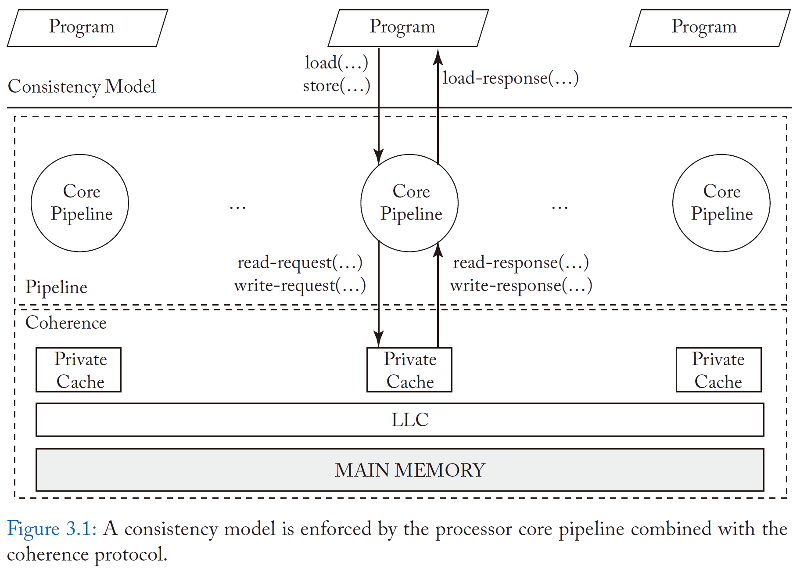

总之：

- 缓存连贯性不等于内存一致性。
- 内存一致性实现可以将缓存连贯性用作有用的“黑匣子”。

### 3.4 顺序一致性 (SC) 的基本思想

可以说最直观的内存一致性模型是SC。它首先由Lamport[12]形式化，如果“执行的结果与按照程序指定的顺序执行操作相同”，他将其称之为单处理器（核心）顺序。然后，如果“任何执行的结果都与所有处理器（内核）的操作按某种顺序执行相同，并且每个单独的处理器（内核）的操作以其程序指定的顺序出现。”，则称之为多处理器顺序一致。这种操作的总顺序称为内存顺序。在SC中，内存顺序尊重每个内核的程序顺序，但其他一致性模型可能允许不总是遵守程序顺序的内存顺序。

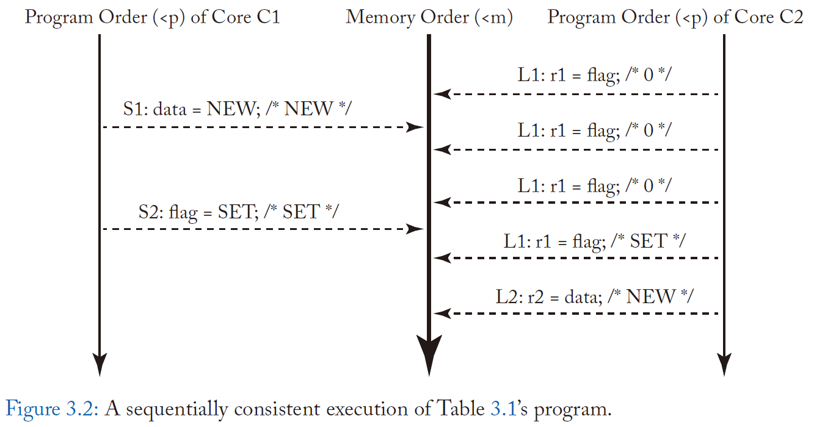

图 3.2 描述了表 3.1 中示例程序的执行。中间垂直向下的箭头表示内存顺序$(<m)$，而每个内核的向下箭头表示其程序顺序$(<p)$。我们使用运算符$<m$表示内存顺序，因此$op1\ <m\ op2$意味着$op1$在内存顺序中先于$op2$。类似地，我们使用运算符$<p$来表示给定内核的程序顺序，因此$op1\ <p\ op2$意味着$op1$在该内核的程序顺序中先于$op2$。在SC下，内存顺序尊重每个内核的程序顺序。“尊重”意味着$op1\ <p\ op2$意味着$op1\ <m\ op2$。注释中的值$(/* ... */)$给出加载或存储的值。此执行以$r2$为NEW终止。更一般地，表 3.1 程序的所有执行都以$r2$作为NEW终止。唯一的不确定性——L1在加载一次SET值之前加载标记为0的次数——但这并不重要。

这个例子说明了SC的价值。在第 3.1 节中，如果您期望r2必须是NEW，那么您可能是在独立发明SC，尽管不如Lamport精确。

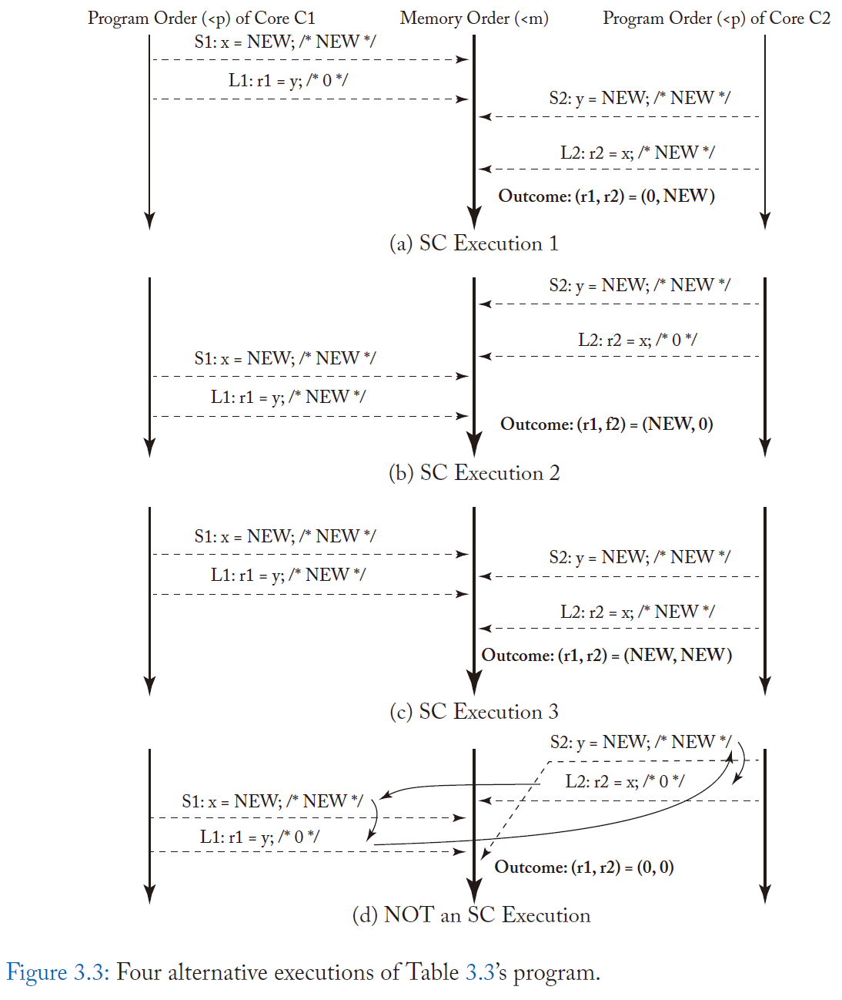

SC的价值在图 3.3中进一步显示，它说明了表 3.3中程序的四种执行。图 3.3(a-c)描述了对应于三个直观输出的SC执行：(r1, r2) = (0, NEW)、(NEW, 0) 或 (NEW, NEW)。请注意，图 3.3(c) 仅描述了导致 (r1, r2) = (NEW, NEW) 的四种可能的 SC 执行之一；本次执行为{S1,S2,L1,L2}，其他为{S1,S2,L2,L1},{S2,S1,L1,L2},{S2,S1,L2,L1}。因此，在图 3.3(a-c)中，有六个合法的SC执行。

图 3.3d显示了对应于输出 (r1, r2) = (0, 0) 的非SC执行。对于此输出，无法创建遵守程序顺序的内存顺序。程序顺序规定：

- $S1\ <p\ L1$
- $S2\ <p\ L2$

但内存顺序规定：

- $L1\ <m\ S2$ (so r1 is 0)
- $L2\ <m\ S1$ (so r2 is 0)

遵守所有这些约束会导致循环，这与总顺序不一致。图 3.3d 中额外的弧线说明了循环。

我们刚刚看到了六种SC执行和一种非SC执行。这可以帮助我们理解SC实现：SC实现必须允许前六种执行中的一个或多个，但不能允许第七种执行。

### 3.5 一点SC形式化

在本节中，我们将更精确地定义 SC，特别是为了让我们能够在接下来的两章中将 SC 与较弱的一致性模型进行比较。我们采用 Weaver 和 Germond [20] 的形式主义——一种指定一致性的公理方法，我们将在第 11 章中详细讨论——使用以下符号：L(a) 和 S(a) 分别表示加载和存储地址 a，顺序$<p$和$<m$分别定义程序和全局内存顺序。程序顺序$<p$是每个内核的总顺序，它捕获每个内核逻辑（顺序）执行内存操作的顺序。全局内存顺序$<m$是所有内核的内存操作的总顺序。

SC 执行需要以下内容。

(1) 所有内核都将它们的加载和存储插入到顺序$<m$中，尊重它们的程序顺序，无论它们是相同的还是不同的地址（即，$a=b$或$a\neq b$）。 有四种情况：

- If $L(a)\ <p\ L(b)\ \Rightarrow L(a)\ <m\ L(b)$ $/*Load \rightarrow Load*/$
- If $L(a)\ <p\ S(b)\ \Rightarrow L(a)\ <m\ S(b)$ $/*Load \rightarrow Store*/$
- If $S(a)\ <p\ S(b)\ \Rightarrow S(a)\ <m\ S(b)$ $/*Store \rightarrow Store*/$
- If $S(a)\ <p\ L(b)\ \Rightarrow S(a)\ <m\ L(b)$ $/*Store \rightarrow Load*/$

(2) 每个加载从它之前的最后一个存储（按全局内存顺序）获取其值到相同的地址：

$$L(a) = MAX_{<m}\{S(a)|S(a)\ <m\ L(a)\}$$

其中$MAX_{<m}$表示“最新的内存顺序”。

我们在第 3.9 节中更深入地讨论的原子读-修改-写 (RMW) 指令进一步限制了允许的执行。 例如，test-and-set指令的每次执行都要求测试的加载和置位的存储在内存顺序中逻辑上连续出现（即，没有其他相同或不同地址的内存操作插入它们之间）。

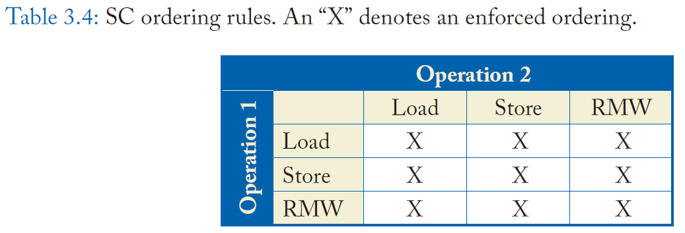

我们在表 3.4 中总结了 SC 的顺序要求。 该表指定一致性模型强制执行哪些程序排序。 例如，如果给定线程在存储之前按程序顺序有一个加载（即，加载是“操作 1”，存储是表中的“操作 2”），那么该交点处的表条目是“X ”，表示这些操作必须按程序顺序执行。 对于 SC，所有内存操作都必须按照程序顺序执行； 在我们在接下来的两章中研究的其他一致性模型下，其中一些排序约束是放宽的（即，它们的排序表中的某些条目不包含“X”）。

SC实现只允许SC执行。严格来说，这是SC实现的安全属性（无害）。SC实现也应该有一些活性属性（做一些更好）。具体来说，store必须最终对反复尝试load该位置的load可见。此属性称为最终写入传播，通常由连贯性协议确保。更一般地说，避免饥饿和一些公平也是有价值的，但这些问题超出了本讨论的范围。

### 3.6 简单的 SC 实现

SC 允许两个简单的实现，可以更容易地理解 SC 允许哪些执行。

**多任务单处理器**

首先，可以通过在单个顺序内核（单处理器）上执行所有线程来为多线程用户级软件实现SC。线程T1的指令在核心C1上执行，直到上下文切换到线程T2等。在上下文切换时，任何挂起的内存操作都必须在切换到新线程之前完成。因为每个线程在其量程中的指令都作为一个原子块执行（并且因为单处理器正确地遵守内存相关性），所以所有 SC 规则都被强制执行。

**开关**

其次，可以使用一组核心C、单个交换机和内存来实现SC，如图 3.4所示。假设每个内核按其程序顺序一次一个地向交换机提供内存操作。每个内核都可以使用任何不影响其向交换机呈现内存操作的顺序的优化。例如，可以使用带有分支预测的简单的五级有序流水线。

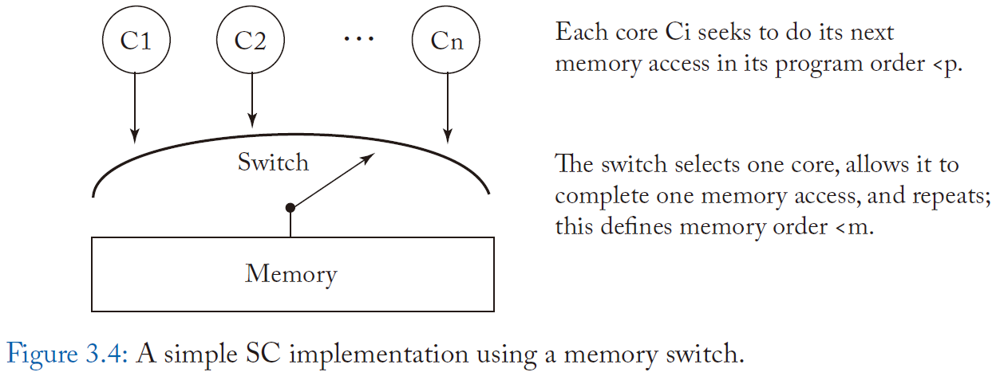

接下来假设交换机选择一个内核，允许内存完全满足加载或存储，并且只要存在请求就重复此过程。交换机可以通过任何方法（例如，随机）挑选内核，该方法不会不响应就绪请求的内核。该实现在操作上通过构造实现了SC。

**评估**

这些实现的好消息是它们提供了定义 (1) 允许 SC 执行和 (2) SC 实现“黄金标准”的操作模型。（在第 11 章中，我们将看到此类操作模型可用于形式化指定一致性模型。）切换实现还可以作为存在性证明，证明SC可以在没有缓存或一致性的情况下实现。

当然，坏消息是这些实现的性能不会随着内核数量的增加而增加，因为在第一种情况下使用单个内核和在第二种情况下使用单个交换机/内存的顺序瓶颈。这些瓶颈导致一些人错误地得出结论，即SC排除了真正的并行执行。它不会，正如我们接下来将看到的。

### 3.7 具有缓存连贯性的基本 SC 实现

缓存连贯性促进了 SC 实现，这些实现可以完全并行地执行无冲突的加载和存储——如果两个操作指向相同的地址并且其中至少一个是存储，则它们会发生冲突。 此外，创建这样的系统在概念上很简单。

在这里，我们主要将连贯性视为实现第 2 章 SWMR 不变量的黑盒。我们通过稍微打开连贯性块框以显示简单的一级 (L1) 缓存来提供一些实现直觉：

- 使用状态修改 (M) 表示一个内核可以读写的 L1 块，
- 使用状态共享 (S) 表示一个或多个内核只能读取的 L1 块，以及
- GetM 和 GetS 分别表示在 M 和 S 中获取块的连贯性请求。

我们不需要深入了解如何实现连贯性，这些将在第 6 章及以后讨论。

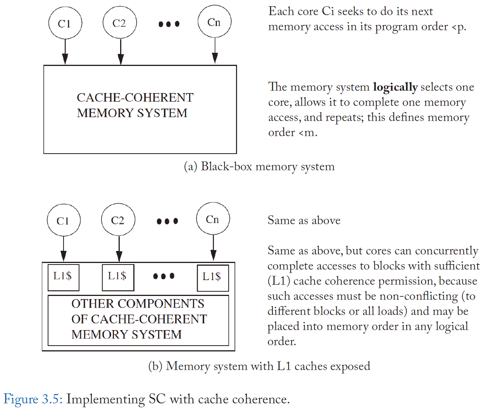

图 3.5a描绘了图 3.4的模型，其中开关和内存被缓存连贯的内存系统取代，表示为黑盒。每个内核按其程序顺序一次一个地向高速缓存一致性存储器系统提供存储器操作。内存系统在开始对同一内核的下一个请求之前完全满足每个请求。

图 3.5b 稍微“打开”了内存系统黑匣子，显示每个内核都连接到自己的 L1 缓存（我们将在后面讨论多线程）。 如果内存系统具有适当的B的连贯性权限（状态 M 或 S 用于加载，M 用于存储），则内存系统可以响应加载或存储block B。此外，只要相应的L1缓存具有适当的权限，内存系统就可以并行响应来自不同内核的请求。例如，图 3.6a描述了四个内核每个都试图执行内存操作之前的缓存状态。这四个操作不冲突，可以由各自的L1缓存满足，因此可以并发进行。如图 3.6b所示，我们可以任意排序这些操作以获得合法的SC执行模型。更一般地说，==L1缓存可以满足的操作总是可以并发完成，因为连贯性的SWMR不变量确保它们不冲突。== (连贯性保证在符合memory consistency的情况下实现并行性，这也是私有缓存加入的好处之一)

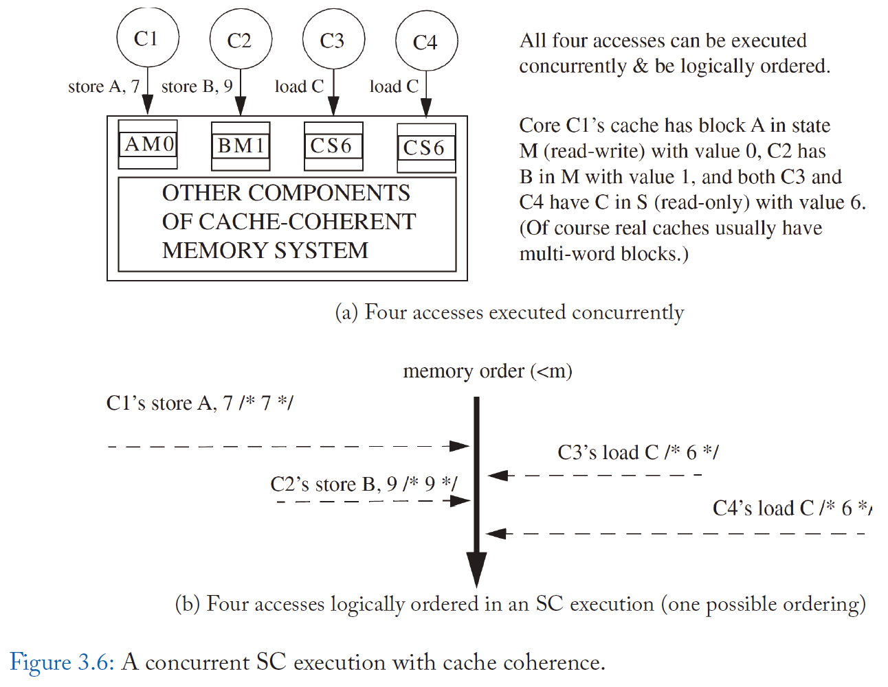

**评估**

我们已经创建了一个 SC 的实现：

- 充分利用缓存的延迟和带宽优势，
- 与它使用的缓存连贯性协议一样可扩展，并且
- 将实现核心的复杂性与实现连贯性分离开来。

### 3.8 使用缓存一致性优化 SC 实现

大多数真正的核心实现比我们具有缓存连贯性的基本 SC 实现更复杂。 内核采用预取、推测执行和多线程等功能来提高性能并容忍内存访问延迟。 这些特性与内存接口交互，我们现在讨论这些特性如何影响 SC 的实现。 值得记住的是，任何特性或优化都是合法的，只要它不产生违反 SC 的最终结果（负载返回的值）。

**非绑定预取**

Block B 的非绑定预取是对连贯性存储系统的请求，以更改一个或多个缓存中 B 的一致性状态。 最常见的是，软件、核心硬件或缓存硬件请求预取以更改一级缓存中 B 的状态以允许加载（例如，B 的状态为 M 或 S）或加载和存储（B 的状态为 M） 发出连贯性请求，例如GetS和GetM。重要的是，在任何情况下，非绑定预取都不会改变块 B 中寄存器或数据的状态。非绑定预取的影响仅限于图 3.5a的“缓存连贯存储系统”块，使得非绑定预取的内存一致性模型在功能上等同于no-op。只要加载和存储按程序顺序执行，以什么顺序获得连贯性权限并不重要。

实现可以在不影响内存一致性模型的情况下进行非绑定预取。 这对于内部缓存预取（例如，流缓冲区）和更激进的内核都很有用。

**投机核心**

考虑一个内核，它按程序顺序执行指令，但也进行分支预测，其中包括加载和存储在内的后续指令开始执行，但可能会因分支错误预测而被压缩（即，使其影响无效）。这些压缩的加载和存储可以看起来像非绑定预取，使这种推测是正确的，因为它对 SC 没有影响。分支预测后的加载可以呈现给 L1 缓存，其中它要么未命中（导致非绑定 GetS 预取），要么命中然后将值返回到寄存器。如果负载被压缩，内核会丢弃寄存器更新，从负载中擦除任何功能影响——就好像它从未发生过一样。缓存不会撤消非绑定预取，因为这样做不是必需的，如果重新执行加载，则预取块可以帮助提高性能。对于存储，内核可能会提前发出非绑定 GetM 预取，但在保证提交存储之前，它不会将存储呈现给缓存。

> **闪回测验问题1：** 在保持顺序一致性的系统中，核心必须按程序顺序发出一致性请求。 对或错？
> **回答：** 错！ 核心可以以任何顺序发出一致性请求。

**动态调度的内核**

许多现代内核按照程序顺序动态调度指令执行，以实现比必须以严格程序顺序执行指令的静态调度内核更高的性能。使用动态或乱序（程序）调度的单核处理器必须简单地在程序中强制执行真正的数据依赖性。但是，在多核处理器环境中，动态调度引入了一个新问题：内存一致性推测。考虑一个内核，它希望动态重新排序两个Load的执行，L1和L2（例如，因为L2的地址在L1的地址之前计算）。许多内核会在L1之前推测性地执行L2，并且他们预测这种重新排序对其他内核不可见，这将违反SC。
> ==Load乱序导致内存顺序不服从程序顺序，如果这两个乱序对其他core不产生影响，那么也不会引发问题，但实际上SC已经违例了。以下两种检测方案感觉实现起来比较复杂，现在的CPU中有可能是使用弱一致性模型而不会进行这一检测。==

推测SC需要核心验证预测是否正确。Gharachorloo等人提出了两种执行这种检查的技术。首先，在内核推测性地执行L2之后，但在提交L2之前，内核可以检查推测性访问的块是否没有离开缓存。 只要块保留在缓存中，它的值就不会在加载执行和提交之间发生变化。为了执行此检查，内核会跟踪L2加载的地址，并将其与驱逐的块和传入的连贯性请求进行比较。传入的GetM表示另一个内核可能会无序观察L2，而此GetM将暗示错误推测并压制推测执行。

第二种检查技术是在内核准备好提交加载时重放每个推测加载。如果提交时加载的值不等于之前推测加载的值，则预测不正确。在该示例中，如果L2的重放加载值与L2的原始加载值不同，则加载-加载重新排序导致了明显不同的执行，必须压制推测执行。

**动态调度内核中的非绑定预取**

动态调度的内核可能会遇到程序顺序之外的加载和存储未命中。例如，假设程序顺序是加载A，存储B，然后是存储C。核心可以“乱序”启动非绑定预取，例如，先是GetM C，然后是并行的GetS A和GetM B。SC不受非绑定预取顺序的影响。SC只要求内核的加载和存储（似乎）按程序顺序访问其一级缓存。连贯性要求一级缓存块处于适当的状态以接收加载和存储。

重要的是，SC（或任何其他内存一致性模型）：

- 规定了加载和存储（似乎）应用于连贯存储的顺序，但
- 不规定连贯性活动的顺序

> **闪回测验问题 2：** 内存一致性模型指定了连贯性事务的合法顺序。 对或错？
> **答案：** 错！

> 个人小结: 由于缓存连贯性的保证，将私有内存与共享内存合并成一个连贯性系统，因此图3.5b中的系统等效于图3.5a甚至是单共享内存系统，在连贯性私有内存中进行任何操作，只要CPU不发送访存请求，都不会影响一致性。

**多线程**

SC 实现可以适应多线程——粗粒度、细粒度或同时进行。每个多线程内核应该在逻辑上等同于多个（虚拟）内核，通过一个开关共享每个一级缓存，缓存选择下一个要服务的虚拟内核。此外，每个缓存实际上可以同时服务多个非冲突请求，因为它可以假装它们是按某种顺序服务的。一个挑战是确保在store对其他内核上的线程“可见”之前，线程T1无法读取同一内核上另一个线程T2写入的值。因此，虽然线程T1可以在线程T2按内存顺序插入store时立即读取该值（例如，通过将其写入状态M中的缓存块），但它无法从处理器核心的共享加载存储队列中读取该值。

> **侧边栏：高级 SC 优化**
> 此边栏描述了一些高级 SC 优化。
TODO:

### 3.9 SC 的原子操作

为了编写多线程代码，程序员需要能够同步线程，这种同步通常涉及原子地执行成对的操作。 此功能由原子地执行“读-修改-写”(RMW) 的指令提供，例如众所周知的“test-and-set”、“fetch-and-increment”和“compare-and-swap”。这些原子指令对于正确同步至关重要，用于实现自旋锁和其他同步原语。对于自旋锁，程序员可能会使用 RMW 原子地读取锁的值是否已解锁（例如，等于 0）并写入锁定的值（例如，等于 1）。 要使RMW 具有原子性，RMW 的读取（加载）和写入（存储）操作必须按照SC 所需的操作总顺序连续出现。

在微架构中实现原子指令在概念上很简单，但幼稚的设计会导致原子指令的性能不佳。 实现原子指令的正确但简单的方法是让内核有效地锁定内存系统（即防止其他内核发出内存访问）并对内存执行读取、修改和写入操作。 这种实现虽然正确且直观，但牺牲了性能。

更积极的 RMW 实现利用了 SC 只需要所有请求的总顺序出现的洞察力。 因此，原子 RMW 可以通过首先让核心获取其缓存中处于状态 M 的块来实现，如果该块尚未处于该状态。 然后，内核只需要在其缓存中加载和存储块——没有任何连贯性消息或总线锁定——只要它等待为块的任何传入连贯性请求提供服务，直到存储之后。这种等待不会有死锁的风险，因为可以保证存储完成。==是锁定对这个block的一致性请求吗？具体怎么实现的呢？因为本身已经获取了M状态，如果不是放M状态，其他核心不进行一致性请求，则认为无法获取到最新副本，即使是没有进行修改，因此无法发送对这个block的读或写。==

> **闪回测验问题 3：** 要执行原子读-修改-写指令（例如，test-and-set），一个内核必须始终与其他内核通信。 对或错？
> **答案：** 错！

更优化的 RMW 实现可以在加载部分和存储部分执行之间允许更多时间，而不会违反原子性。考虑块在缓存中处于只读状态的情况，RMW 的加载部分可以立即推测执行，而缓存控制器发出连贯性请求以将块的状态升级为读写。当块在读写状态下获得时，RMW的写部分执行。只要核心能保持原子性的假象，这种实现就是正确的。为了检查原子性的错觉是否保持，内核必须检查加载的块是否从加载部分和存储部分之间的缓存中驱逐；这种推测支持与检测SC中的错误推测所需的支持相同（第 3.8 节）。==这种相当于是在不发生冲突的时候，RMW当作普通的读写指令执行，但是如果在load之后，但是在获取M状态之前，其他核也产生了Read请求，是不是会破坏原子性呢？虽然跟上面的SC模型相比，两个线程之间的内存interleaving顺序不同，但是两个程序的顺序还是相同的，不违反SC模型。如果在Load和获取M状态之前，其他核对数据进行了改动，此时由于当前core中数据为S状态，其他core需要改写势必要Invalidate当前核中的数据，因此可以通过上述的检测数据是否换出来决定是否满足原子性。但是这种方案比较激进，如果产生冲突就需要错误恢复。==

### 3.10 综合起来：MIPS R10000

MIPS R10000为推测微处理器提供了一个古老但干净的商业示例，该微处理器与缓存一致的存储器层次结构合作实现SC。在此，我们专注于R10000与实现内存一致性相关的方面。

R10000 是具有分支预测和乱序执行功能的四路超标量RISC处理器内核。该芯片支持L1指令和L1数据的回写缓存，以及到（片外）统一L2缓存的专用接口。

该芯片的主系统接口总线支持多达四个处理器的缓存连贯性，如图 3.7 所示（改编自 Yeager中的图 1）。 为了构建具有更多处理器的基于 R10000 的系统，例如 SGI Origin 2000（在第 8.8.1 节中详细讨论），架构师实现了一个目录连贯性协议，该协议通过系统接口总线和专用集线器芯片连接 R10000 处理器。 在这两种情况下，R10000 处理器内核都看到了一个连贯存储系统，该系统恰好部分在片上，部分在片外。

在执行期间，R10000 核心发射（推测性）按程序顺序加载和存储到地址队列中。加载从它之前的最后一个存储中获取一个（推测）值到相同的地址，或者如果没有，则从数据缓存获取。按程序顺序加载和存储提交，然后删除它们的地址队列条目。要提交存储，L1 缓存必须将块保存在状态 M 中，并且存储的值必须与提交一起以原子方式写入。

重要的是，在地址队列中包含加载地址的缓存块的逐出（由于连贯性无效或为另一个块腾出空间）会压缩加载和所有后续指令，然后重新执行。 因此，当加载最终提交时，加载的块在执行和提交之间一直在缓存中，因此它必须获得与在提交时执行时相同的值。 由于存储实际上是在提交时写入缓存，因此 R10000 在逻辑上按程序顺序将加载和存储呈现给连贯内存系统，从而实现 SC，如前所述。

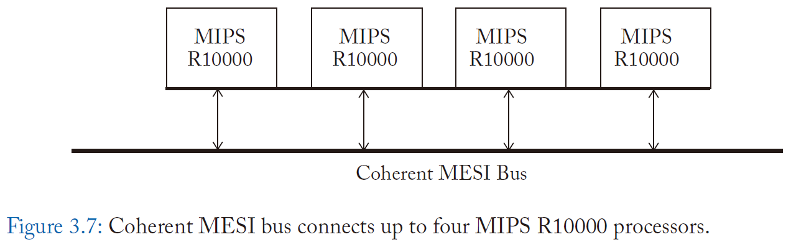

### 3.11 关于 SC 的进一步阅读

下面我们重点介绍围绕 SC 的大量文献中的一些论文。

Lamport[12]定义了SC。据我们所知，Meixner和Sorin[15]是第一个证明内核按程序顺序加载和存储到高速缓存连贯存储器系统的系统足以实现SC，即使这个结果在一段时间内被直觉地相信。

SC 可以与数据库的可序列化性进行比较 [10]。 这两个概念的相似之处在于它们都坚持认为来自所有实体的操作似乎以串行顺序影响共享状态。这些概念因操作和共享状态的性质和期望而异。 对于 SC，每个操作都是对假定不会失败的易失性状态（内存）的单个内存访问。 有了可串行化，每个操作都是一个数据库上的事务，可以读写多个数据库实体，并且应该遵守 ACID 属性：原子性(Atomic)——即使失败也全有或全无； 一致(Consistent)——保持数据库一致； 隔离(Isolated)——不受并发事务的影响； 和持久(Durable)——效果在崩溃和断电中仍然存在。

我们遵循 Lamport 和 SPARC 来定义所有内存访问的总顺序。 虽然这可以减轻某些人的直觉，但这不是必需的。 回想一下，如果两个访问来自不同的线程，访问相同的位置，并且至少一个是存储（或 RMW），则它们会发生冲突。 正如 Shasha 和 Snir [18] 所开创的那样，人们可以只定义冲突访问的约束而不是全序，而让非冲突访问无序。 这种观点对于第 5 章的宽松模型尤其有价值。

最后，一个警示故事。我们在前面（第 3.7 节）说过，检查推测执行的加载是否可能被无序观察的一种方法是记住加载推测读取的值 A 并在提交时提交加载，是否内存位置具有相同的值 A. Martin 等人[14]表明，对于执行价值预测的核心而言，情况并非如此 [13]。通过值预测，当负载执行时，核心可以推测其值。考虑一个推测块 X 的负载将产生值 A 的核心，尽管该值实际上是 B。在核心推测 X 的负载和它在提交时重放负载之间，另一个核心将块 X 的值更改为A. 内核然后在提交时重放负载，比较两个相等的值，并错误地确定推测是正确的。如果系统以这种方式进行推测，则它可能违反 SC。这种情况类似于所谓的ABA问题(http://en.wikipedia.org/wiki/ABA_problem)，Martin等人表明有一些方法可以在存在价值预测的情况下检查推测，以避免违反一致性的可能性（例如，通过重播依赖于最初推测的负载的所有负载）。本次讨论的重点不是深入研究这个特定极端情况或其解决方案的细节，而是说服您证明您的实施是正确的，而不是依靠直觉。

## 4 Total Store Order 和 x86 内存模型

一个广泛实现的内存一致性模型是总存储顺序 (TSO)。TSO最初由SPARC引入，更重要的是，它似乎与广泛使用的x86架构的内存一致性模型相匹配。RISC-V还支持TSO扩展RVTSO，部分是为了帮助移植最初为x86或SPARC架构编写的代码。本章使用类似于前一章顺序一致性的模式来介绍这个重要的一致性模型。我们首先通过指出SC的局限性来激励TSO/x86（第4.1节）。然后，在更正式地描述它之前（第4.3节），我们以直观的级别（第4.2节）介绍TSO/x86，解释系统如何实现TSO/x86，包括原子指令和用于强制指令之间排序的指令（第4.4节）。我们最后讨论了其他资源，以了解更多有关TSO/x86（第4.5节）的信息并比较TSO/x86和SC（第4.6节）。

### 4.1 TSO / X86 的动机

处理器内核长期以来一直使用写（存储）缓冲区来保存已提交（退休）的存储，直到内存系统的其余部分可以处理这些存储。当存储提交时，存储进入写缓冲区，当要写入的块在缓存中处于读写一致性状态时，存储退出写缓冲区。值得一提的是，在缓存获得要写入块的读写一致性权限之前，存储可以进入写缓冲区；因此，写缓冲区隐藏了为存储未命中提供服务的延迟。由于store很常见，因此能够避免在大多数store中停滞不前是一个重要的好处。此外，不停止内核似乎是明智的，因为内核不需要任何东西，因为存储试图更新内存而不是内核状态。

对于单核处理器，即使对A的一个或多个存储在写入缓冲区中，也可以通过确保地址A的加载将最近存储的值返回给A，从而使写入缓冲区在架构上不可见。这通常是通过将最近存储到A的值绕过到从A加载的值来完成的，其中“最近”由程序顺序确定，或者如果对A的存储在写入缓冲区中，则停止加载A.

在构建多核处理器时，使用多个内核似乎很自然，每个内核都有自己的旁路写缓冲区，并假设写缓冲区在架构上仍然不可见。

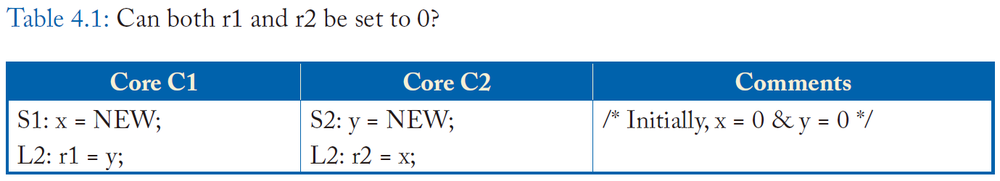

这个假设是错误的。考虑表4.1中的示例代码（与上一章的表3.3相同）。假设多核处理器具有有序内核，其中每个内核都有一个单项写入缓冲区，并按以下顺序执行代码。

- 核心C1执行存储S1，但在其写入缓冲区中缓冲新存储的NEW值。
- 同样，核心 C2 执行存储 S2 并将新存储的 NEW 值保存在其写入缓冲区中。
- 接下来，两个内核执行各自的负载 L1 和 L2，并获得旧值 0。
- 最后，两个内核的写入缓冲区都使用新存储的值 NEW 更新内存。

最终结果是$(r1, r2) = (0, 0)$。正如我们在上一章中看到的，这是一个SC禁止的执行结果。没有写缓冲区，硬件是SC，但有写缓冲区，它不是，这使得写缓冲区在多核处理器中在架构上可见。

对写入缓冲区可见的一种反应是关闭它们，但由于潜在的性能影响，供应商一直不愿意这样做。 另一种选择是使用积极的、推测性的 SC 实现，使写入缓冲区再次不可见，但这样做会增加复杂性，并且会浪费检测违规和处理错误推测的能力。

SPARC 和后来的 x86 选择的选项是放弃 SC，转而支持另一种内存一致性模型TSO，该模型允许在每个内核直接使用先进先出 (FIFO) 写入缓冲区。 新模型 TSO 允许结果“(r1, r2) = (0, 0)”。 这个模型让一些人感到惊讶，但事实证明，对于大多数编程习语来说，它的行为类似于 SC，并且在所有情况下都得到了很好的定义。

### 4.2 TSO/X86 的基本理念

随着执行的进行，SC 要求每个内核为所有四种连续操作组合保留其加载和存储的程序顺序：

- Load -> Load
- Load -> Store
- Store -> Store
- Store -> Load /\*include for SC but omitted for TSO\*/

TSO包括前三个约束，但不包括第四个。对于大多数程序来说，这种省略并不重要。表4.2重复了上一章表3.1的示例程序。在这种情况下，TSO允许与SC相同的执行，因为TSO保留了核心C1的两个存储和核心C2的两个（或更多）加载的顺序。图 4.1（与上一章的图 3.2 相同）说明了该程序的执行情况。

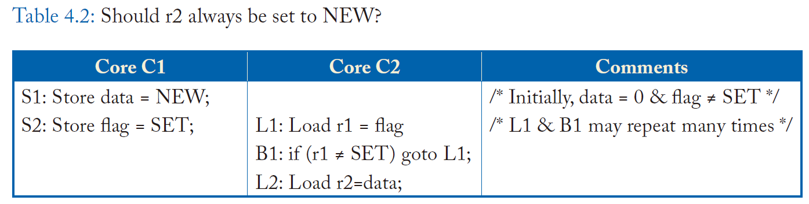

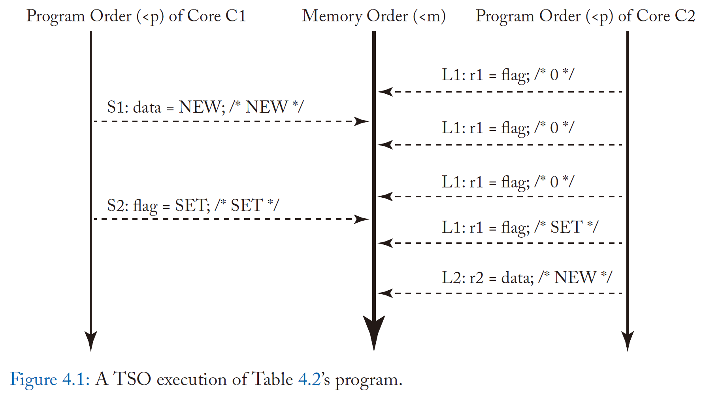


更一般地，对于以下常见的编程习语，TSO 的行为与 SC 相同：

- C1 加载并存储到内存位置 D1、... . ., Dn（通常是数据），
- C1 存储到 F（通常是一个同步标志）表示上述工作完成，
- C2 从 F 加载以观察上述工作是否完成（有时先自旋，经常使用 RMW 指令），以及
- C2 加载并存储到部分或全部存储位置 D1、... . ., DN。

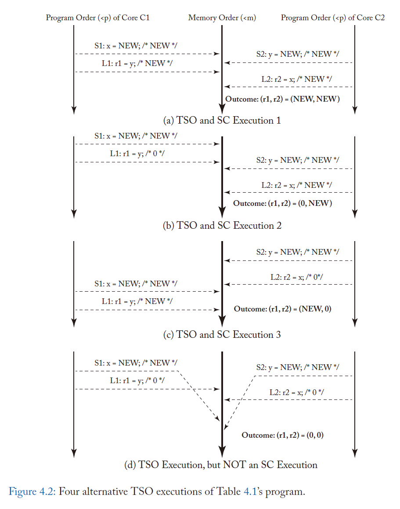

然而，TSO允许一些非SC执行。在TSO下，表 4.1（重复上一章的表 3.3）中的程序允许图 4.2中描述的所有四种结果。在SC下，只有前三个是合法结果（如上一章的图 3.3所示）。图 4.2d中的执行说明了符合TSO但不遵守第四个（即Store -> Load）约束而违反SC的执行。省略第四个约束允许每个内核使用写缓冲区。请注意，第三个约束意味着写缓冲区必须是FIFO（而不是，例如，合并）以保持存储 - 存储顺序。

程序员（或编译器）可以通过在内核 C1 的 S1 和 L1 之间以及内核 C2 的 S2 和 L2 之间插入 FENCE 指令来阻止图 4.2d 中的执行。 在核心 Ci 上执行 FENCE 可确保在 FENCE 之前的 Ci 的内存操作（按程序顺序）在 FENCE 之后的 Ci 的内存操作之前按内存顺序放置。 FENCE（又名内存屏障）很少被使用 TSO 的程序员使用，因为 TSO 对大多数程序“做正确的事”。 尽管如此，FENCEs 在下一章讨论的宽松模型中扮演着重要的角色。

TSO确实允许一些非直观的执行结果。表 4.3说明了表 4.1中程序的修改版本，其中内核C1和C2分别制作x和y的本地副本。许多程序员可能会假设如果r2和r4都等于0，那么r1和r3也应该是0，因为必须在加载L2和L4之后将存储S1和S2插入到内存顺序中。但是，图 4.3说明了一个执行，其中r1和r3绕过了每核写入缓冲区中的NEW值。事实上，为了保持单线程顺序语义，每个内核都必须按照程序顺序查看自己存储的效果，即使其他内核尚未观察到该存储。因此，在所有TSO执行下，本地副本r1和r3将始终设置为NEW值。

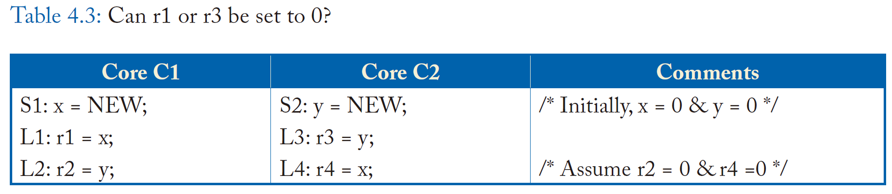

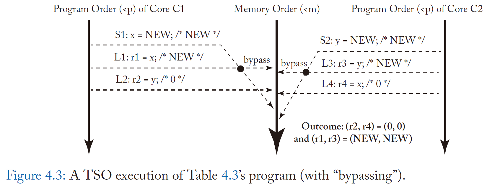

### 4.3 一点 TSO/X86 形式主义

在本节中，我们使用仅对第 3.5 节的 SC 定义进行三处更改的定义来更精确地定义 TSO。

**TSO执行**需要以下内容:

1. 所有核心都将它们的加载和存储插入到内存顺序$<m$中，并尊重它们的程序顺序，无论它们是位于相同还是不同的地址（即 a==b 或 a!=b）。有四种情况：
   - If $L(a)\ <p\ L(b)\ \Rightarrow \ L(a)\ <m\ L(b)$ /\*Load -> Load\*/
   - If $L(a)\ <p\ S(b)\ \Rightarrow \ L(a)\ <m\ S(b)$ /\*Load -> Store\*/
   - If $S(a)\ <p\ S(b)\ \Rightarrow \ S(a)\ <m\ S(b)$ /\*Store -> Store\*/
   - ~~If S(a) <p L(b) $\Rightarrow$ S(a) <m L(b)/\*Store -> Load\*//*Change 1: Enable FIFO Write Buffer\*/~~

	===考虑到write buffer中的写合并，第三条是不是也不满足？==

2. 每次加载都从它之前的最后一个存储获取它的值到相同的地址：

   - ~~Value of L(a) = Value of MAX<sub><m</sub>{S(a) <m L(a)}~~/\*Change 2: Need Bypassing\*/
   - Value of L(a) = Value of MAX<sub><m</sub>{S(a) <m L(a) **or S(a) <p L(a)**}

   最后一个令人费解的等式表示，加载的值是最后一次存储到相同地址的值，该地址：(a) 要么在内存顺序中位于之前，(b) 要么在程序顺序中位于之前（但可能在程序顺序中之后） 内存顺序），选项（b）优先（即，写缓冲区绕过覆盖内存系统的其余部分）。

3. 必须扩充第 (1) 部分以定义 FENCE：/\*Change 3: FENCEs Order Everything\*/

   - If L(a) <p FENCE $\Rightarrow$ L(a) <m FENCE /\*Load -> FENCE\*/
   - If S(a) <p FENCE $\Rightarrow$ S(a) <m FENCE /\*Store -> FENCE\*/
   - If FENCE <p FENCE $\Rightarrow$ FENCE <m FENCE /\*FENCE -> FENCE\*/
   - If FENCE <p L(a) $\Rightarrow$ FENCE <m L(a) /\*FENCE -> Load\*/
   - If FENCE <p S(a) $\Rightarrow$ FENCE <m S(a) /\*FENCE -> Store\*/

   因为TSO已经需要除了Store -> Load顺序之外的所有顺序，所以可以将TSO FENCEs定义为仅顺序：

   - If S(a) <p FENCE $\Rightarrow$ S(a) <m FENCE /\*Store -> FENCE\*/
   - If FENCE <p L(a) $\Rightarrow$ FENCE <m L(a) /\*FENCE -> Load\*/

	即TSO模型只需要在S和L之间插入Fench。

我们在表 4.4中总结了TSO的排序规则。该表与SC的类似表（表 3.4）有两个重要区别。首先，如果操作 #1 是一个存储，而操作 #2 是一个加载，那么该交叉点的条目是“B”而不是“X”；如果这些操作都在同一个地址上，即使这些操作进入内存顺序而不是程序顺序，负载也必须获得刚刚存储的值。其次，该表包括FENCE，这在SC中是不必要的；SC系统的行为就像在每次操作之前和之后已经有一个FENCE一样。

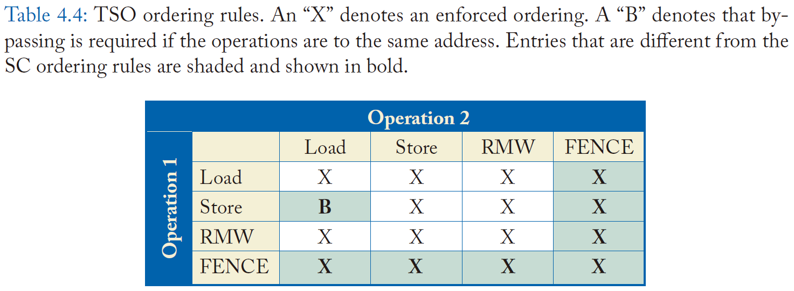

人们普遍认为 x86 内存模型等同于 TSO（用于普通可缓存内存和普通指令），但据我们所知，AMD 和 Intel 都没有保证这一点，也没有发布正式的 x86 内存模型规范。 AMD 和英特尔通过示例和散文公开定义了 x86 内存模型，该过程在 Sewell 等人的第 2 节中得到了很好的总结。所有的例子都符合 TSO，所有的散文似乎都符合 TSO。 只有当 x86 内存模型的公开正式描述可用时，才能证明这种等价性。 如果反例显示 TSO 不允许 x86 执行、x86 不允许 TSO 执行或两者兼而有之，则这种等价性可能会被推翻。

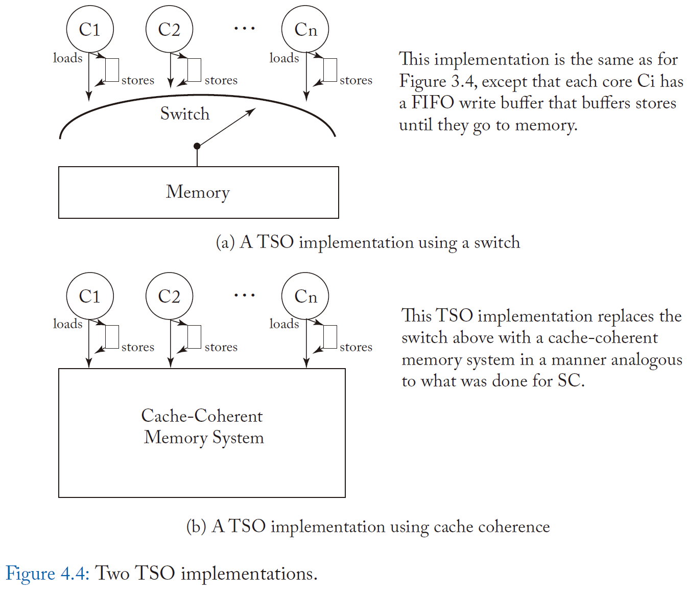

### 4.4 实施 TSO / X86

TSO/x86 的实现故事类似于 SC，增加了每核 FIFO 写缓冲区。 图 4.4a 更新了图 3.4 的开关以适应 TSO 并如下操作。

- 加载和存储使每个内核按照该内核的程序顺序 <p.
- 负载要么绕过写缓冲区中的值，要么像以前一样等待切换。
- 如果缓冲区已满，则存储进入 FIFO 写缓冲区的尾部或停止内核。
- 当交换机选择核心 Ci 时，它执行下一个加载或在写缓冲区的头部存储。
  
在第 3.7 节中，我们展示了，对于 SC，开关可以由缓存一致的内存系统代替，然后论证内核可以是推测性和/或多线程的，并且非绑定预取可以由内核、缓存或软件启动。

如图 4.4b 所示，相同的论点适用于 TSO，在每个内核和缓存一致性内存系统之间插入一个 FIFO 写入器缓冲区。 因此，除了写缓冲区之外，所有先前的 SC 实现讨论都适用于 TSO，并提供了一种构建 TSO 实现的方法。 此外，大多数当前的 TSO 实现似乎只使用上述方法：采用 SC 实现并插入写入缓冲区。

关于写缓冲区，关于推测内核如何实现它们的文献和产品空间超出了本章的范围。 例如，微体系结构可以物理地组合存储队列（未提交的存储）和写入缓冲区（提交的存储），和/或物理地分离加载和存储队列。

最后，多线程为 TSO 引入了一个微妙的写缓冲区问题。 TSO 写入缓冲区在逻辑上是每个线程上下文（虚拟核心）私有的。 因此，在多线程内核上，一个线程上下文不应该绕过另一个线程上下文的写缓冲区。 这种逻辑分离可以通过每个线程上下文写入缓冲区来实现，或者更常见的是，通过使用共享写入缓冲区来实现，其中条目由线程上下文标识符标记，仅当标签匹配时才允许绕过。

> **闪回测验问题 4：** 在具有多线程内核的 TSO 系统中，线程可能会绕过写入缓冲区中的值，而不管哪个线程写入了该值。 对或错？
> **回答：** 错！ 一个线程可能会绕过它已写入的值，但其他线程可能无法看到该值，直到将存储插入到内存顺序中。

#### 4.4.1 执行原子指令

TSO 中原子 RMW 指令的实现问题与 SC 中原子指令的实现问题类似。 主要区别在于 TSO 允许加载通过（即，在之前排序）已写入写入缓冲区的较早存储。 对 RMW 的影响是“写”（即存储）可能会写入写缓冲区。

为了理解 TSO 中原子 RMW 的实现，我们将 RMW 视为紧随Load的store。

由于TSO的排序规则，RMW的Load部分不能旁路早期的Load。乍一看，RMW的Load部分可能会传递写入缓冲区中较早的Store，但这是不合法的。如果RMW的Load部分旁路较早的Strore，则RMW的Store部分也必须旁路较早的Store，因为RMW是原子对。但是因为在TSO中stores是不允许互相旁路的，所以RMW的load部分也不能传递一个更早的store。

这些对RMW的排序限制会影响实现。因为RMW的Load部分在更早的Store被执行（即退出写缓冲区）之前无法执行，原子RMW在它可以执行RMW的Load部分之前有效地耗尽了写缓冲区。此外，为了确保Store部分可以在Load部分之后立即执行，Load部分需要读写一致性权限，而不仅仅是足以满足正常加载的读取权限。最后，为了保证RMW的原子性，缓存控制器可能不会放弃对加载和存储之间块的一致性权限。

更优化的RMW实现是可能的。例如，写缓冲区不需要排空，只要 (a) 已经在写缓冲区中的每个条目在缓存中都具有读写权限，并在RMW提交之前保持缓存中的读写权限，并且 (b) 内核执行MIPS R10000式的Load推测检查（第3.8节）。从逻辑上讲，所有较早的存储和加载都将在RMW之前作为一个单元（有时称为“块”）提交。

#### 4.4.2 实现FENCE

支持TSO的系统不提供存储和后续（按程序顺序）加载之间的排序，尽管它们确实需要加载以获取较早存储的值。在程序员希望对这些指令进行排序的情况下，程序员必须通过在存储和后续加载之间放置一条FENCE指令来明确指定该顺序。FENCE的语义规定，程序顺序中FENCE之前的所有指令必须在程序顺序中FENCE之后的任何指令之前排序。
对于支持TSO的系统，FENCE因此禁止Load绕过较早的存储。在表 4.5中，我们重新审视了表 4.1中的示例，但我们添加了两个之前没有出现的FENCE指令。如果没有这些FENCE，两个负载（L1和L2）可以绕过两个存储（S1和S2），从而导致r1和r2都设置为零的执行。添加的FENCE禁止重新排序，因此禁止执行。
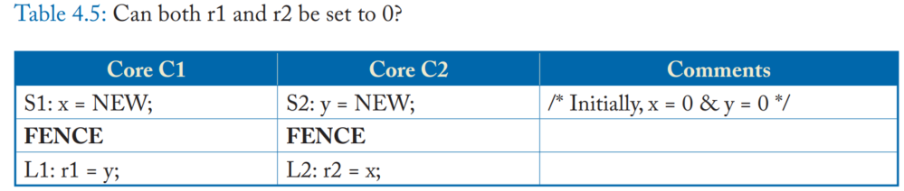

因为TSO只允许一种类型的重新排序，所以FENCE相当少见，并且FENCE指令的实现不是太关键。一个简单的实现（例如在执行FENCE时排空写入缓冲区，并且在较早的FENCE提交之前不允许后续加载执行）可能会提供可接受的性能。

然而，对于允许更多重新排序的一致性模型（在下一章中讨论），FENCE指令更频繁，它们的实现会对性能产生重大影响。

> 侧边栏：非推测性 TSO 优化
TODO:

### 4.5 关于 TSO 的进一步阅读

Collier[2]通过一个模型描述了替代的内存一致性模型，包括IBM System/370的模型，其中每个内核都有一个完整的内存副本，它的Load从本地副本读取，它的写入根据一些定义模型的限制更新所有副本。
如果使用此模型定义TSO，每个存储将立即写入其自己核心的内存副本，然后可能稍后一起更新所有其他内存。

Goodman[7]公开讨论了处理器一致性(PC)的概念，其中一个核心的存储按顺序到达其他核心，但不一定在同一“时间”到达其他核心。Gharachorloo等人[5]更精确地定义PC。TSO和x86-TSO是PC的特殊情况，其中每个内核都会立即看到自己的存储区，而当任何其他内核看到一个存储区时，所有其他内核都会看到它。这个属性在下一章（5.5 节）中称为写原子性。

据我们所知，TSO首先由Sindhu等人正式定义[16]。如第4.3节所述，Sewell等人[9, 14, 15]提出并形式化了x86-TSO模型，该模型看起来与AMD和Intel x86文档和当前实现一致。

### 4.6 比较SC和TSO

现在我们已经看到了两个内存一致性模型，我们可以比较它们。 SC、TSO 等如何关联？

- 执行：SC 执行是 TSO 执行的适当子集； 所有 SC 执行都是 TSO 执行，而一些 TSO 执行是 SC 执行，而有些则不是。 参见图 4.5a 中的维恩图。
- 实现：实现遵循相同的规则：SC 实现是 TSO 实现的适当子集。 见图 4.5b，与图 4.5a 相同。

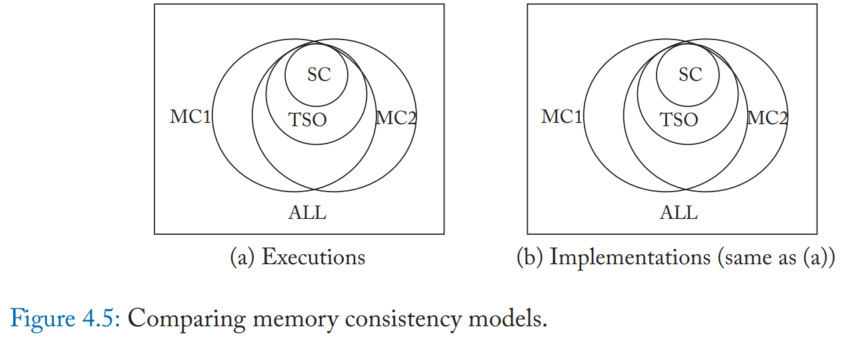

更一般地，如果所有X执行也是Y执行，则内存一致性模型Y比内存一致性模型X严格更宽松（弱），但反之则不然。如果Y比X更宽松，那么所有X实现也是Y实现。也有可能两个内存一致性模型无法比较，因为两者都允许执行被另一个排除。

如图4.5所示，TSO比SC更宽松，但比无与伦比的模型MC1和MC2更宽松。在下一章中，我们将看到MC1和MC2的候选，包括IBM Power内存一致性模型的案例研究。

**什么是好的内存一致性模型？**

一个好的内存一致性模型应该具备Sarita Adve的3Ps[1]加上我们的第四个P：

- 可编程性：一个好的模型应该（相对）容易地编写多线程程序。 该模型对大多数用户来说应该是直观的，即使是那些没有阅读细节的人。 它应该是精确的，以便专家可以推动允许的范围。
- 性能：一个好的模型应该以合理的功耗、成本等促进高性能实现。它应该为实现者提供广泛的选择余地。
- 可移植性：一个好的模型将被广泛采用或至少提供向后兼容性或模型之间转换的能力。
- 精度：一个好的模型应该被精确定义，通常用数学来定义。 自然语言太模棱两可，以至于专家无法突破允许的范围。

**SC和TSO有多好？**

使用这些 4P：

- 可编程性：SC是最直观的。TSO很接近，因为它的作用类似于常见编程习惯的SC。 然而，微妙的非SC执行可能会迫害程序员和工具作者。
- 性能：对于简单的内核，TSO 可以提供比 SC 更好的性能，但可以通过推测来缩小差异。
- 可移植性：SC 被广泛理解，而 TSO 被广泛采用。
- 精确：正式定义了 SC 和 TSO。

底线是 SC 和 TSO 非常接近，尤其是与下一章讨论的更复杂和更宽松的内存一致性模型相比。

## 5 宽松的内存一致性

前两章探讨了内存一致性模型顺序一致性（SC）和总存储顺序（TSO）。 这些章节介绍了直观的 SC 和广泛实施的 TSO（例如，在 x86 中）。 这两种模型有时都被称为强一致性，因为每个模型的全局内存顺序通常尊重（保留）每个线程的程序顺序。 回想一下，对于加载和存储的所有四种组合（加载->加载、加载->存储、存储->存储和存储->加载），SC 保留来自同一线程的两个内存操作的顺序，而 TSO 保留前三个顺序但不保证存储->加载顺序。

本章研究了更宽松（弱）的内存一致性模型，这些模型试图只保留程序员“需要”的顺序。 这种方法的主要好处是，通过允许更多的硬件和软件（编译器和运行时系统）优化，强制更少的排序约束可以促进更高的性能。主要缺点是，当“需要”排序时，宽松模型必须形式化，并为程序员或低级软件提供将这种排序传达给实现的机制，并且供应商未能就单一的宽松模型达成一致，从而损害了可移植性。

对宽松一致性模型的全面探索超出了本章的范围。 相反，本章是一本入门书，旨在提供基本的直觉并帮助读者了解对这些模型的简单理解的局限性。 特别是，我们提供了宽松模型的动机（第 5.1 节），提出并形式化了一个示例宽松一致性模型 XC（第 5.2 节），讨论了 XC 的实现，包括原子指令和用于强制排序的指令（第 5.3 节），介绍了顺序 无数据竞争程序的一致性（第 5.4 节），介绍其他宽松模型概念（第 5.5 节），介绍 RISC-V 和 IBM Power 内存模型案例研究（第 5.6 节），指向进一步阅读和其他商业模型（第 5.5 节） 5.7），比较模型（第 5.8 节），并触及高级语言记忆模型（第 5.9 节）。

### 5.1 动机

正如我们很快将看到的，掌握宽松的一致性模型可能比理解 SC 和 TSO 更具挑战性。 这些缺点引出了一个问题：为什么要使用宽松的模型呢？ 在本节中，我们展示宽松一致性模型的动机，首先通过展示程序员不关心指令顺序的一些常见情况（第 5.1.1 节），然后讨论在不强制执行不必要的顺序时可以利用的一些优化（ 第 5.1.2 节）。

#### 5.1.1 重新排序内存操作的机会

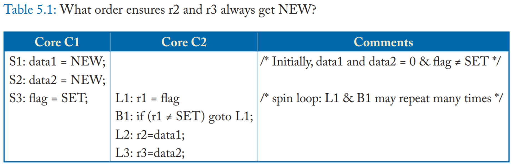

考虑表 5.1 中描述的示例。 大多数程序员会期望 r2 总是得到值 NEW，因为 S1 在 S3 之前，而 S3 在加载值 SET 的 L1 的动态实例之前，它在 L2 之前。 我们可以这样表示：

- S1 -> S3 -> L1 loads SET -> L1.

类似地，大多数程序员会期望 r3 总是得到值 NEW，因为：

- S2 -> S3 -> L1 loads SET -> L3

除了上面这两个预期的订单，SC 和 TSO 还需要订单 S1 -> S2和L2 -> L3。保留这些额外的顺序可能会限制实现优化以提高性能，但程序不需要这些额外的顺序来进行正确操作。

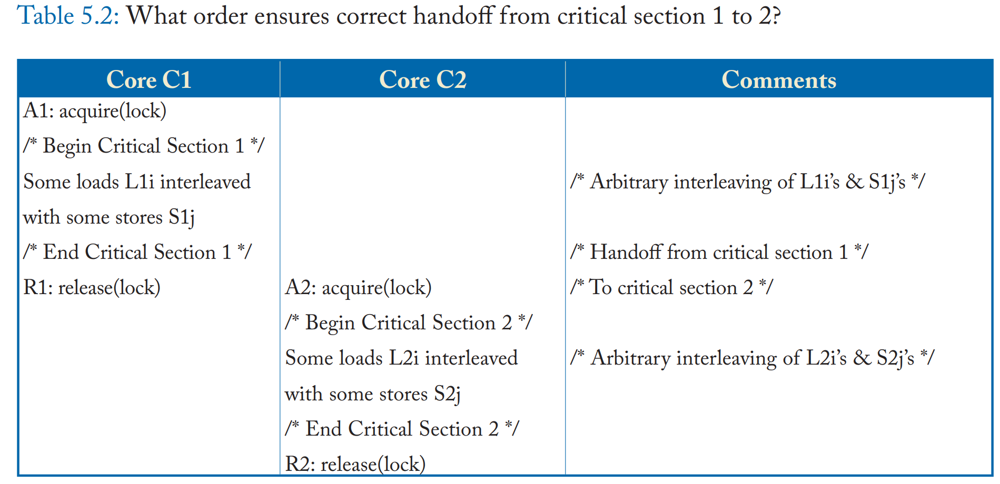

表 5.2 描述了使用相同锁在两个关键部分之间进行切换的更一般情况。假设硬件支持锁获取（例如，使用 test-and-set 执行 read-modify-write 并循环直到成功）和锁释放（例如，存储值 0）。 让核心 C1 获取锁，执行临界区 1，任意交错加载 (L1i) 和存储 (S1j)，然后释放锁。类似地，让核心 C2 执行关键部分 2，包括负载 (L2i) 和存储 (S2j) 的任意交错。

从临界区 1 到临界区 2 的切换的正确操作取决于这些操作的顺序：

- All L1i, All S1j -> R1 -> A2 -> All L2i, All S2j,

其中逗号 (“,”) 分隔未指定顺序的操作。

正确的操作不依赖于每个临界区中加载和存储的任何顺序——除非操作是针对相同的地址（在这种情况下需要排序以保持处理器顺序）。 那是：

- All L1i and S1j can be in any order with respect to each other, and
- All L2i and S2j can be in any order with respect to each other.

如果正确的操作不依赖于许多加载和存储之间的顺序，也许可以通过放宽它们之间的顺序来获得更高的性能，因为加载和存储通常比锁获取和释放要频繁得多。 这就是松弛或弱模型所做的。

#### 5.1.2 利用重新排序的机会

现在假设一个宽松的内存一致性模型，它允许我们重新排序任何内存操作，除非它们之间存在 FENCE。 这种宽松的模型迫使程序员推断需要对哪些操作进行排序，这是一个缺点，但它也启用了许多可以提高性能的优化。 我们讨论了一些常见且重要的优化，但对该主题的深入处理超出了本入门的范围。

**非 FIFO，合并写入缓冲区**

回想一下，TSO 支持使用 FIFO 写入缓冲区，它通过隐藏提交存储的部分或全部延迟来提高性能。 尽管 FIFO 写入缓冲区提高了性能，但更优化的设计将使用允许合并写入的非 FIFO 写入缓冲区（即，在程序顺序上不连续的两个存储可以写入写入缓冲区中的同一条目）。 但是，非 FIFO 合并写入缓冲区通常违反 TSO，因为 TSO 要求存储按程序顺序出现。 我们的示例宽松模型允许存储在非 FIFO 写入缓冲区中合并，只要存储没有被 FENCE 分隔。

**更简单地支持核心推测**

在具有强一致性模型的系统中，核心可能会在准备好提交之前推测性地执行超出程序顺序的负载。回想一下支持 SC 的 MIPS R10000 内核如何使用这种推测来获得比没有推测的幼稚实现更好的性能。然而，问题是支持 SC 的推测核心通常必须包含检查推测是否正确的机制，即使错误推测很少见 [15, 21]。 R10000 通过将逐出缓存块的地址与内核推测加载但尚未提交的地址列表（即内核加载队列的内容）进行比较来检查推测。这种机制增加了硬件的成本和复杂性，消耗了额外的功率，并且它代表了另一种可能限制指令级并行性的有限资源。在具有宽松内存一致性模型的系统中，核心可以不按程序顺序执行加载，而无需将这些加载的地址与传入的一致性请求的地址进行比较。这些加载相对于宽松一致性模型不是推测性的（尽管它们可能是推测性的，例如，分支预测或同一线程对同一地址的早期存储）。

**耦合一致性和连贯性**

我们之前提倡将一致性和连贯性解耦以管理智力复杂性。或者，通过“打开一致性框”，松弛模型可以提供比强模型更好的性能。例如，一个实现可能允许一个核心子集从存储中加载新值，即使其余核心仍然可以加载旧值，暂时打破了 coherence 的单写多读不变量。例如，当两个线程上下文在逻辑上共享每个内核的写入缓冲区或两个内核共享 L1 数据缓存时，可能会发生这种情况。然而，“打开连贯性盒子”会带来相当大的智力和验证复杂性，让人想起关于潘多拉魔盒的希腊神话。正如我们将在第 5.6.2 节中讨论的那样，IBM Power 允许进行上述优化。我们还将在第 10 章探讨 GPU 和异构处理器为什么以及如何在强制一致性的同时打开连贯性框。但首先，我们探索紧密密封的相干盒的放松模型。

### 5.2 松弛一致性模型 (XC) 示例

出于教学目的，本节介绍了一个示例宽松一致性模型 (XC)，该模型捕获了宽松内存一致性模型的基本思想和一些实现潜力。 XC 假设存在全局内存顺序，这对于 SC 和 TSO 的强模型以及 Alpha [33] 和 SPARC 松弛内存顺序 (RMO) [34] 的大部分已失效的松弛模型都是如此。

#### 5.2.1 XC 模型的基本思想

XC 提供了 FENCE 指令，以便程序员可以指示何时需要顺序访存；否则，默认情况下，加载和存储是无序的。其他宽松的一致性模型将 FENCE 称为屏障、内存屏障、membar 或同步。让核心 Ci 执行一些加载和/或存储，Xi，然后是 FENCE 指令，然后再执行一些加载和/或存储，Yi。 FENCE 确保内存顺序将所有 Xi 操作排序在 FENCE 之前，而 FENCE 又在所有 Yi 操作之前。 FENCE 指令不指定地址。同一核心的两个 FENCE 也保持有序。但是，FENCE 不会影响其他内核的内存操作顺序（这就是为什么“fence”可能比“barrier”更好的名称）。一些架构包括多个具有不同排序属性的 FENCE 指令；例如，一个体系结构可以包含一个 FENCE 指令，该指令强制执行所有顺序，除了从存储到后续加载。然而，在本章中，我们只考虑对所有类型的操作进行排序的 FENCE。

XC 的内存顺序保证尊重（保留）程序顺序：

- Load -> FENCE
- Store -> FENCE
- FENCE -> FENCE
- FENCE -> Load
- FENCE -> Store

XC 维护 TSO 规则，用于仅对同一地址进行两次访问：

- Load -> Load to same address
- Load -> Store to the same address
- Store -> Store to the same address

这些规则强制执行顺序处理器模型（即顺序核心语义）并禁止可能让程序员感到惊讶的行为。 例如，Store -> Store规则防止执行“A = 1”然后“A = 2”的关键部分在A设置为 1 的情况下奇怪地完成。同样，Load -> Load规则确保如果 B 最初为 0 并且另一个线程执行“B = 1”，那么当前线程不能执行“r1 = B”然后“r2 = B”，其中 r1 得到 1，r2 得到 0，就好像 B 的值从新到旧更新。

XC 确保加载由于它们自己的存储而立即看到更新（如 TSO 的写缓冲区绕过）。 该规则保留了单线程的顺序性，也避免了程序员的惊讶。

#### 5.2.2 在 XC 下使用 Fences 的示例

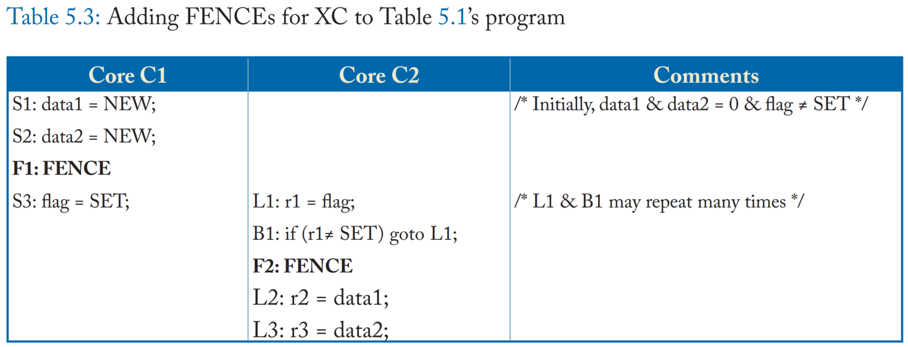

表 5.3 显示了程序员或低级软件应如何在表 5.1 的程序中插入 FENCE，以便它在 XC 下正确运行。 这些FENCE确保：

- S1, S2 -> F1 -> S3 -> L1 loads SET -> F2 -> L2, L3

顺序store的F1 FENCE对大多数读者来说很有意义，但有些人对 F2 FENCE 顺序Load的需求感到惊讶。但是，如果允许负载乱序执行，它们可以使它看起来像乱序执行的有序存储。例如，如果执行可以按 L2、S1、S2、S3、L1 和 L3 进行，则 L2 可以得到值 0。这种结果对于不包含 B1 控制依赖的程序尤其可能，因此 L1 和 L2 是对不同地址的连续加载，其中重新排序似乎是合理的，但并非如此。

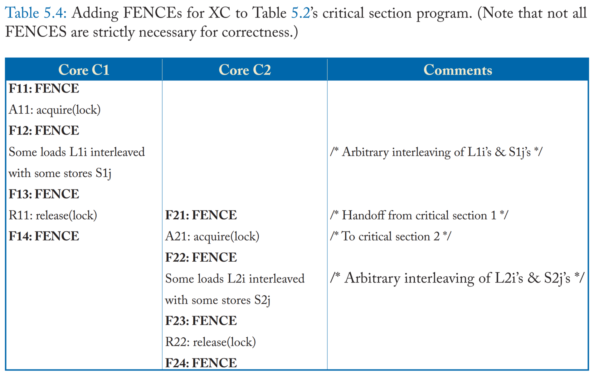

表 5.4 显示了程序员或低级软件如何在表 5.2 的临界区程序中插入 FENCE，以便它在 XC 下正确运行。 这个 FENCE 插入策略，其中 FENCE 围绕每个锁获取和锁释放，出于说明目的是保守的； 我们稍后将展示其中一些 FENCE 可以被移除。 特别是，FENCEs F13 和 F22 确保了关键部分之间的正确切换，因为：

- All L1i, ALL Sj -> F13 -> R11 -> A21 -> F22 -> All L2i, All S2j

接下来，我们将 XC 形式化，然后说明上述两个示例为何有效。

#### 5.2.3 形式化 XC

在这里，我们以与前两章的符号和方法一致的方式将 XC 形式化。 再一次，让 L(a) 和 S(a) 分别代表加载和存储，以寻址 a。 命令 $<p$ 和 $<m$ 分别定义了每个处理器的程序顺序和全局内存顺序。

程序顺序 $<p$ 是每个处理器的总顺序，它捕获每个内核逻辑（顺序）执行内存操作的顺序。 全局内存顺序 $<m$ 是所有核的内存操作的总顺序。

更正式地说，XC 执行需要以下内容。

1. All cores insert their loads, stores, and FENCEs into the order $<m$ respecting:
   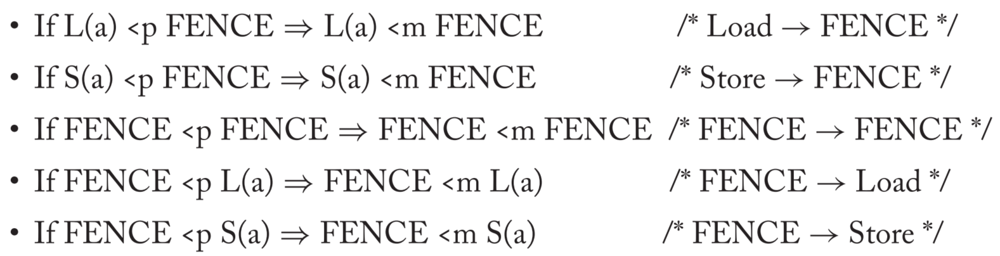
2. All cores insert their loads and stores to the same address into the order $<m$ respecting:
   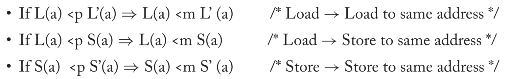
3. Every load gets its value from the last store before it to the same address:
   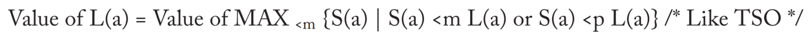


我们在表 5.5 中总结了这些排序规则。 该表与 SC 和 TSO 的表有很大不同。 从视觉上看，该表显示仅对相同地址的操作或使用 FENCE 的操作强制执行排序。 和 TSO 一样，如果操作 1 是“存储 C”，操作 2 是“加载 C”，则存储可以在加载后进入全局顺序，但加载必须已经看到新存储的值。

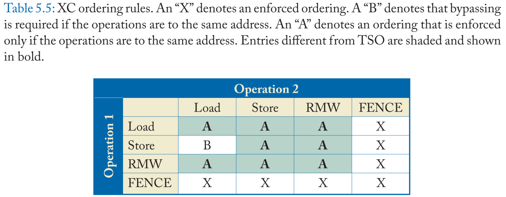

#### 5.2.4 XC正常运行的示例

TODO:

## 6 连贯性协议

在本章中，我们回到第 2 章中介绍的缓存连贯性主题。我们在第 2 章中定义了连贯性，以了解连贯性在支持一致性方面的作用，但我们没有深入研究具体的连贯性协议如何工作或它们如何被执行。在我们在接下来的两章中讨论特定类别的协议之前，本章将讨论一般性的连贯性协议。 我们从 6.1 节开始展示连贯性协议的工作原理，然后在 6.2 节中展示如何指定协议。 我们在 6.3 节中展示了一个简单、具体的连贯性协议示例，并在 6.4 节中探索了协议设计空间。

### 6.1 大局

连贯性协议的目标是通过强制执行第 2.3 节中介绍并在此重申的不变量来保持连贯性。

1. 单写入、多读取 (SWMR) 不变。 对于任何内存位置 A，在任何给定（逻辑）时间，只有一个内核可以写入 A（也可以读取它）或某些数量的内核只能读取 A。
2. 数据值不变。 epoch开始时的内存位置值与其上一个读写epoch结束时的内存位置值相同。

为了实现这些不变量，我们将每个存储结构（每个缓存和 LLC/内存）与称为连贯性控制器的有限状态机相关联。 这些连贯性控制器的集合构成了一个分布式系统，其中控制器相互交换消息，以确保对于每个块，始终保持 SWMR 和数据值不变量。 这些有限状态机之间的交互由连贯性协议指定。

连贯性控制器有几个职责。缓存中的连贯性控制器，我们称之为缓存控制器，如图 6.1 所示。缓存控制器必须为来自两个来源的请求提供服务。在“内核端”，缓存控制器与处理器内核接口。控制器接受来自内核的加载和存储，并将加载值返回到内核。缓存未命中导致控制器通过为包含核心访问的位置的块发出连贯性请求（例如，请求只读许可）来启动连贯性事务。该连贯性请求通过互连网络发送到一个或多个连贯性控制器。事务由请求和为满足请求而交换的其他消息（例如，从另一个连贯性控制器发送到请求者的数据响应消息）组成。事务的类型和作为每个事务的一部分发送的消息取决于特定的连贯性协议。

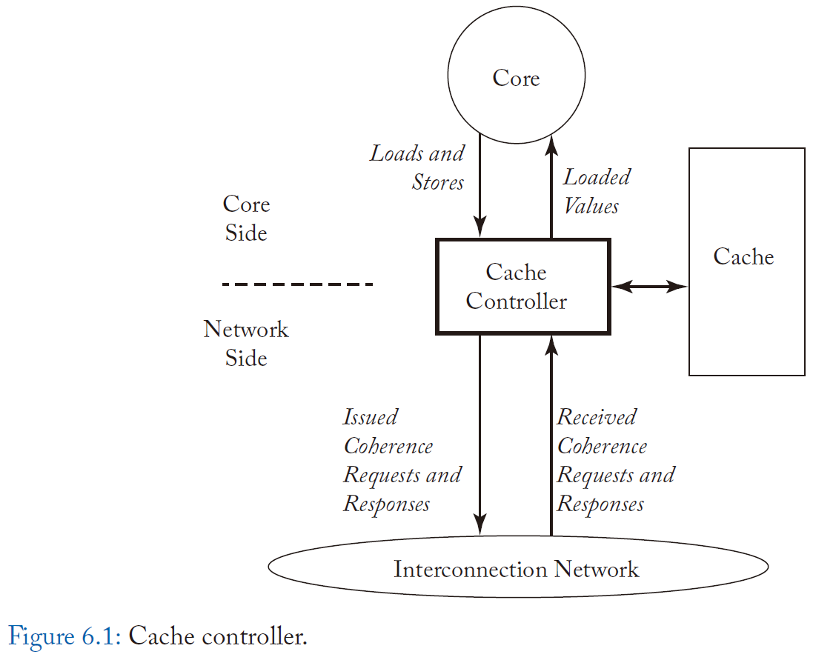

在缓存控制器的“网络侧”，缓存控制器通过互连网络连接到系统的其余部分。控制器接收它必须处理的一致性请求和一致性响应。 与核心端一样，传入一致性消息的处理取决于特定的一致性协议。

LLC/内存中的一致性控制器，我们称之为内存控制器，<font color=blue>如后一句所揭示的那样，由于LLC和DRAM都是所有内核共享，只存在这一个并行副本，因此LLC/DRAM控制器是等价的。</font>如图 6.2 所示。 内存控制器类似于缓存控制器，不同之处在于它通常只有一个网络端。 因此，它不会发出一致性请求（代表加载或存储）或接收一致性响应。 其他代理（例如 I/O 设备）的行为可能类似于缓存控制器、内存控制器或两者，具体取决于它们的特定要求。

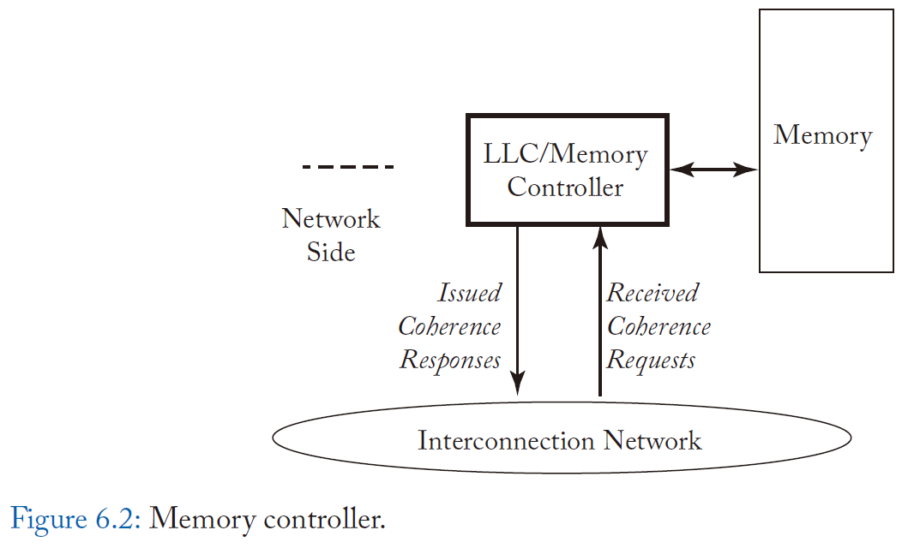

每个一致性控制器实现一组有限状态机——逻辑上一个独立但每个块相同的有限状态机——并根据块的状态接收和处理事件（例如，传入的一致性消息）。 对于类型 E 的事件（例如，从内核到缓存控制器的存储请求）到块 B，一致性控制器采取动作（例如，发出读写许可的一致性请求），这些动作是E和B的状态（例如，只读）的函数。采取这些行动后，控制器可能会改变B的状态。

### 6.2 指定一致性协议

我们通过指定一致性控制器来指定一致性协议。我们可以通过多种方式指定一致性控制器，但一致性控制器的特定行为适用于表格规范 [9]。如表 6.1 所示，我们可以将控制器指定为一个表格，其中行对应块状态，列对应于事件。我们将表中的状态/事件条目称为转换，并且属于块 B 的事件 E 的转换包括（a）当 E 发生时采取的动作和（b）块 B 的下一个状态。我们表示转换以“动作/下一个状态”的格式，如果下一个状态是当前状态，我们可以省略“下一个状态”部分。作为表 6.1 中的转换示例，如果从内核接收到块 B 的存储请求并且块 B 处于只读状态 (RO)，则该表显示控制器的转换将执行操作“发出读写权限的一致性请求（到块B）”并将块B的状态更改为RW。

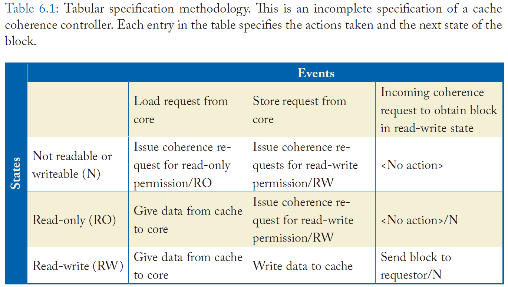

为简单起见，表 6.1 中的示例有意不完整，但它说明了表格规范方法捕获一致性控制器行为的能力。 要指定一致性协议，我们只需要完全指定缓存控制器和内存控制器的表。

一致性协议之间的差异在于控制器规格的差异。 这些差异包括不同的区块状态、交易、事件和转换集。 在 6.4 节中，我们通过探索每个方面的选项来描述一致性协议设计空间，但我们首先指定一个简单、具体的协议。

### 6.3 简单一致性协议示例

为了帮助理解一致性协议，我们现在提出一个简单的协议。我们的系统模型是第 2.1 节中的基线系统模型，但互连网络仅限于共享总线：一组共享线路，核心可以在其上发布消息并让所有核心和 LLC/内存观察到该消息。

每个缓存块可以处于两种稳定的一致性状态之一：I(nvalid) 和 V(alid)。 LLC/内存中的每个块也可以处于两种一致性状态之一：I 和 V。在 LLC/内存中，状态 I 表示所有缓存都持有处于状态 I 的块，状态 V 表示一个缓存持有状态 V 中的块。缓存块也有一个瞬态，IV<sup>D</sup>，如下所述。系统启动时，所有缓存块和LLC/内存块都处于状态I。每个内核都可以向其缓存控制器发出加载和存储请求；当缓存控制器需要为另一个块腾出空间时，它会隐式地生成一个 Evict Block 事件。缓存中未命中的加载和存储启动一致性事务，如下所述，以获得缓存块的有效副本。与本入门手册中的所有协议一样，我们假设有一个写回缓存；也就是说，当存储命中时，它仅将存储值写入（本地）缓存，并等待将整个块写回 LLC/内存以响应 Evict Block 事件。

使用三种类型的总线消息实现了两种类型的一致性事务：Get 请求一个块，DataResp 传输块的数据，以及 Put 将块写回内存控制器。 在加载或存储未命中时，缓存控制器通过发送 Get 消息并等待相应的 DataResp 消息来启动 Get 事务。 Get 事务是原子的，因为在缓存发送 Get 和该 Get 的 DataResp 出现在总线上之间，没有其他事务（Get 或 Put）可以使用总线。 在 Evict Block 事件中，缓存控制器将包含整个缓存块的 Put 消息发送到内存控制器。

我们在图 6.3 中说明了稳定连贯性状态之间的转换。 我们使用前缀“Own”和“Other”来区分由给定缓存控制器发起的事务与由其他缓存控制器发起的事务的消息。 请注意，如果给定的缓存控制器具有处于状态 V 的块并且另一个缓存使用 Get 消息（表示为 Other-Get）请求它，则拥有的缓存必须以块响应（使用 DataResp 消息，未显示）并转换到状态I。

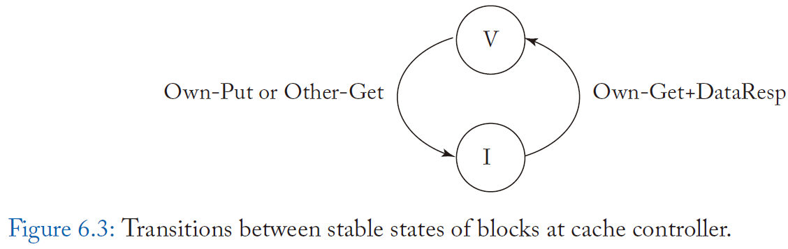

表 6.2 和 6.3 更详细地指定了协议。 表中的阴影条目表示不可能的转变。 例如，缓存控制器永远不应该在总线上看到它自己的 Put 请求，该请求在其缓存中处于状态 V 的块（因为它应该已经转换到状态 I）。

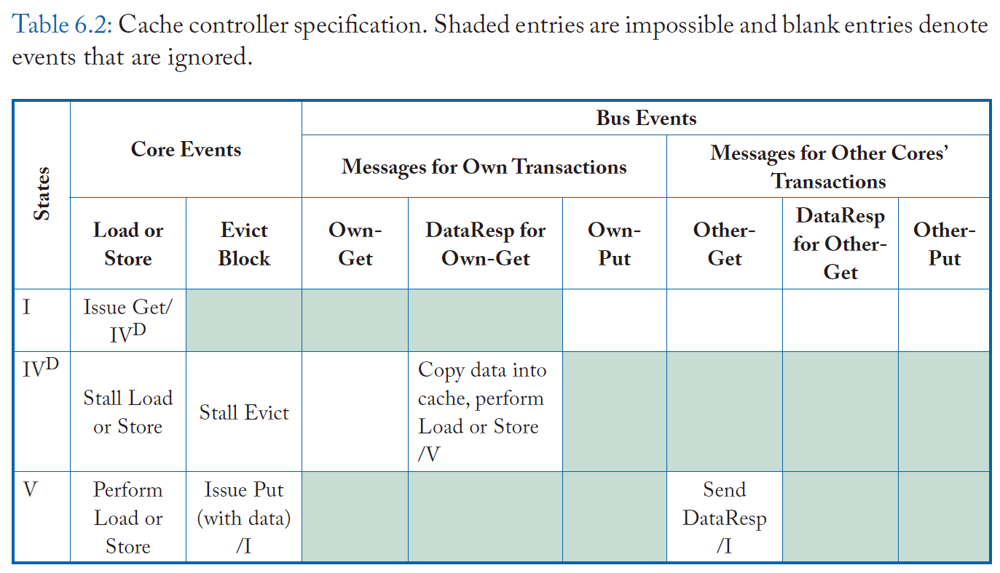

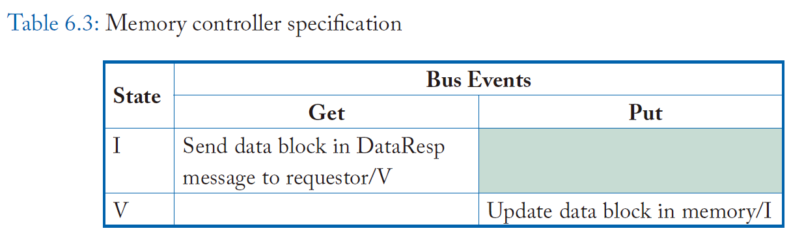

瞬态IV<sup>D</sup>对应于状态I中的块，它在转换到状态V之前等待数据（通过 DataResp 消息）。当稳定状态之间的转换不是原子时，就会出现瞬态。 在这个简单的协议中，单个消息的发送和接收是原子的，但是从内存控制器中获取一个块需要发送一个 Get 消息和接收一个 DataResp 消息，中间有一个不确定的间隙。 IVD 状态表示协议正在等待 DataResp。 我们在 6.4.1 节更深入地讨论瞬态。

这种一致性协议在很多方面都过于简单和低效，但展示该协议的目的是了解协议是如何指定的。 在介绍不同类型的一致性协议时，我们在整本书中都使用这种规范方法。

### 6.4 一致性协议设计空间概述

如第 6.1 节所述，一致性协议的设计者必须为系统中的每种类型的一致性控制器选择状态、事务、事件和转换。 稳定状态的选择在很大程度上独立于一致性协议的其余部分。 例如，有两类不同的一致性协议，称为侦听和目录，架构师可以设计具有相同稳定状态集的侦听协议或目录协议。 我们在 6.4.1 节讨论了独立于协议的稳定状态。 同样，事务的选择也很大程度上独立于具体的协议，我们在 6.4.2 节讨论事务。 然而，与稳定状态和事务的选择不同，事件、转换和特定的瞬态高度依赖于一致性协议，不能孤立地讨论。 因此，在第 6.4.3 节中，我们讨论了一致性协议中的一些主要设计决策。

#### 6.4.1 状态

在只有一个参与者的系统中（例如，没有一致 DMA 的单核处理器），缓存块的状态要么有效要么无效。 如果需要区分脏块，则缓存块可能有两种可能的有效状态。 脏块的值比该块的其他副本更近的时间写入。 例如，在具有回写 L1 缓存的两级缓存层次结构中，L1 中的块相对于 L2 缓存中的陈旧副本可能是脏的。

如第 6.3 节所示，一个有多个参与者的系统也可以只使用这两种或三种状态。但我们经常想要区分不同类型的有效状态。我们希望对其状态进行编码的缓存块有四个特征：有效性、肮脏性、排他性和所有权。后两个特征是具有多个参与者的系统所独有的。

- Validity：有效块具有该块的最新值。 该块可以被读取，但只有在它也是独占的情况下才能被写入。
- Dirtiness：就像在单核处理器中一样，如果一个缓存块的值是最新值，则它是脏的，这个值与LLC/内存中的值不同，并且缓存控制器负责最终使用这个新值更新LLC/内存。清洁一词通常用作脏的反义词。
- Exclusivity：如果缓存块是系统中该块的唯一私有缓存副本（即，该块不会缓存在共享 LLC 中的其他任何地方），则该缓存块是排他性。
- Ownership：如果缓存控制器（或内存控制器）负责响应对该块的一致性请求，则它是该块的所有者。 在大多数协议中，给定块始终只有一个所有者。 由于容量或冲突未命中，在不将块的所有权交给另一个一致性控制器的情况下，可能不会从缓存中驱逐一个拥有的块来为另一个块腾出空间。 在某些协议中，非拥有块可能会被静默驱逐（即，不发送任何消息）。

在本节中，我们首先讨论一些常用的稳定状态——当前不在一致性事务中的块的状态——然后讨论使用瞬态来描述当前处于事务中的块。

**Stable States**

许多coherence协议使用由 Sweazey 和 Smith 首次引入的经典五态 MOESI 模型的一个子集。这些 MOESI（通常发音为“MO-sey”或“mo-EE-see”）状态指的是缓存中块的状态，最基本的三个状态是 MSI； 可以使用 O 和 E 状态，但它们不是基本的。 这些状态中的每一个都具有先前描述的特征的不同组合。

- M(odified)：该块是有效的、独占的、拥有的，并且可能是脏的。 该块可以被读取或写入。 缓存拥有块的唯一有效副本，缓存必须响应对块的请求，并且 LLC/内存中的块副本可能已经过时。
- S(hared)：块有效但不排他，不脏，不拥有。 缓存具有该块的只读副本。 其他缓存可能具有该块的有效只读副本。
- I(nvalid)：块无效。 缓存要么不包含该块，要么包含一个可能无法读取或写入的潜在陈旧副本。 在本入门手册中，我们不区分这两种情况，尽管有时前一种情况可能会被表示为“不存在”状态。

最基本的协议仅使用 MSI 状态，但有理由添加 O 和 E 状态以优化某些情况。 当我们讨论有和没有这些状态的窥探和目录协议时，我们将在后面的章节中讨论这些优化。 现在，这里是 MOESI 状态的完整列表：

- O(wned)：块是有效的，拥有的，并且可能是脏的，但不是排他的。 缓存具有块的只读副本，并且必须响应对块的请求。 其他缓存可能具有该块的只读副本，但它们不是所有者。 LLC/内存中块的副本可能是陈旧的。
- E(xclusive)：区块有效、排他、干净。 缓存具有该块的只读副本。 没有其他缓存具有该块的有效副本，并且 LLC/内存中的块副本是最新的。 在本入门手册中，我们认为该块在处于独占状态时被拥有，尽管在某些协议中独占状态不被视为所有权状态。 当我们在后面的章节中介绍 MESI 侦听和目录协议时，我们会讨论与是否使 Exclusive 块所有者有关的问题。

我们在图 6.4 中说明了 MOESI 状态的维恩图。 维恩图显示了哪些状态共享哪些特征。 除了 I 之外的所有状态都是有效的。 M、O 和 E 是所有权状态。 M 和 E 都表示排他性，因为没有其他缓存具有该块的有效副本。M 和 O 都表示该块可能是脏的。 回到 6.3 节中的简单示例，我们观察到该协议有效地将 MOES 状态压缩为 V 状态。

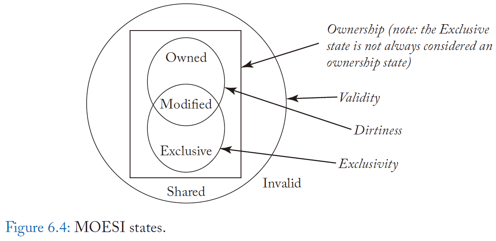

MOESI 状态虽然很常见，但并不是一组详尽的稳定状态。例如，F(orward)状态类似于O状态，除了它是干净的（即，LLC/内存中的副本是最新的）。有许多可能的连贯性状态，但我们在本入门指南中将注意力集中在著名的 MOESI 状态上。

**瞬态**

到目前为止，我们只讨论了当块没有当前一致性活动时出现的稳定状态，并且只有在提及协议时才使用这些稳定状态（例如，“具有 MESI 协议的系统”）.然而，正如我们在6.3节的例子中看到的那样，在从一种稳定状态到另一种稳定状态的过渡过程中可能会存在瞬态。在6.3节中，我们有瞬态IV<sup>D</sup>（在I中，转到V，等待DataResp）。在更复杂的协议中，我们可能会遇到数十种瞬态。我们使用符号XY<sup>Z</sup>对这些状态进行编码，这表示块正在从稳定状态X转换到稳定状态Y，并且转换不会完成，直到发生类型Z的事件。例如，在后面章节的协议中，我们使用IM<sup>D</sup>来表示一个块以前在I中，一旦D(ata)消息到达该块，它就会变成M。

**LLC/内存中的块状态**

到目前为止，我们讨论的状态（稳定的和瞬态的）都与驻留在缓存中的块有关。LLC和内存中的块也有与其关联的状态，并且有两种通用方法来命名LLC和内存中的块状态。命名约定的选择不影响功能或性能；它只是一个规范问题，可能会使不熟悉该约定的架构师感到困惑。

- 以缓存为中心：在这种我们认为最常见的方法中，LLC 和内存中的块状态是缓存中该块状态的聚合。例如，如果一个块在所有缓存中都处于状态I，则该块的 LLC/内存状态为I。如果一个块在一个或多个缓存中处于状态S，则LLC/内存状态为S。如果一个块在单个缓存中处于状态M，则LLC/内存状态为M。
- 以内存为中心：在这种方法中，LLC/内存中块的状态对应于内存控制器对该块的权限（而不是缓存的权限）。例如，如果一个块在所有缓存中处于状态I，则该块的LLC/内存状态为O（不是以缓存为中心的方法中的I），因为LLC/内存的行为就像块的所有者。如果一个块在一个或多个缓存中处于状态S，那么LLC/内存状态也是O，出于同样的原因。但是，如果块在单个缓存中处于状态M或O，则LLC/内存状态为I，因为LLC/内存具有块的无效副本。

本入门手册中的所有协议都使用以缓存为中心的名称来表示LLC和内存中的块状态。

**维护块状态**

系统实现必须维护与缓存、LLC和内存中的块相关联的状态。对于缓存和LLC，这通常需要将每个块的缓存状态最多扩展几位，因为稳定状态的数量通常很少（例如，MOESI协议的5个状态需要每个块3位）。一致性协议可能有更多的瞬态状态，但只需要为那些具有待处理一致性事务的块维护这些状态。实现通常通过向未命中状态处理寄存器(MSHR)或用于跟踪这些未决事务的类似结构添加额外位来维护这些瞬态。

对于内存而言，更大的总容量似乎会带来重大挑战。然而，许多当前的多核系统维护一个包容性LLC，这意味着LLC维护缓存在系统中任何位置的每个块的副本（甚至“独占”块）。使用包容性LLC，内存不需要显式表示一致性状态。如果一个块驻留在LLC中，则其在内存中的状态与其在LLC中的状态相同。如果块不在LLC中，则其在内存中的状态隐式为无效，因为不包含在LLC中意味着该块不在任何缓存中。侧边栏讨论了在具有包容性LLC的多核之前的日子里，内存状态是如何维护的。上面对内存的讨论假设系统具有单个多核芯片，本入门书的大部分内容也是如此。具有多个多核芯片的系统可能会受益于内存逻辑上的显式一致性状态。

> **侧边栏：多核之前：在内存中保持一致性状态**
> 传统的前多核协议需要为每个内存块维护一致性状态，并且它们不能使用 LLC，如第 6.4.1 节所述。 我们简要讨论了几种保持这种状态的方法以及相关的工程权衡。
> **用状态位扩充每个内存块。** 最通用的实现是向每个内存块添加额外的位以保持一致性状态。如果内存中有 N 个可能的状态，那么每个块都需要 log2N 个额外位。虽然这种设计是完全通用的，概念上也很简单，但它有几个缺点。首先，额外的比特可能会以两种方式增加成本。使用现代面向块的 DRAM 芯片很难添加两个或三个额外的位，这些芯片通常至少有 4 位宽，而且通常更宽。此外，内存增加任何变化都排除了使用商品 DRAM 模块的可能性（例如 DIMM），这会显着增加成本。幸运的是，对于每个块只需要几位状态的协议，可以使用修改后的 ECC 代码来存储这些状态。通过在更大的粒度（例如，512 位而不是 64 位）上维护 ECC，可以在使用商品 DRAM 模块时释放足够的代码空间来“隐藏”少量额外位。第二个缺点是，将状态位存储在 DRAM 中意味着获取状态会导致完整的 DRAM 延迟，即使在块的最新版本存储在其他缓存中的情况下也是如此。在某些情况下，这可能会增加缓存到缓存一致性传输的延迟。最后，将状态存储在 DRAM 中意味着所有状态更改都需要 DRAM 读-修改-写周期，这可能会影响功率和 DRAM 带宽。
> 在内存中为每个块添加单个状态位。Synapse使用的一个设计选项是使用与每个内存块相关联的单个位来区分两个稳定状态（I和V）。很少有块处于瞬态状态，这些状态可以用一个小的专用结构来维持。此设计是更完整的第一个设计的子集，存储成本最低。
> **零位逻辑或。** 为了避免修改内存，我们可以让缓存按需重建内存状态。 块的内存状态是每个缓存中块状态的函数，因此，如果所有缓存聚合它们的状态，它们就可以确定内存状态。 系统可以通过让所有内核向逻辑 OR 门（或 OR 门树）发送一个“IsOwned？”信号来推断内存是否是块的所有者，其中输入的数量等于缓存的数量 . 如果此 OR 的输出为高，则表示缓存是所有者； 如果输出低，则内存是所有者。 该解决方案避免了在内存中维护任何状态的需要。 但是，使用逻辑门或线或来实现快速 OR 可能很困难。

#### 6.4.2 事务

大多数协议都有一组相似的事务，因为一致性控制器的基本目标是相似的。 例如，几乎所有协议都有一个事务来获得对块的共享（只读）访问。 在表 6.4 中，我们列出了一组常见事务，并且对于每个事务，我们描述了发起事务的请求者的目标。 这些事务都是由缓存控制器发起的，缓存控制器响应来自其相关核心的请求。 在表 6.5 中，我们列出了内核可以向其缓存控制器发出的请求，以及这些内核请求如何引导缓存控制器启动一致性事务。

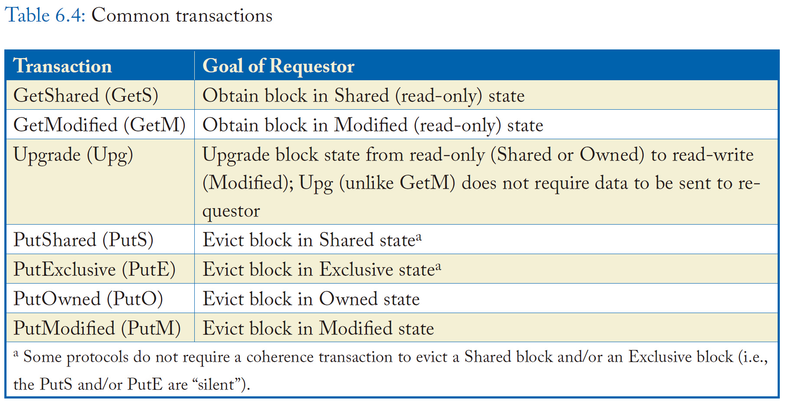

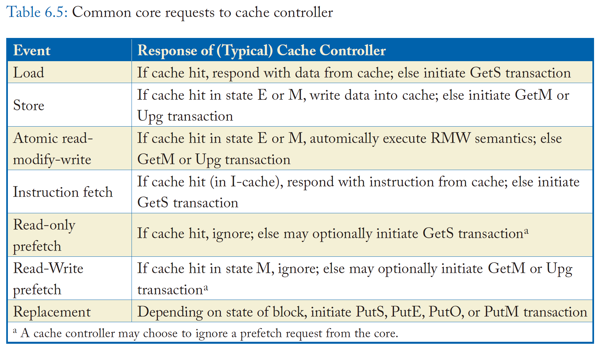

尽管大多数协议使用一组相似的事务，但它们在一致性控制器如何交互以执行事务方面存在很大差异。 正如我们将在下一节中看到的，在一些协议（例如，监听协议）中，缓存控制器通过向系统中的所有一致性控制器广播 GetS 请求来启动 GetS 事务，并且无论哪个当前块所有者的控制器都会响应请求者一个包含所需数据的消息。相反，在其他协议（例如，目录协议）中，缓存控制器通过向特定的预定义一致性控制器发送单播GetS消息来启动GetS事务，该控制器可以直接响应，也可以将请求转发到另一个一致性控制器来响应请求者。

#### 6.4.3 主要协议设计选项

有许多不同的方法来设计一致性协议。 即使对于同一组状态和事务，也有许多不同的可能协议。 协议的设计决定了每个连贯性控制器可能发生的事件和转换；与状态和事务不同，无法呈现独立于协议的可能事件或转换列表。

尽管一致性协议有巨大的设计空间，但有两个主要设计决策对协议的其余部分有重大影响，我们接下来将讨论它们。

**侦听与目录**

有两类主要的一致性协议：侦听和目录。我们现在对这些协议进行简要概述，并将对它们的深入介绍分别推迟到第7章和第8章。

- 侦听协议：缓存控制器通过向所有其他一致性控制器广播请求消息来发起对块的请求。 一致性控制器共同“做正确的事情”，例如，如果他们是所有者，则发送数据以响应另一个核心的请求。 侦听协议依靠互连网络以一致的顺序将广播消息传送到所有内核。 大多数侦听协议假设请求以全序到达，例如，通过共享线路总线，但更先进的互连网络和宽松的顺序是可能的。
- 目录协议：缓存控制器通过将块单播到作为该块所在的内存控制器来发起对块的请求。 内存控制器维护一个目录，该目录保存有关 LLC/内存中每个块的状态，例如当前所有者的身份或当前共享者的身份。 当对块的请求到达 home 时，内存控制器会查找该块的目录状态。 例如，如果请求是 GetS，则内存控制器查找目录状态以确定所有者。 如果 LLC/内存是所有者，则内存控制器通过向请求者发送数据响应来完成事务。 如果缓存控制器是所有者，则内存控制器将请求转发给所有者缓存； 当所有者缓存收到转发的请求时，它通过向请求者发送数据响应来完成事务。

侦听与目录的选择涉及权衡。侦听协议在逻辑上很简单，但它们不能扩展到大量内核，因为广播不能扩展。目录协议是可扩展的，因为它们是单播的，但许多事务需要更多时间，因为当home不是所有者时，它们需要发送额外的消息。此外，协议的选择会影响互连网络（例如，经典侦听协议需要请求消息的总顺序）。

**无效与更新**

一致性协议中的另一个主要设计决策是决定内核写入块时要做什么。 该决定与协议是窥探还是目录无关。这有两种选择。

- 无效协议：当一个核心希望写入一个块时，它会启动一个一致性事务以使所有其他缓存中的副本无效。 一旦副本失效，请求者就可以写入该块，而另一个核心不可能读取该块的旧值。 如果另一个内核希望在其副本失效后读取该块，则必须发起新的一致性事务来获取该块，并且将从写入它的内核获取副本，从而保持一致性。
- 更新协议：当一个核心希望写入一个块时，它会启动一个一致性事务来更新所有其他缓存中的副本，以反映它写入块的新值。

再一次，做出这个决定需要权衡。 更新协议减少了内核读取新写入块的延迟，因为内核不需要启动并等待 GetS 事务完成。 然而，更新协议通常比无效协议消耗更多的带宽，因为更新消息比无效消息（地址和新值，而不仅仅是地址）大。 此外，更新协议使许多内存一致性模型的实现变得非常复杂。 例如，当多个缓存必须对一个块的多个副本应用多次更新时，保持写原子性（第 5.5 节）变得更加困难。 由于更新协议的复杂性，它们很少被实现； 在本入门手册中，我们将重点介绍更为常见的无效协议。

**混合设计**

对于这两个主要的设计决策，一种选择是开发混合方案。有些协议结合了侦听和目录协议的各个方面，有些协议结合了无效和更新协议的各个方面。设计空间丰富，架构师不受任何特定设计风格的约束。

## 7 侦听连贯性协议

在本章中，我们将介绍侦听一致性协议。侦听协议是第一个广泛部署的协议类，它们继续用于各种系统。侦听协议提供了许多吸引人的特性，包括低延迟一致性事务和概念上比替代目录协议更简单的设计（第8章）。

我们首先在高层介绍侦听协议（第 7.1 节）。 然后，我们展示了一个具有完整但不复杂的三态 (MSI) 侦听协议的简单系统（第 7.2 节）。 该系统和协议作为我们稍后添加系统功能和协议优化的基准。 我们讨论的协议优化包括添加独占状态（第 7.3 节）和拥有状态（第 7.4 节），以及更高性能的互连网络（第 7.5 和 7.6 节）。 然后我们讨论具有窥探协议的商业系统（第 7.7 节），然后以讨论窥探及其未来（第 7.8 节）结束本章。

考虑到一些读者可能不想深入研究侦听，我们对本章进行了组织，以便读者可以浏览或跳过第7.3-7.6节，如果他们愿意的话。

### 7.1 侦听简介

侦听协议基于一个想法：所有一致性控制器以相同的顺序观察（侦听）一致性请求，并共同“做正确的事情”以保持一致性。通过要求对给定块的所有请求按顺序到达，侦听系统使分布式一致性控制器能够正确更新共同表示缓存块状态的有限状态机。

传统的侦听协议向所有一致性控制器广播请求，包括发起请求的控制器。 一致性请求通常在有序的广播网络（例如总线）上传播。 有序广播确保每个一致性控制器以相同的顺序观察到相同系列的一致性请求，即一致性请求的总顺序。 由于全序包含所有每块的顺序，因此该全序保证所有一致性控制器可以正确更新缓存块的状态。

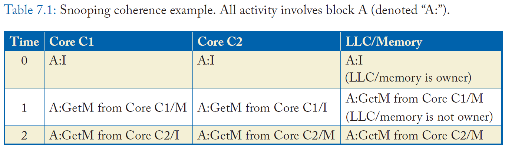

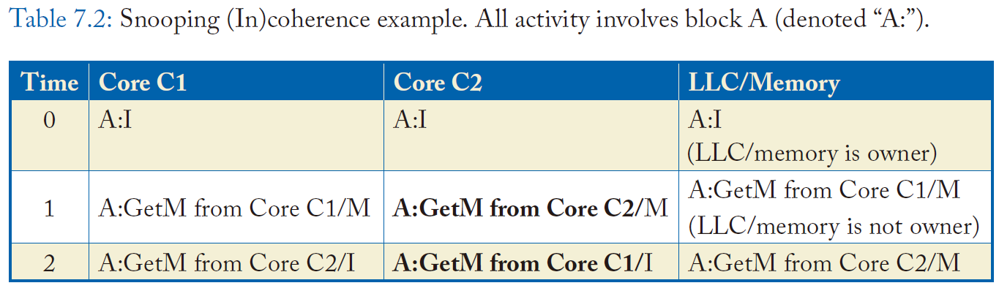

为了说明以相同的每块顺序处理一致性请求的重要性，请考虑表 7.1 和 7.2 中的示例，其中核心 C1 和核心 C2 都希望在状态 M 中获得相同的块 A。在表 7.1 中，所有三个一致性控制器遵守相同的每块一致性请求顺序，并共同维护单写入-多读取 (SWMR) 不变量。块的所有权从 LLC/内存到核心 C1 再到核心 C2。作为每个观察到的请求的结果，每个一致性控制器独立地得出关于块状态的正确结论。相反，表 7.2 说明了如果核心 C2 观察到与核心 C1 和 LLC/内存不同的每个块的请求顺序，不连贯性可能会如何出现。首先，我们有一种情况，其中核心 C1 和核心 C2 同时处于状态 M，这违反了 SWMR 不变量。接下来，我们有一种情况，没有一致性控制器认为它是所有者，因此此时的一致性请求不会收到响应（可能导致死锁）。

即使一致性只需要每个块的请求顺序，传统的侦听协议在所有块上创建了一个完整的连贯性请求顺序。拥有全序可以更轻松地实现需要内存引用全序的内存一致性模型，例如SC和TSO。考虑表 7.3中涉及两个块A和B的示例；每个块只被请求一次，因此系统简单地观察每个块的请求顺序。然而，由于核心C1和C2观察GetM和GetS请求无序，因此此执行违反了SC和TSO内存一致性模型。

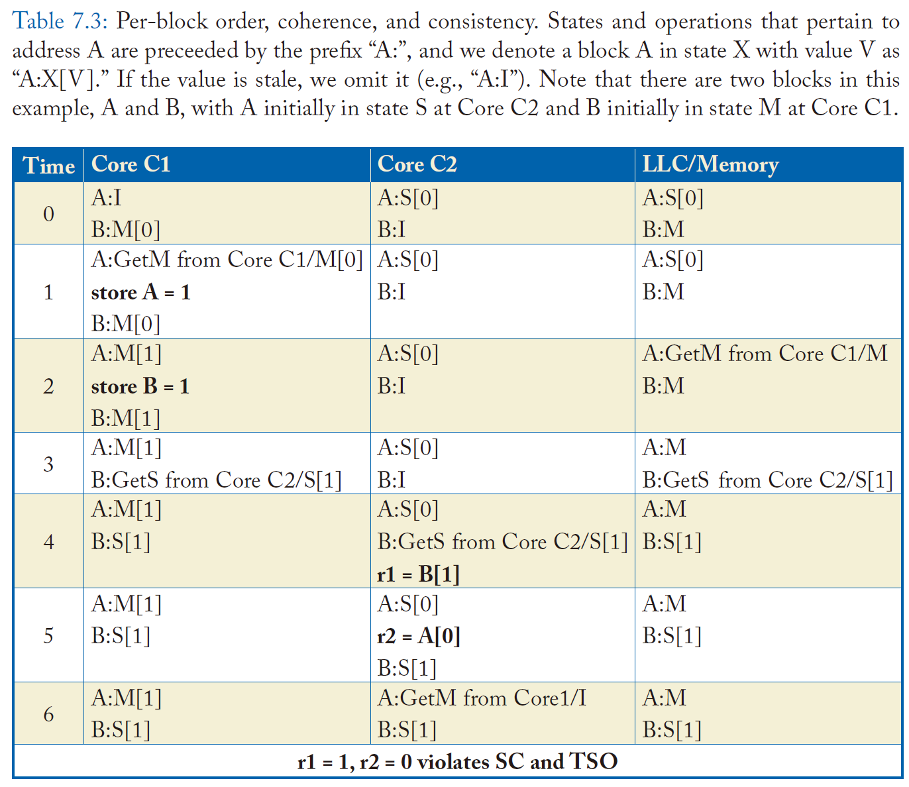

> **侧边栏：侦听如何取决于连贯性请求的总顺序**
> 乍一看，读者可能会假设出现表 7.3 中的问题是因为在周期 1 中块 A 违反了 SWMR 不变量，因为 C1 具有 M 副本而 C2 仍然具有 S 副本。 但是，表 7.4 说明了相同的示例，但强制执行了一致性请求的总顺序。 此示例在第 4 周期之前是相同的，因此具有相同的明显 SWMR 违规。 然而，就像众所周知的“森林中的树”一样，这种违规行为不会造成问题，因为它没有被观察到（即“没有人听到”）。 具体来说，因为内核以相同的顺序看到两个请求，C2 在看到块 B 的新值之前使块 A 无效。因此，当 C2 读取块 A 时，它必须获得新值，因此产生正确的 SC 和 TSO 执行。
> 传统的侦听协议使用一致性请求的总顺序来确定在基于侦听顺序的逻辑时间中何时观察到特定请求。 在表7.4的例子中，由于全序，核心C1可以推断C2会在看到B的GetS之前看到A的GetM，因此C2在收到一致性消息时不需要发送特定的确认消息。 这种对请求接收的隐式确认将侦听协议与我们在下一章中研究的目录协议区分开来。

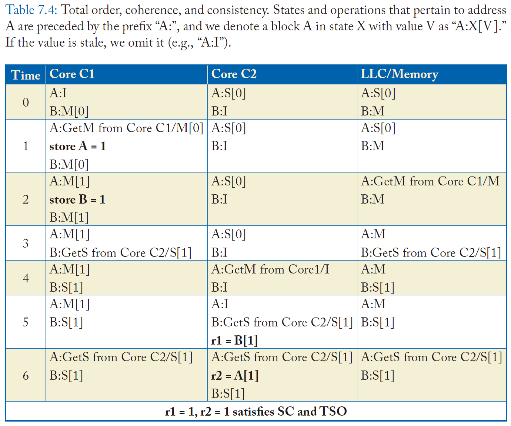

我们在侧边栏中讨论了一些关于需要一个总顺序的更微妙的问题。

要求以全序方式观察广播一致性请求对于用于实现传统侦听协议的互连网络具有重要意义。由于许多一致性控制器可能同时尝试发出一致性请求，互连网络必须将这些请求序列化为某种总顺序。虽然网络决定了这个顺序，这个机制被称为协议的序列化（排序）点。在一般情况下，一致性控制器发出一致性请求，网络在序列化点排序请求并将其广播给所有控制器，发出请求的控制器通过监听从网络接收到的控制器请求流来了解其请求的排序位置。作为一个具体而简单的例子，考虑一个使用总线来广播一致性请求的系统。一致性控制器必须使用仲裁逻辑来确保一次在总线上只发出一个请求。该仲裁逻辑充当串行化点，因为它有效地确定了请求出现在总线上的顺序。一个微妙但重要的一点是一致性请求在仲裁逻辑序列化它的瞬间被排序，但是控制器可能只能通过监听总线来观察在它自己的请求之前和之后出现哪些其他请求来确定这个顺序。因此，一致性控制器可以在序列化点确定后几个周期观察总请求顺序。

到目前为止，我们只讨论了一致性请求，而不是对这些请求的响应。这种看似疏忽的原因是侦听协议的关键方面是围绕着请求，响应消息几乎没有限制。它们可以在不需要支持广播也没有任何顺序要求的独立互连网络上传播。由于响应消息携带数据，因此比请求长得多，因此能够在更简单、成本更低的网络上发送它们有很大的好处。值得注意的是，响应消息不会影响一致性事务的序列化。从逻辑上讲，一致性事务（由广播请求和单播响应组成）在请求被排序时发生，而不管响应何时到达请求者。请求出现在总线上和响应到达请求者之间的时间间隔确实会影响协议的实现（例如，在此间隙期间，是否允许其他控制器请求此块？如果是，请求者如何响应?)，但不影响事务的序列化。

### 7.2 基线侦听协议

在本节中，我们展示了一个简单的、未优化的监听协议，并描述了它在两种不同系统模型上的实现。 第一个简单的系统模型说明了实现侦听一致性协议的基本方法。 第二个稍微复杂的基线系统模型说明了即使是相对简单的性能改进也可能会影响一致性协议的复杂性。 这些示例提供了对侦听协议关键特性的深入了解，同时揭示了激发本章后续部分中介绍的特性和优化的低效率。 7.5 和 7.6 节讨论了如何为更高级的系统模型调整这个基线协议。

#### 7.2.1 高级协议规范

基线协议只有三个稳定状态：M、S和I。这样的协议通常被称为MSI协议。与第 6.3节中的协议一样，该协议假设一个回写缓存。除非块处于状态M的缓存中，否则块归LLC/内存所有。在介绍详细规范之前，我们首先说明协议的更高级别抽象，以了解其基本行为。在图 7.1和7.2中，我们分别显示了高速缓存和内存控制器稳定状态之间的转换。

有三个符号问题需要注意。首先，在图 7.1中，弧线标有在总线上观察到的一致性请求。我们有意省略了其他事件，包括加载、存储和一致性响应。其次，缓存控制器的一致性事件被标记为“Own”或“Other”，以表示观察请求的缓存控制器是否是请求者。第三，在图 7.2中，我们使用以缓存为中心的表示法指定内存中块的状态（例如，内存状态M表示存在块处于状态M的缓存）。

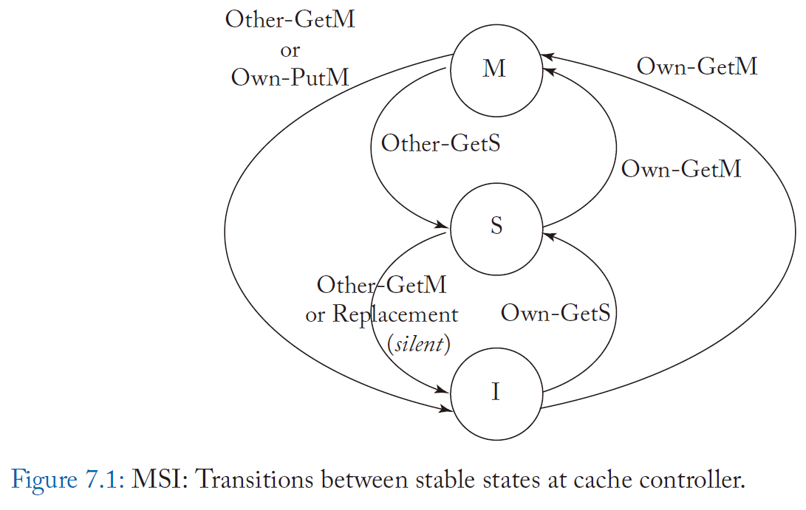

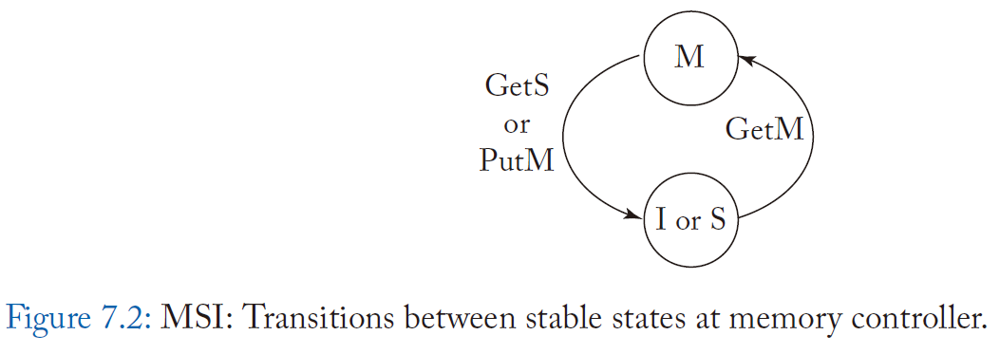

#### 7.2.2 简单的侦听系统模型：原子请求、原子事务

图 7.3说明了简单系统模型，它与图 2.1中介绍的基线系统模型几乎相同。唯一的区别是图 2.1中的通用互连网络被指定为总线。每个内核都可以向其缓存控制器发出加载和存储请求；当缓存控制器需要为另一个块腾出空间时，它会选择一个块来驱逐。总线促进所有一致性控制器监听的一致性请求的总顺序。与前一章中的示例一样，该系统模型具有简化一致性协议的原子性属性。具体来说，该系统实现了两个原子性属性，我们将其定义为原子请求和原子事务。Atomic Requests属性指出一致性请求在发出它的同一周期中排序。此属性消除了在发出请求和排序请求之间，由于另一个内核的一致性请求而导致块状态改变的可能性。Atomic Transactions属性声明一致性事务是原子性的，因为在第一个事务完成之前（即，在总线上出现响应之前），对同一块的后续请求可能不会出现在总线上。由于一致性涉及对单个块的操作，因此系统是否允许对不同块的后续请求不会影响协议。虽然比当前大多数系统都简单，但该系统模型类似于20世纪80年代成功的SGI Challenge。

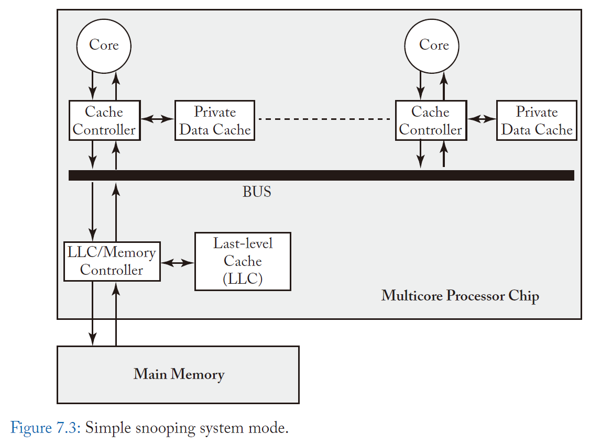

**详细协议规范**

表7.5和7.6给出了简单系统模型的详细一致性协议。与第7.2.1节中的高级描述相比，最显著的区别是在缓存控制器中添加了两个瞬态，在内存控制器中添加了一个瞬态。由于简单系统模型的原子性约束极大地限制了可能的消息交错的数量，因此该协议具有很少的瞬态。

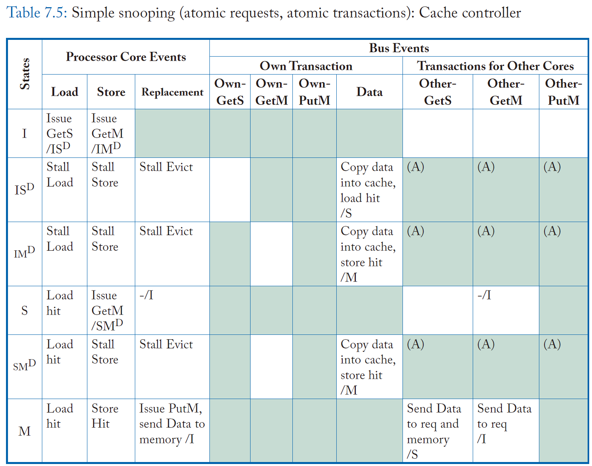

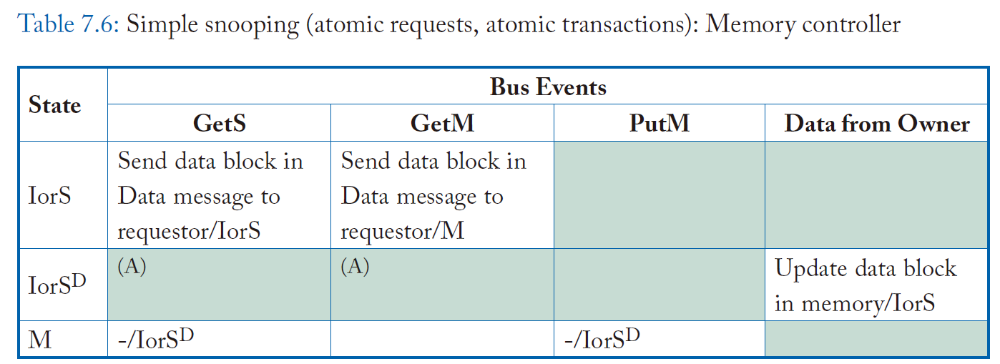

> **闪回测验问题 6：** 在 MSI 侦听协议中，缓存块可能仅处于三种一致性状态之一。 对或错？
> **回答：** 错！ 即使对于最简单的系统模型，由于瞬态，也有超过三个状态。

表中阴影项表示不可能（或至少错误）的转换。例如，缓存控制器永远不应接收其未请求的块（即，其缓存中处于状态i的块）的数据消息。类似地，原子事务约束防止另一个核心在当前事务完成之前发出后续请求；由于此约束，标记为“（A）”的表格条目无法出现。空白项表示不需要采取行动的法律过渡。这些表省略了理解协议不需要的许多实现细节。此外，在本协议和本章中的其他协议中，我们省略了与另一个核心事务的数据对应的事件；一个内核从不采取任何行动来响应在总线上观察另一个内核事务的数据。

与所有 MSI 协议一样，加载可以在状态 S 和 M 中执行（即命中），而存储仅在状态 M 中命中。在加载和存储未命中时，缓存控制器分别通过发送 GetS 和 GetM 请求来启动一致性事务。 瞬时状态 IS<sup>D</sup>、IM<sup>D</sup> 和 SM<sup>D</sup> 表示已发送请求消息，但尚未收到数据响应（Data）。 在这些瞬态状态下，因为请求已经排序，交易也已经排序，并且块在逻辑上分别处于状态 S、M 或 M。 但是，加载或存储必须等待数据到达。 一旦数据响应出现在总线上，缓存控制器就可以将数据块复制到缓存中，适当地转换到稳定状态 S 或 M，并执行挂起的加载或存储。

系统模型的原子性属性以两种方式简化了缓存未命中处理。首先，Atomic Requests属性确保当缓存控制器试图升级一个块的权限时——从I到S，从I到M，或从S到M——它可以发出请求而不必担心另一个核心的请求顺序可能会领先于自己。因此，缓存控制器可以根据需要立即转换到状态IS<sup>D</sup>、IM<sup>D</sup> 或 SM<sup>D</sup>，以等待数据响应。类似地，原子事务属性确保在当前事务完成之前不会发生对块的后续请求，从而无需在处于这些瞬态之一时处理来自其他内核的请求。

数据响应可能来自内存控制器或另一个具有处于状态M的块的缓存。具有处于状态S的块的缓存可以忽略GetS请求，因为内存控制器需要响应，但必须在GetM上使块无效要求强制执行一致性不变量。具有处于状态M的块的缓存必须同时响应GetS和GetM请求，发送数据响应并分别转换到状态S或状态I。

LLC/内存有两种稳定状态，M和IorS，以及一种瞬态IorS<sup>D</sup>。在状态IorS中，内存控制器是所有者并响应GetS和GetM请求，因为该状态表明没有缓存具有处于状态M的块。在状态M中，内存控制器不响应数据，因为处于状态M的缓存是所有者并拥有数据的最新副本。但是，状态M中的GetS意味着缓存控制器将转换到状态S，因此内存控制器还必须获取数据、更新内存并开始响应所有未来的请求。它通过立即转换到瞬态IorS<sup>D</sup>并等待直到它从拥有它的缓存接收数据来做到这一点。

当缓存控制器由于替换决定驱逐一个块时，这会导致协议的两种可能的一致性降级：从S到I和从M到I。在这个协议中，S到I降级在块从缓存中被逐出，而不与其他一致性控制器进行任何通信。一般来说，只有当所有其他一致性控制器的行为保持不变时，静默状态转换才有可能；例如，不允许对拥有的块进行静默驱逐。M-to-I降级需要通信，因为块的M副本是系统中唯一有效的副本，不能简单地丢弃。因此，另一个一致性控制器（即内存控制器）必须改变它的状态。为了替换状态M中的块，缓存控制器在总线上发出PutM请求，然后将数据发送回内存控制器。在LLC中，当PutM请求到达时，块进入状态IorS<sup>D</sup>，然后在数据消息到达时转换到状态IorS。Atomic Requests属性通过防止可能在总线上排序PutM之前降级状态的介入请求（例如，另一个内核的GetM请求），简化了缓存控制器。类似地，原子事务属性通过阻止对块的其他请求来简化内存控制器，直到PutM事务完成并且内存控制器准备好响应它们。

**运行示例**

在本节中，我们将展示系统的执行示例，以展示一致性协议在常见场景中的行为。 我们将在后续部分中使用此示例来理解协议并强调它们之间的差异。 该示例仅包括一个块的活动，并且最初，该块在所有缓存中处于状态 I，在 LLC/内存中处于状态 IorS。

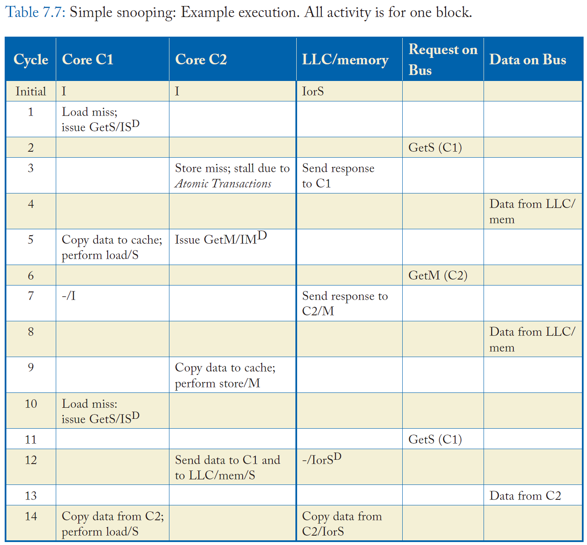

在此示例中，如表 7.7所示，内核C1和C2分别发出加载和存储指令，但在同一块上未命中。核心C1尝试发出GetS，核心C2尝试发出GetM。我们假设核心C1的请求碰巧首先被序列化，并且原子事务属性阻止核心C2的请求到达总线，直到C1的请求完成。内存控制器在第3周期响应C1完成事务。然后，内核C2的GetM在总线上被序列化；C1使其副本无效，内存控制器响应C2以完成该事务。最后，C1发出另一个GetS。C2，所有者，响应数据并将其状态更改为S。C2还将数据的副本发送到内存控制器，因为LLC/内存现在是所有者，并且需要该块的最新副本。在此执行结束时，C1和C2处于状态S，LLC/内存处于状态IorS。

#### 7.2.3 基线侦听系统模型：非原子请求、原子事务

我们在本章其余部分的大部分内容中使用的基线侦听系统模型与简单侦听系统模型的不同之处在于允许非原子请求。非原子请求产生于许多实现优化，但最常见的原因是在缓存控制器和总线之间插入消息队列（甚至单个缓冲区）。通过将发出请求的时间与发出请求的时间分开，协议必须解决简单侦听系统中不存在的漏洞窗口。基线侦听系统模型保留了原子事务属性，我们直到第 7.5 节才放松该属性。

我们在表 7.8和7.9中提供了详细的协议规范，包括所有瞬态。与第 7.2.2节中的简单侦听系统的协议相比，最显着的区别是瞬态数量要多得多。放宽Atomic Requests属性会引入许多情况，其中缓存控制器在发出其一致性请求和在总线上观察其自身的一致性请求之间观察来自总线上另一个控制器的请求。

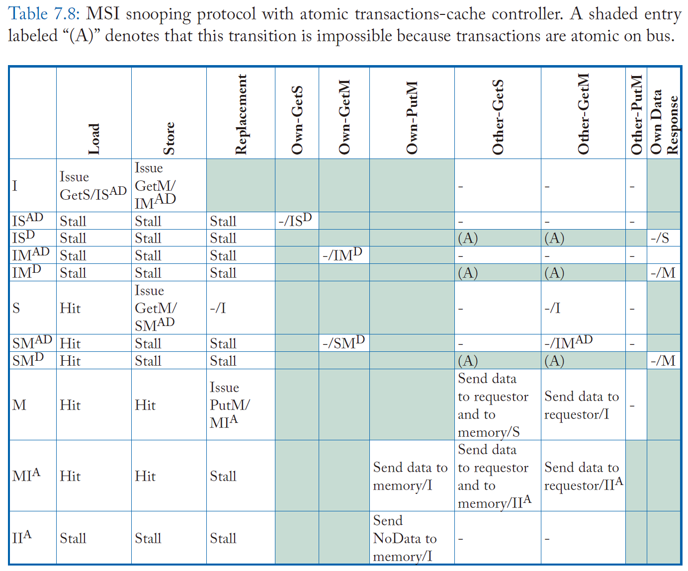

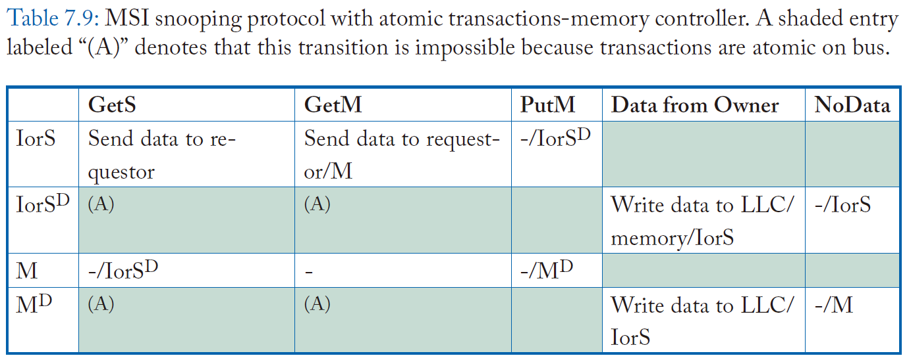

以I-to-S转换为例，缓存控制器发出GetS请求，将块的状态从I更改为IS<sup>AD</sup>。在总线上观察到请求缓存控制器自己的GetS并序列化之前，块的状态实际上是I。也就是说，请求者的块被视为在I中；无法执行加载和存储，并且必须忽略来自其他节点的一致性请求。一旦请求者观察到自己的GetS，请求被排序并且block在逻辑上是S，但是由于数据还没有到达而无法进行加载。缓存控制器将块的状态更改为IS<sup>D</sup> 并等待来自前一个所有者的数据响应。由于 Atomic Transactions 属性，数据消息是下一个一致性消息（到同一块）。一旦数据响应到达，事务就完成了，请求者将块的状态更改为稳定的 S 状态并执行加载。I-to-M 的转换过程与 I-to-S 的转换类似。

从S到M的转变说明了在脆弱性窗口期间发生状态变化的可能性。如果内核尝试存储到状态S的块，缓存控制器会发出GetM请求并转换到状态SM<sup>AD</sup>。 该块有效地保持在状态 S，因此负载可能会继续命中，并且控制器会忽略来自其他内核的 GetS 请求。 但是，如果另一个内核的 GetM 请求首先被排序，则缓存控制器必须将状态转换为 IM<sup>AD</sup>以防止进一步的负载命中。 正如我们在侧边栏中所讨论的，S 到 M 转换期间的漏洞窗口使升级事务的添加变得复杂。

> **侧边栏：在没有原子请求的情况下升级系统中的事务**
> 对于具有原子请求的协议，升级事务是缓存从共享转换为修改的有效方式。 Upgrade 请求使所有共享副本无效，并且比发出 GetM 快得多，因为请求者只需要等到 Upgrade 序列化（即总线仲裁延迟），而不是等待数据从 LLC/内存到达 .
> 但是，如果没有原子请求，添加升级事务变得更加困难，因为在发出请求和请求序列化之间存在漏洞窗口。 由于在此漏洞窗口期间序列化的 Other-GetM 或 Other-Upgrade，请求者可能会丢失其共享副本。 这个问题最简单的解决方案是将块的状态更改为一个新状态，在该状态下它等待自己的 Upgrade 被序列化。 当它的 Upgrade 被序列化时，这将使其他 S 副本（如果有）无效但不会返回数据，内核必须随后发出一个 GetM 请求以转换到 M。
> 更有效地处理升级是困难的，因为 LLC/内存需要知道何时发送数据。 考虑核心 C0 和 C2 共享一个块 A 并且都试图升级它，同时核心 C1 试图读取它的情况。 C0 和 C2 发出升级请求，C1 发出 GetS 请求。 假设它们在总线上序列化为 C0、C1 和 C2。 C0 的升级成功，因此 LLC/内存（处于 IorS 状态）应将其状态更改为 M 但不发送任何数据，并且 C2 应使其 S 副本无效。 C1 的 GetS 在 C0 处找到处于状态 M 的块，它以新的数据值响应并将 LLC/内存更新回状态 IorS。 C2的Upgrade终于出现了，但是因为丢失了共享副本，需要LLC/内存来响应。 不幸的是，LLC/内存处于IorS 状态，无法判断此升级需要数据。 存在解决此问题的替代方法，但超出了本入门的范围。

脆弱性窗口也以更重要的方式影响M-to-I一致性降级。为了替换状态M中的块，缓存控制器发出PutM请求并将块状态更改为MI<sup>A</sup>；与第 7.2.2节中的协议不同，它不会立即将数据发送到内存控制器。在总线上观察到PutM之前，块的状态实际上是M，缓存控制器必须响应其他内核对该块的一致性请求。在没有中间一致性请求到达的情况下，缓存控制器通过将数据发送到内存控制器并将块状态更改为状态I来响应观察自己的PutM。如果中间GetS或GetM请求在PutM被排序之前到达，缓存控制器必须像处于状态M一样响应，然后转换到状态II<sup>A</sup> 以等待其PutM出现在总线上。一旦它看到它的PutM，直观地，缓存控制器应该简单地转换到状态I，因为它已经放弃了块的所有权。不幸的是，这样做会使内存控制器停留在瞬态状态，因为它也会收到PutM请求。无论如何，缓存控制器也不能简单地发送数据，因为这样做可能会覆盖有效数据。解决方案是缓存控制器在状态II<sup>A</sup>期间看到它的PutM时向内存控制器发送一条特殊的NoData消息。NoData消息向内存控制器表明它来自非所有者并让内存控制器退出其瞬态。如果内存控制器接收到NoData消息，它需要知道它应该返回哪个稳定状态，因此变得更加复杂。我们通过添加第二个瞬态记忆状态M<sup>D</sup>来解决这个问题。请注意，这些瞬态表示我们通常的瞬态命名约定的例外。在这种情况下，状态X<sup>D</sup>表示内存控制器在收到NoData消息时应恢复到状态X（如果收到数据消息，则移至状态IorS）。

#### 7.2.4 运行示例

回到运行示例，如表 7.10所示，核心C1发出GetS，核心C2发出GetM。与前面的示例（在表 7.7中）不同，消除Atomic Requests属性意味着两个内核都会发出请求并更改其状态。我们假设核心C1的请求碰巧首先被序列化，并且原子事务属性确保C2的请求在C1的事务完成之前不会出现在总线上。LLC/内存响应完成C1的事务后，核心C2的GetM在总线上被序列化。C1使其副本无效，并且LLC/内存响应C2以完成该事务。最后，C1发出另一个GetS。当这个GetS到达总线时，所有者C2响应数据并将其状态更改为S。C2还将数据的副本发送到内存控制器，因为LLC/内存现在是所有者并且需要一个高达-块的日期副本。在此执行结束时，C1和C2处于状态S，LLC/内存处于状态IorS。

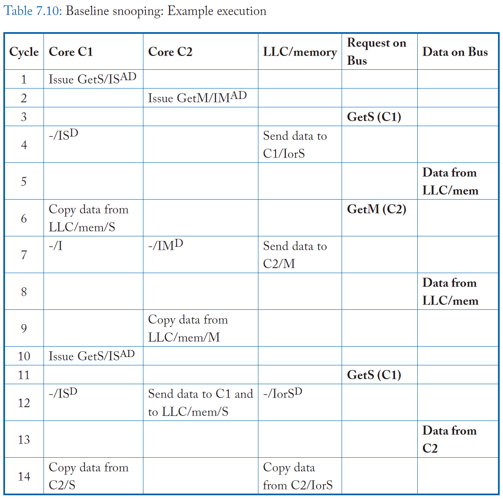

#### 7.2.5 协议简化

该协议相对简单，并且为了实现这种简单性而牺牲了性能。 最重要的简化是在总线上使用原子事务。 原子事务消除了许多可能的转换，在表中用“(A)”表示。 例如，当一个内核具有处于IM<sup>D</sup>状态的缓存块时，该内核不可能观察到来自另一个内核的对该块的一致性请求。 如果事务不是原子的，则可能会发生此类事件，并迫使我们重新设计协议来处理它们，如第 7.5 节所示。

另一个牺牲性能的显着简化涉及对处于状态S的缓存块的存储请求的事件。在该协议中，缓存控制器发出GetM并将块状态更改为SM<sup>AD</sup>。 更高性能但更复杂的解决方案将使用升级事务，如前面的侧边栏中所述。

### 7.3 添加独占(E)状态

有许多重要的协议优化，我们将在接下来的几节中讨论。更多的休闲读者可能希望在第一次阅读时跳过或略读这些部分。一个非常常用的优化是添加Exclusive(E)状态，在本节中，我们将描述如何通过使用E状态扩充第 7.2.3节中的基线协议来创建MESI侦听协议。回忆第 6 章，如果缓存中有一个处于Exclusive状态的块，那么该块是有效的、只读的、干净的、排他的（不在其他地方缓存）并且是拥有的。缓存控制器可以在不发出一致性请求的情况下悄悄地将缓存块的状态从E更改为M。

#### 7.3.1 动机

Exclusive 状态几乎用于所有商业一致性协议，因为它优化了一个常见的情况。与 MSI 协议相比，MESI 协议在内核先读取块然后再写入的情况下提供了重要的优势。这是许多重要应用程序（包括单线程应用程序）中的典型事件序列。在 MSI 协议中，当加载未命中时，缓存控制器将发起 GetS 事务以获得读取权限；在后续的store上，它会再发起一个GetM事务来获取写权限。然而，在没有其他缓存可以访问该块时发生 GetS 的情况下，MESI 协议使缓存控制器能够获取状态 E 中的块，而不是 S。因此，后续存储不需要 GetM 事务；缓存控制器可以静默地将块的状态从 E 升级到 M，并允许内核写入块。因此，E 状态可以消除这种常见场景中一半的一致性事务。

#### 7.3.2 进入EXCLUSIVE状态

在解释协议如何工作之前，我们必须首先弄清楚 GetS 的发行者如何确定没有其他共享者，因此直接进入状态 E 而不是状态 S 是安全的。 至少有两种可能的解决方案：

- 向总线添加线或“共享器”信号：当在总线上排序 GetS 时，所有共享块的缓存控制器都会断言“共享器”信号。 如果 GetS 的请求者观察到“共享者”信号被断言，则请求者将其块状态更改为 S； 否则，请求者将其阻塞状态更改为 E。此解决方案的缺点是必须实现线或信号。 这个额外的共享线在这个已经有共享线总线的基线侦听系统模型中可能没有问题，但它会使不使用共享线总线的实现变得非常复杂（第 7.6 节）。
- 在 LLC 保持额外状态：另一种解决方案是 LLC 区分状态 I（无共享者）和 S（一个或多个共享者），这对于 MSI 协议来说是不需要的。在状态 I 中，内存控制器以特别标记为 Exclusive 的数据进行响应；在状态 S 中，内存控制器以未标记的数据进行响应。然而，准确地保持 S 状态具有挑战性，因为 LLC 必须检测最后一个共享者何时放弃其副本。首先，这要求缓存控制器在驱逐处于状态 S 的块时发出 PutS 消息。其次，内存控制器必须维护共享者的计数，作为该块状态的一部分。这比我们之前的协议更加复杂和带宽密集，允许无声地驱逐 S 中的块。一个更简单但不太完整的替代方案允许 LLC 保守地跟踪共享者；也就是说，内存控制器的状态 S 意味着在状态 S 中有零个或多个缓存。缓存控制器默默地替换状态 S 中的块，因此，即使在最后一个共享器被替换后，LLC 仍保持在 S 中。如果状态 M 的块被写回（使用 PutM），LLC 块的状态变为 I。这个“保守的 S”解决方案放弃了一些使用 E 状态的机会（即，当最后一个共享者在另一个共享者之前替换它的副本时核心问题 GetM），但它避免了对显式 PutS 事务的需要，并且仍然捕获了许多重要的共享模式。

在本节介绍的 MESI 协议中，我们选择了最可实现的选项——在 LLC 保持保守的 S 状态——既避免与在高速总线中实现线或信号相关的工程问题，也避免显式的 PutS 事务。

#### 7.3.3 协议的高级规范

在图 7.4 和 7.5 中，我们展示了 MESI 协议中稳定状态之间的转换。 MESI 协议与缓存和 LLC/内存中的基线 MSI 协议不同。 在缓存中，GetS 请求转换为 S 或 E，具体取决于排序 GetS 时 LLC/内存的状态。 然后，从状态 E 中，块可以默默地更改为 M。在该协议中，我们使用 PutM 来驱逐 E 中的块，而不是使用单独的 PutE； 这个决定有助于保持协议规范简洁，并且对协议功能没有影响。

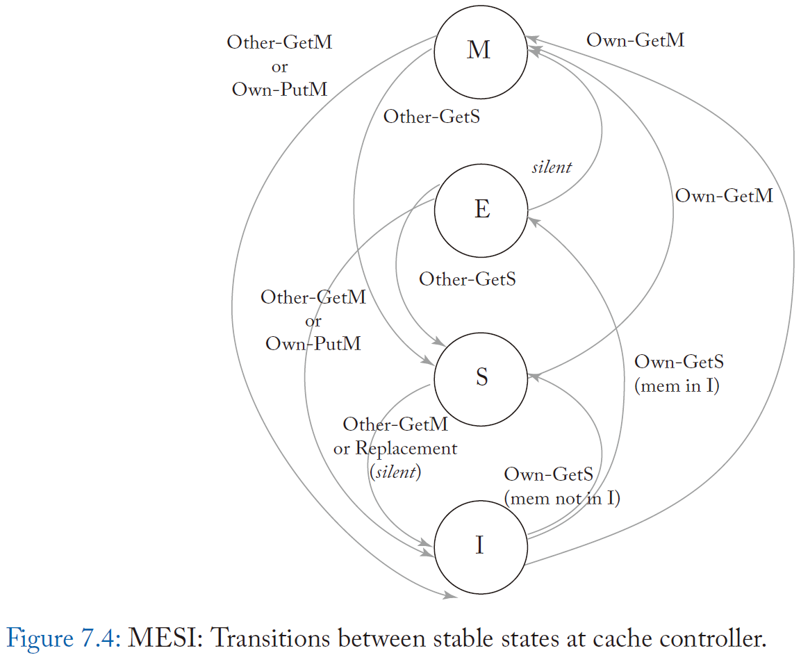

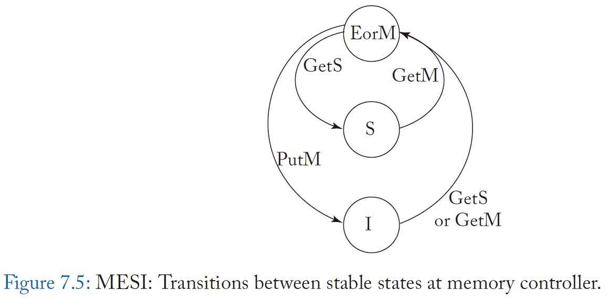

LLC/内存有一种比 MSI 协议更稳定的状态。 LLC/内存现在必须区分零个或多个缓存共享的块（保守的 S 状态）和根本不共享的块（I），而不是像在 MSI 协议中那样将它们合并为一个状态 .

在本入门手册中，我们将 E 状态视为所有权状态，这对协议具有重大影响。 但是，有些协议不将 E 状态视为所有权状态，侧边栏讨论了此类协议中涉及的问题。

> **侧边栏：如果 E 是非所有权状态，则 MESI Snooping**
> 如果 E 状态不被视为所有权状态（即，E 中的一个块由 LLC/内存拥有），那么协议必须确定在内存控制器将一个块给一个块后，哪个一致性控制器应该响应一个请求。 状态 E 中的缓存。因为从状态 E 到状态 M 的转换是静默的，所以内存控制器无法知道缓存是否将块保存在 E 中（在这种情况下 LLC/内存是所有者），或者在 M 中，在这种情况下 缓存是所有者。 如果此时总线上序列化了 GetS 或 GetM，则缓存可以轻松确定它是否是所有者并应该响应，但内存控制器无法做出相同的确定。
> 此问题的一种解决方案是让 LLC/内存等待缓存响应。 当 GetS 或 GetM 在总线上被序列化时，块处于状态 M 的缓存会以数据响应。 内存控制器等待一段固定的时间，如果在那个时间窗口内没有响应出现，内存控制器就会推断它是所有者并且它必须响应。 如果确实出现了来自缓存的响应，则内存控制器不会响应一致性请求。 该解决方案有几个缺点，包括可能会增加内存响应的延迟。 一些实现通过从内存中推测性地预取块来隐藏部分或全部延迟，代价是增加内存带宽、功率和能量。 一个更显着的缺点是必须将系统设计为缓存的响应延迟是可预测的和短的。

#### 7.3.4 详细规格

在表 7.11 和 7.12 中，我们提供了 MESI 协议的详细规范，包括瞬态。 与 MSI 协议的差异以粗体突出显示。 该协议将稳定 E 状态和瞬态 EIA 添加到缓存状态集，但还有更多 LLC/内存状态，包括额外的瞬态。

此 MESI 协议共享基线 MSI 协议中存在的所有相同简化。 一致性事务仍然是原子的，等等。

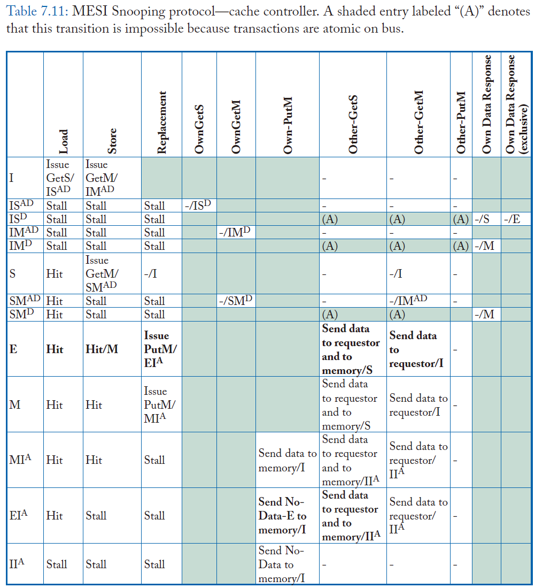

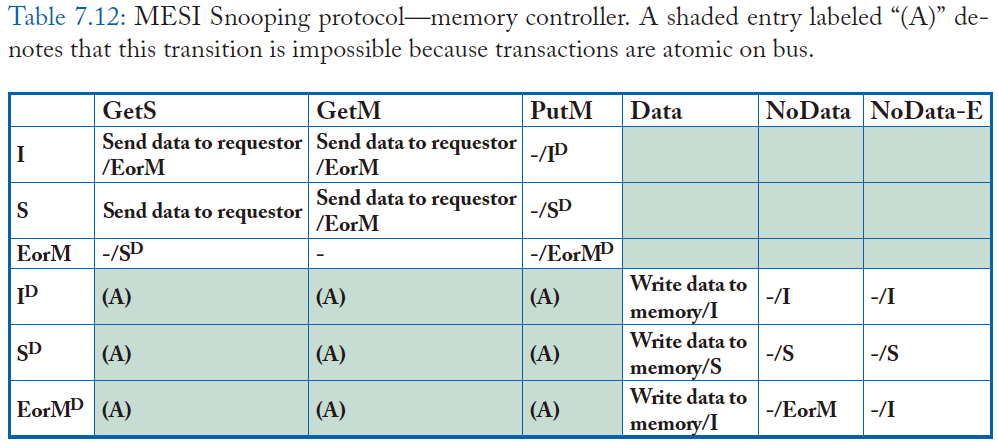


#### 7.3.5 运行示例

我们现在返回到运行示例，如表 7.13 所示。 执行几乎立即与 MSI 协议不同。 当 C1 的 GetS 出现在总线上时，LLC/内存处于状态 I，因此可以发送 C1 独占数据。 C1 观察总线上的 Exclusive 数据并将其状态更改为 E（而不是 MSI 协议中的 S）。 其余的执行过程与 MSI 示例类似，只是瞬态差异很小。

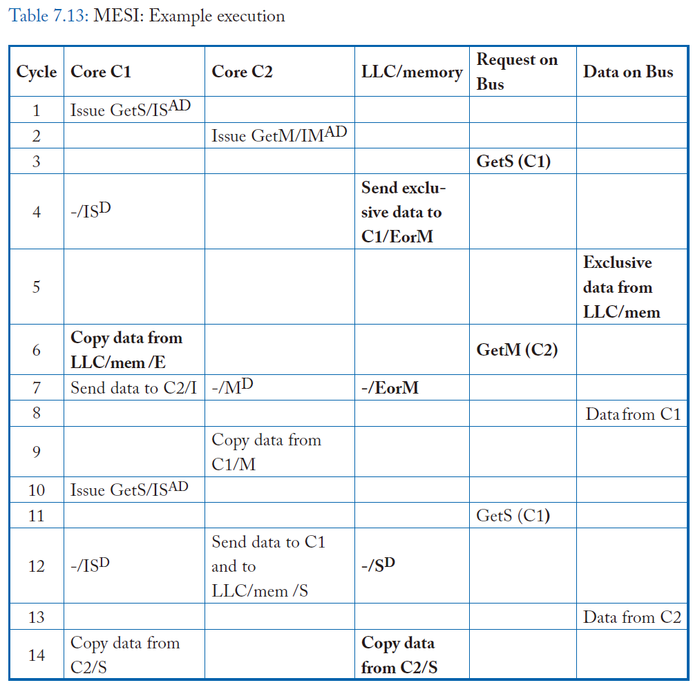

### 7.4 添加OWNED状态

第二个重要的优化是拥有 (Owned) 状态，在本节中，我们将描述如何通过使用 O 状态扩充第 7.2.3 节中的基线协议来创建 MOSI 侦听协议。 回忆第 6 章，如果缓存中有一个处于 Owned 状态的块，那么该块是有效的、只读的、脏的，并且缓存是所有者，即缓存必须响应对该块的一致性请求。 我们维护与基线监听 MSI 协议相同的系统模型； 事务是原子的，但请求不是原子的。

#### 7.4.1 动机

与 MSI 或 MESI 协议相比，添加 O 状态在一种特定且重要的情况下是有利的：当缓存具有处于状态 M 或 E 的块并从另一个内核接收 GetS 时。 在第 7.2.3 节的 MSI 协议和第 7.3 节的 MESI 协议中，缓存必须将块状态从 M 或 E 更改为 S，并将数据发送给请求者和内存控制器。 必须将数据发送到内存控制器，因为响应缓存放弃所有权（通过降级到状态 S），并且 LLC/内存成为所有者，因此必须为后续请求具有要响应的数据的最新副本。

添加 O 状态有两个好处：（1）当缓存在 M（和 E）状态下接收到 GetS 请求时，它消除了更新 LLC/内存的额外数据消息，以及（2）它消除了可能不必要的写入 LLC（如果块在被写回 LLC 之前被再次写入）。 从历史上看，对于多芯片多处理器来说，还有第三个好处，那就是 O 状态允许缓存而不是速度慢得多的内存来满足后续请求。 今天，在具有包容性 LLC 的多核中，如本入门中的系统模型一样，LLC 的访问延迟几乎没有片外 DRAM 存储器的访问延迟那么长。 因此，使用缓存而不是 LLC 响应不如缓存响应而不是内存带来的好处大。

我们现在提出一个 MOSI 协议并展示它如何实现这两个好处。

#### 7.4.2 高级协议规范

我们在图 7.6 和 7.7 中指定了稳定状态之间转换的高级视图。 关键的区别在于当一个块处于状态 M 的缓存从另一个内核接收到 GetS 时会发生什么。 在 MOSI 协议中，缓存将块状态更改为 O（而不是 S）并保留块的所有权（而不是将所有权转移到 LLC/内存）。 因此，O 状态使缓存能够避免更新 LLC/内存。

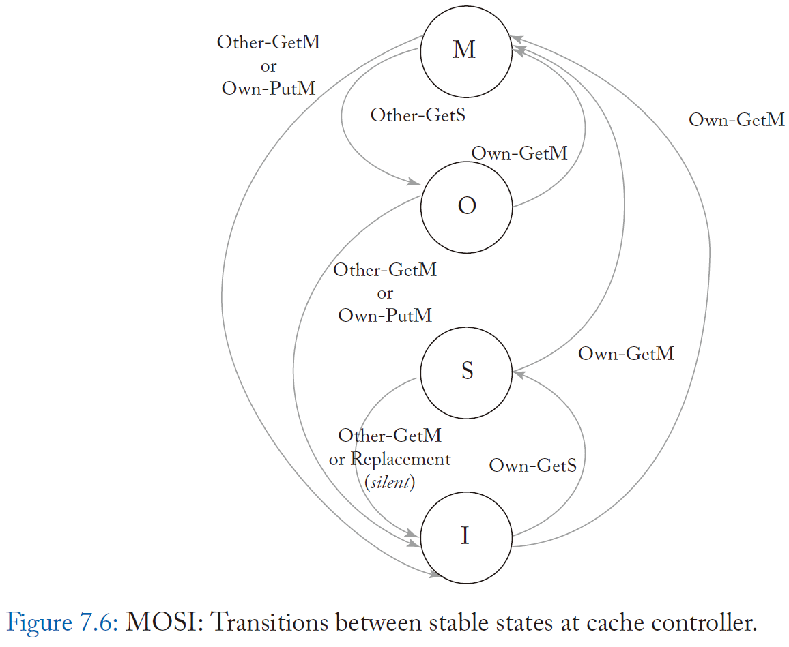

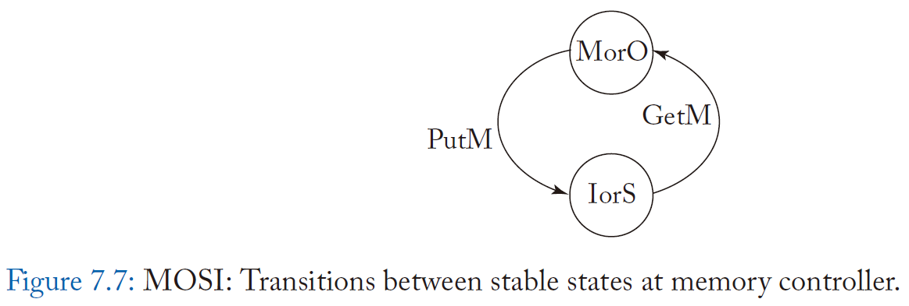

#### 7.4.3 详细的协议规范

在表 7.14 和 7.15 中，我们提供了 MOSI 协议的详细规范，包括瞬态。 与 MSI 协议的差异以粗体突出显示。 除了稳定的 O 状态外，该协议还添加了两个临时缓存状态。 瞬态 OI<sup>A</sup> 状态帮助处理状态 O 中块的替换，瞬态 OM<sup>A</sup> 状态处理在存储后升级回状态 M。 内存控制器没有额外的瞬态，但我们将 M 状态重命名为 MorO，因为内存控制器不需要区分这两种状态。

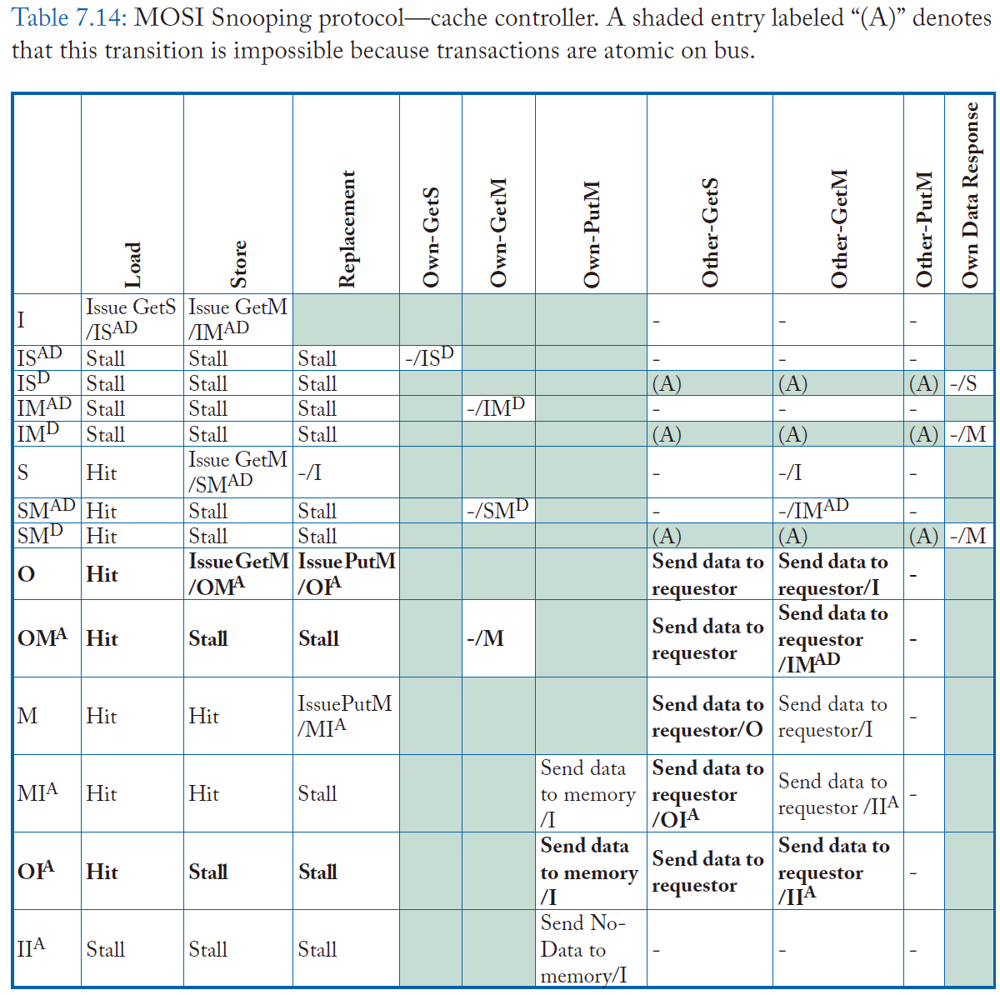

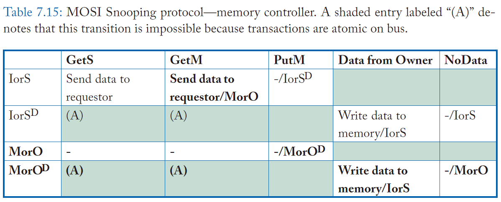

为了使规范尽可能简洁，我们将 PutM 和 PutO 事务合并为单个 PutM 事务。 也就是说，缓存使用 PutM 驱逐处于状态 O 的块。 这个决定对协议的功能没有影响，但有助于保持表格规范的可读性。

该 MOSI 协议共享基线 MSI 协议中存在的所有相同的简化。 一致性事务仍然是原子的，等等。

#### 7.4.4 运行示例

在表 7.16 中，我们返回到我们为 MSI 协议引入的运行示例。 该示例与 MSI 示例相同，直到 C1 的第二个 GetS 出现在总线上。 在 MOSI 协议中，这第二个 GetS 导致 C2 响应 C1 并将其状态更改为 O（而不是 S）。 C2 保留块的所有权并且不需要将数据复制回 LLC/内存（除非并且直到它驱逐块，未显示）。

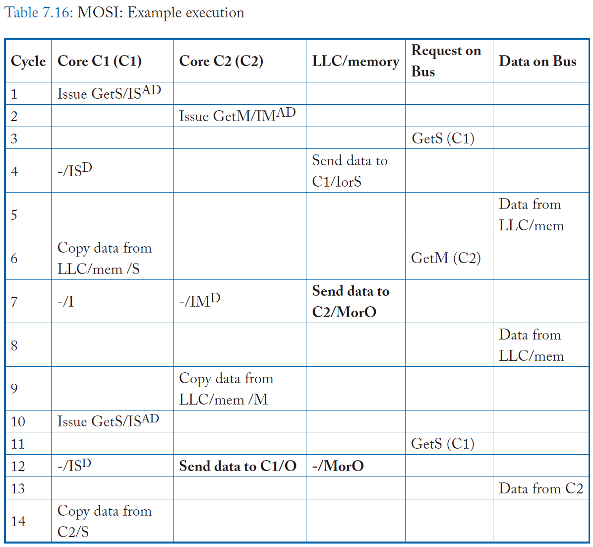

### 7.5 非原子总线

基线 MSI 协议以及 MESI 和 MOSI 变体都依赖于原子事务假设。 这种原子性极大地简化了协议的设计，但牺牲了性能。

#### 7.5.1 动机

实现原子事务的最简单方法是使用具有原子总线协议的共享线路总线； 也就是说，所有总线事务都由不可分割的请求-响应对组成。 拥有原子总线类似于拥有非流水线处理器内核； 没有办法重叠可以并行进行的活动。 图 7.8 说明了原子总线的操作。 因为一致性事务占用总线直到响应完成，原子总线简单地实现原子事务。 然而，总线的吞吐量受限于请求和响应的延迟总和（包括请求和响应之间的任何等待周期，未显示）。 考虑到可以由片外存储器提供响应，这种延迟会成为总线性能的瓶颈。

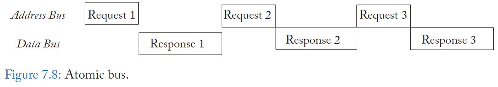

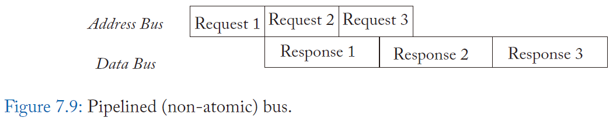

图 7.9 说明了流水线非原子总线的操作。 关键优势是不必等待响应才能在总线上串行化后续请求，因此总线可以使用相同的共享线路集实现更高的带宽。 然而，实现原子事务变得更加困难（但并非不可能）。 原子交易属性将并发交易限制在同一个区块，而不是不同的区块。 SGI 挑战使用快速查表在流水线总线上强制执行原子事务，以检查另一个事务是否已经为同一块挂起。

#### 7.5.2 按序 VS 无序响应

非原子总线的一个主要设计问题是它是流水线还是拆分事务。 如图 7.9 所示，流水线总线以与请求相同的顺序提供响应。 拆分事务总线，如图 7.10 所示，可以以不同于请求顺序的顺序提供响应。

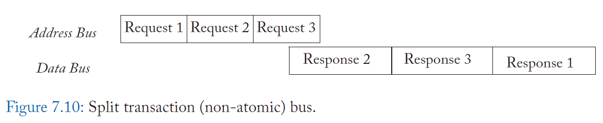

与流水线总线相比，拆分事务总线的优势在于低延迟响应不必等待对先前请求的长延迟响应。 例如，如果请求 1 是针对内存拥有的块并且不存在于 LLC 中，而请求 2 是针对片上缓存拥有的块，则强制响应 2 等待响应 1，因为流水线总线需要 , 会导致性能损失。

拆分事务总线引发的一个问题是将响应与请求匹配。 对于原子总线，很明显响应对应于最近的请求。 对于流水线总线，请求者必须跟踪未完成请求的数量，以确定哪个消息是对其请求的响应。 对于拆分事务总线，响应必须携带请求或请求者的身份。

#### 7.5.3 非原子系统模型

我们假设一个系统如图 7.11 所示。 请求总线和响应总线是分开的，独立运行。 每个一致性控制器都有与两条总线的连接，除了内存控制器没有连接来发出请求。 我们绘制 FIFO 队列来缓冲传入和传出的消息，因为在一致性协议中考虑它们很重要。 值得注意的是，如果一致性控制器在处理来自请求总线的传入请求时停顿，那么它后面的所有请求（在停顿的请求之后序列化）将不会被该一致性控制器处理，直到它处理当前停顿的请求。 无论消息类型或地址如何，这些队列都以严格的 FIFO 方式进行处理。

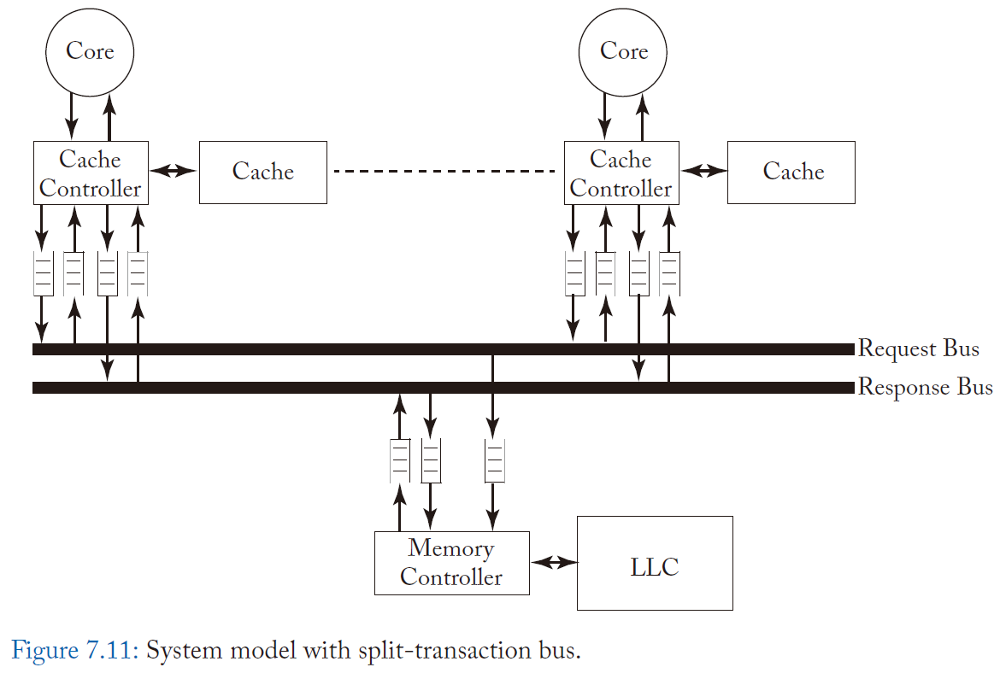

#### 7.5.4 具有拆分事务总线的 MSI 协议

在本节中，我们修改了基线 MSI 协议，以便在具有拆分事务总线的系统中使用。 拥有拆分事务总线不会改变稳定状态之间的转换，但它对详细实现有很大影响。 特别是，还有更多可能的转换。

在表 7.17 和 7.18 中，我们指定了协议。 现在可以进行一些原子总线无法实现的转换。 例如，缓存现在可以接收处于 IS<sup>D</sup> 状态的块的其他 GetS。 所有这些新可能的转换都是针对处于暂态状态的块，在这种状态下缓存正在等待数据响应； 在等待数据时，缓存首先观察另一个对该块的一致性请求。 回想一下 7.1 节，事务的排序基于其请求在总线上的排序时间，而不是数据到达请求者的时间。 因此，在这些新的可能转换中的每一个中，缓存已经有效地完成了其事务，但恰好还没有数据。 回到我们的 ISD 示例，缓存块实际上在 S 中。因此，处于此状态的其他 GetS 的到达不需要采取任何操作，因为在 S 中具有块的缓存不需要响应其他 GetS。

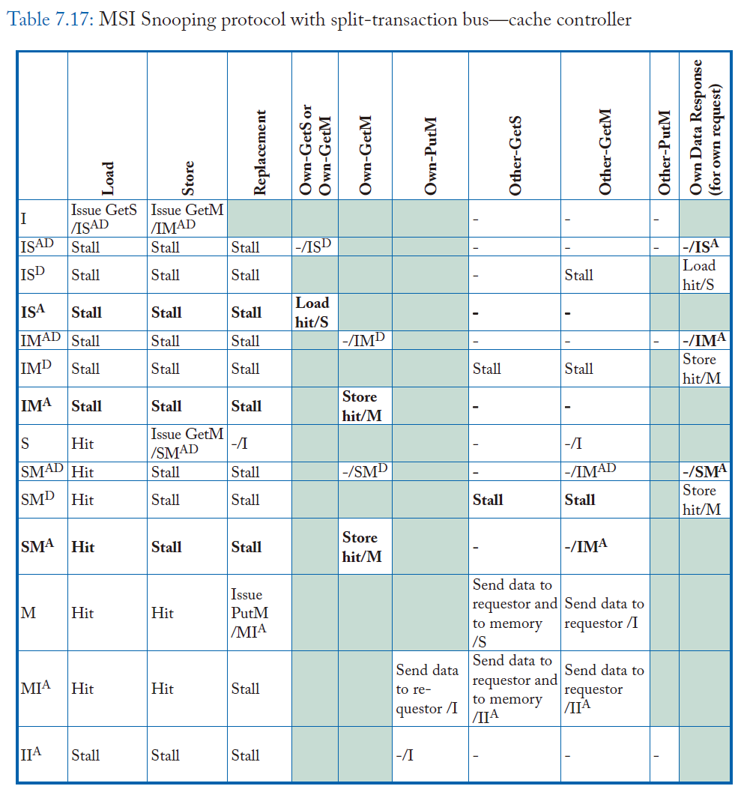

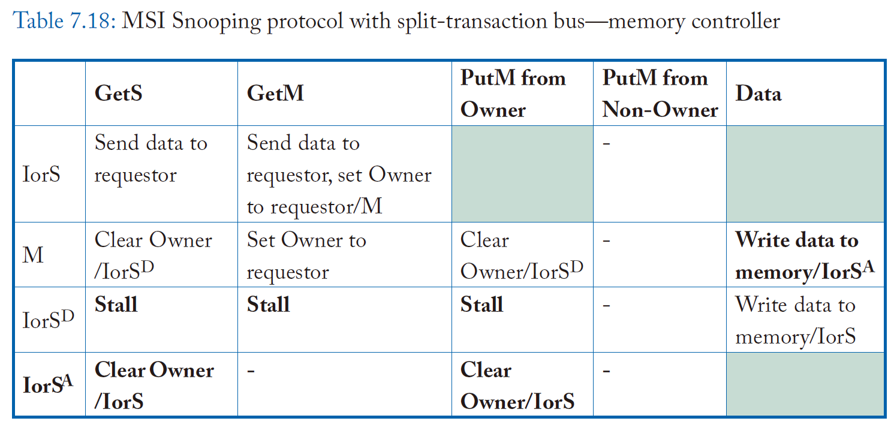

然而，除上述示例之外的新可能转换更为复杂。 当在总线上观察到 Other-GetS 时，考虑处于 IMD 状态的高速缓存中的块。 缓存块实际上处于状态 M，因此缓存是块的所有者，但还没有块的数据。 因为缓存是所有者，所以缓存必须响应Other-GetS，而缓存直到收到数据才能响应。 对于这种情况，最简单的解决方案是让缓存停止其他 GetS 的处理，直到针对其 Own-GetM 的数据响应到达。 此时，缓存块将更改为状态 M，并且缓存将有有效数据要发送给 Other-GetS 的请求者。

对于其他新可能的转换，在缓存控制器和内存控制器，我们也选择停止直到数据到达以满足进行中的请求。 这是最简单的方法，但它引发了三个问题。 首先，它牺牲了一些性能，我们将在下一节中讨论。

其次，拖延会增加死锁的可能性。 如果控制器在等待另一个事件（消息到达）时可以暂停消息，则架构师必须确保等待的事件最终会发生。 摊位的圆形链会导致死锁，必须避免。 在我们本节的协议中，停顿的控制器保证收到取消停顿的消息。 这个保证很容易看出来，因为控制器已经看到了自己的请求，停顿只影响请求网络，控制器正在等待响应网络上的数据消息。

延迟一致性请求引起的第三个问题是，也许令人惊讶的是，它使请求者能够在处理自己的请求之前观察对其请求的响应。考虑表 7.19 中的示例。核心 C1 为块 X 发出 GetM 并将 X 的状态更改为 IMAD。 C1 在总线上观察其 GetM 并将状态更改为 IMD。 LLC/内存是X的所有者，需要很长时间才能从内存中检索数据并将其放到总线上。与此同时，核心 C2 为 X 发出一个 GetM，它在总线上被序列化，但不能被 C1 处理（即 C1 停顿）。 C1 为块 Y 发出一个 GetM，然后在总线上序列化。这个用于 Y 的 GetM 在 C1 之前停止的一致性请求（来自 C2 的 GetM）之后排队，因此 C1 无法处理它自己的用于 Y 的 GetM。但是，所有者 C2 可以处理这个用于 Y 的 GetM 并快速响应 C1 .因此，C1 可以在处理它的请求之前观察对它的 GetM 的响应。这种可能性需要添加瞬态。在此示例中，核心 C1 将块 Y 的状态从 IMAD 更改为 IMA。同样，该协议还需要添加瞬态ISA和SMA。在这些瞬态状态中，在请求之前观察到响应，块实际上处于先前状态。例如，IMA 中的块在逻辑上处于状态 I，因为尚未处理 GetM；如果块在 IMA 中，缓存控制器不会响应观察到的 GetS 或 GetM。我们将 IMA 与 IMD 进行对比——在 IMD 中，块在逻辑上位于 M 中，一旦数据到达，缓存控制器必须响应观察到的 GetS 或 GetM 请求。

该协议与本章之前的协议还有一个区别，区别在于 PutM 事务。处理方式不同的情况是，当一个核心（例如核心 C1）发出 PutM 时，同一块的另一个核心发出的 GetS 或 GetM 在 C1 的 PutM 之前被排序。 C1 在观察到它自己的 PutM 之前从状态 MIA 转换到 IIA。在本章前面的原子协议中，C1 观察自己的 PutM 并向 LLC/内存发送 NoData 消息。 NoData 消息通知 LLC/内存 PutM 事务已完成（即，它不必等待数据）。在这种情况下，C1 无法向 LLC/内存发送数据消息，因为 C1 的数据是陈旧的，协议无法发送 LLC/内存陈旧数据，然后会覆盖数据的最新值。在本章的非原子协议中，我们用一个字段来增加 LLC 中每个块的状态，该字段包含块当前所有者的身份。 LLC 在每次更改区块所有权的交易中更新区块的所有者字段。使用所有者字段，LLC 可以识别在总线上订购来自非所有者的 PutM 的情况；这与 C1 在观察其 PutM 时处于状态 IIA 的情况完全相同。因此，LLC 知道发生了什么，C1 不必向 LLC 发送 NoData 消息。与原子协议相比，为了简单起见，我们选择修改非原子协议中处理 PutM 事务的方式。允许 LLC 直接识别这种情况比要求使用 NoData 消息更简单；对于非原子协议，系统中可能存在大量 NoData 消息，并且 NoData 消息可以在其关联的 PutM 请求之前到达。

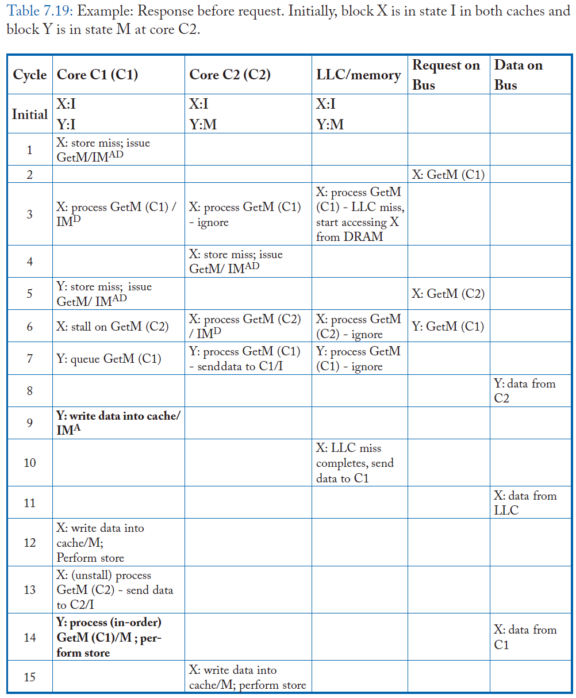

#### 7.5.5 具有拆分事务总线的优化的、非停滞的 MSI 协议

如前一节所述，我们通过使用拆分事务总线拖延系统新可能的转换而牺牲了一些性能。 例如，一个块处于 ISD 状态的缓存停止而不是处理该块的其他-GetM。 但是，在 Other-GetM 之后可能会有一个或多个请求到其他块，缓存可以在不停止的情况下进行处理。 通过停止请求，协议在停止的请求之后停止所有请求，并延迟这些事务的完成。 理想情况下，我们希望一个一致性控制器在一个被停止的请求之后处理请求，但请记住——为了支持内存请求的总顺序——监听需要一致性控制器按照接收到的顺序观察和处理请求。 不允许重新排序。

这个问题的解决方案是按顺序处理所有消息，而不是停滞。 我们的方法是添加反映一致性控制器已收到但必须记住在以后的事件中完成的消息的瞬态状态。 回到ISD中缓存块的例子，如果缓存控制器观察到总线上的Other-GetM，那么它将块状态更改为ISDI（这表示“在I中，去S，等待数据，当数据 到达将去我”）。 类似地，IMD 中收到Other-GetS 的块将状态更改为IMDS，并且必须记住Other-GetS 的请求者。 当数据到达响应缓存的 GetM 时，缓存控制器将数据发送到其他-GetS 的请求者并将块的状态更改为 S。

除了瞬态的扩散之外，非停滞协议还引入了潜在的活锁问题。 考虑在 IMDS 中具有块的缓存，该块接收数据以响应其 GetM。 如果缓存立即将块状态更改为 S 并将数据发送到 Other-GetS 的请求者，则它不会执行最初为其发出 GetM 的存储。 如果内核随后重新发出 GetM，则可能会一次又一次地出现相同的情况，并且存储可能永远不会执行。 为了保证不会出现这种活锁，我们要求 ISDI、IMDI、IMDS 或 IMDSI（或具有附加稳定一致性状态的协议中的任何类似状态）中的缓存在接收到数据时对块执行一次加载或存储 它的请求。6 在执行一次加载或存储后，它可能会改变状态并将块转发到另一个缓存。 我们将更深入的活锁处理推迟到第 9.3.2 节。

我们在表 7.20 和 7.21 中提供了非停顿 MSI 协议的详细规范。 最明显的区别是瞬态的数量。 这些状态中的任何一个都没有本质上的复杂性，但它们确实增加了协议的整体复杂性。

我们没有从内存控制器中移除停顿，因为它不可行。 考虑 IorSD 中的一个块。 内存控制器观察到来自核心 C1 的 GetM 并且当前停止。

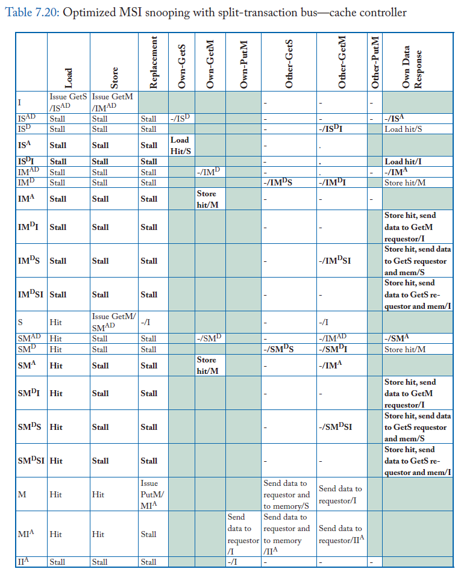

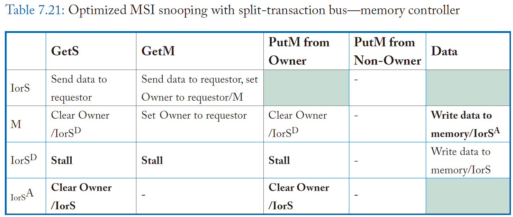

但是，看起来我们可以在等待数据时简单地将块的状态更改为 IorSDM。 然而，在 IorSDM 中，内存控制器可以观察到来自核心 C2 的 GetS。 如果内存控制器没有在这个 GetS 上停顿，它必须将块状态更改为 IorSDMIorSD。 在这种状态下，内存控制器可以观察到来自核心 C3 的 GetM。 没有优雅的方法可以将 LLC/内存所需的瞬态数量限制为一个较小的数量（即小于内核数量），因此，为简单起见，我们有内存控制器停顿。


### 7.6 对总线互连网络的优化

到目前为止，在本章中，我们假设了系统模型，其中存在用于一致性请求和响应的单个共享线总线或用于请求和响应的专用共享线总线。 在本节中，我们将探讨另外两种可以提高性能的可能系统模型。

#### 7.6.1 用于数据响应的独立非总线网络

我们已经强调了侦听系统提供广播一致性请求的总顺序的必要性。 表 7.2 中的示例显示了缺乏一致性请求的总顺序如何导致不一致。 然而，不需要对一致性响应进行排序，也不需要广播它们。 因此，一致性响应可以在不支持广播或排序的单独网络上传播。 此类网络包括横杆、网格、圆环、蝴蝶等。

使用单独的非总线网络进行相干响应有几个优点。

- 可实现性：高速共享线总线很难实现，特别是对于总线上有很多控制器的系统。 其他拓扑可以使用点对点链接。
- 吞吐量：总线一次只能提供一个响应。 其他拓扑可以一次有多个响应。
- 延迟：使用总线进行一致性响应要求每个响应都会产生延迟以对总线进行仲裁。 其他拓扑可以允许立即发送响应而无需仲裁。

#### 7.6.2 一致性请求的逻辑总线

侦听系统要求存在广播一致性请求的总顺序。 用于一致性请求的共享线路总线是实现这种广播总顺序的最直接方式，但它不是实现此目的的唯一方式。 有两种方法可以在没有物理总线的情况下实现与总线（即逻辑总线）相同的完全有序的广播属性。

- 具有物理全序的其他拓扑：共享线路总线是实现广播全序的最明显的拓扑，但也存在其他拓扑。 一个值得注意的例子是一棵树，在树的叶子上有一致性控制器。 如果所有的一致性请求都被单播到树的根部，然后向下广播，那么每个一致性控制器都会观察到相同的一致性广播的总顺序。 此拓扑中的序列化点是树的根。 Sun Microsystems 在其 Starfire 多处理器 [3] 中使用了树形拓扑结构，我们将在第 7.7 节中详细讨论。
- 逻辑全序：即使没有自然提供这种顺序的网络拓扑，也可以获得广播的全序。 关键是按逻辑时间对请求进行排序。 马丁等人。 [6] 设计了一种侦听协议，称为时间戳侦听，可以在任何网络拓扑上运行。 为了发出一致性请求，缓存控制器将它广播到每个一致性控制器，并用应该对广播消息进行排序的逻辑时间标记广播。 协议必须确保 (a) 每个广播都有一个不同的逻辑时间，(b) 一致性控制器按逻辑时间顺序处理请求（即使它们在物理时间到达时不按此顺序），以及 (c) 在逻辑时间没有请求 T 可以在控制器经过逻辑时间后到达控制器。 Agarwal 等人。 提出了一种类似的方案，称为网络内窥探订购（INSO）[1]。

> **闪回测验问题 7：** 侦听缓存一致性协议要求内核在总线上进行通信。 对或错？
> **回答：** 错！ 侦听需要一个完全有序的广播网络，但该功能可以在没有物理总线的情况下实现。

TODO:

## 8 目录一致性协议

在本章中，我们将介绍目录一致性协议。目录协议最初是为了解决侦听协议缺乏可扩展性而开发的。传统的侦听系统在完全有序的互连网络上广播所有请求，并且所有请求都由所有一致性控制器侦听。相比之下，目录协议使用间接级别来避免有序广播网络和让每个缓存控制器处理每个请求。

我们首先在高层介绍目录协议（第 8.1 节）。然后，我们展示了一个具有完整但简单的三态 (MSI) 目录协议的系统（第 8.2 节）。该系统和协议作为我们稍后添加系统功能和协议优化的基准。然后我们解释如何将独占状态（第 8.3 节）和拥有状态（第 8.4 节）添加到基线 MSI 协议中。接下来我们将讨论如何表示目录状态（第 8.5 节）以及如何设计和实现目录本身（第 8.6 节）。然后我们描述了用于提高性能和降低实现成本的技术（第 8.7 节）。然后我们讨论带有目录协议的商业系统（第 8.8 节），然后以讨论目录协议及其未来（第 8.9 节）结束本章。

那些只想学习目录一致性协议基础知识的读者可以略读或跳过第 8.3 节到第 8.7 节，尽管这些节中的一些材料将帮助读者更好地理解第 8.8 节中的案例研究。

### 8.1 目录协议简介

目录协议的关键创新是建立一个目录，该目录维护每个块的一致性状态的全局视图。目录跟踪哪些缓存保存每个块以及处于什么状态。想要发出一致性请求（例如，GetS）的缓存控制器将其直接发送到目录（即单播消息），目录会查找块的状态以确定接下来要执行的操作。例如，目录状态可能表明请求的块由核心C2的缓存拥有，因此应将请求转发给C2（例如，使用新的Fwd-GetS请求）以获取块的副本。当C2的缓存控制器收到这个转发的请求时，它会向发出请求的缓存控制器单播一个响应。

比较目录协议和窥探协议的基本操作是有指导意义的。在目录协议中，目录维护每个块的状态，缓存控制器将所有请求发送到目录。目录要么响应请求，要么将请求转发给一个或多个其他一致性控制器，然后响应。一致性事务通常涉及两步（单播请求，然后是单播响应）或三步（单播请求、$K \gt 1$转发请求和 K 响应，其中 K 是共享者的数量）。有些协议甚至还有第四步，要么是因为通过目录间接响应，要么是因为请求者在事务完成时通知目录。相比之下，侦听协议可能会在所有一致性控制器之间分配块的状态。由于此分布式状态没有中央总结，因此必须将一致性请求广播到所有一致性控制器。因此，侦听一致性事务总是涉及两个步骤（广播请求，然后是单播响应）。

与侦听协议一样，目录协议需要定义一致性事务何时以及如何相对于其他事务进行排序。在大多数目录协议中，一致性事务在目录中被排序。多个一致性控制器可以同时向目录发送一致性请求，事务顺序由请求在目录中序列化的顺序决定。如果两个请求争用目录，互连网络将有效地选择目录将首先处理哪个请求。第二个到达的请求的命运取决于目录协议以及正在竞争的请求类型。第二个请求可能会 (a) 在第一个请求之后立即得到处理，(b) 在等待第一个请求完成时保留在目录中，或者 (c) 否定确认 (NACKed)。在后一种情况下，目录向请求者发送否定确认消息 (NACK)，并且请求者必须重新发出其请求。在本章中，我们不考虑使用 NACK 的协议，但我们会在第 9.3.2 节中讨论 NACK 的可能用途以及它们如何导致活锁问题。

使用目录作为排序点代表了目录协议和侦听协议之间的另一个关键区别。传统的侦听协议通过序列化有序广播网络上的所有事务来创建总顺序。Snooping的总顺序不仅确保每个块的请求按每个块的顺序处理，而且有助于实现内存一致性模型。回想一下，传统的侦听协议使用完全有序的广播来序列化所有请求； 因此，当一个请求者观察到它自己的一致性请求时，这作为它的一致性时期可能开始的通知。 特别是，当监听控制器看到自己的 GetM 请求时，它可以推断其他缓存将使其 S 块无效。 我们在表 7.4 中证明了这个序列化通知足以支持强 SC 和 TSO 内存一致性模型。

相比之下，目录协议对目录中的事务进行排序，以确保所有节点按每个块的顺序处理冲突请求。 然而，缺少全序意味着目录协议中的请求者需要另一种策略来确定其请求何时被序列化，从而何时可以安全地开始其一致性时期。 因为（大多数）目录协议不使用完全有序的广播，所以没有序列化的全局概念。相反，一个请求必须针对所有（可能）拥有该块副本的缓存进行单独序列化。 需要显式消息来通知请求者其请求已被每个相关缓存序列化。 特别是，在 GetM 请求中，每个具有共享 (S) 副本的缓存控制器在序列化无效消息后都必须发送显式确认 (Ack) 消息。

目录和窥探协议之间的这种比较突出了它们之间的基本权衡。 目录协议以间接级别（即，对于某些事务具有三个步骤而不是两个步骤）为代价实现了更大的可扩展性（即，因为它需要更少的带宽）。 这种额外的间接级别增加了一些一致性事务的延迟。

### 8.2 基线目录系统

在本节中，我们展示了一个带有简单、适度优化的目录协议的基线系统。 该系统提供了对目录协议关键特性的洞察，同时揭示了激励本章后续部分中介绍的特性和优化的低效率。

#### 8.2.1 目录系统模型

我们在图 8.1 中说明了我们的目录系统模型。 与侦听协议不同，互连网络的拓扑结构是故意模糊的。 它可以是网格、环面或架构师希望使用的任何其他拓扑。 我们在本章中假设的互连网络的一个限制是它强制执行点对点排序。 也就是说，如果控制器 A 向控制器 B 发送两条消息，那么这些消息将按照它们发送的相同顺序到达控制器 B。点对点排序降低了协议的复杂性，我们暂缓讨论 在第 8.7.3 节之前没有排序的网络。

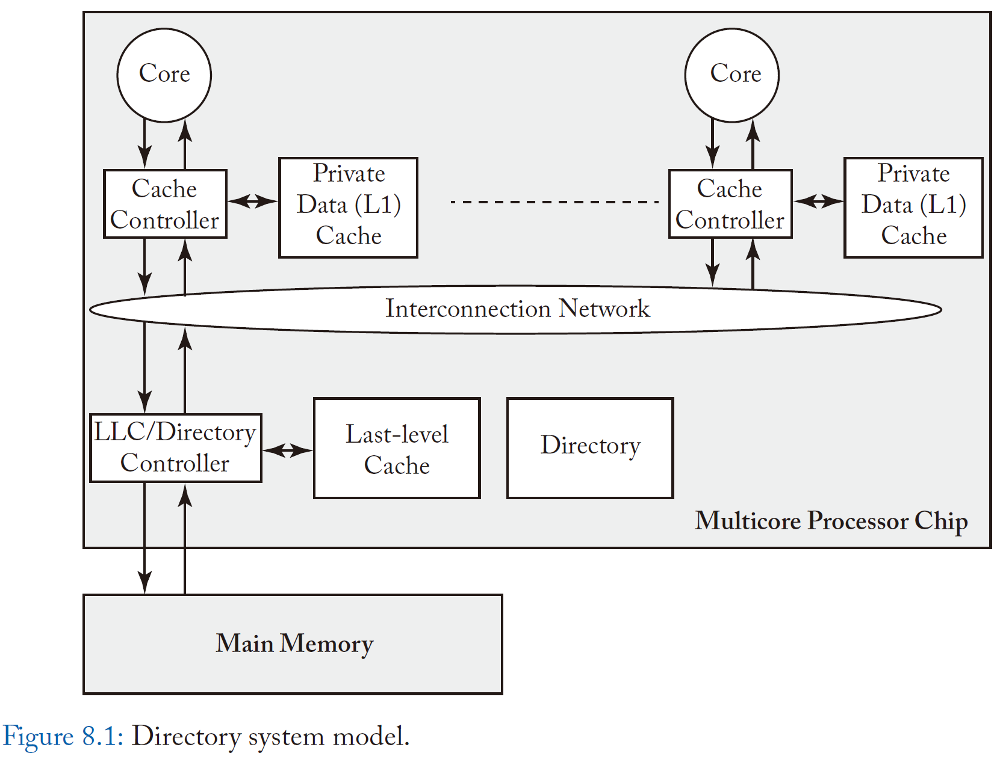

此目录系统模型与图 2.1 中的基线系统模型之间的唯一区别是我们添加了一个目录并将内存控制器重命名为目录控制器。 有多种调整目录大小和组织目录的方法，现在我们假设最简单的模型：对于内存中的每个块，都有一个对应的目录条目。 在第 8.6 节中，我们检查并比较了更实用的目录组织选项。 我们还假设一个具有单个目录控制器的整体 LLC； 在第 8.7.1 节中，我们解释了如何在 LLC 的多个银行和多个目录控制器之间分发此功能。

### 8.2.2 高级协议规范

基线目录协议只有三个稳定状态：MSI。除非块处于状态M的缓存中，否则块归目录控制器所有。每个块的目录状态包括稳定一致性状态、所有者的身份（如果块处于状态M）以及编码为一个单热位向量的共享器标识（如果块处于状态S）。我们在图 8.2中说明了一个目录条目。在第 8.5 节中，我们将讨论目录条目的其他编码。

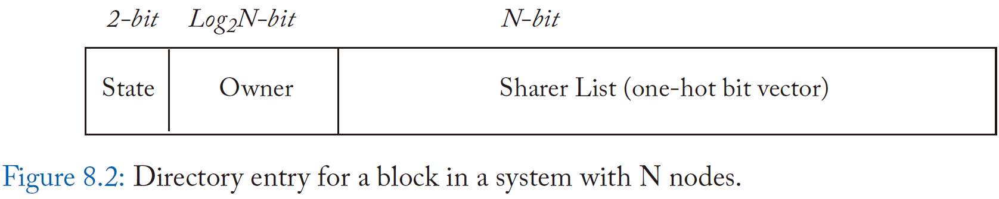