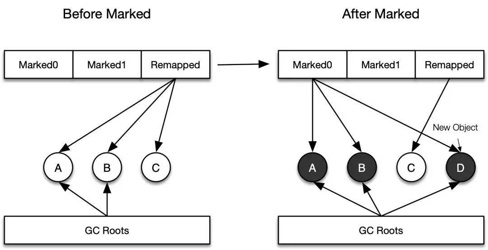
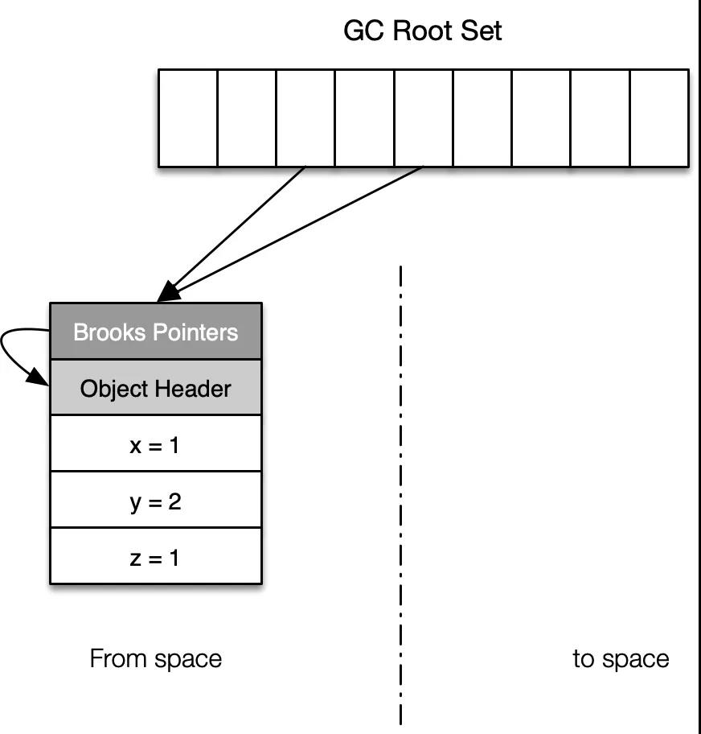

> 简介：上一篇《底层原理：垃圾回收算法是如何设计的？》介绍了垃圾回收的基本原理，以及若干种基本算法和优化算法，这部分内容属于垃圾回收的方法论。下面将结合业界目前垃圾回收器的发展方向，介绍几种较前沿的垃圾回收器，以便于加深对垃圾回收算法的理解。

点击阅读上篇：底层原理：垃圾回收算法是如何设计的？[https://developer.aliyun.com/ar](https://link.zhihu.com/?target=https%3A//developer.aliyun.com/article/777750)

注：如无特别说明，本文中垃圾回收器的内容都是基于 HotSpot Java 虚拟机展开的。

## 一、 垃圾回收器简介

工业界的垃圾回收器，一般都是上篇中几种垃圾回收算法的组合实现。下图中列举了最常见及最新的几种垃圾回收器，大多数的垃圾回收器均采用了分代设计（或者适用于分代场景），且一般有固定的搭配使用模式，每种垃圾回收器的用法和特性在这里就不赘述了，有需要的话可以参考其他资料。图中的垃圾回收器，还需要补充的一些内容有：

- CMS 是适用于老年代的垃圾回收器，虽然在回收过程中可能也会触发新生代垃圾回收。CMS 在 JDK 9中被声明为废弃的，在JDK 14中将被移除；
- Parallel Scavenge 和大部分垃圾回收器都不兼容，原因是其实现未基于 HotSpot VM 框架；
- Parallel Scavenge + Parallel Old 的组合有自适应调节策略，适用于对吞吐量敏感的场景；
- C4 和 ZGC 可以视为是同一种垃圾回收算法的不同实现，ZGC 目前还没有分代设计（规划中）；
- C4、ZGC、Shenandoah GC 的垃圾回收算法在多处是趋同的，同时各自也有比较独特的设计理念。
- G1GC


各种垃圾回收器和垃圾回收算法间的关系如下：

- Serial：标记-复制
- Serial Old：标记-压缩
- ParNew：标记-复制
- Parallel Scavenge：标记-复制
- Parallel Old：标记-压缩
- CMS（Concurrent-Mark-Sweep）：（并发）标记-清除
- G1（Garbage-First）：并发标记 + 并行复制
- ZGC/C4：并发标记 + 并发复制
- Shenandoah GC：并发标记 + 并发复制

可以看到，如果堆空间进行了分代，那么新生代通常采用复制算法，老生代通常采用压缩-复制算法。G1、C4、ZGC、Shenandoah GC 是几种比较新的垃圾回收器，下面会结合算法实现，分别介绍这四种垃圾回收器的核心原理。

## 二、 G1 垃圾回收器

G1是从JDK 7 Update 4及后续版本开始正式提供的，从JDK 9开始G1作为默认的垃圾回收器。

G1 的垃圾回收是分代的，整个堆分成一系列大小相等的分区（Region）。新生代的垃圾回收（Young GC）使用的是并行复制的方式，一旦发生一次新生代回收，整个新生代都会被回收（根据对暂停时间的预测值，新生代的大小可能会动态改变）。老年代回收不会回收全部老年代空间，只会选择一部分收益最高的 Region，回收时一般会搭便车——把待回收的老年代 Region 和所有的新生代 Region 放在一起进行回收，这个过程一般被称为 Mixed GC，Young GC 和 Mixed GC 最大的不同就在于是否回收了老年代的 Region。注意：Young GC 和 Mixed GC 都是在进行对象标记，具体的回收过程与这两个过程是独立的，回收时 GC 线程会根据标记的结果选择部分收益高的 Region 进行复制。从某种角度来说，G1 可视为是一种「标记-复制算法」的实现（注意这里不是压缩算法，因为 G1 的复制过程完全依赖于之前标记阶段对对象生死的判定，而不是自行从 GC Roots 出发遍历对象引用关系图）。

G1 老年代的标记过程大致可以分为下面四个阶段：

1. 初始标记阶段（STW）
2. 并发标记阶段
3. 再标记阶段（STW）
4. 清理阶段（STW）

上面的四个阶段中，有三个阶段都是 STW 的，每个阶段的内容就不具体叙述了。为了降低标记阶段中 STW 的时间，G1 使用了记录集（Remembered Set, RSet）来记录不同代际之间的引用关系。在并发标记阶段，GC 线程和应用线程并发运行，在这个过程中涉及到引用关系的改变，G1 使用了 SATB（Snapshot-At-The-Beginning） 记录并发标记时引用关系的改变，保证并发结束后引用关系的正确性。实现 RSet 和 SATB 的关键就是之前提到的写屏障。

G1 中的写屏障分为 pre_write_barrier 和 post_write_barrier，如下面的代码所示，应用 field 将要被赋予新值 value，由于 field 指向的旧的引用对象会丢失引用关系，因此在赋值之前会触发 pre_write_barrier，更新 SATB 日志记录，记录下引用关系变化时旧的引用值；在正式赋值之后，会执行 post_write_barrier，更新新引用对象所在的 RSet。

G1 中的写屏障分为 pre_write_barrier 和 post_write_barrier，如下面的代码所示，应用 field 将要被赋予新值 value，由于 field 指向的旧的引用对象会丢失引用关系，因此在赋值之前会触发 pre_write_barrier，更新 SATB 日志记录，记录下引用关系变化时旧的引用值；在正式赋值之后，会执行 post_write_barrier，更新新引用对象所在的 RSet。

```c++ {.line-numbers}
// 赋值操作，将 value 赋值给 field 所在的引用
void assign_new_value(oop* field, oop value) {  
  pre_write_barrier(field);         // 步骤1
  *field = value;                   // 步骤2
  post_write_barrier(field, value); // 步骤3
}
```

SATB 和 RSet 的更新都是通过写屏障来实现的，但是更新操作并不都是在屏障里做的，否则会对应用线程造成很大的干扰。G1 中的写屏障实现为线程队列+全局队列的两级结构，当写屏障触发后，记录会首先加入到线程队列（线程队列是独立、定长的）中，线程队列区满了后，就会加入到全局队列区里，换一个新的、干净的队列继续执行下去，全局队列里的记录超过一定的阈值，相关线程就会去做相应处理（更新 RSet 或是将记录压入标记栈中）。

### 2.1 RSet

首先来看一下 RSet，这个数据结构是为了记录对象代际之间的引用关系而提出的，目的是加速垃圾回收的速度。引用关系的记录方式通常有两种方式：「我引用了谁」和「谁引用了我」，前一种记录简单，但是在回收时需要对记录集做全部扫描，后一种记录复杂，占用空间大，但是在回收时只需要关注对象本身，即可通过 RSet 直接定位到引用关系。G1 的 RSet 使用的是后一种「谁引用了我」的记录方式，其数据结构可理解为一个哈希表。每次向引用类型字段赋值时，会触发：「写屏障 -> 线程队列 -> 全局队列 -> 并发 RSet 更新」这样一个过程。

G1 RSet 记录的是对象之间的引用关系，那到底需要记录哪些引用关系呢？

- Region 内部的引用：无需记录，因为垃圾回收时 Region 内对象肯定要扫描的；
- 新生代 Region 间的引用：无需记录，因为新生代在 Young GC 和 Mixed GC 中都会被整体回收：
- 老年代 Region 间的引用：需要记录，因为老年代回收时是按 Region 进行回收的，因此需要记录；
- 新生代 Region 到老年代 Region 的引用：无需记录，Mixed GC 中会把整个新生代作为 GC Roots；
- 老年代 Region 到新生代 Region 的引用：需要记录，Young GC 时直接将这种引用加入 GC Roots。

具体在回收时，RSet 的作用是这样的：进行 Young GC 时，选择新生代所在的 Region 作为 GC Roots，这些 Region 中的 RSet 记录了老年代->新生代的的跨代引用（「谁引用了我」），从而可以避免了扫描整个老年代。进行 Mixed GC 时，「老年代->老年代」之间的引用，可以通过待回收 Region 中的 RSet 记录获得，「新生代->老年代」之间的引用通过扫描全部的新生代获得（前面提到过 Mixed GC 会搭 Young GC 的便车），也不需要扫描全部老年代。总之，引入 RSet 后，GC 的堆扫描范围大大减少了。


### 2.2 SATB

SATB 在算法篇介绍过，其实就是在一次 GC 活动前所有对象引用关系的一个快照。之所以需要快照，是因为并发标记时，GC 线程一边在标记垃圾对象，应用线程一边还在生成垃圾对象，如果我们记录下快照，以及并发标记期间引用发生过变更的对象（包括新增对象和引用发生变更的对象），则我们就可以实现一次完整的标记。

SATB 的过程可以简单理解为：当并发标记阶段引用的关系发生变化时，旧引用所指向的对象就会被标记，同时其子引用对象也会被递归标记，这样快照的完整性就得到保证了。SATB 的记录更新是由 pre_write_barrier 写屏障触发的，下面是 G1 论文中介绍的 SATB 原始表述，具体实现时，还是由两级的队列结构缓存，再由并发标记线程批量处理进入标记队列 satb_mark_queue。

```c++ {.line-numbers}
void pre_write_barrier(oop* field) {  
  oop old_value = *field;  
  if (old_value != null) {  
    if ($gc_phase == GC_CONCURRENT_MARK) {
      $current_thread->satb_mark_queue->enqueue(old_value);  
    }  
  }  
}
```

因此，G1 在结束并发标记后还有一个需要 STW 的再标记（remark）阶段就可以理解了，因为如果不引入一个 STW 的过程，那么新的引用变更会不断产生，永远就无法达成完成标记的条件。再标记阶段，因为有了SATB 的设计，则只需要扫描 satb_mark_queue 队列里的引用变更记录就可以对此次 GC 活动形成完整标记了（可以对比 CMS 的 remark 阶段）。

> Note: 读写屏障都是以mutator线程的工作状态来命名的，mark阶段，GC线程只需要做读操作，但是mutator线程会对引用关系进行修改（写操作）。因此为了保证标记的正确性，需要在mutator执行写操作时增加一些保护机制，即写屏障。在回收复制/整理阶段，GC线程对引用关系进行写操作，此时，mutator线程进行并发读写操作都会发生错误。TODO: 分析实现并发GC复制所需的读写屏障。

## 三、 ZGC/C4 垃圾回收器

G1 目前的发展已经相当成熟了，从众多的测评结果上看，也达到了其最初的设计目标。但是 G1 也有下面这些不足之处：

- 堆利用率不高：原因就是引入的 RSet 占用内存空间较大，一般会达到1%~20%；
- 暂停时间较长：通常 G1 的 STW 时间要达到几十到几百毫秒，还不够低。

G1 由于使用了并发标记，因此标记阶段对暂停时间的影响较小，暂停时间主要来自于标记阶段结束后的 Region 复制（一般占用整个 GC STW 的 80%），这个阶段使用的是复制算法：GC 把一部分 Region 里的活的对象复制到空 Region 里去，然后回收原本的 Region的空间。上述过程是无法并发进行的（并发复制一般需要通过「读屏障」来实现，G1 并未使用），因为需要一边移动对象，同时一边修正指向这些对象的引用（并发期间应用线程可能会访问到这些对象），G1 虽然在复制对象时也做到了并行化，但大量对象的复制会涉及到很多==内存分配、变量复制的操作==，非常耗时。(个人观点：应该还存在并发重定位的开销)

ZGC 就是针对上述 G1 的不足提出的，2017 年 Oracle 将 ZGC 贡献给 OpenJDK 社区，2018年 JEP-333 正式引入：ZGC: A Scalable Low-Latency Garbage Collector (Experimental)。ZGC 的设计思路借鉴了一款商业垃圾回收器——Azul Systems公司的的 C4（Continuously Concurrent Compacting Collector） 垃圾回收器，后者是一款分代式的、并发的、协作式垃圾回收算法，目前只在 Azul System 公司的 Zing JVM 得到实现，详细介绍请参考[论文](http://go.azul.com/continuously-concurrent-compacting-collector)。ZGC 和 C4 背后的算法均是 Azul Systems 很多年前提出的 Pauseless GC，区别在于 C4 是一种分代的实现，而 ZGC 现在还是不分代的。

ZGC 可以视为是一种「标记-复制」算法的并发实现，其中标记阶段是并发的，复制阶段又分为转移（Relocate）和重定位（Remap）两个子阶段，也都是并发的，通过全程并发，可以让暂停时间保持在10ms以内。标记和复制看上去是两个串行的阶段，其实也是有重叠的，譬如重定位（remap）阶段实际上被合并到标记阶段中，即在标记的时候如果发现对象引用到老的地址，这时会先完成重定位更新对象的引用关系，然后再标记对象。

下面具体来看一下 ZGC 是如何高效地设计并发操作的。


### 3.1 算法设计

#### 3.1.1 SATB

ZGC 在进行并发标记和并发复制时也会面临引用关系改变造成的「漏标」和「漏转移」，解决的方法是引入 SATB，和 G1 中通过写屏障实现的 SATB 不同，ZGC 是通过「读屏障」+「多视图映射」来实现 SATB 的。读屏障在算法篇已经介绍过了，它发生在从堆上加载一个对象引用时，后续使用该引用不会触发读屏障。

读屏障是实现 SATB 的关键，除此之外，ZGC 引入读屏障后，也实现了对象的并发复制，弥补了 G1 垃圾回收算法中最大的不足。读屏障和写屏障解决的问题是不一样的，标记-清除算法是不需要读读屏障的，因为没有内存移动的过程（压缩或者复制），但是对于复制算法，如果不用读屏障去跟踪读的情况，并发执行的应用线程可能就会读取到错误的引用。引入读屏障后，GC 线程可以并发执行，应用读取的引用如果发生了转移或者修改，可以在读屏障内完成内存的转移或者重定位，也就不会出现长时间的 STW 了。

可以通过从堆空间中加载对象的执行代码这里对读屏障有更直观的感受，这里调用的load_barrier_on_oop_field_preloaded 就是读屏障。

```c++ {.line-numbers}
template <DecoratorSet decorators, typename BarrierSetT>
template <typename T>
inline oop ZBarrierSet::AccessBarrier<decorators, BarrierSetT>::oop_load_in_heap(T* addr) {
  verify_decorators_absent<ON_UNKNOWN_OOP_REF>();
  const oop o = Raw::oop_load_in_heap(addr);
  return load_barrier_on_oop_field_preloaded(addr, o);
}
```

读屏障触发后，SATB 的具体执行细节就不展开了，SATB 虽然实现的方式不一样，如 G1 中是通过写屏障实现的，但是其核心思想是一致的：标记开始后，把引用关系快照里所有的活对象都看作是活的，如果出现了引用关系变更，则把旧的引用所指向的对象进行标记或记录下来。

读屏障的开销是很大的，因为堆的读操作频率是远高于写操作的，ZGC 是如何对对象进行标记，实现高效的 SATB 算法的呢？答案是上面提到过的「多视图映射」，下面简单介绍下。

#### 3.1.2 多视图映射

和 G1 一样，ZGC 将内存划分成小的分区，在ZGC中称为页面（page），但是 ZGC 中的页面大小并不是固定的，分为小页面、中页面和大页面，其中小页面大小为 2MB，中页面大小为 32MB，而大页面则和操作系统中的大页面的大小一致。

多视图映射指的是在 ZGC 的内存管理中，同一物理地址的对象可以映射到多个虚拟地址上，虚拟地址有 Marked0、Marked1 和 Remapped 三种，在 ZGC 中这三个虚拟空间在同一时间点有且仅有一个空间有效。下表中显示了这三个地址空间的范围，[0~4TB)对应的是Java的堆空间，该虚拟地址对应用程序可见，经 ZGC 映射后，真正使用的就是 Marked0、Marked1 和 Remapped 这三个视图对应的地址空间，这三个视图的切换是由垃圾回收的不同阶段触发的。

```shell {.line-numbers}
+--------------------------------+ 0x0000140000000000 (20TB)
|         Remapped View          |
+--------------------------------+ 0x0000100000000000 (16TB)
|     (Reserved, but unused)     |
+--------------------------------+ 0x00000c0000000000 (12TB)
|         Marked1 View           |
+--------------------------------+ 0x0000080000000000 (8TB)
|         Marked0 View           |
+--------------------------------+ 0x0000040000000000 (4TB)
```

既然多个视图映射的是同一个物理对象，那么就需要对引用（指针）进行若干改造，ZGC 在堆引用（指针）上增加了若干元数据信息：前42位保留为对象的实际地址（在源代码中作为偏移量引用），42位地址理论上提供了4TB的堆限制，其余的位用于标记：Finalizable、Remapped、Marked1 和 Marked0 (保留一位以备将来使用)，这种引用也被称为着色指针（Color Pointers）。

```shell {.line-numbers}
6                  4 4 4   4 4                                             0
3                  7 6 5   2 1                                             0
+-------------------+-+----+-----------------------------------------------+
|00000000 00000000 0|0|1111|11 11111111 11111111 11111111 11111111 11111111|
+-------------------+-+----+-----------------------------------------------+
|                  | |    |
|                  | |    * 41-0 Object Offset (42-bits, 4TB address space)
|                   | |
|                  | * 45-42 Metadata Bits (4-bits)  0001 = Marked0
|                  |                                 0010 = Marked1
|                  |                                 0100 = Remapped
|                  |                                 1000 = Finalizable
|                  |
|                  * 46-46 Unused (1-bit, always zero)
|
* 63-47 Fixed (17-bits, always zero)
```

为什么要使用多视图映射呢？最直接的好处就是可以加快标记和转移的速度。比如在标记阶段，标记某个对象时只需要转换地址视图即可，而地址视图的转化非常简单，只需要设置地址中第42~45位中相应的标记位即可。而在以前的垃圾回收器实现中，需要修改相应对象头的标记位，而这会有内存存取访问的开销。在 ZGC 标记对象中无须任何对象访问，这就是ZGC在标记和转移阶段速度更快的原因。

把读屏障、 SATB 和多视图映射放在一起，可以总结 ZGC 中的并发算法的核心要点为：

- SATB 保证了在并发标记和并发复制阶段引用变更的正确性；
- 在并发标记阶段，通过标记引用（指针）实现对对象的遍历；
- 在并发转移阶段，读屏障会保证并发转移时应用线程读出的指针为对象的新地址；
- 在并发重定位阶段，读屏障会保证应用线程可以获取到转移后的对象的新地址。

引用 R 大（RednaxelaFX）的话就是：与标记对象的传统算法相比，ZGC 在指针上做标记，在访问指针时加入 Load Barrier（读屏障），比如当对象正被 GC 移动，指针上的颜色就会不对，这个屏障就会先把指针更新为有效地址再返回，也就是，永远只有单个对象读取时有概率被减速，而不存在为了保持应用与 GC 一致而粗暴整体的 Stop The World。

### 3.2 算法实现

下面通过一个简单的例子看了解 ZGC 的并发执行过程。



第一次执行并发标记前，整个内存空间的地址视图被设置为 Remapped，并发标记结束后，对象的地址视图要么是 Marked0，要么是 Remapped。

如果地址视图是 Marked0，说明对象是在标记阶段被标记或者是新创建的；如上图所示 A、B 对象均可以通过 GC Roots 访问到，属于活跃的对象，对象 D 在并发期间被创建，也属于活跃对象，均被映射到 Marked0 地址视图；
如果地址视图是 Remapped，说明对象在标记阶段既不能通过根集合访问到（直接或间接访问），也没有应用线程访问它，所以是不活跃的，即对象所使用的内存可以被回收。上图中的对象 C 不能从 GC Roots 访问，属于不活跃对象，地址视图还是 Remapped，表示为垃圾对象。

在并发标记期间，如果应用线程访问对象且对象的地址视图是 Remapped，说明对象是前一阶段分配的，只要把该对象的视图从 Remapped 调整为 Marked0 就能防止对象漏标。

标记阶段结束后，所有活跃对象的地址会被存储在一个「对象活跃信息表」的集合中，然后进入并发转移（Relocated）阶段。转移阶段转移线程会从「对象活跃信息表」中把活跃对象转移到新的内存中，并回收对象转移前的内存空间（注意：如果页面不需要转移，那么页面里面的对象也就不需要转移）。并发转移结束后，对象的地址视图要么是 Remapped，要么是 Marked0。

- 如果地址视图是 Marked0，说明该对象在垃圾回收的标记阶段已经被标记，但是在转移阶段未被转移（如下图中的 B 和 D）；
- 如果地址视图是 Remapped，说明对象在并发转移阶段被转移或者被访问过（如下图中的 G 和 F，C 因为不活跃可能就直接被回收了）。


在并发转移阶段，如果应用线程访问的对象在对象活跃信息表中，且对象的地址视图为 Marked0，说明对象是标记阶段标记的活跃对象，所以需要转移对象，对象转移以后，对象的地址视图从 Marked0 调整为 Remapped。


并发转移结束后，会再次进入下一次的标记阶段。新的标记阶段为了区分「本次标记的活跃对象」和「上次标记的活跃对象」，使用了 Marked1 来标识本次并发标记的结果，即：用 Marked1 表示本次垃圾回收中识别的活跃对象（上图中的 H 和 F），用 Marked0 表示前一次垃圾回收的标记阶段被标记过的活跃对象，且该对象在转移阶段未被转移，但是在本次垃圾回收中被识别为不活跃对象（上图中的 B 和 D）。注意：在并发转移完活跃对象之后，引用还指向对象转移之前的地址，ZGC 通过「对象转移地址信息表」存储页面对象转移前和转移后的地址，在新一轮垃圾回收启动后，在标记时会执行重定位的操作。

ZGC 虽然是全程并发设计的，但也还是有若干个 STW 的阶段的，包括并发标记中的初始化标记和结束标记阶段，并发转移中的初始转移阶段等。事实上，完全没有 STW 的垃圾回收器是不存在的，即便是 Azul 的 PGC（原汁原味基于 Pauseless GC 算法实现），也是有非常短暂的 STW 阶段，譬如 GC Roots 的扫描。

## 四、 Shenandoah 垃圾回收器

Shenandoah GC 最早是由 Red Hat 公司发起的，后来被贡献给了 OpenJDK，2014 年通过 JEP-189：A Low-Pause-Time Garbage Collector (Experimental)正式成为 OpenJDK 的开源项目，Shenandoah GC 出现的时间比 ZGC 要早很多，因此发展的成熟度和稳定性相较于 ZGC 来说更好一些，实现了包括括C1屏障、C2屏障、解释器、对 JNI 临界区域的支持等特性。

和 ZGC 一样，Shenandoah GC 也聚焦在解决 G1 中产生最长暂停时间的「并行复制」问题，通过与 ZGC 不一样的方式，实现了「并发复制」，在 Shenandoah GC 中也未区别年轻代与老年代。ZGC实现并发复制的关键是：读屏障 + 基于着色指针（Color Pointers）的多视图映射，而 Shenandoah GC 实现并发复制的关键是：读写屏障 + 转发指针（Brook Pointers），转发指针（Brook Pointers）的原理将在下面详细介绍，其过程可以参考论文：Trading Data Space for Reduced Time and Code Space in Real-Time Garbage Collection on Stock Hardware。

Shenandoah GC 的 回收周期和 ZGC 非常类似，大致也可以分为并发标记和并发复制两个阶段，在并发标记阶段，也是通过 读屏障+ SATB 来实现的，并发复制阶段也分为并发转移和并发重定位两个子阶段。

### 4.1 算法设计

并发标记阶段的 SATB 在这里就不详细介绍了，这里主要看一下 Shenandoah GC 是如何实现并发复制的。

Shenandoah GC 将堆分成大量同样大小的分区（Region） ，分区大小从 256KB 到 32MB不等。在进行垃圾回收时，也只是会回收部分堆区域。上面提到，Shenandoah GC 实现高效读屏障的关键是增加了 转发指针（Brook Pointers）这个结构，这是对象头上增加的一个额外的数据，在读写屏障触发时时可以通过 Brook Pointer 直接访问对象。转发指针要么指向对象本身，要么指向对象副本所在的空间，如下图所示：



Shenandoah GC 使用写屏障+转发指针完成了并发复制，其过程可以用下面的伪代码表示：

```c++ {.line-numbers}
stub evacuate(obj) {
    if(in-colleciton-set(obj) && fwd-ptrs-to-self(obj)) {
        copy = copy(obj);
        CAS(fwd-ptr-addr(obj), obj, copy);
    }
}
```

上面并发转移的详细过程如下：首先判断待转移对象是否在待回收集合中（这个集合根据标记阶段的结果生成），同时转移指针是否指向了自己，如果没有在待收回集合，则不用转移，如果对象的转移指针已经指向了其他地址，说明已经转移过了，也不用转移；然后进行对象复制；对象复制结束后，会通过 CAS 的方式更新转移指针的值，使其指向新的复制对象所在的堆空间地址，如果 CAS 失败，会多次重试。

Shenandoah GC 使用读屏障+转发指针保证转移过程中或转移结束后，应用线程可以读取到真实的引用地址，保证了数据的一致性，因为如果不这样做，可能会导致一些线程使用旧对象，而另一些线程使用新对象。

需要注意的是，在 ZGC 中并发重定位和并发标记阶段是重合的，而在 Shenandoah GC 在某些情况下，可能会把并发标记、并发转移和并发重定位合并到同一个并发阶段内完成，这种回收方式在 Shenandoah GC 中被称为遍历回收，细节请参考相关资料。如下图所示，第1个回收周期会进行并发标记，第2回收周期会进行并发标记和并发转移，第3个以后的回收周期会同时执行并发标记、并发转移和并发重定位。


### 4.2 算法实现

我们来看一下并发复制的具体过程。

步骤1：将对象从 From 复制到 to 空间，同时将新对象的转移指针指向新对象自己。


步骤2：将旧对象的转移指针通过 CAS 的方式指向新对象。


步骤3：将堆中其他指向旧对象的引用，更新为新对象的地址，如果在这个过程中有应用线程访问到了旧对象，则会通过读屏障的方式将新对象的地址返回给新的应用。


步骤4：所有的引用被更新，旧对象所在的分区可以被回收。


再次回顾一下 Shenandoah GC 里使用的各种屏障：读对象时，会首先通过读屏障来解析对象的真实地址，当需要更新对象（或对象的字段），则会触发写屏障，将对象从 From 空间复制到 to 空间。读写屏障在底层的应用，可以用下面的一个例子去理解。

```c++ {.line-numbers}
void updateObject(Foo foo) {
  // 读操作
  Bar b1 = foo.bar;
 
  // 读操作
  Baz baz = b1.baz;
  // 写操作         
  b1.x = makeSomeValue(baz);  
}
```

Shenandoah GC 中读写屏障出现的位置：

```c++ {.line-numbers}
void updateObject(Foo foo) {
  // 读屏障
  Bar b1 = readBarrier(foo).bar;             
  
  // 读屏障
  Baz baz = readBarrier(b1).baz;             
  X value = makeSomeValue(baz);
  // 写屏障
  writeBarrier(b1).x = readBarrier(value);  
}
```

一言以蔽之，Shenandoah GC 的并发复制是基于读屏障+写屏障共同实现的（ ZGC 只使用了读屏障）。Shenandoah GC 中所有的数据写操作均会触发写屏障，包括对象写、获取锁、hash code 的计算等，因此在具体实现时 Shenandoah GC 对写屏障也有若干的优化（譬如从循环逻辑中移除写屏障）。Shenandoah GC 还使用了一种称之为「比较屏障」的机制来解决对象引用间的比较操作，特别是同一个对象分别处于 From 和 to 空间时的比较。此外，Shenandoah GC 里屏障也不需要特殊的硬件支持和操作系统支持。

Shenandoah GC 更适合用在大堆上，如果CPU资源有限，内存也不大，比如小于20GB，那么就没有必要使用Shenandoah GC。Shenandoah GC 在降低了暂停时间的同时，也牺牲了一部分的吞吐，如果对吞吐有较高的要求，则还是建议使用传统的基于 STW 的 GC 实现，譬如 Parallel 系列垃圾回收器。

## 五、 总结与回顾

在这一篇文章中，我们看到了几种比较前沿的垃圾回收器：G1/C4/ZGC/Shenandoah GC，在它们的诸多实现细节中，我们也可以看到 Java 垃圾回收器的一大技术趋势：在大内存的前提下，通过并发的方式降低 GC 算法在标记和转移对象时对应用程序的影响。CMS 做到了并发标记，G1降低了并发标记的成本，同时还通过并行复制的方式对部分堆内存进行了整理，ZGC、C4、Shenandoah GC 进一步降低了并发标记时的 STW 的时间，同时通过并发复制的方式将对象转移时的暂停时间最小化。并发算法降低了应用暂停的时间，但与此同时我们也需要看到：并发算法可以正常执行的前提是「垃圾回收的速度大于对象的分配速度」，这也就意味着并发算法需要更大的堆空间，同时需要预留部分空间用来「喘息」。

在并发算法中，读写屏障和SATB是非常关键的，它们共同保证了并发操作时引用关系的正确性，相信通过对上述垃圾回收器的介绍，可以对这几个概念理解得更加透彻。

> 本文转载自：https://developer.aliyun.com/article/778412

## References

[^1]: http://dinfuehr.github.io/blog/a-first-look-into-zgc/
[^2]: https://rkennke.wordpress.com/2013/06/10/shenandoah-a-pauseless-gc-for-openjdk/
[^3]: https://shipilev.net/talks/devoxx-Nov2017-shenandoah.pdf
[^4]: http://go.azul.com/continuously-concurrent-compacting-collector
[^5]: https://dl.acm.org/doi/10.1145/800055.802042
[^6]: http://citeseerx.ist.psu.edu/viewdoc/download?doi=10.1.1.63.6386&rep=rep1&type=pdf
[^7]: https://www.infoq.com/articles/tuning-tips-G1-GC/
[^8]: https://developers.redhat.com/b