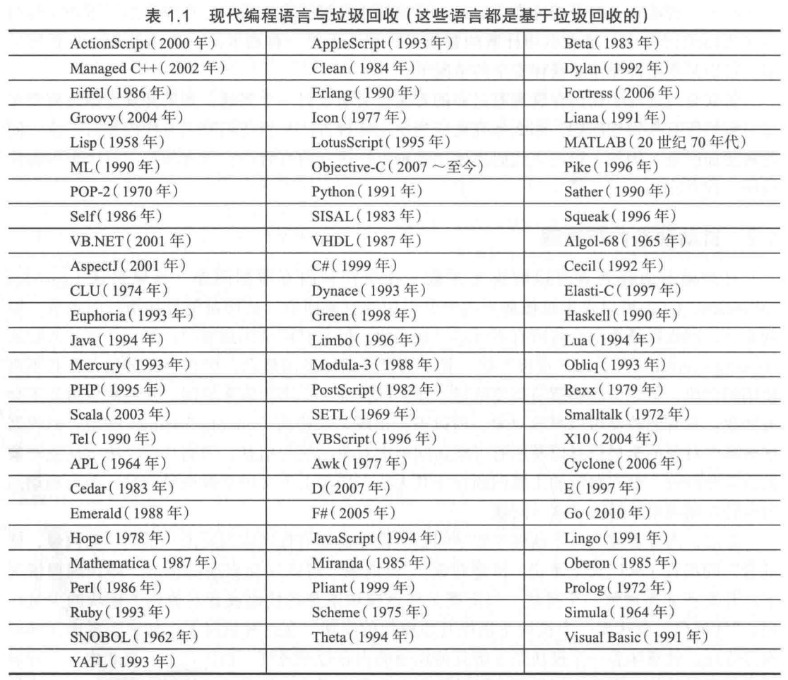

## 第一章 引言

### 1.1 显式内存释放

如C语言的free函数和C++的delete操作符。

C++11中使用unique_ptr取代autor_ptr，实现智能指针。
此外，新标准还引入基于引用计数的shared_ptr。

==智能指针可能只适用于管理数据块非常大、引用关系变更较少的场景，因为只有在这种情况下，智能指针的开销才有可能远小于追踪式垃圾回收。==

<iframe width="100%" id="iframeid" onload="Javascript:SetCwinHeight()" scrolling=yes height="1000" frameborder="0" src="https://xhy3054.github.io/cpp-unique-ptr/"></iframe>

### 1.2 自动动态内存管理

回收器回收所有不可达对象。

### 1.3 垃圾回收算法之间的比较

- 安全性：任何时候都不能回收存活对象，在并发回收器中实现安全性要付出更多的代价。
- 吞吐量：文献中同窗用标记/构造率来衡量这一指标。
- 完整性与及时性
  - 完整性：堆中所有的垃圾最终都应当得到回收
- 停顿时间
- 空间开销