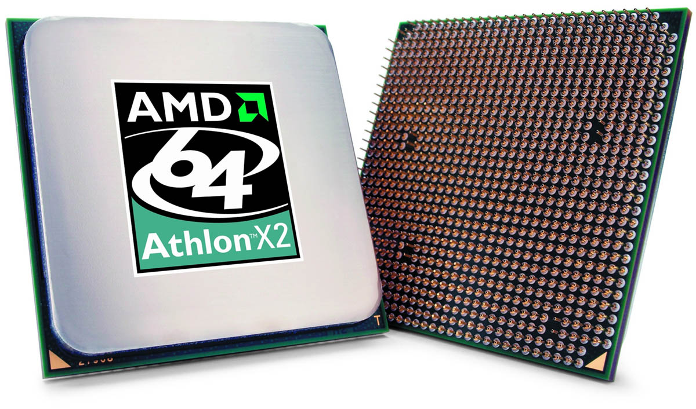
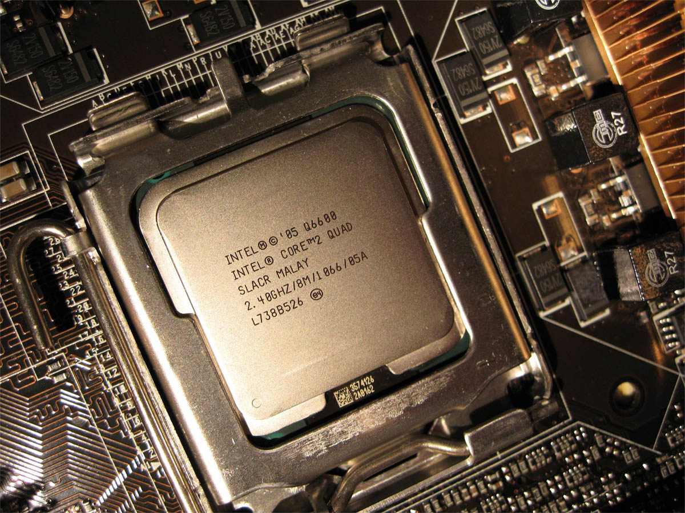
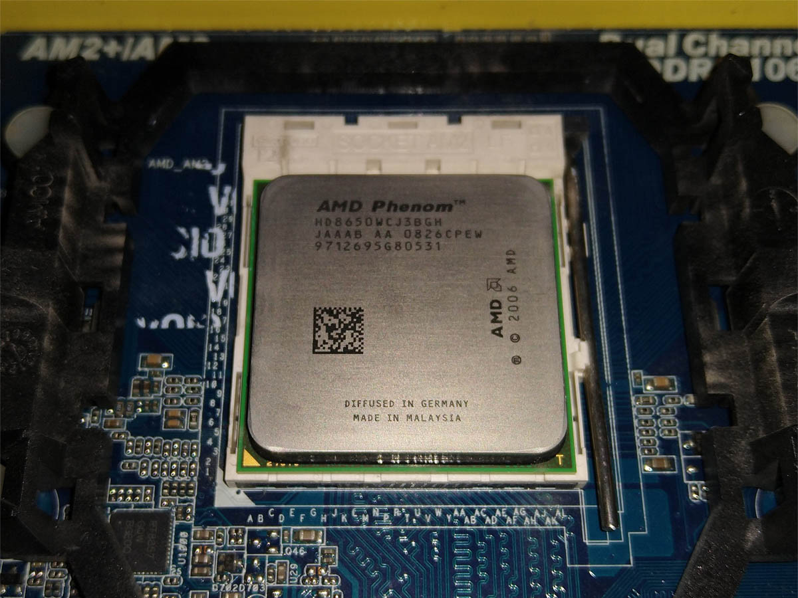
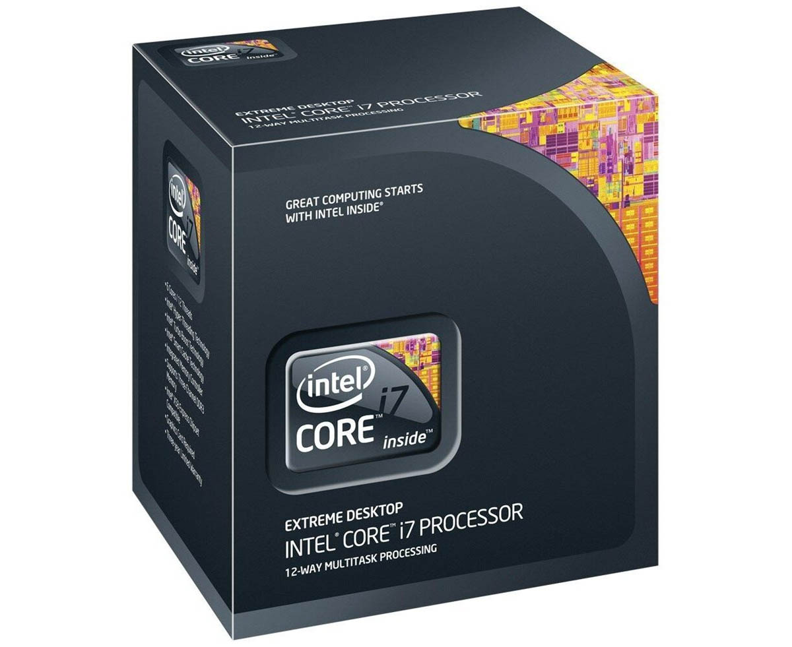
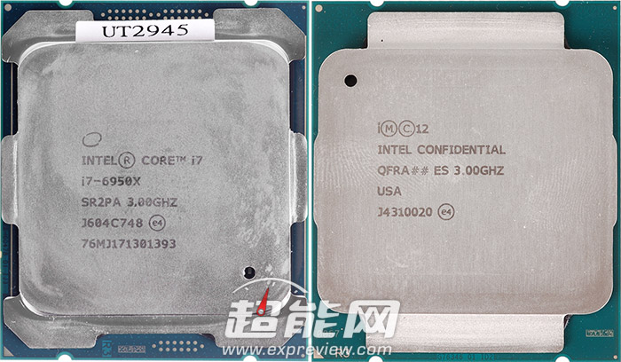
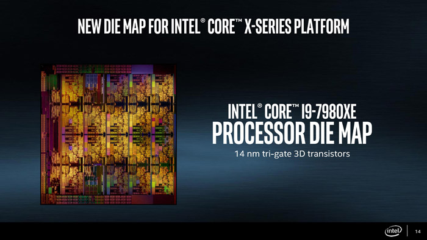
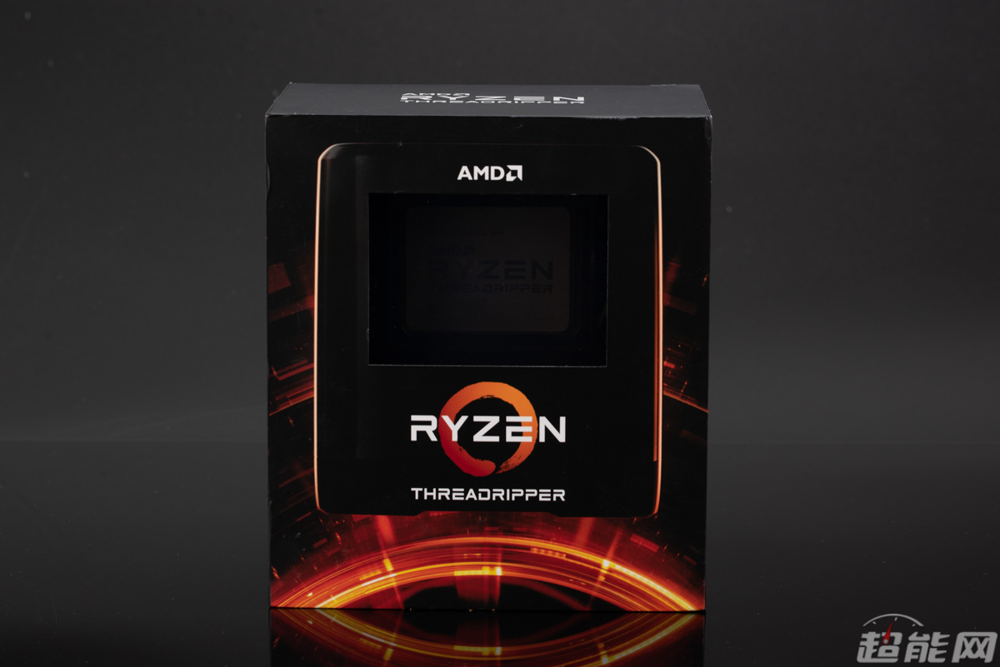
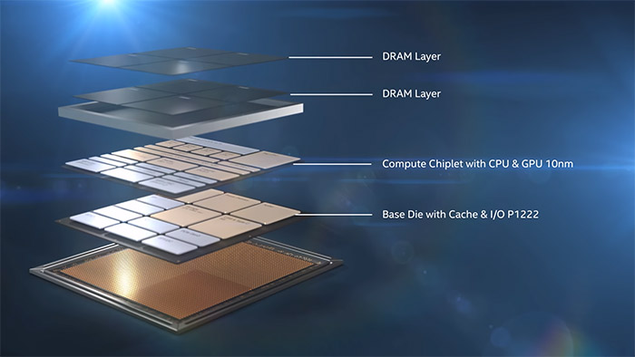

# 处理器是如何从单核演化到64核的

<!-- TOC -->

- [处理器是如何从单核演化到64核的](#处理器是如何从单核演化到64核的)
	- [首个双核处理器：Intel Pentium D](#首个双核处理器intel-pentium-d)
	- [首款原生双核：AMD Athlon 64 X2](#首款原生双核amd-athlon-64-x2)
	- [首款四核处理器：Core 2 Quad](#首款四核处理器core-2-quad)
	- [首款四核处理器：Core 2 Quad](#首款四核处理器core-2-quad-1)
	- [首款三核处理器：AMD Phenom X3](#首款三核处理器amd-phenom-x3)
	- [首款六核处理器：Core i7-980X](#首款六核处理器core-i7-980x)
	- [首款八核处理器：AMD FX-8100系列](#首款八核处理器amd-fx-8100系列)
	- [首款十核处理器：Core i7-6950X](#首款十核处理器core-i7-6950x)
	- [Intel Skylake-X：12/14/16/18核一同到来](#intel-skylake-x12141618核一同到来)
	- [Ryzen Threadripper系列：24/32甚至64核](#ryzen-threadripper系列2432甚至64核)
	- [Intel Lakefield：开启混合架构新时代的五核处理器](#intel-lakefield开启混合架构新时代的五核处理器)
	- [展望未来](#展望未来)

<!-- /TOC -->

自Intel在1978年推出第一颗x86处理器8086之后，CPU的发展方向一直都是更宽，整合更多的指令集与外部控制器，以及更高的主频，但这些东西都会受到当时的制程工艺限制，CPU内核架构没个三五年其实是没法弄个全新的出来的，而频率这东西则得同时看CPU架构与制程工艺，当CPU的单核效能与频率都到瓶颈之后，Intel与AMD都得出了一个答案，向多核发展，到了2005年，双核时代到来，就此之后CPU的内核数量越堆越多，直到现在16核能出现在主流平台上，而HEDT平台甚至能达到64核之多。

今天我们就来回顾一下多核处理器是如何发展到现在这个样子的。

## 首个双核处理器：Intel Pentium D

其实Intel与AMD的双核处理器发布时间都在2005年5月，但Intel的Pentium D要早一点，所以它就成了第一个双核处理器了，首发的包括Pentium D 820/830/840，采用90nm工艺核心代号Smithfield，每核心拥有1MB L2缓存，均是800MHz的FSB[^1]，随后还推出了带超线程技术的Pentium Extreme Edition 840处理器，双核四线程，FSB也提升到了1066MHz，频率也更高。

在次年一月份Intel推出了升级65nm工艺的Presler，也就是Pentium D 900系列，更先进的工艺带来了更高的频率以及更好的功耗控制，L2缓存也升级到每核心2MB，但FSB没变，至尊版则包括955和965两个型号，他们均解除了倍频锁，同时他们还推出了Pentium D 805处理器，频率比Pentium D 820更低，而且FSB降低到533MHz，但价格低得多，它的存在确实为普及双核处理器有不少贡献。

当然了Pentium D也是一款争议很大的产品，毕竟他里面是两颗以高频低能著称的Pentium 4处理器，而且不是两个Pentium 4内核，而是真的是两颗Pentium 4处理器（Smithfield是两个Prescott，而Presler则是两个Cedar Mill），他们被封装到一块PCB上，而且他们之间是没有直接互联的，数据交换需要通过FSB，但FSB本来就不够用，这导致双核效能季度低下，性能完全不是AMD Athlon 64 X2的对手，再加上Pentium 4本来就热，把两个封在一齐只会更热，在很长一段时间里Pentium D都被人叫作大火炉。

现在来看Pentium D系列处理器只是Intel的一个缓兵之计，要第一款双核处理器的头衔，还得找产品对抗AMD的双核，但自己的真双核Core 2 Due要等新工艺，所以就把Pentium D搬了出来。

## 首款原生双核：AMD Athlon 64 X2

AMD的双核处理器Athlon 64 X2也是在2005年5月份出的，但比Intel要晚，没抢到首款双核的头衔，但与Pentium D不同，AMD的Athlon 64 X2是在同一块芯片内整合了两个K8核心，两个核心之间可透过System Request Queue实现数据互通，执行效率比Pentium D好多了，所以有了当年声势浩大的真假双核讨论。

最初Athlon 64 X2只出在Socket 939平台上，采用90nm工艺，型号从3600+到4600+，频率从2GHz到2.4GHz，L2缓存有256KB*2、512KB*2以及1MB*2三种。在2006年5月推出AM2平台后就转移到了那边，这次频率范围是2GHz到3.2GHz，型号则是从3600+到6400+，L2缓存依然是那三种容量。

在2006年12月，AMD推出了升级65nm工艺的Athlon 64 X2处理器，L2缓存统一成512KB*2，频率从1.9GHz到3.1GHz，型号是3600+到6000+，此外还有45W的低功耗衍生版本Athlon X2 BE 45w系列。

K8时代可以说是AMD当年的顶峰，基本上K8架构是要远优于对手Intel Pentium 4所用的NetBusrt架构的，与后来这Core 2 Due相比虽然说处于劣势但至少还可打得有来有回，而K8之后的K10以及推土机架构的表现就真的一言难尽。

## 首款四核处理器：Core 2 Quad

Intel的Pentium D处理器的继任者是非常经典的Core 2 Duo处理器，而且他们还用当年炮制首款双核处理器的手法造出了首款四核处理器Core 2 Quad。

最初Athlon 64 X2只出在Socket 939平台上，采用90nm工艺，型号从3600+到4600+，频率从2GHz到2.4GHz，L2缓存有256KB*2、512KB*2以及1MB*2三种。在2006年5月推出AM2平台后就转移到了那边，这次频率范围是2GHz到3.2GHz，型号则是从3600+到6400+，L2缓存依然是那三种容量。

在2006年12月，AMD推出了升级65nm工艺的Athlon 64 X2处理器，L2缓存统一成512KB*2，频率从1.9GHz到3.1GHz，型号是3600+到6000+，此外还有45W的低功耗衍生版本Athlon X2 BE 45w系列。

K8时代可以说是AMD当年的顶峰，基本上K8架构是要远优于对手Intel Pentium 4所用的NetBusrt架构的，与后来这Core 2 Due相比虽然说处于劣势但至少还可打得有来有回，而K8之后的K10以及推土机架构的表现就真的一言难尽。

## 首款四核处理器：Core 2 Quad

Intel的Pentium D处理器的继任者是非常经典的Core 2 Duo处理器，而且他们还用当年炮制首款双核处理器的手法造出了首款四核处理器Core 2 Quad。

首款桌面级的四核处理器诞生于2006年11月2日，首发的只有Core 2 Extreme Edition QX6700，最后陆续推出了Core 2 Quad Q6600、Core 2 Extreme Edition QX6800、Core 2 Quad Q6700、Core 2 Extreme Edition QX6850。

这些处理器的核心代号是Kentsfield，其实就是由两个Conroe的Core 2 Due封装而成，跨芯片通信同样需要通过FSB，不过FSB频率和Core 2 Due一同提升到了1066MHz，至尊版的QX6850则直接提到1333MHz的FSB，主频则是从2.4GHz到3GHz，均配备4MB*2的L2缓存。

这次Intel比AMD足足早了一年拿出了四核处理器，也就是说Core 2 Quad在一年的时间内根本没有对手，即使AMD在一年后拿出了K10这个原生四核，并再一次挑起了真假四核之争，但K10早期存在TLB bug大幅影响性能，再加上Core架构实在太强了，即使是胶水四核也能把AMD的原生四核打趴下。

更重要的是，AMD在推出K10的时候，Intel这边已经拿出了45nm制程升级版的Yorkfield，更先进的工艺带来了更高的频率，FSB也全部提升到1333MHz，而且产品线也进行了细分，根据L2的容量来进行划分，有2MB*2的Q8x00系列，3MB*2的Q9x00系列，还有6MB*2的Q9x50系列，最高端的当然还是至尊版，Core 2 Extreme QX9770可以说LGA 775平台的绝唱，FSB达到了1600MHz，频率3.2GHz，不过呢，实际上Core 2处理器的超频能力都非常好，很多45nm的Core 2 Quad动手超下都能达到它的水平。

## 首款三核处理器：AMD Phenom X3

AMD的K10架构四核是2007年11月11日发布的，它确实是首款的原生四核处理器，并且首次把L3缓存引入到消费级市场，但它上来就碰到TLB bug，虽然可以通过bios升级修复问题，但会导致5%到20%的性能损失，直到次年4月推出的B3步进产品才修复了问题，但整体效能还是不如对手的Core 2 Quad。

不过原生四核倒是能比Intel的胶水四核玩出更多的花样，比如屏蔽一个核心就可以当成三核处理器拿去卖了，这就有了Phenom X3，在市场上销售的盒装Phenom X3其实都是B3步进的，第一代产品由于还是采用65nm工艺，所以频率较低，从1.9GHz起步，最高2.5GHz，每个核心独享512KB L2缓存，所有核心共享2MB L3缓存。

Phenom X3的目标对手自然不会是对手的四核，而是他们的双核处理器，想凭借多一个核心来战胜对手，但当时系统与软件对多线程优化远没有现在那么好，再加上到了2007年Intel的产品已经升级到了45nm工艺，频率以及超频能力都要比AMD好不少，多一个核心其实没给AMD带来多大优势，而且较低的频率让Phenom X3在当时的游戏表现还不如自己的高频K8双核。

但这些三核处理器带来了开核玩法，就是把原本屏蔽了的残缺核心通过BIOS里面的ACC选项重新开启，这就让当时AMD的处理器充满话题性，当然开出来的是原本残缺核心，多少有些问题，所以频率可能要降一点，电压也要加一点，但这对玩家来说不算什么，开核的玩法后来也扩展到后来的Athlon II和Phenom II处理器上。

在45nm版K10处理器推出后AMD还推出了Phenom II X3以及屏蔽L3缓存的Athlon II X3处理器，后续的第一代采用K10内核的APU也有A6-3500这个三核的型号，基本上三核处理器伴随了K10架构的整个生命周期。

## 首款六核处理器：Core i7-980X

2010年3月16日推出的Core i7-980X是首款6核处理器，核心代号Gulftown，它基于Westmere架构 ，也就是Nehalem的32nm版本，所以也继承了整合三通道内存控制器、QPI总线[^2]、Turbo Boost以及重新启用的超线程技术，处理器每核心拥有256KB L2缓存，共享12MB L3缓存，主频是3.33GHz，最高睿频3.6GHz。

由于X58属于HEDT[^3]平台，所以Gulftown六核其实也没几款，前后一共才出了四颗，售价也高高在上，对市场影响有限，但它的存在是给对手六核Phenom II X6的一个降维打击，性能远超对手，发布也比你早一个月，用的工艺也比你先进一代，在当时，从CPU技术上讲，AMD彻底失去了“话语权”，当然了如果说对市场的影响，便宜的Phenom II X6比高价的Core i7-980X要大多了。

## 首款八核处理器：AMD FX-8100系列

其实说2011年AMD推出的Bulldozer推土机是首款八核处理器估计会有很大争议，因为它是一个模块化的CPU，每个模块内有2个整数单元和1个高度共享的浮点单元，AMD的FX系列处理器最多拥有4个这样的模组，而AMD将每个整数单元都视为一个核心，所以FX-8100系列也成为世界上首款原生8核桌面CPU。

当然了，推土机处理器的性能有多糟糕我已经不想再提了，当年关于AMD FX系列处理器是否是“真8核”很多玩家与AMD之间出现争议，一些玩家甚至认为AMD涉嫌非法宣传，将AMD告上了法庭，最后这官司还赢了，AMD因此而吃了罚单。

首发的FX-8100系列有五个型号，最高加速频率是4.5GHz，每个模组共享2MB L2缓存，所有核心共享8MB L3缓存，TDP有95W和125W两种。一年后推出的Piledriver打桩机处理器则是推土机的改良版本，不过性能其实也没高多少，FX-8300系列一共有7个型号，最高加速频率降至4.3GHz，TDP同样是95W或125W，不过嘛，还有FX-9590和FX-9370两个标配一体式水冷散热器的奇特产品，他们的TDP高达220W，前者最高加速频率达到了5GHz，后者也有4.7GHz，当年是AMD追高频追得比较疯狂。

其实推土机一共有四代架构，除了上面已经提到的推土机和打桩机之外，还有Steamroller压路机以及Excavator挖掘机，但AMD在推出打桩机后就放弃了与Intel在高端平台上的争夺市场，后面两种架构只出现在APU上。

而桌面市场的第一颗真八核处理器是Intel在2014年推出Core i7-5960X，属于22nm的Haswell-E架构 ，基础频率3GHz，最高睿频3.5GHz，拥有20MB L3缓存，是用HEDT的X99平台上的，999美元的高昂售价也让许多玩家望而却步。

至于主流平台的八核处理器，则是2017年AMD Zen架构的第一代Ryzen 7系列处理器，是它正式引发了Intel与AMD在处理器市场上的核心数量大战。

## 首款十核处理器：Core i7-6950X

Intel在2016年5月发布的Core i7-6950X是首款桌面的十核处理器，它所用的Broadwell-E架构其实就是Haswell-E的制程升级版，生产工艺从22nm升级到14nm，核心数量从上代Core i7-5960X的8核增加到10核，晶体管数量也从26亿增加到32亿，但因为更先进的制程工艺，芯片面积从355.52mm2缩减到246mm2。

除了核心数量与制程之外，Core i7-6950X与Core i7-5960X的区别其实不算大，L3缓存容量增加到25MB，基础频率依然是3.0GHz，最大睿频2.0频率3.5GHz，但在这一代处理器Intel引入了Turbo Boost Max 3.0技术，最高单核睿频能到4.0GHz，此外支持DDR4的频率也从2133MHz提升到2400MHz，但这个对于X99主板来说意义不大。

而主流市场的10核处理器直到2020年5月才到来，它就是Core i9-10900K，目前市场上就Comet Lake这一代有10核的产品，最新一代的Rocket Lake最多就只有8核，AMD的Zen 2因为架构问题8核以上只能出12核或16核的产品，而Zen 3理论上是能出10核或者14核的，但AMD可能觉得没必要所以没出。

## Intel Skylake-X：12/14/16/18核一同到来

在2017年6月份，Intel推出了第七代Core X系列处理器，不过这代产品有点奇葩，有Skylake-X与Kabylake-X两种不同架构的处理器，当中Kabylake-X可以说是非常坑，所以后续也没有类似的产品了，而Skylake-X则与以往HEDT产品一样源于服务器处理器。

与上一代X99平台的Broadwell-E处理器相比，Skylake-X处理器多了12核、14核、16核、18核的产品，并且用Core i9取代Core i7成为Intel消费级市场上最强处理器的代名词。

Skylake-X与主流级的Skylake相比，缓存结构有了明显的调整，L2缓存从每核心256KB提升到1MB，L3则从每核心共享2MB变成了1.375MB，这样做可以提升L2的命中率降低访问延迟，提升IPC。此外网状总线取代了环形总线，这样有利于拓扑更多核心数量，AVX-512指令集也是从这代架构开始引入的。Turbo Boost MAX 3.0从Broadwell-E的只能提升单核频率变成最多可以提升两个核心的频率，但频率提升幅度没以前那么大。

第7、9、10代Core X处理器都是用Skylake-X架构的，虽然第10代的代号改成了Cascade Lake，但本质上就是Skylake-X，就多了4条PCI-E通道并且强化了AI性能。

不过实际上第一个上市的12核和16核处理器是AMD的锐龙Threadripper 1920X和1950X，他们在2017年8月份就上市了，而Intel只是在6月份纸面发布了第七代Core X系列处理器，7月份首批上市的只有10核及以下的产品，12和到18核的产品要等到10月份才上市。

在2019年，AMD推出了Zen 2架构的锐龙3000系列处理器，把12核与16核处理器推向了主流市场。

## Ryzen Threadripper系列：24/32甚至64核

实际上这些年挑起核心数量大战的不是Intel，而是AMD，他们在第一代EPYC上玩起MCM[^4]之后就一发不可收拾，而基于EPYC的锐龙Threadripper自然也这样，第一代锐龙Threadripper处理器最大核心数量只有16，而到了2018年发布的第二代锐龙Threadripper，最大核心数量直接翻倍到32。

锐龙Threadripper 2000系列处理器采用12nm Zen+内核，分为WX系列和X系列，X系列和第一代是一样的，只有两个内核可工作的内部双路系统，最大核心数16个，而WX系列则是四个内核都可工作的，和服务器的EPYC一样内部是四路互联，最大核心数32个。

核心之间采用25GBps的Infinity Fabric总线互联，只有核心0和核心2提供内存控制器和PCI-E控制器， 于核心1和核心3是没有直接连接内存和PCI-E的，锐龙Threadripper 2970WX/2990WX只能工作在NUMA模式，这核心1/3的通信延迟明显高于核心0/2，所以会限制这两个核心的性能。

到了Zen 2架构的锐龙Threadripper 3000，CPU被拆分成CCD计算核心和IOD输入输出核心，所有的内存、PCI-E、USB、SATA控制器转移到了IOD上，CCD与IOD之间采用第二代Infinity Fabric总线连接，这样延迟虽然会有所增加，但是很好的解决了每个核心之间访问内存和PCI-E时延迟不一的问题，并且每个IOD最多可连接8个CCD，于是就有了64核的锐龙Threadripper 3990X。

## Intel Lakefield：开启混合架构新时代的五核处理器

Intel的Lakefield项目其实在2019年就正式公开了，而产品正式上市是2020年，这款产品的实验性质很重，它是首款采用Intel Foveros 3D堆叠工艺的产品，也是首款采用混合架构的x86处理器。

Lakefield SoC至少包含四个层，顶部两层是由PoP封装的DRAM内存所组成，由两块BGA DRAM堆叠在一起，第三层则是由10nm工艺打造的CPU与GPU，最底层则是由22nm工艺打造的I/O与缓存层。

10nm工艺的计算芯片包含一个Sunny Cove大核，独享512KB L2缓存，四个Tremont小核，它们共享1.5M L2缓存，所有核心共享4MB的L3缓存，内存控制器是4*16位的，支持LPDDR4，整合了Gen 11核显，有64个EU单元，Gen 11.5显示控制器还有新的IPU，支持DP 1.4。

Lakefield家族只有Core i5-L16G7和Core i3-L13G4两款产品，两者的主要区别的是频率以及核显的EU数量，只有少数轻薄本用了这款处理器，性能表现其实还不错，5W的Core i5-L16G7甚至可以与15W的Core i5-10210U叫板。

在经过Lakefield的小规模实验后，Intel的混合架构将会在这个月底发布的Alder Lake处理器上开花结果，大家可以期待桌面满血的混合架构x86处理器到底会怎么样的表现，而Foveros 3D堆叠工艺也会用在未来的Xe-HPC服务器计算卡上。

## 展望未来

在可预见的将来，桌面市场的最大核心数量依然会维持在64核，因为Intel和AMD的新一代HEDT处理器完全没有消息，但从两家最新的服务器处理器来看，Intel的最多不会超过40核，而AMD最多也是64核，Intel把双芯Xeon下放到HEDT平台可能性非常小，主要看点还是AMD未来的Zen 4，有消息说Zen 4架构的EPYC处理器最多能到96核，但是否会下放到HEDT平台这就不太确定了。

主流平台方面，目前的消息是代号为Raphael的Zen 4处理器最高配置依然为16核，Intel方面下一代的Raptor Lake则最多24核，但是由16个E-Core加8个P-Core所组成的，也就是说最多32线程，线程数和Zen 4的16核保持一致，但这些都不是实锤的消息，还有很大不确定性。

> 本文转载自：https://www.expreview.com/80704.html

[^1]: FSB: Front Side (前端总线), 指CPU与北桥芯片之间的数据传输总线。
[^2]: QPI: Quick Path Interconnect, 是一种基于包传输的串行式高速点对点连接协议，采用差分信号与专门的时钟进行传输。在延迟方面，QPI与 FSB几乎相同，却可以提升更高的访问带宽。一组QPI具有20条数据传输线，以及发送（TX）和接收方（RX）的时钟信号。
[^3]: [High-End Desktop](https://www.bestcpus.com/what-is-hedt-cpu/)
[^4]: MCM: Multichip Module, MCM技术是将多个LSI/VLSI/ASIC裸芯片和其它元器件组装在同一块多层互连基板上，然后进行封装，从而形成高密度和高可靠性的微电子组件。