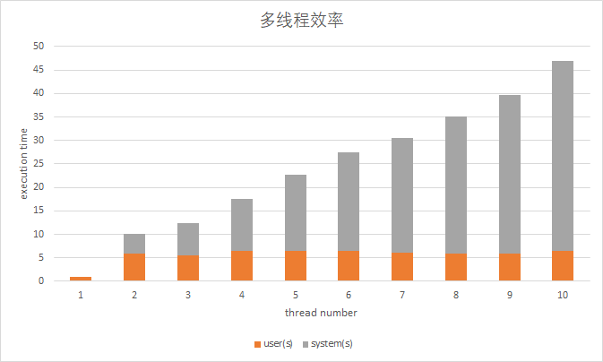
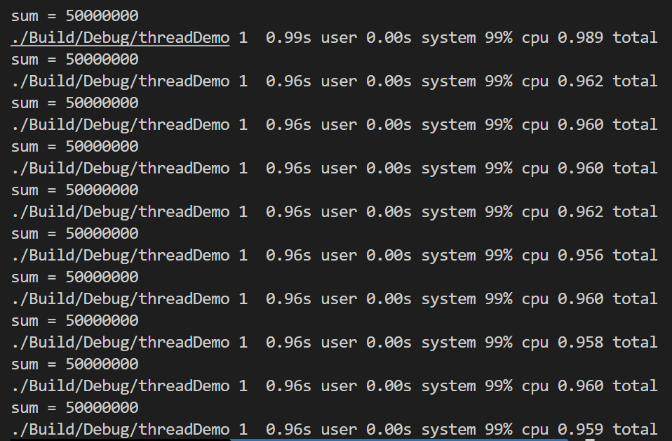
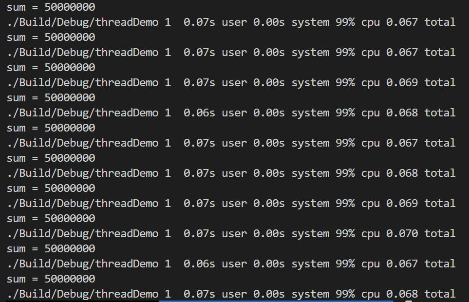
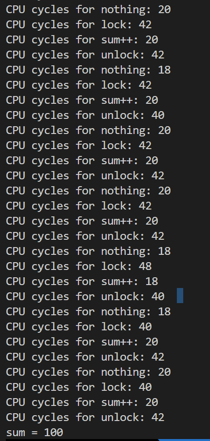

为了探究多线程的效率，通过多个线程去实现一个加法任务，最终观察执行时间。

```c++ {.line-numbers}
/*************************************************************************
        > File Name: src/main.cpp
        > Author: Wang Zongwu
        > Mail: wangzongwu@outlook.com
        > Created Time: Thu 17 Nov 2022 05:26:04 PM CST
  # Description: multi-thread run efficiency
  ***********************************************************************/


#include <cstddef>
#include <cstdio>
#include<iostream>
#include<thread>
#include <mutex>
#include <unistd.h>

using namespace std;

// LOCKEN must defined when thread number larger than 1
#define LOCKEN

volatile int sum = 0;

mutex mtx;

void myAdd(int time) {
        int i = 0;
        uint64_t begin, end;
        while (i < time)
        {
                #ifdef LOCKEN
                mtx.lock();
                #endif
                sum++;
                #ifdef LOCKEN
                mtx.unlock();
                #endif
                i++;
        }

}

int main(int argc, char *argv[]) {
        size_t tnum = atoi(argv[1]);
        size_t count = 50000000;
        thread threads[tnum];
        for (size_t i = 0; i < tnum; i++)
        {
                threads[i] = thread(myAdd, count/tnum);
        }

        for (size_t i = 0; i < tnum; i++)
        {
                threads[i].join();
        }

        printf("sum = %d\n", sum);

        return 0;
}
```

结果：

| thread_num 	| user(s) 	| system(s) 	|
|------------	|---------	|-----------	|
| 1          	| 1.01    	| 0         	|
| 2          	| 5.99    	| 4.16      	|
| 3          	| 5.48    	| 6.84      	|
| 4          	| 6.39    	| 11.09     	|
| 5          	| 6.47    	| 16.24     	|
| 6          	| 6.44    	| 21.07     	|
| 7          	| 6       	| 24.6      	|
| 8          	| 5.82    	| 29.3      	|
| 9          	| 5.82    	| 33.8      	|
| 10         	| 6.38    	| 40.5      	|



从以上结果来看，多线程效率无法线性scale的原因在于：
- 锁竞争
- 实现锁的原子指令执行时间

为了探索lock和unlock的执行时间，分别对thread_num=1使能lock和不是能lock，测试结果如下：


使能lock执行时间


不使能lock执行时间

在这种情况下不存在锁竞争，可以看出原子指令的时间远高于"sum++"指令执行时间。

我们可以用rdtscp来测试不同指令的执行时间。

```c++ {.line-numbers}
/*************************************************************************
        > File Name: src/main.cpp
        > Author: Wang Zongwu
        > Mail: wangzongwu@outlook.com
        > Created Time: Thu 17 Nov 2022 05:26:04 PM CST
  # Description: measure the lock delay
  ***********************************************************************/


#include <cstddef>
#include <cstdio>
#include<iostream>
#include<thread>
#include <mutex>
#include <unistd.h>

using namespace std;

volatile int sum = 0;

mutex mtx;

void myAdd(int time) {
        int i = 0;
        uint64_t begin, end;
        while (i < time)
        {
                __asm__ __volatile__("rdtscp;"
                                : "=a"(begin)
                                :
                                : "%rcx", "%rdx");
                __asm__ __volatile__("rdtscp;"
                                : "=a"(end)
                                :
                                : "%rcx", "%rdx");
                printf("CPU cycles for nothing: %ld\n", (end-begin));

                __asm__ __volatile__("rdtscp;"
                                : "=a"(begin)
                                :
                                : "%rcx", "%rdx");
                mtx.lock();
                __asm__ __volatile__("rdtscp;"
                                : "=a"(end)
                                :
                                : "%rcx", "%rdx");
                printf("CPU cycles for lock: %ld\n", (end-begin));


                __asm__ __volatile__("rdtscp;"
                                : "=a"(begin)
                                :
                                : "%rcx", "%rdx");
                sum++;
                __asm__ __volatile__("rdtscp;"
                                : "=a"(end)
                                :
                                : "%rcx", "%rdx");
                printf("CPU cycles for sum++: %ld\n", (end-begin));


                __asm__ __volatile__("rdtscp;"
                                : "=a"(begin)
                                :
                                : "%rcx", "%rdx");
                mtx.unlock();
                __asm__ __volatile__("rdtscp;"
                                : "=a"(end)
                                :
                                : "%rcx", "%rdx");
                printf("CPU cycles for unlock: %ld\n", (end-begin));
                i++;
        }

}

int main(int argc, char *argv[]) {
        size_t tnum = atoi(argv[1]);
        size_t count = 100;
        thread threads[tnum];
        for (size_t i = 0; i < tnum; i++)
        {
                threads[i] = thread(myAdd, count/tnum);
        }

        for (size_t i = 0; i < tnum; i++)
        {
                threads[i].join();
        }

        printf("sum = %d\n", sum);

        return 0;
}
```



测试结果表明：lock和unlock操作相较于sum++延迟要高很多。
