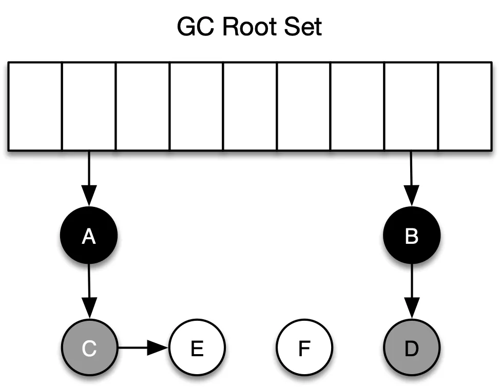
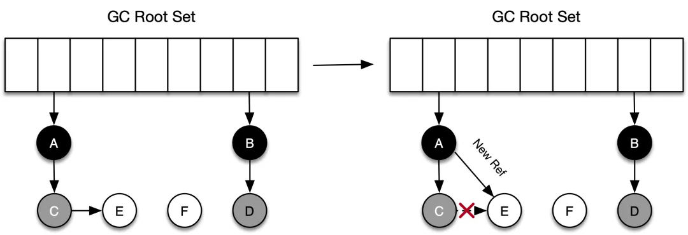
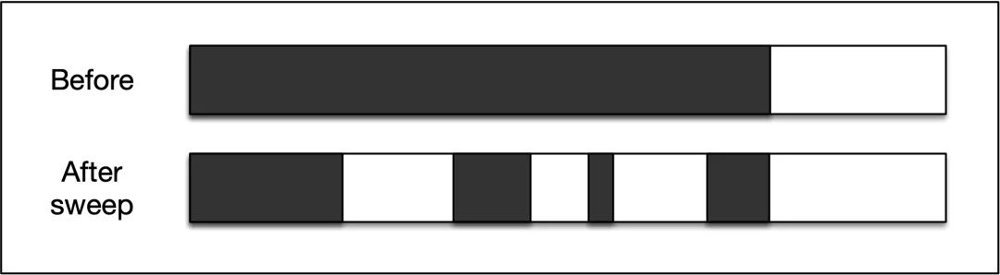
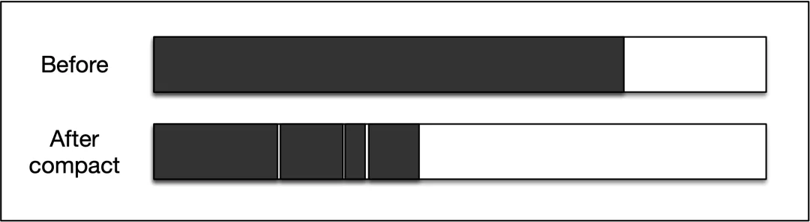
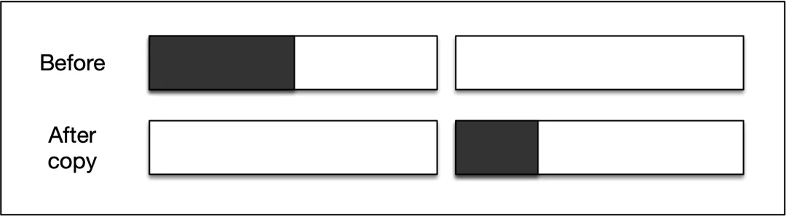
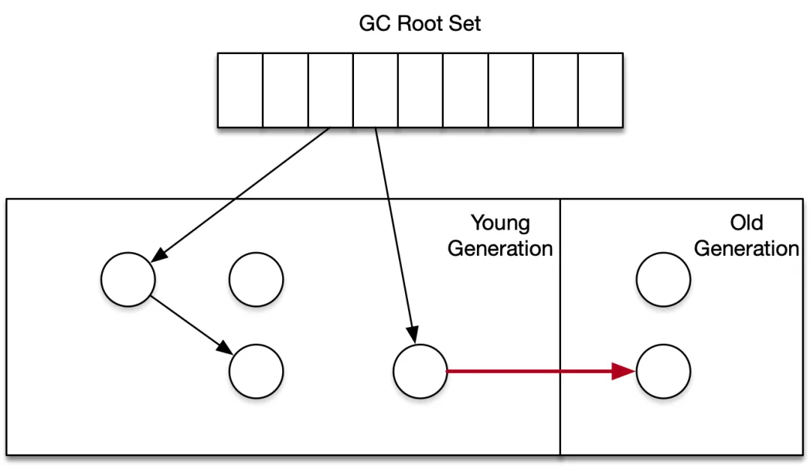
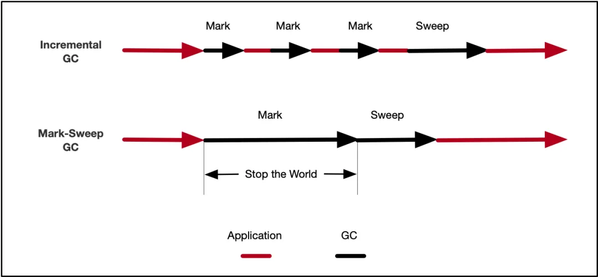
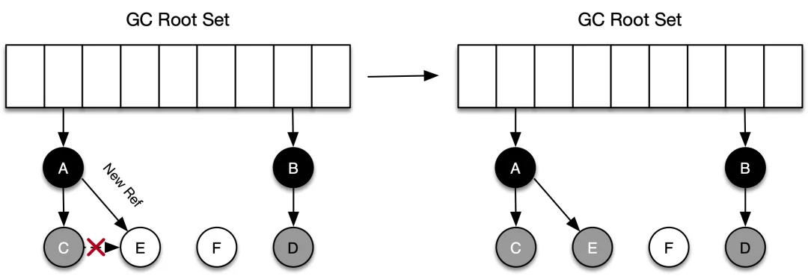
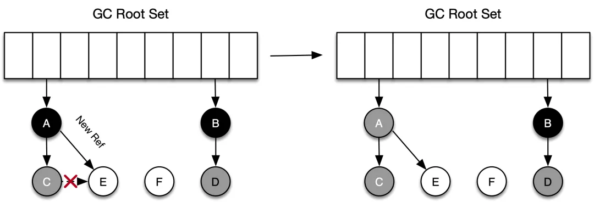
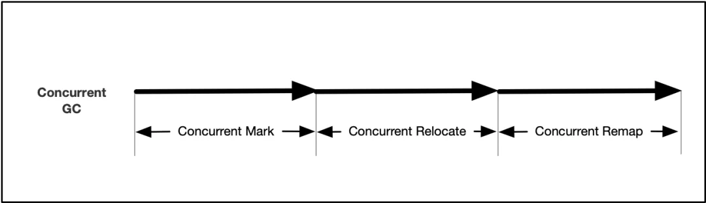

**简介：** 理解Java虚拟机垃圾回收机制的底层原理，是成为一个高级Java开发者的基本功。本文从底层的垃圾回收算法开始，着重去阐释不同垃圾回收器在算法设计和实现时的一些技术细节，去探索「why」这一部分，通过对比不同的垃圾回收算法和其实现，进一步感知目前垃圾回收的发展脉络。

如果大家关注 JDK，会发现在频繁发布的 JDK 版本中，和垃圾回收相关的 JEP (JDK Enhancement Proposals，Java 增强提案）越来越多了，垃圾回收（Garbage Collection，GC）正处于方兴未艾的阶段。譬如，在 JEP-248 中 G1 替代了并行垃圾回收器成为 JVM 中默认的垃圾回收器，JEP-333 加入了实验性质的 ZGC；最新的 JEP-189 引入了名为 Shenandoah GC 的垃圾回收器。

对于这么一个有趣的话题，我决定写篇文章来介绍，与很多介绍垃圾回收器的文章不同，本文不会涉及「某某垃圾回收器特性」和「如何使用某某垃圾回收器」等「what&how」的内容，而是从底层的垃圾回收算法开始，着重去阐释不同垃圾回收器在算法设计和实现时的一些技术细节，去探索「why」这一部分，通过对比不同的垃圾回收算法和其实现，进一步感知目前垃圾回收的发展脉络。

本文主要分为上下两个部分：

第一部分为「算法篇」，主要介绍一些重要的 GC 算法，去领略 GC 独特的思维方式和各算法的特性，这些是和具体的编程语言无关的；

第二部分为「实现篇」，主要介绍 JVM 上的一些垃圾回收器实现，包括 G1、ZGC、Shenandoah GC 等，通过了解这些商业垃圾回收器的设计理念，加深对垃圾回收算法的理解。

下面是第一部分，「算法篇」的内容。

## 一、 垃圾回收概述

垃圾回收（Garbage Collection，GC）引起大家的关注，是从1995 年 Java 发布后开始的。事实上，GC 作为计算机科学领域非常热的研究话题之一，最早可以追溯到 1959 年的夏天，起初是用用来简化 Lisp 内存管理的。在接下来60余年的时间里， 通过 Cheney、Baker 等大师的不断努力，GC 的世界里出现了标记清除、复制、分代、增量回收等一系列 GC 算法，基于这些算法，又出现了种类繁复的垃圾回收器。

### 1.1 GC 的定义

首先我们来看一下什么是 GC。

GC 把程序不用的内存空间视为「垃圾」，（几乎所有的）GC 要做的就只有两件事：

- 找到内存空间里的垃圾，使其和活对象分开来。
- 回收垃圾对象的内存，使得程序可以重复使用这些内存。

GC 给我们带来的好处不言而喻，选择 GC 而不是手动释放资源的原因很简单：程序比人更可靠。即便是 C/C++ 这种没有 GC 的语言，也有类似 Boehm GC 这样的第三方库来实现内存的自动管理了。可以毫不夸张地说，GC 已经是现代编程语言的标配。

### 1.2 GC 的流派

GC 从其底层实现方式（即 GC 算法）来看，大体可以分为两大类：基于可达性分析的 GC和基于引用计数法的 GC。当然，这样的分类也不是绝对的，很多现代 GC 的设计就融合了引用计数和可达性分析两种。

**可达性分析法**

基本思路就是通过根集合（gc root）作为起始点，从这些节点出发，根据引用关系开始搜索，所经过的路径称为引用链，当一个对象没有被任何引用链访问到时，则证明此对象是不活跃的，可以被回收。使用此类算法的有JVM、.NET、Golang等。

**引用计数法**

引用计数法没有用到根集概念。其基本原理是：在堆内存中分配对象时，会为对象分配一段额外的空间，这个空间用于维护一个计数器，如果有一个新的引用指向这个对象，则计数器的值加1；如果指向该对象的引用被置空或指向其它对象，则计数器的值减1。每次有一个新的引用指向这个对象时，计数器加1；反之，如果指向该对象的引用被置空或指向其它对象，则计数器减1；当计数器的值为0时，则自动删除这个对象。使用此类算法的有 Python、Objective-C、Per l等。

基于可达性分析法的 GC 垃圾回收的效率较高，实现起来比较简单（引用计算法是是算法简单，实现较难），但是其缺点在于 GC 期间，整个应用需要被挂起（STW，Stop-the-world，下同），后面很多此类算法的提出，都是在解决这个问题（缩小 STW 时间）。

基于引用计数法的 GC，天然带有增量特性（incremental），GC 可与应用交替运行，不需要暂停应用；同时，在引用计数法中，每个对象始终都知道自己的被引用数，当计数器为0时，对象可以马上回收，而在可达性分析类 GC 中，即使对象变成了垃圾，程序也无法立刻感知，直到 GC 执行前，始终都会有一部分内存空间被垃圾占用。

上述两类 GC 各有千秋，真正的工业级实现一般是这两类算法的组合，但是总体来说，基于可达性分析的 GC 还是占据了主流，究其原因，首先，引用计数算法无法解决「循环引用无法回收」的问题，即两个对象互相引用，所以各对象的计数器的值都是 1，即使这些对象都成了垃圾（无外部引用），GC 也无法将它们回收。当然上面这一点还不是引用计数法最大的弊端，引用计数算法最大的问题在于：计数器值的增减处理非常繁重，譬如对根对象的引用，此外，多个线程之间共享对象时需要对计数器进行原子递增/递减，这本身又带来了一系列新的复杂性和问题，计数器对应用程序的整体运行速度的影响，这里的细节可以参考文章：Boost's shared_ptr up to 10× slower than OCaml's garbage collection[^1]。

本文后面介绍的垃圾回收算法，主要就是可达性分析类算法及其变种。

## 二、 垃圾回收核心概念

在深入研究垃圾回收算法的实现细节之前，有必要知道 GC 算法中的一些基本概念，这对了解 GC 算法的基本原理和演进过程是有帮助的。除了算法基础名词外，我们需要深入理解GC 世界里极其重要的两个核心概念：读/写屏障和三色标记法。

### 2.1 基础名词

**根节点（GC Roots）**

在 GC 的世界里，根是执行可达性分析的「起点」部分，在 Java 语言中，可以作为 GC Roots 的对象包括：

- 虚拟机栈中（栈帧中的本地变量表）引用的对象
- 方法区中的类静态属性引用的对象
- 方法区中常量引用的对象
- 本地方法栈中 JNI（Native 方法） 引用的对象

是否作为根的判定依据：程序是否可以直接引用该对象（譬如调用栈中的变量指针）。同时还需要注意的是：不同的垃圾回收器，选择 GC Roots 的范围是不一样的。

**并行回收&&串行回收**

根据垃圾回收的运行方式不同，GC 可以分为三类：

- 串行执行：垃圾回收器执行的时候应用程序挂起，串行执行指的是垃圾回收器有且仅有一个后台线程执行垃圾对象的识别和回收；
- 并行执行：垃圾回收器执行的时候应用程序挂起，但是在暂停期间会有多个线程进行识别和回收，可以减少垃圾回收时间；
- 并发执行：垃圾回收器执行期间，应用程序不用挂起正常运行（当然在某些必要的情况下垃圾回收器还是需要挂起的）。

上面并发和并行容易混淆，因为在 Java 中，我们提到的并发天然会联想到是「同一类多个线程」执行「同一类任务」，在 GC 中，并发描述的是「GC 线程」和「应用线程」一起工作。

当我们说到某种垃圾回收器支持并发时，并不意味着在垃圾回收的过程中都是并发的，譬如，G1 和 CMS 垃圾回收器支持并发标记，但是在对象转移、引用处理、符号表和字符串表处理、类卸载时，是不支持并发的。总之，并发的表述具有「阶段性」。

**三色标记法**

可达性分析类 GC 都属于「搜索型算法」（标记阶段经常用到深度优先搜索），这一类算法的过程可以用 Edsger W. Dijkstra 等人提出的三色标记算法（Tri-color marking）来进行抽象（算法详情可以参考论文：On-the-fly Garbage Collection：An Exercise in Cooperation）[^2]。顾名思义，三色标记算法背后的首要原则就是把堆中的对象根据它们的颜色分到不同集合里面，这三种颜色和所包含的意思分别如下所示：

- 白色：还未被垃圾回收器标记的对象
- 灰色：自身已经被标记，但其拥有的成员变量还未被标记
- 黑色：自身已经被标记，且对象本身所有的成员变量也已经被标记

在 GC 开始阶段，刚开始所有的对象都是白色的，在通过可达性分析时，首先会从根节点开始遍历，将 GC Roots 直接引用到的对象 A、B、C 直接加入灰色集合，然后从灰色集合中取出 A，将 A 的所有引用加入灰色集合，同时把 A 本身加入黑色集合。最后灰色集合为空，意味着可达性分析结束，仍在白色集合的对象即为 GC Roots 不可达，可以进行回收了。下面是第一轮标记结束后，各个对象的颜色分布。



基于可达性分析的 GC 算法，标记过程几乎都借鉴了三色标记的算法思想，尽管实现的方式不尽相同，比如标记的方式有栈、队列、多色指针等。

**读屏障&&写屏障**

在标记对象是否存活的过程中，对象间的引用关系是不能改变的，这对于串行 GC 来说是可行的，因为此时应用程序处于 STW 状态。对于并发 GC 来说，在分析对象引用关系期间，对象间引用关系的建立和销毁是肯定存在的，如果没有其他补偿手段，并发标记期间就可能出现对象多标和漏标的情况。还是以上面三色标记法中的例子说明：

（1）多标

假设 C 被标为灰色后，在进行下面的标记之前，A 和 C 之间的引用关系解除了（应用程序），按照三色标记法，C 和 E 都应该是垃圾，而事实上，C 不会在本轮 GC 活动中被回收，这部分本应该回收但是没有回收到的内存，被称之为「浮动垃圾」。

（2）漏标

如下图所示，对象 C 在被标记为灰色后，对象 C 断开了和对象 E 之间的引用，同时对象 A 新建了和对象 E 之间的引用。在进行后面的标记时，因为 C 没有对 E 的引用，所以不会将 E 放到灰色集合，虽然 A 重新引用了 E，但因为 A 已经是黑色了，不会再返回重新进行深度遍历了。最终导致的结果是：对象 E 会一直停留在白色集合中，最后被当作垃圾回收，事实上 E 却是活动对象，这种情况也是不可接受的。



多标不会影响程序的正确性，只会推迟垃圾回收的时机，漏标会影响程序的正确性，需要引入读写屏障来解决漏标的问题。GC 里的读屏障（Read barrier）和写屏障（Write barrier）指的是程序在从堆中读取引用或更新堆中引用时，GC 需要执行一些额外操作，其本质是一些同步的指令操作，在进行读/写引用时，会额外执行这些指令。读/写屏障实现的是「对读/写引用这个操作的环切」，即该操作前后都在屏障的范畴内，可以将读/写屏障类比于 Spirng 框架里的拦截器。下面所示的代码，当从 foo 的成员变量第一次从堆上被加载时，就会触发读屏障（后续使用该引用不会触发 ），而当 bar 的成员变量(引用类型的)被分配/写入时，会触发写屏障。

```c++ {.line-numbers}
void example(Foo foo) {    
    Bar bar = foo.bar;                  // 这里触发读屏障    
    bar.otherObj = makeOtherValue();   // 这里触发写屏障
}
```

读写屏障是如何解决并发标记时的漏标的？总结一下发生漏标的充分必要条件是：

- 应用线程插入了一个从黑色对象（A）到白色对象（E）的新引用。
- 应用线程删除了从灰色对象（C）到白色对象（E）的直接或者间接引用。

要避免对象的漏标，只需要打破上述两个条件中的任何一个即可，两种不同的方法核心都是采用了读写屏障：

（a）方法一：

- 开启写屏障，当新增引用关系后，触发写屏障，发出引用的黑色或者白色对象会被标记成灰色（例子中 A 将被标记为灰色并进入灰色集合），或者将被引用对象标记为灰色。
- 开启读屏障，当检测到应用即将要访问白色对象时，触发读屏障，GC 会立刻访问该对象并将之标为灰色。这种方法被称为「增量更新（Increment Update）」。

（b）方法二：

- 开启写屏障。当删除引用关系前，将所有即将被删除的引用关系的旧引用记录下来（C -> E），最后以这些旧引用为根重新扫描一遍，这种方法实际上是「SATB（Snapshot At The Begining） 算法」的一种具体实现。

> 注：SATB 算法是由 Taiichi Yuasa 为增量式标记清除垃圾收集器开发的一个算法，其核心思想是：GC 开始之前，会复制一份引用关系快照，如果某个指针的地址被改变了，那么之前的地址会被加入待标记栈中，便于后面再次检查，这样就可以保证在 GC 时，所有的对象都会被遍历到，即使指向它们的指针发生了改变。鉴于篇幅原因，这里不再讲述，感兴趣的读者可自行查看 Yuasa 的论文（Real-time garbage collection on general-purpose machines[^3]）。

通过读写屏障可以解决并发标记时的漏标问题，具体在工程实践中，不同的垃圾回收器又有不同实现，譬如针对 HotSpot 虚拟机，CMS 使用了「写屏障 + 增量更新」的方法，G1 和 Shenandoah是通过「写屏障 + SATB」来完成的，而 ZGC 则采取了「读屏障」的方式。

下面是 HotSpot 虚拟机中写屏障的一段代码，这段代码记录下了所有的引用关系的变化情况。

```c++ {.line-numbers}
void post_write_barrier(oop* field, oop val) {  
  jbyte* card_ptr = card_for(field);  
  *card_ptr = dirty_card;  
}
```

需要注意的是，读/写屏障只是一种理念，触发读写屏障后具体执行什么，取决于垃圾回收器的实现。由于从堆读取引用是非常频繁的操作，因此这两种屏障需要非常高效，在常见情况下就是一些汇编代码，读屏障的开销通常比写屏障大一个数量级（这也是为何大多数 GC 没有使用或者很少使用读屏障的原因，因为引用的读操作要远多于写操作），读屏障更多的时候是用在解决并发转移时的引用更新问题上。

一些公司可能会在硬件层面对读写屏障做专门的设计，便于达到最高效的垃圾回收效率。譬如，Azul 公司为 Pauseless GC 算法专门定制了一整套系统（包括CPU、芯片组、主板和操作系统），用来运行具备垃圾收集功能的虚拟机，定制的 CPU 内置了「读屏障指令」，来实现并行的、具有碎片压缩功能的高并发(无 STW 暂停)垃圾收集算法。

注意：JVM 里还有另外一组内存屏障的概念：读屏障（Load Barrier）和写屏障（Store Barrier），这两组指令和上面我们谈及的屏障不同，Load Barrier 和 Store Barrier主要用来保证主缓存数据的一致性以及屏障两侧的指令不被重排序。

## 三、 垃圾回收算法

这一部分将从最简单的垃圾回收算法开始，介绍垃圾回收算法的演进情况，主要介绍的算法有：

- 标记-清除算法
- 标记-压缩算法
- 标记-复制算法
- 分代算法
- 增量算法
- 并发算法

前三种是最基础的算法，后面三种是对前面三种算法在某些方面的改进。了解到上述这些算法后，我们可以看到，现在的很多垃圾回收器，无非是是把文中提到的几种算法进行组合或取舍。如 CMS 垃圾回收器，就是「标记-清除 + 并发算法」的组合，其全称 Concurrent Mark-Sweep 也表明了这一点，而 G1 是「标记-复制算法 + 增量算法 + 并发算法」的组合。

### 3.1 基础垃圾回收算法

基础的垃圾回收算法有标记-清除算法、标记-压缩算法和标记-复制算法这三种，后面两种可以视为是对标记-清除算法中「清除」阶段的优化。

#### 3.1.1 标记-清除算法（Mark-Sweep）

在之前介绍三色标记法时，其实已经能看到标记-清除算法的影子了，正是因为如此，它是最简单也是最重要的一种算法。

标记-清除算法由标记阶段和清除阶段构成。标记阶段是把所有活动对象都做上标记的阶段，有对象头标记和位图标记（bitmap marking）这两种方式，后者可以与写时复制技术（copy-on-write）相兼容。清除阶段是把那些没有标记的对象，也就是非活动对象回收的阶段，回收时会把对象作为分块，连接到被称为「空闲链表（free-lis）」的链表中去。

清除操作并不总是在标记阶段结束后就全部完成的，一种「延迟清除（Lazy Sweep）」的算法可以缩减因清除操作导致的应用 STW 时间。延迟清除算法不是一下遍历整个堆（清除所花费的时间与堆大小成正比），它只在分配对象时执行必要的堆遍历，同时其算法复杂度只与活动对象集的大小成正比。

下图是标记-清除算法执行前后，堆空间的变化情况：




从上图可以看到，标记-清除算法执行完成后，会让堆出现碎片化，这会带来两个问题：

- 大量的内存碎片会导致大对象分配时可能失败，从而提前触发了另一次垃圾回收动作；
- 具有引用关系的对象可能会被分配在堆中较远的位置，这会增加程序访问所需的时间，即「访问的局部性（Locality）」较差。

上述两个问题，将分别由下面介绍的标记-压缩算法和标记-复制算法来解决。

#### 3.1.2 标记-压缩算法（Mark-Compact）

标记-压缩算法是在标记-清除算法的基础上，用「压缩」取代了「清除」这个回收过程，如下图所示，GC 将已标记并处于活动状态的对象移动到了内存区域的起始端，然后清理掉了端边界之外的内存空间。



压缩阶段需要重新安排可达对象的空间位置（reloacate）以及对移动后的对象引用重定向（remap），这两个过程都需要搜索数次堆来实现，因此会增加了 GC 暂停的时间。标记-压缩算法的好处是显而易见的：在进行这种压缩操作之后，新对象的分配会变得非常方便——通过指针碰撞即可实现。与此同时，因为 GC 总是知道可用空间的位置，因此也不会带来碎片的问题。

标记-压缩算法算法还有很多变种，如 Robert A. Saunders 研究出来的名为 Two-Finger 的压缩算法（论文：The LISP system for the Q-32 computer. In The Programming Language LISP: Its Operation and Applications[^4]），可以把堆搜索的次数缩短到2次， Stephen M. Blackburn 等研究出来的 ImmixGC 算法（论文：Cyclic reference counting with lazy mark-scan[^5]）结合了标记-清除和标记-压缩两种算法，可以有效地解决碎片化问题。

#### 3.1.3 标记-复制算法（Mark-Copy）

标记-复制算法与标记-压缩算法非常相似，因为它们会对活动对象重新分配（reloacate）空间位置。两个算法区别是：在标记-复制算法中，reloacate 目标是一个不同的内存区域。

标记清除算法的优点很多，譬如：

- 不会发生碎片化
- 优秀的吞吐率
- 可实现高速分配
- 良好的 locality

对比算法执行前后堆空间的变化，可以看到，不难发现标记-复制算法最大缺点在于所需空间翻倍了，即堆空间的利用率很低。



标记-复制在复制阶段，需要递归复制对象和它的子对象，递归调用带来的开销是不容忽视的。C. J. Cheney 于 1970 年研究出了迭代版本的复制算法，可以抑制调用函数的额外负担和栈的消耗，感兴趣的同学可以参考论文：A Nonrecursive List Compacting Algorithm[^6]。

### 3.2 垃圾回收算法的改进

下面介绍的三种垃圾回收算法，会针对基础算法中诸如堆碎片化、暂停时间过长、空间利用率不高等不足进行改进。

#### 3.2.1 分代算法（Generational GC）

分代算法对基础算法的改进主要体现在该算法减小了 GC 的作用范围。如前所述，标记过程和对象的 reloacate 过程都需要完全停止应用程序进行堆搜索，堆空间越大，进行垃圾回收所需的时间就越长，如果 GC 的堆空间变小，应用暂停时间也会相应地降低。

分代算法基于这样一个假说（Generational Hypothesis）：绝大多数对象都是朝生夕灭的，该假说已经在各种不同类型的编程范式或者编程语言中得到证实了。分代算法把对象分类成几代，针对不同的代使用不同的 GC 算法：刚生成的对象称为新生代对象，对新对象执行的 GC 称为新生代 GC（minor GC），到达一定年龄的对象则称为老年代对象，面向老年代对象的 GC 称为老年代 GC（major GC），新生代对象转为为老年代对象的情况称为晋升（promotion）。注：代数并不是划分的越多越好，虽然按照分代假说，如果分代数越多，最后抵达老年代的对象就越少，在老年代对象上消耗的垃圾回收的时间就越少，但分代数增多会带来其他的开销，综合来看，代数划分为 2 代或者 3 代是最好的。

在经过新生代 GC 而晋升的对象把老年代空间填满之前，老年代 GC 都不会被执行。因此，老年代 GC 的执行频率要比新生代 GC 低。通过使用分代垃圾回收，可以改善 GC 所花费的时间（吞吐量）。

分代算法由于其普适性，已经被大多数的垃圾回收器采用（ZGC 目前不支持，但也在规划中了），其细节就不赘述了，这里我们主要关注引入分代算法后，GC 过程会出现哪些问题。

（1）问题1：不同分代在堆空间之中如何划分？

Ungar 提出的分代算法（论文：Generation Scavenging[^7]）是目前使用最多的分代划分方案，该算法即为目前 CMS 垃圾回收器的原型：堆空间由 eden、survivor0/survivor1、old 共四个区域组成。Ungar 的论文里新生代 GC 采用的是标记-复制算法，主要是利用该算法高吞吐的特性；老年代 GC 使用的是标记-清除算法，因为老年代空间比整体堆要小，如果使用标记-复制算法，能利用的堆空间会变得更小。

分代算法的堆空间组织方式，不只 Ungar 这一种方案。譬如，在一些基于 Ungar 的 Generation GC 的实现中，会把老年代的最后一个代通过标记-复制算法处理（Lisp Machine），还有的算法会把最后一个代通过标记-压缩算法回收，降低复制算法出现的频繁换页的问题。

（2）问题2：如何标记代际之间的引用关系？

分代算法引入，需要考虑跨代/区之间对象引用的变化情况。新生代对象不只会被根对象和新生代里的对象引用，也可能被老年代对象引用，GC 算法需要做到「在不回收老年代对象的同时，安全地回收新生代里面的对象」，新生代回收时，不适合也不可能去扫描整个老年代（变相搜索堆中的所有对象），否则就失去了对堆空间进行分代的意义了。



解决上述引用问题的关键是引入写屏障：如果一个老年代的引用指向了一个新生代的对象，就会触发写屏障。写屏障执行过程的伪代码如下所示，其中参数 obj 的成员变量为 field，该变量将要被更新为 new_obj 所指向的对象，记录集 remembered_sets 被用于记录从老年代对象到新生代对象的引用，新生代 GC 时将会把记录集视为 GC Roots 的一部分。

```c++ {.line-numbers}
write_barrier(obj, field, new_obj){
    if(obj.old == TRUE && new_obj.young == TRUE && obj.remembered == FALSE){
        remembered_sets[rs_index] = obj
        rs_index++
        obj.remembered = TRUE
    }
   *field = new_obj
}
```

在写入屏障里，首先会判断：

- 发出引用的对象是不是老年代对象；
- 目标引用标对象是不是新生代对象；
- 发出引用的对象是否还没有加入记录集。

如果满足以上三点，则本次新建的引用关系中，老年代的对象会被加入到记录集。上述过程可能会带来「浮动垃圾」，原因是所有由老年代->新生代的引用都会被加入记录集，但老年代内对象的存活性，只有在下一次老年代GC 时才知道。

分代算法的优点在于减小了 GC 的作用范围后带来的高吞吐，但与此同时我们需要注意的是，其假说「绝大多数对象都是朝生夕灭的」并不适用于所有程序，在某些应用中，对象会活得很久，如果在这样的场景下使用分代算法，老年代的 GC 就会很频繁，反而降低了 GC 的吞吐。此外，由于在记录代际引用关系时引入了写屏障，这也会带来一定的性能开销。

#### 3.2.2 增量算法（Incremental GC）

增量算法对基础算法的改进主要体现在该算法通过并发的方式，降低了 STW 的时间。下图是增量算法和基础的标记-清除算法在执行时间线上的对比，可以看到，增量算法的核心思想是：通过 GC 和应用程序交替执行的方式，来控制应用程序的最大暂停时间。



增量算法的「增量」部分，主要有「增量更新（Incremental Update）」和「增量拷贝（Incremental Copying）」两种，前者主要是做「标记」增量，后者是在做「复制」增量。

增量更新（Incremental Update）我们已经比较熟悉了，在介绍读/写屏障的时候，我们提到过由于存在并发，会出现对象漏标的情况。同样的，在增量算法中，由于 GC 线程和应用线程是交替执行的，也会出现黑色节点指向白色节点的情况，增量算法中的漏标，同样是通过写屏障来解决的，主要有以下两种（基于快照的 SATB 也可以解决增量更新时出现的漏标，在此不再赘述）。

（1）写入屏障1（Dijkstra 写入屏障）

```c++ {.line-numbers}
write_barrier(obj, field, new_obj){
    if(new_obj == FALSE){
        new_obj.mark == TRUE
        push(new_obj, mark_stack)
    }
   *field = new_obj
}
```

在上面的代码中，如果新引用的对象 new_obj 没有被标记过，会将它标记后放到 mark_stack 这个标记栈中，对比三色标记法，就是将这个新对象从白色对象涂成了灰色（下图中的 E）。



（2）写入屏障2（Steele 写入屏障）

```c++ {.line-numbers}
write_barrier(obj, field, new_obj){
    if(obj.mark == TRUE && new_obj == FALSE){
        obj.mark = FALSE
        push(obj, mark_stack)
    }
   *field = new_obj
}
```

在上面的代码中，如果新引用的对象 new_obj 没有被标记过，且将要引用它的对象 obj 已经被标记过了，那么会把发出引用的对象去除标记，将其放入标记栈中，对比三色标记法，就是将发出引用的对象从黑色涂成了灰色（下图中的 A）。



Steele 的写入屏障相较于 Dijkstra 的写入屏障来说，多了一个判断条件，缺点是带来的额外的负担，优点是严格的条件减少了被标记的对象的个数，防止了因疏忽而造成垃圾残留的后果，譬如 A 和 E 引用关系被标记后，如果 E 在本轮标记过程中又称为了垃圾，Dijkstra 的写入屏障还需要对 E 及其子节点进行标记，而 Steele 的写入屏障就避免了这一点。

增量拷贝（Incremental Copying）大部分逻辑与标记-复制算法相似，还是会通过遍历引用关系图，把所有引用的对象拷贝到另一半堆内存，不过这个过程是并发执行的。当应用程序访问到老的堆空间对象时，会触发读屏障，对象会从老的空间被拷贝至新的堆空间。

增量算法中大量使用了读写屏障（主要是写屏障），给应用程序带来了负担，结果就是 GC 的吞吐相较于其他的算法来说不高。

#### 3.2.3 并发算法（Concurrent GC）

广义上的并发算法指的是在 GC 过程中存在并发阶段的算法，如 G1 中存在并发标记阶段，可将其整个算法视为并发算法。

狭义上的并发垃圾回收算法是以基础的标记-复制算法为基础，在各个阶段增加了并发操作实现的。与复制算法的3个阶段相对应，分为并发标记（mark）、并发转移（relocate）和并发重定位（remap）:

（1）并发标记

从 GC Roots 出发，使用遍历算法对对象的成员变量进行标记。同样的，并发标记也需要解决标记过程中引用关系变化导致的漏标记问题，这一点通过写屏障实现；

（2）并发转移

根据并发标记后的结果生成转移集合，把活跃对象转移（复制）到新的内存上，原来的内存空间可以回收，转移过程中会涉及到应用线程访问待转移对象的情况，一般的解决思路是加上读屏障，在完成转移任务后，再访问对象；

（3）并发重定位

对象转移后其内存地址发生了变化，所有指向对象老地址的指针都要修正到新的地址上，这一步一般通过读屏障来实现。



并发算法是 ZGC、Shenandoah、C4 等垃圾回收器的算法基础，在具体的实现中，不同的垃圾回收器又有自己的选择和取舍。

至此，GC 算法的理论知识就告一段落了，有一些知识点是没有提到的，如部分标记-清除算法（Partial Mark & Sweep）的原理、保守式 GC（Conservative GC）对数据和指针的识别、基于引用计数法的若干 GC 算法等，感兴趣的同学可以参考文中列出的论文。

> 本文转载自：https://developer.aliyun.com/article/777750

## References

[^1]: http://flyingfrogblog.blogspot.com/2011/01/boosts-sharedptr-up-to-10-slower-than.html
[^2]: https://lamport.azurewebsites.net/pubs/garbage.pdf
[^3]: https://www.sciencedirect.com/science/article/pii/016412129090084Y
[^4]: https://www.semanticscholar.org/paper/The-lisp-system-for-the-q-32-computer-Saunders/ad2b04c404dc40e142332a030a146b487b6e3cf2
[^5]: https://www.sciencedirect.com/science/article/pii/002001909290088D
[^6]: https://dl.acm.org/doi/10.1145/362790.362798
[^7]: https://people.cs.umass.edu/~emery/classes/cmpsci691s-fall2004/papers/p157-ungar.pdf

