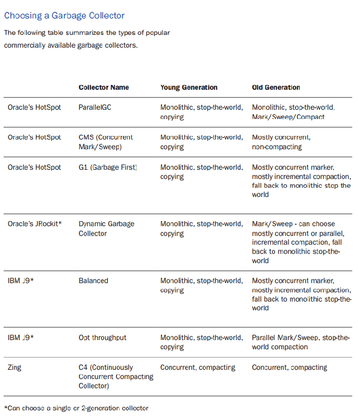
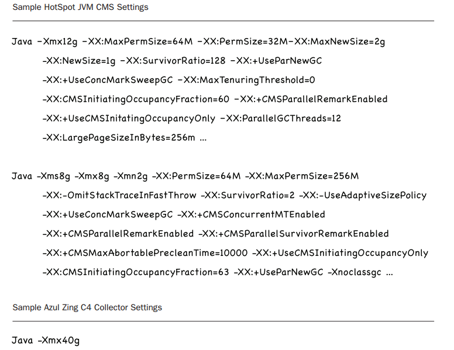

最近翻读ITEYE的HLLVM小组，主要找一些GC方面的只是来补充。

然后发现了Azul公司的Zing JVM和他们的C4 垃圾回收器的介绍PDF。

前面说得比较严肃，很多人误解了GC，没有掌握JVM GC的实现细节和具体应用场景，由此导致应用出现各种各样的问题。

基本把几大商用JVM的GC都介绍了，当然GC的基础算法也介绍了一些。

然后有两个页面特别让我震撼。

一个是四大JVM的GC的介绍对面表格，一个是Zing JVM参数配置和hotspot JVM使用CMS时的参数配置对比。

四大商业JVM GC对比表

Zing JVM配置 和 HotSpot JVM 配置对比

Zing JVM的配置炒鸡简单！！！，后续可能应该测试一下两者的性能对比。

> 本文转载自：https://cyberdak.github.io/java/2016/06/01/azul-c4