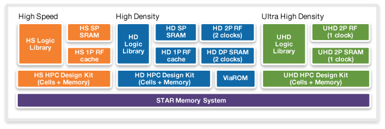
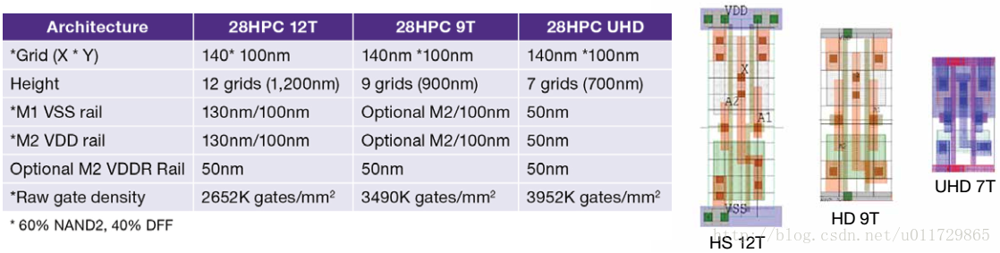
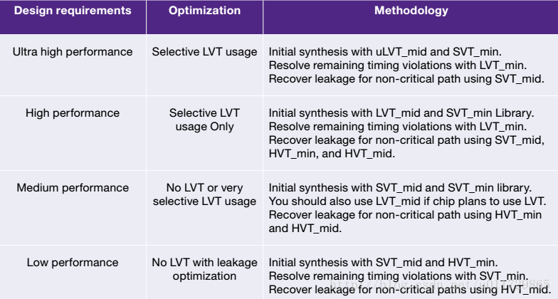
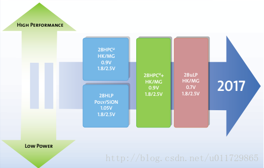
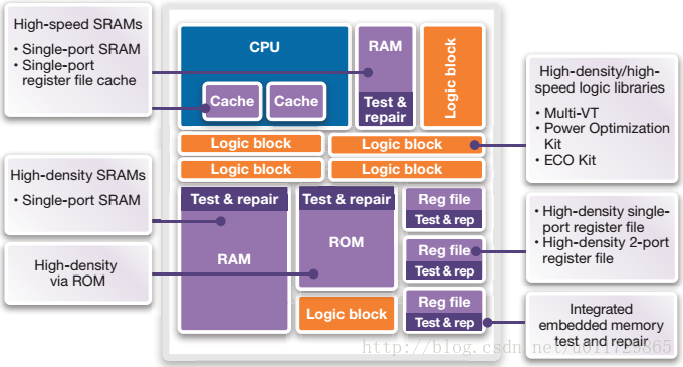
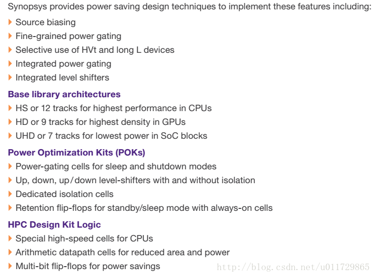
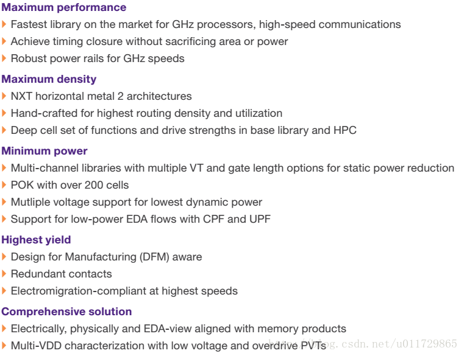

<!-- TOC -->

- [标准单元库的理解](#标准单元库的理解)
	- [HVT/SVT/LVT的意思？](#hvtsvtlvt的意思)
	- [PVT](#pvt)
	- [multi-channel library](#multi-channel-library)
	- [7T/9T/12T](#7t9t12t)
	- [don’t use单元列表](#dont-use单元列表)
	- [推荐的单元库选择方法](#推荐的单元库选择方法)
	- [HLP和HPC的区别](#hlp和hpc的区别)
	- [SOC系统需要的单元库划分](#soc系统需要的单元库划分)
	- [推荐的单元库优化方法](#推荐的单元库优化方法)

<!-- /TOC -->

# 标准单元库的理解

对umc28nm standard cell library，做一些阅读理解，很多数据资料来源。

## HVT/SVT/LVT的意思？

high Vt
Standard Vt（也有称为Regular Vt，即RVT)
low Vt
阈值电压越低，因为饱和电流变小，所以速度性能越高；但是因为漏电流会变大，因此功耗会变差。

## PVT

process、voltage、temperature
technology是28nm工艺；process是制造流程，一般分为FF/TT/SS。两者的内容应该包括high-speed/high-density/HVT/SVT/LVT/multi-channel等信息。

## multi-channel library

对应不同的gate-length，即沟道长度。一般比工艺28nm要大一些。
例如，umc28nm的SVTmin 相对 SVTmax，性能增加20%，静态功耗增加80%。

## 7T/9T/12T

分别对应ultra-high-density（for lowest power in SOC blocks）、high-density（for highest density in GPU blocks）、high-speed（for highest performance in CPU blocks）。
T，代表track；是单元库的版图规则；作为一个计量单位。
标准单元库的单元高度，基本都是固定的，方便版图的布局；高度，通常以track作为计量单位，即用M2 track pitch来表示。
track和pitch的区别？
对于前端设计人员来说，不必深入。只要看懂databook就可以了。个人当前理解track和pitch，就是一样的；pitch=minSpacing+minWidth。

grid是单元库里，与工艺制造精度相关的名称。一般pin都放置在grid上，这也不需要多加深入，就认为是工艺在版图上的最小精度就可以了。

## don’t use单元列表

综合不允许使用的，一般是驱动能力太强或者太弱的标准单元不用；还有其它为了性能、功耗、面积衡量的单元。

## 推荐的单元库选择方法

## HLP和HPC的区别

HLP，high performance low power；这个应该是主流？
HPC，high performace compact。
ps：28nmHLP的core电压，是1.05V；HPC的core电压，则是0.9V。
举例，以CA53来看，HPC相对HLP，性能增加32%；面积减小5%。

另外，发现HLP的版图，跟HPC不一样。

## SOC系统需要的单元库划分

## 推荐的单元库优化方法

