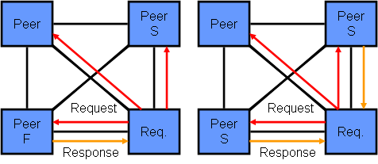
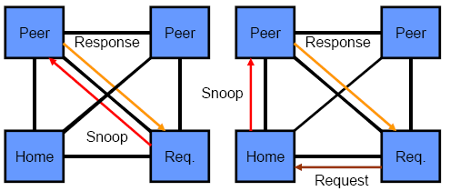
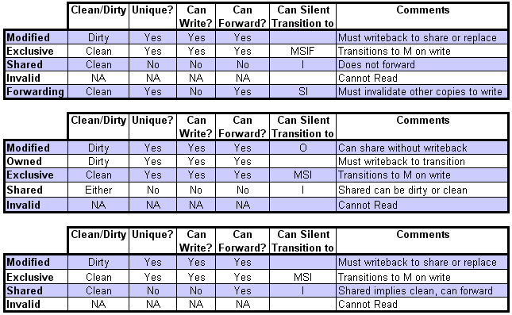

Intel的Nehalem一出，CPU江湖顿时失色。其中北桥FSB被灭，CSI/QPI兴起是一个重要因素。也正式宣告了Parallel Bus在处理器领域的王牌地位退出，和Serial Bus或者Point2Point互联的统治地位的诞生。。。：走的快（Parallel Bus）不如走的远（Serial Bus）。

QPI的互联，其中Cache的一致性是一个关键。

其协议是什么？MESIF！与经典的MESI相比，多了一个F word。当然，不是bad words。这里的F是Forwarding的意思。

在上面的两个图中，左边的是MESIF；右边的是经典的MESI。MESIF的例子中，我们可以看见，F状态的存在其实就是为了与S状态区别开来。系统中只有一个F，类比与：在一个家庭中，婆婆与老婆。如果是双重领导，事情全mess up。必须是一个领导F。找数据的时候，F给你，而非S（系统中有许多S）。读者一定要注意，F状态的引入是为了性能，而非状态机的完备性。没有F，S就可以搞定一切[如上右图]。系统中，对任何一个数据的Cacheline，有而且只有一个F。每次一个新人上台，需要数据，F就移交。F变成S。最新的数据变成F。这也是最佳利用Cache算法中的所谓Temporal Locality和Spatial Locality的考量：年轻人一定是会持续工作，时间长的。。。；年老的数据一定不是常用的；持续力不够的。。。另外，读者从上面两图中可以看出，MESI会造成QPI的链路上产生没必要的Snooping Response: 系统里多个婆婆（拥有相同数据备份的node）在非常殷勤的告诉一个申请者：阿拉有数据，and here you go。。。

在Nehalem互联中，QPI可以有Source Snoop或者Home Snoop。通常而言，小规模socket互联用Source Snoop；大规模互联用Home Snoop。

Home Snoop和Source Snoop的本质区别与Snooping时候MESFI状态机的F状态的目的是类似的：在能解决问题的同时，尽量减少互联上的Transaction。例如，Home Snoop的意思就是：老大说了算，负责协调；别人都别吭声。Soure Snoop的意思就是：各个小山头都可以掺和，立功表态。说到这里，就理解了，如果是一个大规模的Nehalem机群互联，用Home Snoop好；如果是1-8个Nehalem互联，估计Source Snoop好一些。道理很简单：如果是一个startup，问一个事，吆喝一声，知道的都回答你，挺好的；如果是一个10万人的公司，发个群发email给10万个人，问一个事情，估计骂你的人比回答你答案的人都多；你最好是问主管（Home）。。。

在上图中，哪个是Home Snoop？哪个是Source Snoop？显然，右图上Home Snoop；左图是Source Snoop。Source Snoop一定是而且只是2 Hop就能搞定数据，while Home Snoop需要在大本营到一下手，需要3 Hop。

MESIF，Intel申请了专利。其专利为：

[Forward state for use in cache coherency in a multiprocessor system](http://www.google.com/patents/about?id=MzYVAAAAEBAJ&dq=6922756)

该专利是2002年12月9日申请的。2005年7月26日批的。

M-blah-blah-I有许多变种。许多读者估计要么会迷糊，要么静不下心来。如果是前者，抓住一个要素：Write Invalidate。

我曾经在若干年前用大白话解释过Write Invalidate协议。学术的东西其实本质很简单。要理解须先要忘记学术，返璞归真。。。

下图是一个MESI的简单状态机。在理解Cache一致性协议状态机的时候，最容易犯迷糊的是把本CPU的动作与Snooping的动作混淆。现在简单忽悠一下这里面的M状态。从M上面围绕的动作，我们可以知道：蓝色的是自已玩自己的动作（发生在本CPU内部的）；红色的是监听到友商（别的CPU，或者其他逻辑，反正就是人在江湖，不得不在一起混的那些node，station等等）的动作。M的意思是：我现在是独家拥有，而且我很牛，还独家拥有修改过的数据。我现在自己独乐乐（Local Read;Local Write)；显然，没人能拿你怎么样。你多牛呀，你接着当M！ ……但是，突然在总线（FSB）或者互联（QPI）上监听到了不想看到的事情。。。：（1）有人发生了读行为（Remote Read）。你该如何办？还想一党独大嘛？没天理。你要把最新的数据给人民。。。而且要把数据UPDATE到DRAM里面去。数据是天下人的数据；而非某个CPU的数据！你的状态要变成S（hared）的了。。。。。。（2）有人发生了写行为（Remote Write）。要夺权！！！如何处理！？交权！皇帝轮流转！请把数据交出来，给别人写一写，玩一玩；然后人家变成了M；你自己变成了I（nvalid）了。。。你需要变成S嘛？至少目前没必要，除非你想读。。。。。。

细心的读者估计会反复琢磨这个状态机。请注意I（nvalid）状态的输入！！！严格的一致：全部来自红色的Remote Write–这就是我们说M-blah-blah-blah-I等各种变种协议都来自学术界里的所谓：Write Invalidate Protocol。用大白话就是：写失效。只要我看到别人有写一个数据备份，我就认栽！承认自己是弱势群体。。。。。。变成非法躲猫猫。

下图所示是MESFI，MOESI，MESI状态机的一些比较。Note that AMD的ccHT用的是MOESI。。。

另外，从SerDes的角度来观察QPI。可以这样去理解：QPI是一个Parallel Clock的SerDes。

这就可以理解QPI的Signal（Pin）了。QPI是单向的。信号是21个。20lane（bit）+clock。每个信号是Differential Signal（差分信号）的。因此是20×2 +1×2=42个pin（管脚）。如果一个QPI 端口（Port）【一发，一送，pair】，是84个pin。。。

Intel以前的并行总线Front-side Bus的pin有多少，600+多个！QPI是84个！比一比，吓一跳。

Parallel Clock SerDes是典型的把以前的并行总线信号汇聚成Serial Bus的做法。《控制信号+数据信号+地址信号+时钟）—》时钟+Serialized Signals。

> 本文转载自：http://www.valleytalk.org/2010/12/05/%E6%B5%85%E8%B0%88intel-qpi%E7%9A%84mesfi%E5%8D%8F%E8%AE%AE/
