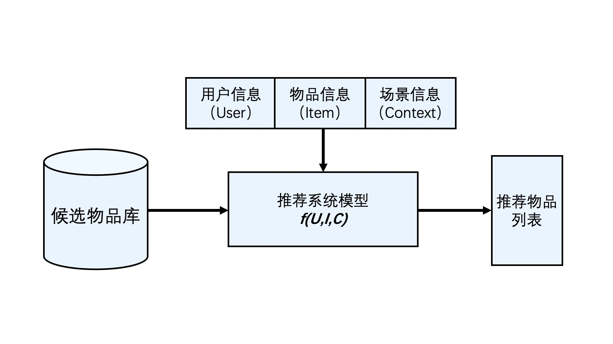
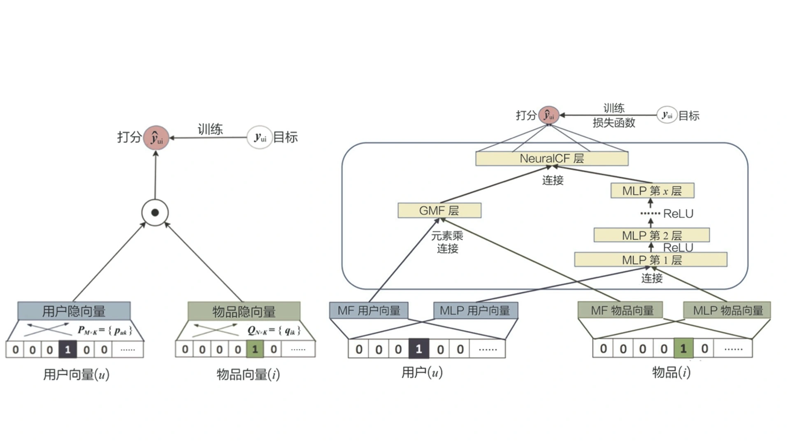
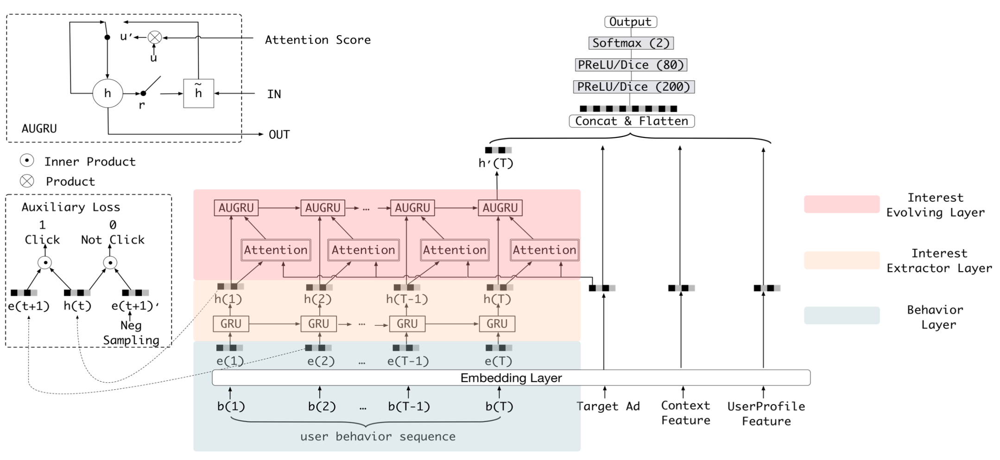
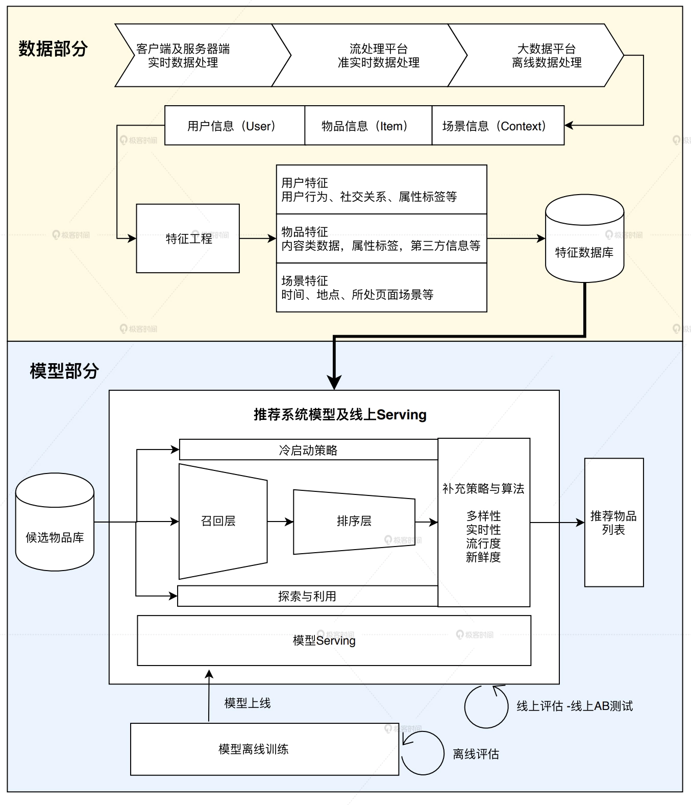
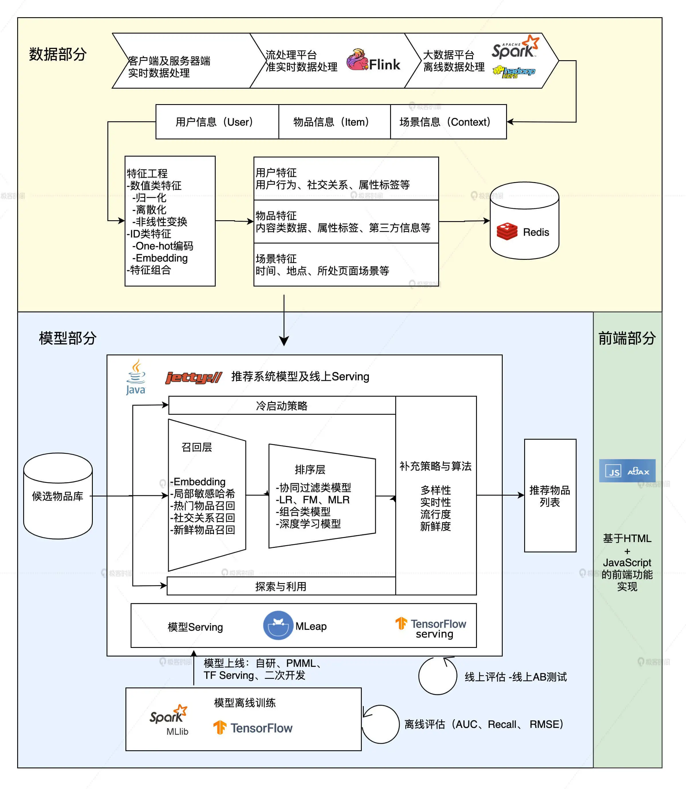
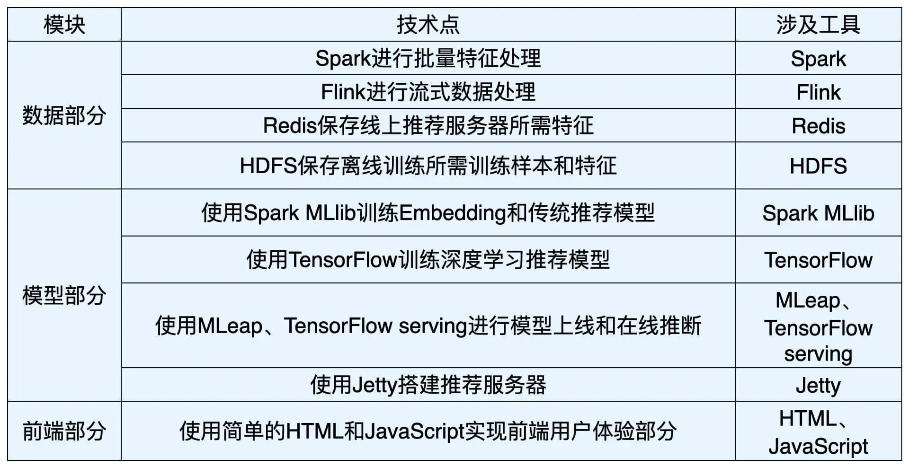

## 一、基础架构篇

### 1. 技术架构：深度学习推荐系统的经典技术架构长啥样？

#### 1.1 推荐系统要解决的根本问题是什么？

在“信息过载”的情况下，用户如何高效获取感兴趣的信息。

#### 1.2 推荐系统的逻辑架构

对于某个用户U（User），在特定场景C（Context）下，针对海量的“物品”信息构建一个函数 ，预测用户对特定候选物品I（Item）的喜好程度，再根据喜好程度对所有候选物品进行排序，生成推荐列表的问题。

图1 推荐系统的逻辑架构

#### 1.3 深度学习对推荐系统的革命

深度学习到底给推荐系统带来了什么革命性的影响?

1. 因为深度学习复杂的模型结构，让深度学习模型具备了理论上拟合任何函数的能力。

图2 传统矩阵分解模型和深度学习矩阵分解模型的对比图
来源：《Neural collaborative filtering》

2. 让深度学习模型的神经网络模拟很多用户兴趣的变迁过程，甚至用户做出决定的思考过程。

图3 阿里巴巴的深度兴趣进化网络
来源：《Deep Interest Evolution Network for Click-Through Rate Prediction》

#### 1.4 深度学习推荐系统的技术架构

一个工业级推荐系统的技术架构按照这两部分展开的，其中“数据和信息”部分逐渐发展为推荐系统中融合了数据离线批处理、实时流处理的数据流框架；“算法和模型”部分则进一步细化为推荐系统中，集训练（Training）、评估（Evaluation）、部署（Deployment）、线上推断（Online Inference）为一体的模型框架。基于此，我们就能总结出推荐系统的技术架构图。

图4 推荐系统技术架构示意图

**第一部分：推荐系统的数据部分**

大数据计算平台通过对推荐系统日志，物品和用户的元数据等信息的处理，获得了推荐模型的训练数据、特征数据、统计数据等。那这些数据都有什么用呢？具体说来，大数据平台加工后的数据出口主要有 3 个：

- 生成推荐系统模型所需的样本数据，用于算法模型的训练和评估。
- 生成推荐系统模型服务（Model Serving）所需的“用户特征”，“物品特征”和一部分“场景特征”，用于推荐系统的线上推断。
- 生成系统监控、商业智能（Business Intelligence，BI）系统所需的统计型数据。

**第二部分：推荐系统的模型部分**

推荐系统的“模型部分”是推荐系统的主体。模型的结构一般由“召回层”、“排序层”以及“补充策略与算法层”组成。

最典型的深度学习应用总结成了 3 点：

- 深度学习中 Embedding 技术在召回层的应用。作为深度学习中非常核心的 Embedding 技术，将它应用在推荐系统的召回层中，做相关物品的快速召回，已经是业界非常主流的解决方案了。
- 不同结构的深度学习模型在排序层的应用。排序层（也称精排层）是影响推荐效果的重中之重，也是深度学习模型大展拳脚的领域。深度学习模型的灵活性高，表达能力强的特点，这让它非常适合于大数据量下的精确排序。深度学习排序模型毫无疑问是业界和学界都在不断加大投入，快速迭代的部分。
- 增强学习在模型更新、工程模型一体化方向上的应用。增强学习可以说是与深度学习密切相关的另一机器学习领域，它在推荐系统中的应用，让推荐系统可以在实时性层面更上一层楼。

### 2. Sparrow RecSys：我们要实现什么样的推荐系统？

#### 2.1 Sparrow RecSys 介绍

#### 2.2 Sparrow Recsys 涵盖的技术点

图8 Sparrow Recsys的推荐系统架构

图9 Sparrow Recsys中的技术点

### 3. 深度学习基础：你打牢深度学习知识的地基了吗？

