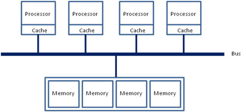
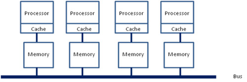
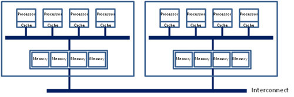
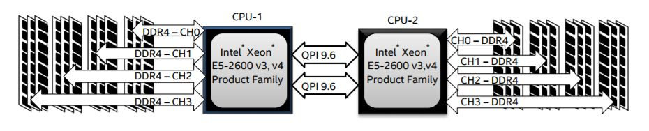
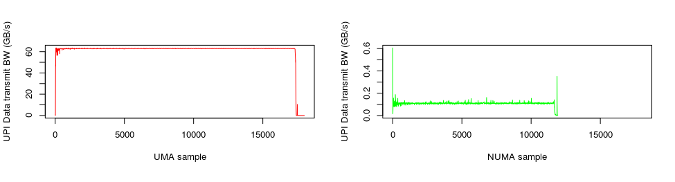

<font color=blue>相关杂思：今天与实验室师兄讨论起PIM开启内存交织的方式，主要是以UPMEM为例，每64MB的DRAM die上都有一个DPU，只可以访问local 64MB的数据，访问其他DPU的数据则需要通过CPU或者DPU之间的数据总线，这需要设计实现相当复杂的NUMA架构。然后我提出了一个想法，将128个DPU绑定为一个Group，同一个group内部的DPU具有全局视野，可以直接访问这一个Group内部的1GB数据，这就与现在CPU中的NUMA方案很相似，如参考博客中的第三张图的方案，同理现在共享LLC也是充当这种角色。第二种方案与现有UPMEM方案相同，只是使用CPU当作QPI的通信功能。这样做有一个弊端就是任意两个核心之间的访问速度都等于NUMA架构中最大跳的延迟，并且QPI上带宽会称为系统瓶颈。</font>

首先列出开源小站之前相关的几篇帖子：

- [Linux的NUMA机制](https://link.zhihu.com/?target=http%3A//www.litrin.net/2014/06/18/linux%25e7%259a%2584numa%25e6%259c%25ba%25e5%2588%25b6/)
- [NUMA对性能的影响](https://link.zhihu.com/?target=http%3A//www.litrin.net/2017/08/03/numa%25e5%25af%25b9%25e6%2580%25a7%25e8%2583%25bd%25e7%259a%2584%25e5%25bd%25b1%25e5%2593%258d/)
- [cgroup的cpuset问题](https://link.zhihu.com/?target=http%3A//www.litrin.net/2016/05/18/cgroup%25e7%259a%2584cpuset%25e9%2597%25ae%25e9%25a2%2598/)

这次，就来深入了解下NUMA。

就如之前说的，在若干年前，对于x86架构的计算机，那时的内存控制器还没有整合进CPU，所有内存的访问都需要通过北桥芯片来完成。此时的内存访问如下图所示，被称为UMA（uniform memory access, 一致性内存访问 ）。这样的访问对于软件层面来说非常容易实现：总线模型保证了所有的内存访问是一致的，不必考虑由不同内存地址之前的差异。



之后的x86平台经历了一场从“拼频率”到“拼核心数”的转变，越来越多的核心被尽可能地塞进了同一块芯片上，各个核心对于内存带宽的争抢访问成为了瓶颈；此时软件、OS方面对于SMP多核心CPU的支持也愈发成熟；再加上各种商业上的考量，x86平台也顺水推舟的搞了NUMA（Non-uniform memory access, 非一致性内存访问）。

在这种架构之下，每个Socket都会有一个独立的内存控制器IMC（integrated memory controllers, 集成内存控制器），分属于不同的socket之内的IMC之间通过QPI link通讯。



然后就是进一步的架构演进，由于每个socket上都会有多个core进行内存访问，这就会在每个core的内部出现一个类似最早SMP架构相似的内存访问总线，这个总线被称为IMC bus。



于是，很明显的，在这种架构之下，两个socket各自管理1/2的内存插槽，如果要访问不属于本socket的内存则必须通过QPI link。也就是说内存的访问出现了本地/远程（local/remote）的概念，内存的延时是会有显著的区别的。这也就是之前那篇文章中提到的为什么NUMA的设置能够明显的影响到JVM的性能。

回到当前世面上的CPU，工程上的实现其实更加复杂了。以[Xeon 2699 v4系列CPU的标准](https://link.zhihu.com/?target=https%3A//ark.intel.com/products/96899/Intel-Xeon-Processor-E5-2699A-v4-55M-Cache-2_40-GHz)来看，两个Socket之之间通过各自的一条9.6GT/s的QPI link互访。而每个Socket事实上有2个内存控制器。双通道的缘故，每个控制器又有两个内存通道（channel），每个通道最多支持3根内存条（DIMM）。理论上最大单socket支持76.8GB/s的内存带宽，而两个QPI link，每个QPI link有9.6GT/s的速率（~57.6GB/s）事实上QPI link已经出现瓶颈了。



嗯，事情变得好玩起来了。

核心数还是源源不断的增加，Skylake桌面版本的i7 EE已经有了18个core，下一代的Skylake Xeon妥妥的28个Core。为了塞进更多的core，原本核心之间类似环网的设计变成了复杂的路由。由于这种架构上的变化，导致内存的访问变得更加复杂。两个IMC也有了local/remote的区别，在保证兼容性的前提和性能导向的纠结中，系统允许用户进行更为灵活的内存访问架构划分。于是就有了“NUMA之上的NUMA”这种妖异的设定（SNC）。

回到Linux，内核[mm](https://link.zhihu.com/?target=https%3A//git.kernel.org/pub/scm/linux/kernel/git/stable/linux-stable.git/tree/mm%3Fh%3Dv4.13.10)/[mmzone.c](https://link.zhihu.com/?target=https%3A//git.kernel.org/pub/scm/linux/kernel/git/stable/linux-stable.git/tree/mm/mmzone.c%3Fh%3Dv4.13.10), [include](https://link.zhihu.com/?target=https%3A//git.kernel.org/pub/scm/linux/kernel/git/stable/linux-stable.git/tree/include%3Fh%3Dv4.13.10)/[linux](https://link.zhihu.com/?target=https%3A//git.kernel.org/pub/scm/linux/kernel/git/stable/linux-stable.git/tree/include/linux%3Fh%3Dv4.13.10)/[mmzone.h](https://link.zhihu.com/?target=https%3A//git.kernel.org/pub/scm/linux/kernel/git/stable/linux-stable.git/tree/include/linux/mmzone.h%3Fh%3Dv4.13.10)文件定义了NUMA的数据结构和操作方式。

Linux Kernel中NUMA的调度位于[kernel](https://link.zhihu.com/?target=https%3A//git.kernel.org/pub/scm/linux/kernel/git/stable/linux-stable.git/tree/kernel%3Fh%3Dv4.13.10)/[sched](https://link.zhihu.com/?target=https%3A//git.kernel.org/pub/scm/linux/kernel/git/stable/linux-stable.git/tree/kernel/sched%3Fh%3Dv4.13.10)/[core.c](https://link.zhihu.com/?target=https%3A//git.kernel.org/pub/scm/linux/kernel/git/stable/linux-stable.git/tree/kernel/sched/core.c%3Fh%3Dv4.13.10)函数int sysctl_numa_balancing

1. 在一个启用了NUMA支持的Linux中，Kernel不会将任务内存从一个NUMA node搬迁到另一个NUMA node。
2. 一个进程一旦被启用，它所在的NUMA node就不会被迁移，为了尽可能的优化性能，在正常的调度之中，CPU的core也会尽可能的使用可以local访问的本地core，在进程的整个生命周期之中，NUMA node保持不变。
3. 一旦当某个NUMA node的负载超出了另一个node一个阈值（默认25%），则认为需要在此node上减少负载，不同的NUMA结构和不同的负载状况，系统见给予一个延时任务的迁移——类似于漏杯算法。在这种情况下将会产生内存的remote访问。
4. NUMA node之间有不同的拓扑结构，各个 node 之间的访问会有一个距离（node distances）的概念，如numactl -H命令的结果有这样的描述：node distances:

| node 	| 0  	| 1  	| 2  	| 3  	|
|------	|----	|----	|----	|----	|
| 0    	| 10 	| 11 	| 21 	| 21 	|
| 1    	| 11 	| 10 	| 21 	| 21 	|
| 2    	| 21 	| 21 	| 10 	| 11 	|
| 3    	| 21 	| 21 	| 11 	| 10 	|

可以看出：0 node 到0 node之间距离为10，这肯定的最近的距离，不提。0-1之间的距离远小于2或3的距离。这种距离方便系统在较复杂的情况下选择最合适的NUMA设定。



上图记录了某个Benchmark工具，在开启/关闭NUMA功能时QPI带宽消耗的情况。很明显的是，在开启了NUMA支持以后，QPI的带宽消耗有了两个数量级以上的下降，性能也有了显著的提升！

通常情况下，用户可以通过numactl来进行NUMA访问策略的手工配置，cgroup中cpuset.mems也可以达到指定NUMA node的作用。以numactl命令为例，它有如下策略：

- –interleave=nodes //允许进程在多个node之间交替访问
- –membind=nodes //将内存固定在某个node上，CPU则选择对应的core。
- –cpunodebind=nodes //与membind相反，将CPU固定在某（几）个core上，内存则限制在对应的NUMA node之上。
- –physcpubind=cpus //与cpunodebind类似，不同的是物理core。
- –localalloc //本地配置
- –preferred=node //按照推荐配置

对于某些大内存访问的应用，比如Mongodb，将NUMA的访问策略制定为interleave=all则意味着整个进程的内存是均匀分布在所有的node之上，进程可以以最快的方式访问本地内存。

讲到这里似乎已经差不多了，但事实上还没完。如果你一直按照这个“北桥去哪儿了？”的思路理下来的话，就有了另一个问题，那就是之前的北桥还有一个功能就是PCI/PCIe控制器，当然原来的南桥，现在的PCH一样也整合了PCIe控制器。事实上，在PCIe channel上也是有NUMA亲和性的。

比如：查看网卡enp0s20f0u5的NUMA，用到了netdev:<设备名称>这种方式。

```shell
[root@local ~]# numactl --prefer netdev:enp0s20f0u5 --show
policy: preferred
preferred node: 0
physcpubind: 0
cpubind: 0
nodebind: 0
membind: 0 1 2 3
```

或者一个PCI address 为00:17的SATA控制器，用到了pci:<PCI address>

```shell
[root@local~]# numactl --prefer pci:00:17 --show
policy: preferred
preferred node: 0
physcpubind: 0
cpubind: 0
nodebind: 0
membind: 0 1 2 3
```

还有block/ip/file的方式查看NUMA affinity，这里也就不再累述了。

综上，感觉上现在的服务器，特别是多socket的服务器架构更像是通过NUMA共享了内存；进而通过共享内存从而共享外设的多台主机。

最后还是那句：那种一个业务就能跑满整台server的时代是再也回不来了！

\----------------------------------------------------------------------
Linux提供了一个一个手工调优的命令numactl（默认不安装），首先你可以通过它查看系统的numa状态

```shell
[root@realhost /]# numactl --hardware
available: 1 nodes (0)
node 0 cpus: 0 1 2 3
node 0 size: 1023 MB
node 0 free: 147 MB
node distances:
node   0
  0:  10
```

可以看到，此系统共有1个node（因为是跑在windows上的虚拟机），共有1170M内存

这里假设我的虚拟机有多个node ，并且我要执行一个java param命令。最好的优化方案时python在node0中执行，而java在node1中执行，那命令是

```shell
numactl --cpunodebind=0 --membind=0 python param
numactl --cpunodebind=1 --membind=1 java param
```

numactl 命令详解

```shell
语法：

numactl [--interleave nodes] [--preferred node] [--membind nodes]
  [--cpunodebind nodes] [--physcpubind cpus] [--localalloc] [--] {arguments ...}
numactl --show
numactl --hardware
numactl [--huge] [--offset offset] [--shmmode shmmode] [--length length] [--strict]
[--shmid id] --shm shmkeyfile | --file tmpfsfile
[--touch] [--dump] [--dump-nodes] memory policy

主要参数：

--interleave=nodes, -i nodes


          这个选项用于设定内存的交织分配模式。 也就是说系统在为多个节点分配内存空间的时候，将会以轮询分发的方式被分配给这多个节点.
          如果在当前众多的交织分配内存节点中的目标节点无法正确的分配内存空间的话，内存空间将会由其他的节点来分配。


--membind=nodes, -m nodes
           选项 '--membind' 仅用来从节点中分配内存空间所用。 如果在这些节点中无法分配出所请求的空间大小的话该分配操作将会失败.
           上述命令中指定需要分配空间的 nodes 的方式可以遵照上述 N,N,N , N-N ,N 这种方式来指定.


--cpunodebind=nodes, -N nodes
          上述命令仅用于施加在运行与 cpu 上的进程。这个命令用于显示 cpu 的个数，cpu 数目信息同样记录在系统中的存放处理器领域信息的 /proc/cpuinfo 文件夹下，
          或者是按照关联的中央处理器信息 在当前的中央处理器集中所存放.          
   
--localalloc , -l
           这个命令选项通常是为当前的节点分配内存的


--preferred=node
               该命令由于指定优先分配内存空间的节点，如果无法将空间分配给该节点的话，应该分配给该节点上的空间将会被分发到其他的节点上               
                该命令选项后面仅接收一个单独的节点标号.  相关的表示方式也可以使用.


--show,-s
           该命令用于显示 NUMA 机制作用在当前运行的那些进程上


--hardware , -H


            该命令用于显示当前系统中有多少个可用的节点.


--huge
            当创建一个基于大内存页面的系统级的共享内存段的时候,使用 --huge 这个选项。
           --huge 选项仅在 --shmid 或是 --shm 命令的后面使用才有效.
--offset
           该参数选项用于指定共享内存段中的位移量的偏移。 默认的情况下偏移量是 0 。 有效的偏移量单位是 m (用于表示 MB)
            g (用于表示 GB) , k (用于表示 KB ), 其他没有指定的被认为是以字节为单位.


--strict 
             这个参数选项 当施加了 NUMA 调度机制的共享内存段区域的页面被施加了另一个机制而导致错误的时候，
            使用 --strict 选项将会把错误信息显示出来. 默认情况是不使用该选项的。


--shmmode shmmode
          该选项仅在 --shmid 或是 --shm 之前使用才会生效。 当创建一个共享内存段的时候，通过整型数值来指定
           共享内存的共享的模式类型.


--length length
            Apply policy to length range in the shared memory segment or make the segment length long Default is to use the remaining
           length Required when a shared memory segment is created and specifies the length of the new segment then .
            Valid units are m ( for MB ) , g( for GB) , k ( for KB) , otherwise it specifies bytes.


--shmid id
             通过ID 号码来创建或使用一个共享内存段。
               (如果共享内存段已经存在，那么通过 shmid 来指定下面要使用某个 ID 的共享内存段 ;  如果该 ID 对应的共享内存段并不存在的话，那么就创建一个)


--shm shmkeyfile
             通过存放在 shmkeyfile（共享内存-键文件）中的 ID 号码来创建或者是使用一个共享内存段。
             访问 shmkeyfile 文件的进程是通过 fork(3 arguments) 方法来实现的.


--file tmpfsfile
         将 numa 机制施加于文件上面, 这个文件属于 tmpfs或者是 hugetlbfs 这种特殊的文件系统


--touch
         通过将 numa 机制施加于刚刚页面上来实现内存的早期 numa 化。
         默认情况下是不使用该选项，如果存在映射或是访问页面的应用的话，将会使用该早期实行 NUMA 机制的这种方法.


--dump
         该选项用于废除将已经 numa 化的特定区域上的 NUMA性质.


(--dump ) 选项后,有效指定 node 的书写方式
         all  用于将所有的节点上的 NUMA 特性移除
         number  通过指定 node 后接的数值来废除该数字对应的 node
         number1(number2)  node number1（node number2）上的 NUMA 特性将会被移除
         number1-number2    node number1 -- node number2 区间上的所有存在的 node 的 NUMA 特性将会被移除
         !nodes                除了 nodes 所指定的节点以外的所有节点上的 NUMA 特性全都会被移除
```

\----------------------------------------------------------------------

## 相关资料

- [浅解NUMA机制](https://zhuanlan.zhihu.com/p/67558970)
- [GT/s和GB/s（Gbps）之间含义说明](https://blog.csdn.net/sinat_41896311/article/details/114091263)
- [Linux的NUMA机制](https://www.cnblogs.com/QiangWum/p/12518797.html#:~:text=Linux%E7%9A%84NUMA%E6%9C%BA%E5%88%B6%20NUMA%20%28Non-Uniform,Memory%20Access%29%E5%AD%97%E9%9D%A2%E7%9B%B4%E8%AF%91%E4%B8%BA%E2%80%9C%E9%9D%9E%E4%B8%80%E8%87%B4%E6%80%A7%E5%86%85%E5%AD%98%E8%AE%BF%E9%97%AE%E2%80%9D%EF%BC%8C%E5%AF%B9%E4%BA%8ELinux%E5%86%85%E6%A0%B8%E6%9D%A5%E8%AF%B4%E6%9C%80%E6%97%A9%E5%87%BA%E7%8E%B0%E5%9C%A82.6.7%E7%89%88%E6%9C%AC%E4%B8%8A%E3%80%82%20%E8%BF%99%E7%A7%8D%E7%89%B9%E6%80%A7%E5%AF%B9%E4%BA%8E%E5%BD%93%E4%B8%8B%E5%A4%A7%E5%86%85%E5%AD%98%2B%E5%A4%9ACPU%E4%B8%BA%E6%BD%AE%E6%B5%81%E7%9A%84X86%E5%B9%B3%E5%8F%B0%E6%9D%A5%E8%AF%B4%E7%A1%AE%E5%AE%9E%E4%BC%9A%E6%9C%89%E4%B8%8D%E5%B0%91%E7%9A%84%E6%80%A7%E8%83%BD%E6%8F%90%E5%8D%87%EF%BC%8C%E4%BD%86%E7%9B%B8%E5%8F%8D%E7%9A%84%EF%BC%8C%E5%A6%82%E6%9E%9C%E9%85%8D%E7%BD%AE%E4%B8%8D%E5%BD%93%E7%9A%84%E8%AF%9D%EF%BC%8C%E4%B9%9F%E6%98%AF%E4%B8%80%E4%B8%AA%E5%BE%88%E5%A4%A7%E7%9A%84%E5%9D%91%E3%80%82)


> 本文主要内容转载自：https://zhuanlan.zhihu.com/p/33621500
