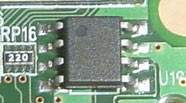
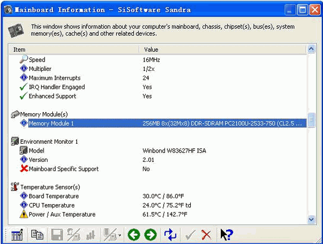

# 用好你的内存之SPD

说起内存，相信大家都不陌生。不过，大家的目光除了更多地投放在内存芯片颗粒上之外，很少会注意到内存PCB（印刷电路板）边上还有一颗体积较小（大约为3mm×4mm×1.5mm）的芯片，这就是SPD芯片。

## 一、什么是SPD

SPD（Serial Presence Detect，串行存在检测）是一颗8针的EEPROM（Electrically Erasable Programmable ROM，电可擦写可编程只读存储器）芯片。它一般位于内存条正面的右侧（如图1），采用SOIC封装形式，容量为256字节（Byte）。SPD芯片内记录了该内存的许多重要信息，诸如内存的芯片及模组厂商、工作频率、工作电压、速度、容量、电压与行、列地址带宽等参数。SPD信息一般都是在出厂前，由内存模组制造商根据内存芯片的实际性能写入到ROM芯片中。

## 二、SPD的作用是什么

启动计算机后，主板BIOS就会读取SPD中的信息，主板北桥芯片组就会根据这些参数信息来自动配置相应的内存工作时序与控制寄存器，从而可以充分发挥内存条的性能。上述情况实现的前提条件是在BIOS设置界面中，将内存设置选项设为“By SPD”。当主板从内存条中不能检测到SPD信息时，它就只能提供一个较为保守的配置。

从某种意义上来说，SPD芯片是识别内存品牌的一个重要标志。如果SPD内的参数值设置得不合理，不但不能起到优化内存的作用，反而还会引起系统工作不稳定，甚至死机。因此，很多普通内存或兼容内存厂商为了避免兼容性问题，一般都将SPD中的内存工作参数设置得较为保守，从而限制了内存性能的充分发挥。更有甚者，一些不法厂商通过专门的读写设备去更改SPD信息，以骗过计算机的检测，得出与实际不一致的数据，从而欺骗消费者。

## 三、如何查看SPD信息

一般来说，品牌内存都有SPD设置，只要借助SiSoft Sandra2004或EVEREST等工具软件，就可以查看SPD芯片中的一些重要信息。以前者为例：运行SiSoft Sandra2004后，用鼠标双击主窗口中的“Mainboard Information”模块，在随后出现的界面内就可以看到“Memory Module”信息了（如图2）。

下面我们就以软件中显示的“256MB 8×(32Mbit×8)DDR-SDRAM PC2100U-2533-750(CL2.5 up to 100MHz)”为例，来说明DDR SDRAM内存的SPD信息的表示方式。这里的“PC2100U-2533-750”就是该内存的SPD值了。其中：

- 第一段：“PC2100”指内存带宽，单位为MB/s，即该内存带宽为2100MB/s，对应的内存标准工作频率为2100MHz×1/16（133MHz，即DDR266内存）；“U”代表DIMM模块不含缓冲区。
- 第二段：“25”表示CAS（列地址选通脉冲）延迟时间（即CL值），用时钟周期表示，这里25代表CL＝2.5；“33”中的前一个3表示RAS相对CAS的延时，单位是时钟周期，第二个3则表示RAS（行地址选通脉冲）预充电时间。
- 第三段：“75”表示相对于时钟下沿的数据读取时间，即7.5ns；最后一个数字0代表SPD的版本，如0代表SPD版本为1.0。

## 四、利用SPD进行优化

一般来说，影响内存性能高低的因素主要是以下两点，一是内存工作频率过低，无法和CPU同步运行。二是内存传输数据时的延迟时间过长，限制了内存的数据存取速度。因此，只要对主板BIOS进行设置，修改SPD值，就可以使内存性能得到进一步的优化。

### 1. 提高内存工作频率

启动计算机，进入主板BIOS设置（这里以Award BIOS、P4系统为例）中“Advanced Chipset Feature”界面，选择“Frequence/Voltage Control”，可以看到“CPU:DRAM Clock Ratio”中显示的内容就是CPU外频对内存的频率比例。

**注：** 默认设置为“SPD”，即“自动侦测模式”。在SPD模式下，系统自动从内存的SPD芯片中获取信息，所以理论上说，此时内存的工作状态是最稳定的。

如果想超频内存，就需要手动设置CPU与内存的工作频率比例来更好地调节与SPD的配合。比如：533MHz FSB的P4外频为133MHz，要将DDR333内存超频到200MHz外频使用，那么就需要选择“2∶3”的比值。如果要让DDR266内存超频到DDR333，无疑就要选择“3∶4”。

如果要保证调节后的稳定性，有时需要在BIOS中手动提高内存的工作电压。方法是：选择“Add Voltage”，然后进行调节。切记：在提高内存工作电压的时候，要循序渐进，切勿一次提高过多而损坏内存。

### 2. 调整内存延迟时间

我们知道，内存总延迟时间＝内存时钟周期×CL数值＋数据存取时间（tAC值），因此，只要在BIOS中修改内存的相应参数值，就可以提升内存的性能。下面，我们就进入“Advanced Chipset Feature”设置界面进行说明：

- （1）修改CAS延迟时间（CL值）。它表示内存进行读写操作前，列地址控制器的等待时间。CAS参数选项为“CAS Latency Time”，数值选择有2.、2.5或者3，如果内存品质较高，可以将数值设为2。
- （2）修改tRCD值。它表示内存行地址控制器到列地址控制器的延迟时间。其参数选项为“DRAM RAS To CAS Delay”，数值选择有2、3等。同样是越小越好。
- （3）修改tRP值。它表示内存行地址控制器预充电时间，其参数选项为“Active to Precharge Delay”，数值选择有2、3等，参数越小说明内存读写速度就越快。
- （4）修改tRAS值。它表示内存行地址选中前的延迟时间。其参数选项为“DRAM RAS Precharge”，数值选择有5、6、7等。数字越小，延迟时间越短。

> 文章转载自：https://blog.csdn.net/wbcuc/article/details/6200735