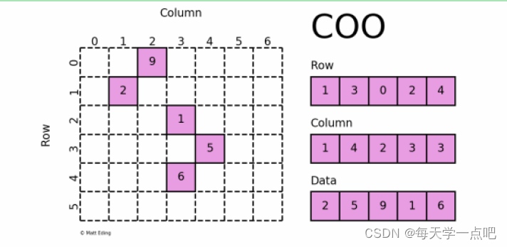
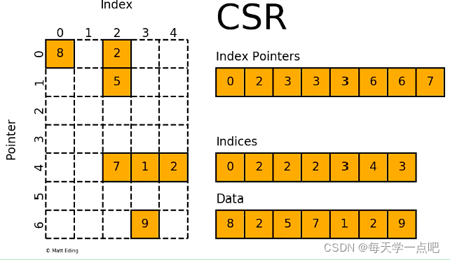

<!-- TOC -->

- [图结构数据](#图结构数据)
- [稀疏矩阵的格式](#稀疏矩阵的格式)
	- [COO](#coo)
	- [CSR](#csr)
	- [CSC](#csc)

<!-- /TOC -->

## 图结构数据

图是用于描述对象间关系的基本结构，顶点表示对象，边表示连接关系。
根据连接关系的紧密可以将图分为稀疏图和稠密图，两者是相对的概念，并不存在明确的划分界限。稀疏图可以理解为仅有少部分对象间存在关联，稠密图反之。实际应用中的图往往都是稀疏图。采用直观的办法来存储图往往会造成极大的空间浪费，如邻接矩阵（稀疏图对应的邻接矩阵中绝大部分的元素为零，无实际意义）。因此需要考虑寻求其它格式来进行高效存储。

## 稀疏矩阵的格式

- COO, coordinate format.
- CSR, compressed sparse row format.
- CSC, compressed sparse column format.

### COO

COO格式是将矩阵中的非零元素以坐标的方式存储。例如下面的邻接矩阵，我们可以用两个长度为n的整数数组分别表示行列索引，以及用另一个长度为n的实数数组表示矩阵非零元素。其中n为矩阵中非0元素个数。具体如下图所示：

### CSR

对于COO格式的一种改进就是CSR格式，这种格式要求矩阵元按行顺序存储，每一行中的元素可以乱序存储。那么对于每一行，就不需要记录所有元素的行指标。只需要用一个指针表示每一行元素的起始位置即可。以下图为例，具体包含以下数据结构：

1. Data，用来存储矩阵中的非零元素的值；
2. Indices，第i个元素记录了Data[i]元素的列数；
3. Index Pointers, 第i个元素记录了第i行元素在Data数组的起始位置，第i+1个元素为第i行元素在Data数组的终止位置（不包含右边界）。例如第0行元素为Data[0, 2)。

### CSC

CSC是按列来存储一个稀疏矩阵的，其原理与CSC类似。具体包含以下数据结构：

1. Data，用来存储矩阵中的非零元素的值；
2. Indices，第i个元素记录了Data[i]元素的行数；
3. Index Pointers, 第i个元素记录了第i列元素在Data数组的起始位置，第i+1个元素为第i列元素在Data数组的终止位置（不包含右边界）。

本文引用自：https://blog.csdn.net/m0_64204369/article/details/123035598

Further Reading

- [稀疏矩阵的主要存储格式](https://zhuanlan.zhihu.com/p/37525925)