# 自己动手写CPU

## 处理器与MIPS

### MIPS指令发展

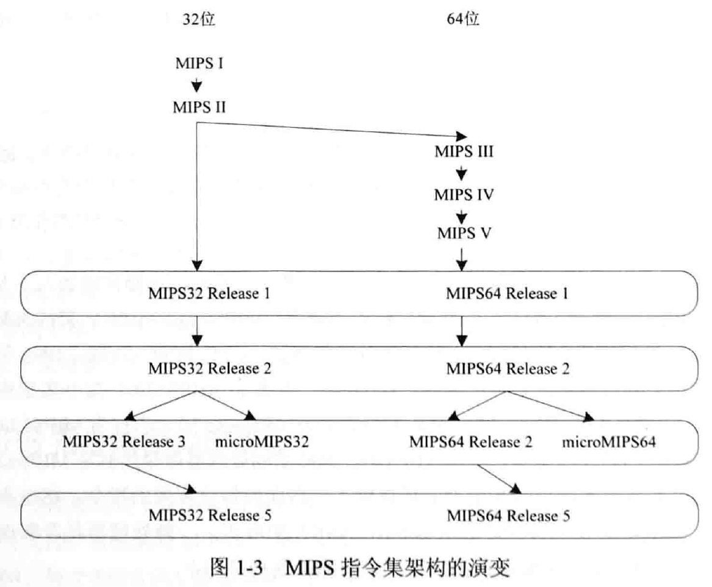

### MIPS32寄存器介绍

MIPS32中的寄存器分为两类：通用寄存器（General Purpose Register, GPR）、特殊寄存器。

1. 通用寄存器

**表 1-1 MIPS32中通用寄存器的约定用法**

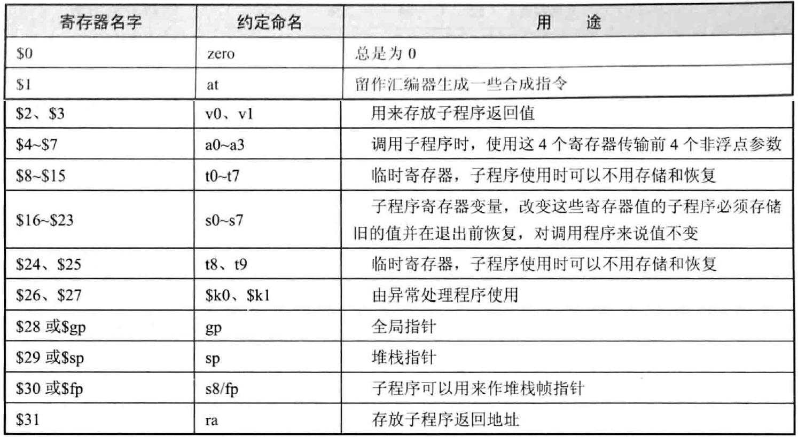

2. 特殊寄存器

MIPS32架构中定义的特殊寄存器有三个：PC（Program Counter程序计数器）、HI（乘除结果高位寄存器）、LO（乘除结果低位寄存器）。
进行乘法运算时，HI和LO把偶才能乘法运算的结果，其中HI存储高32位，LO存储低32位；进行除法运算时，HI和LO保存除法运算的结果。其中HI存储余数，LO存储商。


### 字节次序

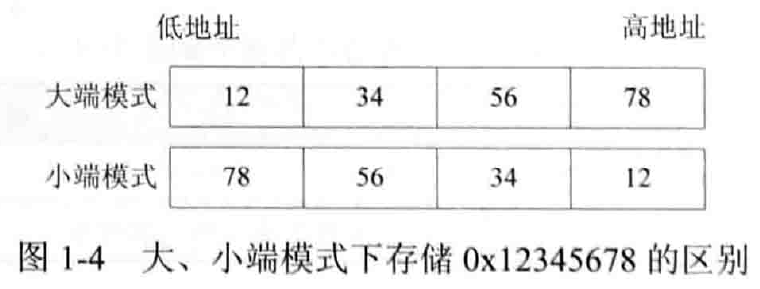

### MIPS32指令格式

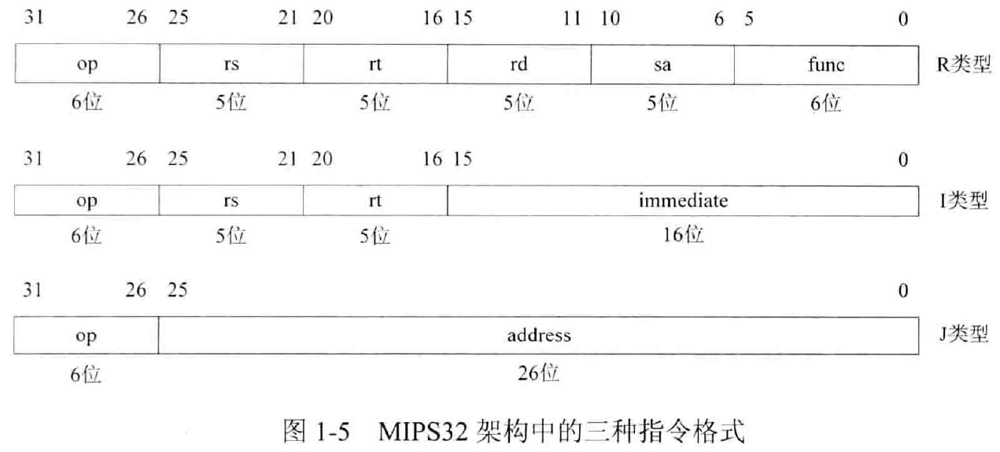

- R类型：具体操作由op、func结合指定，rs和rt是源寄存器的编号，rd是目的寄存器的编号。比如：假设目的寄存器是$3，那么对应的rd就是00011。MIPS32架构中有32个通用寄存器，使用5位编码就可以全部表示，所以rs、rt、rd的宽度都是5位。sa只有在移位指令中使用，用来指定移位位数。
- I类型：具体操作由op指定，指令的低16位是立即数，运算时要将其扩展至32位，然后作为其中一个源操作数参与运算。
- J类型：具体操作由op指定，一般是跳转指令，低26位是字地址，用于产生跳转的目标地址。

### 指令集

<font color=red>本书实现的处理器不包含浮点处理单元，在此不介绍浮点指令。</font>

1. 逻辑操作指令

and, andi, or, ori, xor, xori, nor, lui

2. 移位操作指令

sll, sllv, sra, srav, srl, srlv

3. 移动操作指令

movn, movz, mfhi, mthi, mflo, mtlo

4. 算术操作指令

add, addi, addiu, addu, sub, subu, clo, clz, slt, slti, sltiu, sltu, mul, mult, multu, madd, maddu, msub, msubu, div, divu

5. 转移指令

jr, jalr, j, jal, b, bal, beq, bgez, bgezal, bgtz, blez, bltz, bltzal, bne

6. 加载存储指令

lb, lbu, lh, lhu, ll, lw, lwl, lwr, sb, sc, sh, sw, swl, swor

7. 协处理器访问指令

mtc0, mfc0：用于读取协处理器CP0的某个寄存器的值，或者将数据保存到协处理器CP0中的某个寄存器。

8. 异常相关指令

12条自陷指令，包括：teq, tge, tgeu, tlt, tltu, tne, teqi, tgei, tgeiu, tlti, tnei。此外还有系统调用指令syscall、异常返回指令eret。

9. 其余指令

nop, ssnop, sync, perf.


### 寻址方式

1. 寄存器寻址

2. 立即数寻址

3. 寄存器相对寻址

这种寻址模式主要是加载/存储指令使用，其将一个16位的立即数做符号扩展，然后与指定通用寄存器的值相加，从而得到一个有效地址，如图1-6所示。

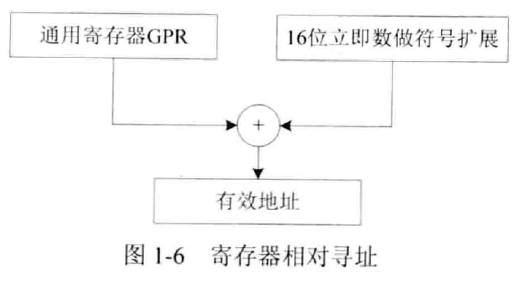

4. PC相对寻址

这种寻址方式主要是转移指令使用，在转移指令中有一个16位立即数，将其左移两位并作符号扩展，然后与程序计数器PC的值相加，从而获得有效地址，如图1-7所示。

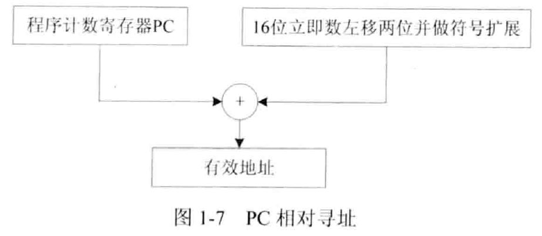


### 协处理器CP0

协处理器一词通常用来表示处理器的一个可选部件，负责处理指令集的某个扩展，拥有与处理器相独立的寄存器。MIPS32架构提供了最多4个协处理器，分别是CP0-CP3。协处理器CP0用作系统控制，CP1、CP3用作浮点处理单元，而CP2被保留用于特定实现。除CP0外的协处理器都是可选的。<font color=red>为什么协处理器的用途不能自定义呢？</font>

协处理器CP0的具体作用有：配置CPU工作状态、高速缓存控制、异常控制、存储单元控制等。CP0通过配置内部的一系列寄存器来完成上述工作。

### 异常

在处理器运行过程中，会从存储器中依次取出指令，然后执行，但是有一些事件会打断正常的程序执行流程，这些事件有中断（Interrupt）、陷阱（Trap）、系统调用（System Call）等，统称为异常。异常发生后，处理器会转移到一个事先定义好的地址，在那个地址有异常的处理例程，在其中进行异常处理，这个地址称为异常处理例程入口地址。异常处理完成后，，使用异常返回指令eret，返回到异常发生前的状态继续执行。

## 教学版OpenMIPS处理器蓝图

### 系统设计目标

教学版OpenMIPS处理器是一款具有哈佛结构的32位标量处理器，兼容MIPS32 Release 1指令集架构。

OpenMIPS的设计目标如下：

- 五级整数流水线，分别是：取指、译码、执行、访存、回写
- 哈佛结构，分开的指令、数据接口
- 32个32位整数寄存器
- 大端模式
- 向量化异常处理，支持精确异常处理
- 支持6个外部中断
- 具有32bit数据、地址总线宽度
- 能实现单周期乘法
- 支持延迟转移
- 兼容MIPS32指令集架构，支持MIPS32指令集中的所有整数指令
- 大多数指令可以在一个时钟周期内完成

### 五级流水线

略

### 指令执行周期

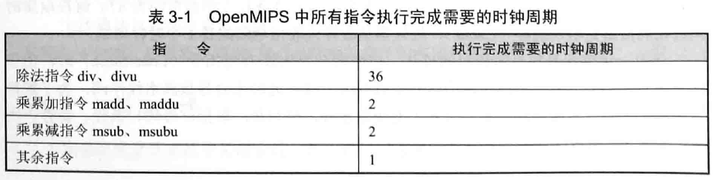

**说明：**

- OpenMIPS计划采用试商法完成除法操作，对于32位的除法，执行阶段至少需要32个时钟周期，再加上一些准备工作需要的时钟周期，最后需要36个时钟周期才能执行完成。
- 乘累加指令madd、maddu，乘累减指令msub、msubu都需要2个时钟周期才能执行完成。主要是因为这4条指令都要做两次运算。

### 教学版OpenMIPS处理器接口

教学版OpenMIPS处理器的外部接口如图3-4所示。采用左侧输入接口，右侧输出接口的方式绘制。

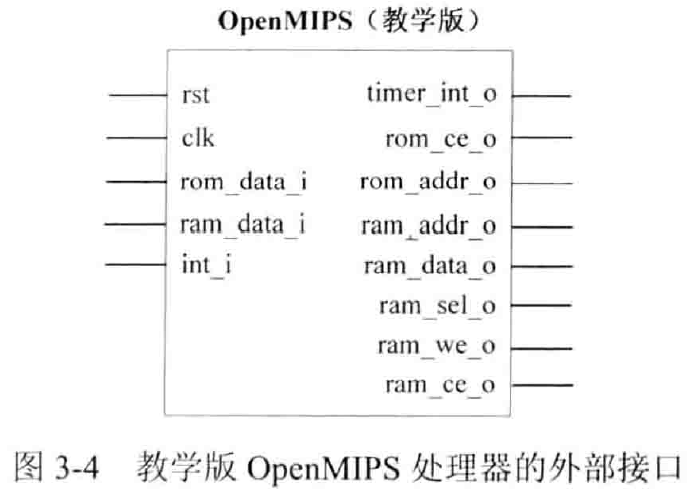

各接口的描述如表3-2所示，可以分为三类：

- 系统控制接口（包括复位、时钟、中断）
- 指令存储器接口
- 数据存储器接口


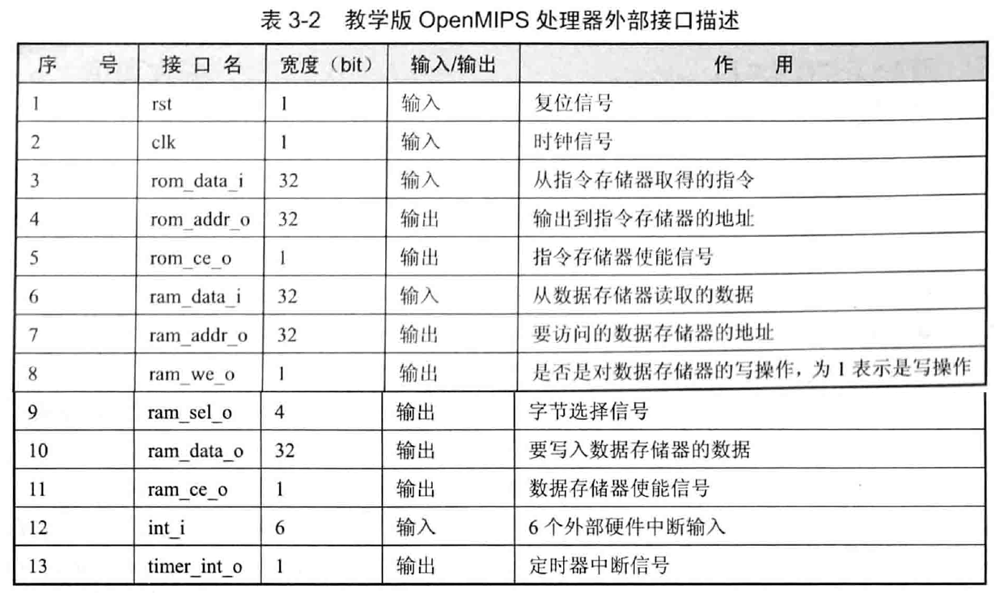

### 文件说明

模块之间连接关系如下图所示。

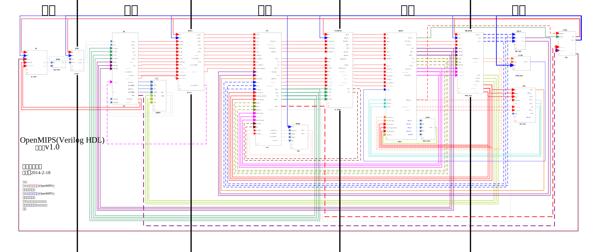

具体说明如下：

1. 取指阶段

- PC模块：给出指令地址，其中实现指令指针寄存器PC，该寄存器的值就是指令地址，对应pc_reg.v文件
- IF/ID模块：实现取指与译码阶段之间的寄存器，将取指阶段结果（取得的指令、指令地址等信息）在下一个时钟传递到译码阶段，对应if_id.v文件

2. 译码阶段

- ID模块：对指令进行译码，译码结果包括运算类型、运算所需的源操作数、要写入的目的寄存器地址等，对应id.v文件
- Regfile模块：实现了32个32位通用整数寄存器，可以同时进行两个寄存器的读操作和一个寄存器的写操作，对应regfile.v文件
- ID/EX模块：实现译码与执行阶段之间的寄存器，将译码阶段的结果在下一个时钟周期传递到执行阶段，对应id_ex.v文件

3. 执行阶段

- EX模块：依据译码阶段的结果，进行指定的运算，给出运算的结果。对应ex.v文件
- DIV模块：进行除法运算的模块，对应div.v文件
- EX/MEM模块：实现执行与访存阶段之间的寄存器，将执行阶段的结果在下一个时钟周期传递到访存阶段，对应ex_mem.v文件

4. 访存阶段

- MEM模块：如果是加载、存储指令，那么会对数据存储器进行访问。此外，还会在该模块进行异常判断。对应mem.v文件
- MEM/WB模块：实现访存与回写阶段之间的寄存器，将访存阶段的结果在下一个时钟周期传递到回写阶段，对应mem_wb.v文件

5. 回写阶段

- CP0模块：对应MIPS架构中的协处理器CP0
- LLbit模块：实现寄存器LLbit，在连接加载指令ll、条件存储指令sc的处理过程中会使用到该寄存器
- HILO模块：实现寄存器HI、LO，在乘法、除法指令的处理过程中会使用到这两个寄存器

6. CTRL模块：用来控制整个流水线的暂停、清除等动作，对应ctrl.v文件


## 第一条指令ori的实现

### ori指令说明

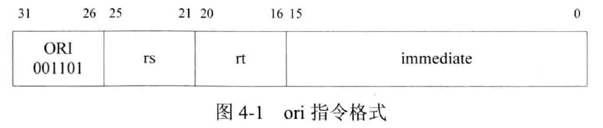

I类型指令，用法为：==ori rs, rt, immediate==。当处理器发现正在处理的指令高6bit是6'001101时，将指令中的16位立即数immediate进行无符号扩展至32位，然后与索引为rs的通用寄存器的值进行逻辑“或”运算，运算结果保存到索引为rt的通用寄存器中。


### 原始的OpenMIPS五级流水线结构

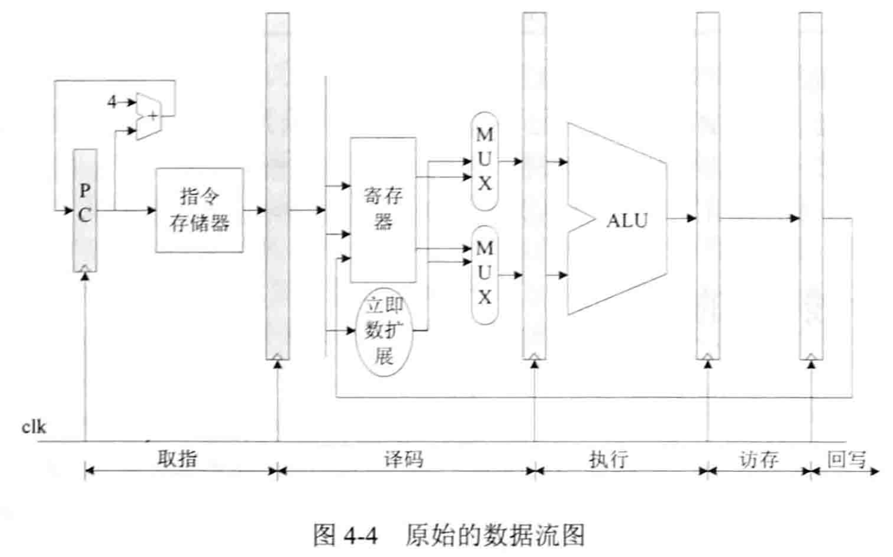

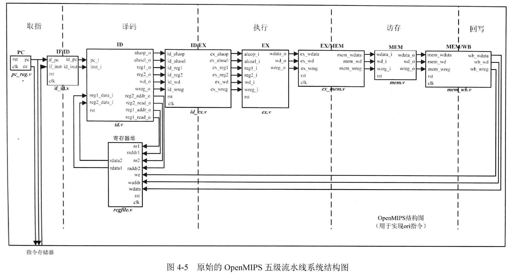

### 一些宏定义

```verilog
//******************** 全局的宏定义 ********************
`define	RstEnable				1'b1				//复位信号有效
`define RstDisable				1'b0				//复位信号无效
`define	ZeroWord				32'h0000_0000		//32位的数值0
`define	WriteEnable				1'b1				//使能写
`define	WriteDisable			1'b0				//禁止写
`define	ReadEnable				1'b1				//使能读
`define ReadDisable				1'b0				//禁止读
`define	AluOpBus				7:0					//译码阶段的输出aluop_o的宽度
`define	AluSelBus				2:0					//译码阶段的输出alusel_o的宽度
`define	InstValid				1'b0				//指令有效
`define	InstInvalid				1'b1				//指令无效
`define	True_v					1'b1				//逻辑“真”
`define	False_v					1'b0				//逻辑“假”
`define ChipEnable				1'b1				//芯片使能
`define ChipDisable				1'b0				//芯片禁止

//******************** 与具体指令相关的宏定义 ********************
`define	EXE_ORI					6'b00_1101			//指令ori的指令码
`define	EXE_NOP					6'b00_0000			//指令nop的指令码

//AluOp
`define	EXE_OR_OP				8'b00100101
`define	EXE_NOP_OP				8'b00000000

//AluSel
`define	EXE_RES_LOGIC			3'b001
`define	EXE_RES_NOP				3'b000

//******************** 与具体指令相关的宏定义 ********************
`define	InstAddrBus				31:0				//ROM的地址总线宽度
`define	InstDataBus					31:0				//ROM的数据总线宽度

```

### 取指阶段的实现

1. PC模块

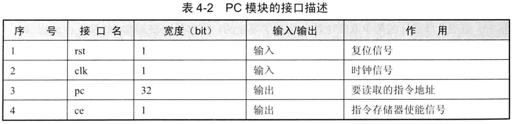

```verilog
module pc_reg(
	input	wire				clk,
	input	wire				rst,
	output	reg[`InstAddrBus]	pc,
	output	reg					ce
);

always @(posedge clk)
begin
	if (rst == `RstEnable)
	begin
		ce <= `ChipDisable;			//复位时指令寄存器禁用
	end
	else
	begin
		ce = `ChipEnable;			//复位结束后，指令存储器使能
	end
end

always @(posedge clk)
begin
	if
end
```