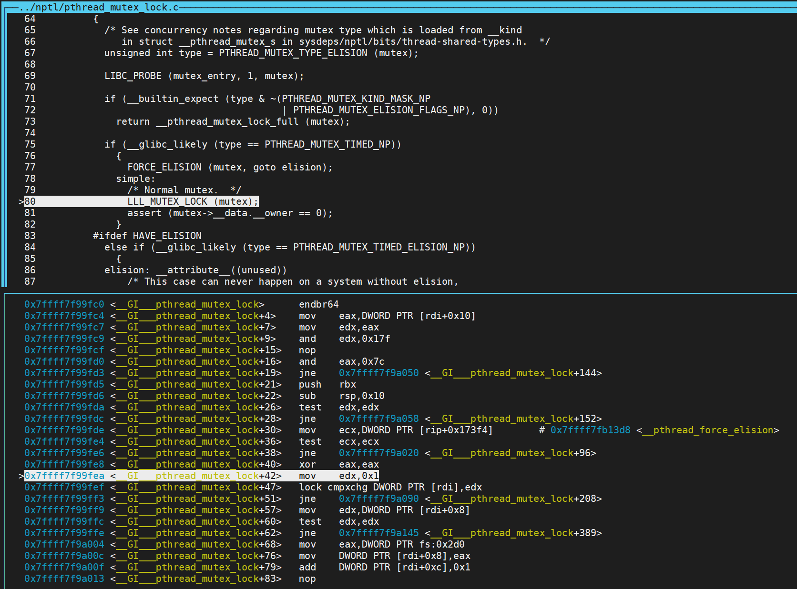
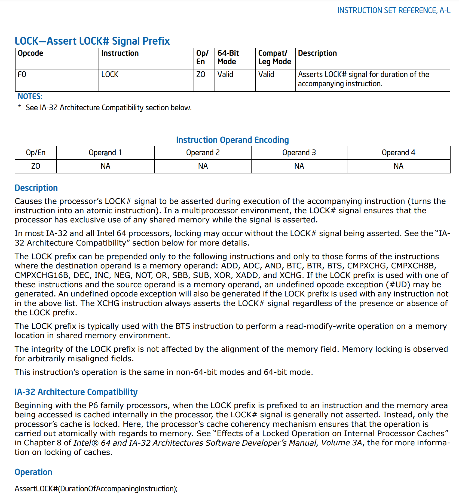

基于上一篇[gdb 调试glibc源码]()的环境搭建，现在可以通过源码调试的方式，来探究spin lock和mutex lock的内部实现机制。

本篇博客的c代码来源于[^1]，在此列出：


```c++ {.line-numbers}

```


先通过这个实验给出一个直观的现象，以及大致的理解。
- 互斥锁mutex
 	- 如果获取不到资源会让出cpu
 	- 使用场景：共享区域执行的内容较多的情况
- 自旋锁spinlock
 	- 如果获取不到资源，会原地自旋，忙等
 	- 使用场景：共享区域执行的内容较少的情况
- 原子操作
 	- 不可分割
 	- 使用场景：做简单++、--操作

```shell {.line-numbers}
# compile with 2 concurrent threads
use spin ------ 
spec lock is  -- 21
count == 200000000
use mutex ------ 
spec lock is  -- 27
count == 200000000
use automic ------ 
spec lock is  -- 4
count == 200000000
# compile with 10 concurrent threads
use spin ------ 
spec lock is  -- 1508
count == 1000000000
use mutex ------ 
spec lock is  -- 750
count == 1000000000
use automic ------ 
spec lock is  -- 183
count == 1000000000
```

可以看出：自旋锁在冲突率比较高的时候是比较差的，这边还没有统计互斥锁可以在线程切换期间执行其他workload。
而原子指令虽然是最快的，但也只是在这个特殊情况下——需要lock的存储范围小，操作简单。

## 1. Spin Lock

### 1.1 数据结构

spin lock的数据结构在`/usr/include/x86_64-linux-gnu/bits/pthreadtypes.h`中定义：

```c++ {.line-numbers}
typedef volatile int pthread_spinlock_t;
```

只是一个`int`类型的变量。

### 1.2 pthread_spin_init

该函数的实现在`glibc/sysdeps/x86_64/nptl/pthread_spin_unlock.S`中，如下所示：

```c++ {.line-numbers}
ENTRY(pthread_spin_unlock)
    movl    $1, (%rdi)
    xorl    %eax, %eax
    retq
END(pthread_spin_unlock)
```

可以看出，spin lock的初始化复用了unlock的代码，都是讲spin lock复位为1。其中eax寄存器在x86_64中保存函数的第一个返回值，因此在此置位为0，表示返回成功。

### 1.3 pthread_spin_lock

该函数的实现在`glibc/sysdeps/x86_64/nptl/pthread_spin_lock.S`中，如下所示。spin lock要实现的就是与unlock相反的操作，将spin lock置位为0。但是由于是抢占式的，对spin lock变量赋值需要是原子操作，因此可以看到在第2~3行实现了原子减1操作。这边没有利用之前看到过的使用`lock xchg`来实现，而是使用`lock decl`来实现。这样也不会出错，因为spin lock是一个int类型的变量，如果其他线程获取了锁，则该操作从0开始减1操作，变为一个负数。后续可以看到在代码的第11行，将spin lock变量的内存数据与0作比较，只有大于0，即某个线程unlock将spin变量置为1。此时，该线程跳转到第2行代码，重新抢占锁。相较于xchg指令的实现方式，使用decl指令不需要写内存，多个线程之间对于这个变量的一致性状态为`Share`，效率应该会更高，其他的好处暂时未知。

```c++ {.line-numbers}
ENTRY(pthread_spin_lock)
1:  LOCK
    decl    0(%rdi)
    jne 2f
    xor %eax, %eax
    ret 

    .align  16  
2:  rep 
    nop 
    cmpl    $0, 0(%rdi)
    jg  1b  
    jmp 2b
END(pthread_spin_lock)
```

### 1.4 pthread_spin_unlock

在pthread_spin_init中已经介绍过。

## 2. Mutex Lock

pthread_mutex_t数据类型定义在`/usr/include/x86_64-linux-gnu/bits/pthreadtypes.h`中，为40 bytes的union类型，我们主要关注其中__pthread_mutex_s结构体变量`__data`(仅展示x86_64架构下代码实现)。

```c++ {.line-numbers}
struct __pthread_mutex_s
{
  int __lock;
  unsigned int __count;
  int __owner;
  unsigned int __nusers;
  int __kind;
  short __spins;
  short __elision;
  __pthread_list_t __list;
  # define __PTHREAD_MUTEX_HAVE_PREV      1
};
```

### 2.1 pthread_mutex_init

该函数在`glibc/nptl/pthread_mutex_init.c`中实现，根据指定的`pthread_mutexattr`设置`__data`中的变量值。

### 2.2 pthread_mutex_lock

mutex实现比较复杂一点，暂时不进行细致探究。从下图的调试可以看出，mutex lock的上锁是通过`lock cmpxchg DWORD PTR [rdi], edx`来实现，即写`1`对比写入之前的数据是否为`0`。



当获取锁失败时，会调用`glibc/nptl/lowlevellock.c`中的`__lll_lock_wait`如下，暂时没有发现从哪里执行线程切换。

```c++ {.line-numbers}
void
__lll_lock_wait (int *futex, int private)
{
  if (atomic_load_relaxed (futex) == 2)
    goto futex;

  while (atomic_exchange_acquire (futex, 2) != 0)
  {   
    futex:
    LIBC_PROBE (lll_lock_wait, 1, futex);
    lll_futex_wait (futex, 2, private); /* Wait if *futex == 2.  */
  }   
}
#endif
```

### 2.3 pthread_mutex_unlock

unlock就只需要执行`xchg`，并不需要保证原子性。

## 3. Atomic

Atomic指令的硬件实现没有详细的解释，这边摘录一些网上的分析：

> In the days of Intel 486 processors, the lock prefix used to assert a lock on the bus along with a large hit in performance. Starting with the Intel Pentium Pro architecture, the bus lock is transformed into a cache lock. A lock will still be asserted on the bus in the most modern architectures if the lock resides in uncacheable memory or if the lock extends beyond a cache line boundary splitting cache lines. Both of these scenarios are unlikely, so most lock prefixes will be transformed into a cache lock which is much less expensive.[^2]

在《Intel® 64 and IA-32 Architectures Software Developer Manuals》中，对于`LOCK`前缀指令有如下解释：



在《Intel® 64 and IA-32 Architectures Software Developer Manuals》的第8.1节，对`LOCK`有以下描述：

> The processor uses three interdependent mechanisms for carrying out locked atomic operations:
> 
> - Guaranteed atomic operations.
> - Bus locking, using the LOCK# signal and the LOCK instruction prefix.
> - Cache coherency protocols that ensure that atomic operations can be carried out on cached data structures (cache lock); this mechanism is present in the Pentium 4, Intel Xeon, and P6 family processors.
> 
> These mechanisms are interdependent in the following ways. Certain basic memory transactions (such as reading or writing a byte in system memory) are always guaranteed to be handled atomically. That is, once started, the processor guarantees that the operation will be completed before another processor or bus agent is allowed access to the memory location. The processor also supports bus locking for performing selected memory operations (such as a read-modify-write operation in a shared area of memory) that typically need to be handled atomically, but are not automatically handled this way. Because frequently used memory locations are often cached in a processor’s L1 or L2 caches, atomic operations can often be carried out inside a processor’s caches without asserting the bus lock.
Here the processor’s cache coherency protocols ensure that other processors that are caching the same memory locations are managed properly while atomic operations are performed on cached memory locations.

### 3.1 非原子操作的多线程问题

有一种理解：我们对内存数据`+1`操作使用`xaddl %2, %1;" : "=a" (old) : "m"(*v),"a"(add) : "cc","memory"`指令就可以实现，按照一致性协议，每个core在执行这条指令时，都会首先获取`M`一致性状态，这样就会保证读到的是最新数据，所以结果不会出错。按照上面的思路，我们构造以下代码：

```c++ {.line-numbers}
// atomic_test.cpp
#include <stdio.h>
#include <pthread.h>
#include <unistd.h>
#include <time.h>
#include <stdint.h>
#include <stdalign.h>

#define MAX_PTHREAD 2
#define LOOP_LEN    1000000000

#ifndef ALIGNMENT
	#define ALIGNBYTE 4
#else
	#define ALIGNBYTE 64
#endif

alignas(ALIGNBYTE) int count1 = 0;
alignas(ALIGNBYTE) int count2 = 0;

typedef void *(*functhread) (void *arg);

int atomic_add(int *v,int add)
{
	int old;

	#ifndef LOCK
		__asm__ volatile(
			"xaddl %2, %1;"
			:"=a" (old)
			:"m"(*v),"a"(add)
			:"cc","memory"
		);
	#else
		__asm__ volatile(
			"lock;xaddl %2, %1;"
			:"=a" (old)
			:"m"(*v),"a"(add)
			:"cc","memory"
		);
	#endif
	
	return old;
}

void * atomicthread(void *arg)
{
	for(int i  = 0;i<LOOP_LEN;i++){
		atomic_add((int *)arg,1);
	}
	return 0;
}


int main()
{

//测试atomic
	count1 = 0;
	count2 = 0;
	printf("use atomic ------ \n");
	pthread_t tid[2] = {0};
	clock_t start = clock();
	int ret1 = pthread_create(&tid[0],NULL,atomicthread,&count1);
	if(0 != ret1)
	{
		printf("pthread1 create error\n");
		return -1;
	}

	int ret2 = pthread_create(&tid[1],NULL,atomicthread,&count1);
	if(0 != ret2)
	{
		printf("pthread2 create error\n");
		return -1;
	}
	pthread_join(tid[0],NULL);
	pthread_join(tid[1],NULL);

	clock_t end = clock();
	printf("spec lock is  -- %ld\n",(end - start)/CLOCKS_PER_SEC);

	printf("count1 == %d\n",count1);
	printf("count2 == %d\n",count2);
	printf("&count1: [%p]\n", (uint64_t)&count1);
	printf("&count2: [%p]\n", (uint64_t)&count2);

	return 0;
}
```

使用`g++ atomic_test.cpp -static -o atomic -pthread`编译，执行结果如下：

```shell {.line-numbers}
use atomic ------ 
spec lock is  -- 28
count1 == 1029861531
count2 == 0
&count1: [0x4df3b0]
&count2: [0x4df3b4]
```

正确的结果为200000000，结果错误。

如果我们将代码的第71行改为对`count2`进行操作，得到的结果如下：

```shell {.line-numbers}
use atomic ------ 
spec lock is  -- 22
count1 == 1000000000
count2 == 1000000000
&count1: [0x4df3b0]
&count2: [0x4df3b4]
```

虽然结果是对的，但是实际上只是偶然。`count1`和`count2`的地址在同一个Cache line，这属于伪共享机制，这在解释第一种结果之后会进行解释。

总结一下以上遇到的两个问题：

- 两个线程对同一Cache line的同一变量进行累加结果错误；
- 两个线程对同一Cache line的不同变量进行累加结果正确。

要解释以上现象，这就涉及到先进CPU架构中为了提高流水线频率，会在译码时将一条汇编指令拆分成几条伪指令(uop)来实现。例如一条访存加法指令就会拆分成`load+alu+store`三条顺序执行的微指令。因此，我们在执行内存加法操作时，执行拆分后的alu和store微指令时，寄存器中load的数据有可能已经被其他核心修改而过时，这就是虽然有一致性协议仍会导致第一种错误的原因所在。

对于第二种情况，为什么会正确也是类似的理解。虽然拆分成三条微指令，在执行store指令时有可能该Cache line已经被其他核心获取`M`一致性状态，但是由于其他核心不会修改本核心所操作的变量值，因此旧的值就是当前线程之前赋予的值，不会过时。而一致性协议又保证了当前的store指令会重新获取`M`一致性状态，从而能够将最新的状态传递给其他线程，从而重新获取时仍然是最新数据。可以想象，如果没有一致性协议的保证，第二种情况仍然会出问题。这是一种伪共享的问题，虽然能够通过一致性协议保证结果的正确性，但是频繁的一致性协议请求开销还是非常大的。

我们可以使用`g++ atomic_test.cpp -static -o atomic -pthread -DALIGNMENT`重新编译代码并执行，此时强制将`count1`和`count2`进行64 bytes对齐，因此两个变量不会共享同一个Cache line，因此不会存在伪共享的问题，执行结果如下：

```shell {.line-numbers}
use atomic ------ 
spec lock is  -- 4
count1 == 1000000000
count2 == 1000000000
&count1: [0x4df400]
&count2: [0x4df440]
```

毋庸置疑，结果仍然是正确的。但是与上一个结果相比，运行时间得到了显著的降低，这就是解决了伪共享的问题带来的巨大收益。

### 3.2 原子指令保证多线程程序的正确性

为了保证以上第一个场景结果的正确性，各大CPU架构都提出了相应的原子指令。在x86_64架构中是使用`lock`指令前缀来实现的。

我们重新编译第一种场景的程序，即两个线程对同一个变量进行操作，执行`g++ atomic_test.cpp -static -o atomic -pthread -DLOCK`，执行结果如下。

```shell {.line-numbers}
use atomic ------ 
spec lock is  -- 63
count1 == 2000000000
count2 == 0
&count1: [0x4df3b0]
&count2: [0x4df3b4]
```

结果显然是对的，但是如果执行这段代码时，会发现需要等待更长的时间，这就是原子指令实现的开销，正如上面所介绍，Intel P6架构中使用两种方式实现原子操作，一种是锁总线，另一种是利用一致性协议实现，这个是微架构内部通过实际情况自动选择的。如果能够通过Cache一致性实现，则通过一致性实现，如果无法通过在Cache一致性协议解决，即原子指令操作的数据需要通过数据在两个core之间共享，则需要将原子操作下沉到总线上去解决，这样开销会更大，会对所有访问总线的性能产生影响，显然以上这种多线程对同一个Cache line的数据执行原子操作，就需要通过总线来保证原子性，因此耗时比较长，以上这一段都是基于自己的理解，如果有不同意见敬请反驳。

进一步，我们再一次将程序修改为两个线程分别操作`count1`和`count2`，并使用`g++ atomic_test.cpp -static -o atomic -pthread -DLOCK -DALIGNMENT`编译，运行结果如下：

```shell {.line-numbers}
use atomic ------ 
spec lock is  -- 13
count1 == 1000000000
count2 == 1000000000
&count1: [0x4df400]
&count2: [0x4df440]
```

结果仍然是正确的，但是相较于上一种使用总线保证原子性，时间开销降低了很多。这是因为`count1`和`count2`都只有一个线程对其进行原子操作，因此可以直接使用Cache一致性来保证原子性，而不会触发总线的原子性。

至此，大家可能还会有一个疑问，两个线程分别操作不同的数据，本身通过一致性就可以保证结果的正确性啊？为什么要使用原子指令呢？（即以上所述的伪共享的问题）

但是我们可以构造一种情况，线程1每对`count1`操作100次会对`count2`操作1次，反之，线程2每对`count2`操作100次会对`count1`操作1次，一致性无法保证结果的正确性。这种情况下大部分原子操作都可以使用Cache一致性保证，从而大大降低原子操作的时间开销。

### 3.3 LOCK前缀对指令执行的影响(硬件实现)

在《Intel® 64 and IA-32 Architectures Software Developer Manuals》的第8.1.2中：

> Intel 64 and IA-32 processors provide a LOCK# signal that is asserted automatically during certain critical memory operations to lock the system bus or equivalent link. While this output signal is asserted, requests from other processors or bus agents for control of the bus are blocked. Software can specify other occasions when the LOCK semantics are to be followed by prepending the LOCK prefix to an instruction.
> In the case of the Intel386, Intel486, and Pentium processors, explicitly locked instructions will result in the assertion of the LOCK# signal. It is the responsibility of the hardware designer to make the LOCK# signal available in system hardware to control memory accesses among processors.
> For the P6 and more recent processor families, if the memory area being accessed is cached internally in the processor, the LOCK# signal is generally not asserted; instead, locking is only applied to the processor’s caches (see Section 8.1.4, “Effects of a LOCK Operation on Internal Processor Caches”).

为了验证总线为了保证原子性会锁定当前Cache line还是锁定整个总线，修改代码如下：


```c++ {.line-numbers}
#include <stdio.h>
#include <pthread.h>
#include <unistd.h>
#include <time.h>
#include <stdint.h>
#include <stdalign.h>


#define MAX_PTHREAD 2
#define LOOP_LEN    1000000000

#ifndef ALIGNMENT
	#define ALIGNBYTE 4
#else
	#define ALIGNBYTE 64
#endif


alignas(ALIGNBYTE) int count1 = 0;
alignas(ALIGNBYTE) int count2 = 0;

typedef void *(*functhread) (void *arg);

int atomic_add(int *v,int add)
{
	int old;

	#ifndef LOCK
		__asm__ volatile(
			"xaddl %2, %1;"
			:"=a" (old)
			:"m"(*v),"a"(add)
			:"cc","memory"
		);
	#else
		__asm__ volatile(
			"lock;xaddl %2, %1;"
			:"=a" (old)
			:"m"(*v),"a"(add)
			:"cc","memory"
		);
	#endif
	
	return old;
}

void * atomicthread(void *arg)
{
	for(int i  = 0;i<LOOP_LEN;i++){
		atomic_add((int *)arg,1);
	}

	return 0;
}

void * bus_req(void *arg)
{
	sleep(1);
	uint64_t *ptr = (uint64_t *)arg;
	clock_t start = clock();
	for (int iter = 0; iter < 4; ++iter) {
		for(uint64_t i = 0; i < (1 << 30); ++i) {
			*(ptr + i) += 1;
		}
	}
	clock_t end = clock();
	printf("bus req is  -- %ld\n",(end - start)/CLOCKS_PER_SEC);
	return 0;
}


int main()
{

	alignas(ALIGNBYTE) uint64_t *data = new uint64_t[1<<30];
	if (data == nullptr) {
		printf("new data failed\n");
		return 1;
	}
//测试atomic
	count1 = 0;
	count2 = 0;
	printf("use atomic ------ \n");
	pthread_t tid[3] = {0};
	clock_t start = clock();
	int ret1 = pthread_create(&tid[0],NULL,atomicthread,&count1);
	if(0 != ret1)
	{
		printf("pthread1 create error\n");
		return -1;
	}

	int ret2 = pthread_create(&tid[1],NULL,atomicthread,&count1);
	if(0 != ret2)
	{
		printf("pthread2 create error\n");
		return -1;
	}
	int ret3 = pthread_create(&tid[2],NULL,bus_req,data);
	if(0 != ret3)
	{
		printf("pthread3 create error\n");
		return -1;
	}
	pthread_join(tid[0],NULL);
	pthread_join(tid[1],NULL);
	pthread_join(tid[2],NULL);

	clock_t end = clock();
	printf("spec lock is  -- %ld\n",(end - start)/CLOCKS_PER_SEC);

	printf("count1 == %d\n",count1);
	printf("count2 == %d\n",count2);
	printf("&count1: [%p]\n", (uint64_t)&count1);
	printf("&count2: [%p]\n", (uint64_t)&count2);

	delete[] data;

	return 0;
}
```


分别使用`g++ atomic.cpp -static -o atomic -pthread -DALIGNMENT`和`g++ atomic.cpp -static -o atomic_lock -pthread -DLOCK -DALIGNMENT`编译代码，执行结果如下所示：

```shell {.line-numbers}
$ ./atomic
  use atomic ------ 
  bus req is  -- 41
  spec lock is  -- 43
  count1 == 996774908
  count2 == 0
  &count1: [0x4f04c0]
  &count2: [0x4f0500]
$ ./atomic_lock
  use atomic ------ 
  bus req is  -- 57
  spec lock is  -- 75
  count1 == 2000000000
  count2 == 0
  &count1: [0x4f04c0]
  &count2: [0x4f0500]
```

多次运行应该能够得到类似的结果，虽然可能存在总线带宽利用率的抖动，但是该程序应该不会达到当前服务器的带宽瓶颈。如果只是锁定单个Cache line，则不会对整体性能产生这么大的影响。

在《Intel® 64 and IA-32 Architectures Software Developer Manuals》的第8.1.4节中：

> For the Intel486 and Pentium processors, the LOCK# signal is always asserted on the bus during a LOCK operation, even if the area of memory being locked is cached in the processor.
> For the P6 and more recent processor families, if the area of memory being locked during a LOCK operation is cached in the processor that is performing the LOCK operation as write-back memory and is completely contained in a cache line, the processor may not assert the LOCK# signal on the bus. Instead, it will modify the memory location internally and allow it’s cache coherency mechanism to ensure that the operation is carried out atomically. This operation is called “cache locking.” The cache coherency mechanism automatically prevents two or more processors that have cached the same area of memory from simultaneously modifying data in that area.

如我们在第3.1节中介绍的，非原子指令即使有一致性协议，也无法得到正确的结果。为此，我们进一步深究Cache一致性如何在声明`LOCK`前缀的情况下，保证原子性。

我们构建以下的测试用例：

```asm {.line-numbers}
.section .data
data_items: 		#These are the data items
.long 0,67,34,222,45,75,54,34,44,33,22,11,66,0

.section .text
.globl _start
_start:

movl $0, %ecx
addl %ecx, %ecx
addl %ecx, %ecx
movl $0, %edx
movl $0, %edi
lock decl data_items(,%edi,4)
decl data_items(,%edi,4)
nop
nop
nop

movl $1, %eax	# this is the linux kernel command
	# number (system call) for exiting
	# a program

movl $0, %ebx	# this is the status number we will
	# return to the operating system.
	# Change this around and it will
	# return different things to
	# echo $?

int $0x80	# this wakes up the kernel to run
	# the exit command
```

使用`as decl.S -o decl.o && ld decl.o -o decl`进行编译，然后通过gem5打印运行时的uop如下：

```shell {.line-numbers}
89500: system.cpu: 0x40101a. 0 :   MOV_R_I : limm   edi, 0  : 
89500: system.cpu: 0x40101f    :   dec  DS:[4*edi + t0d + 0x402000]
89500: system.cpu: 0x40101f. 0 :      DEC_LOCKED_M.mfence       : 
89500: system.cpu: 0x40101f. 1 :      DEC_LOCKED_M : ldstl   t1d, DS:[4*edi + t0d + 0x402000] : 
89500: system.cpu: 0x40101f. 2 :      DEC_LOCKED_M : subi   t1d, t1d, 0x1 : 
89500: system.cpu: 0x40101f. 3 :      DEC_LOCKED_M : stul   t1d, DS:[4*edi + t0d + 0x402000] : 
89500: system.cpu: 0x40101f. 4 :      DEC_LOCKED_M.mfence       : 
90000: system.cpu: 0x401028    :   dec  DS:[4*edi + t0d + 0x402000]
90000: system.cpu: 0x401028. 0 :      DEC_M : ldst   t1d, DS:[4*edi + t0d + 0x402000] : 
90000: system.cpu: 0x401028. 1 :      DEC_M : subi   t1d, t1d, 0x1 : 
90000: system.cpu: 0x401028. 2 :      DEC_M : st   t1d, DS:[4*edi + t0d + 0x402000] : 
90000: system.cpu: 0x401030    :   NOP                      : 
```

可见当在`decl`指令之前增加`lock`之后，微指令由原先的3条变为5条，多增加了首尾的`mfence`。

**TODO:** 探究mfence在gem5中的实现方式
**TODO:** 阅读Intel SDM，判断lock的实现方式是否与gem5表述一致？
**TODO:** lock如何与Cache一致性挂钩？
**TODO:** 在BOOM-v3中如何实现原子指令？

[^1]: [C 语言的 互斥锁、自旋锁、原子操作](https://juejin.cn/post/7020800296225865759)
[^2]: [Implementing Scalable Atomic Locks for Multi-Core Intel® EM64T and IA32 Architectures](https://software.intel.com/en-us/articles/implementing-scalable-atomic-locks-for-multi-core-intel-em64t-and-ia32-architectures)